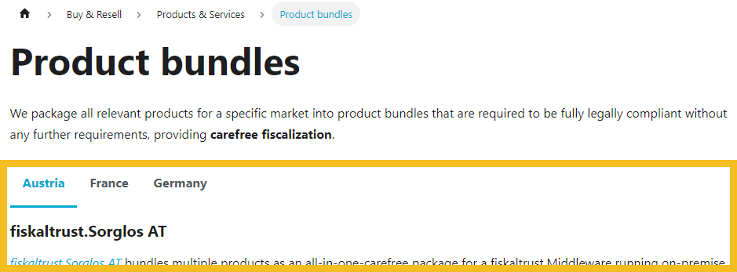
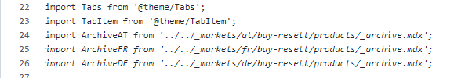
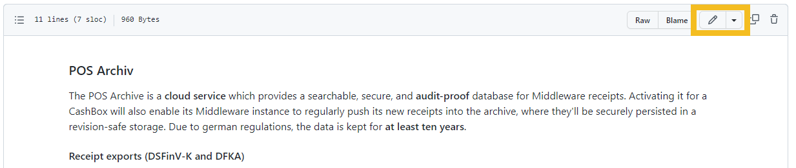

# fiskaltrust dealer documentation 
This repository hosts the docs of the dealer documentation for our documentation platform at https://docs.fiskaltrust.cloud/docs/posdealers.

## Overview 
This repository hosts the content used by the fiskaltrust.space.docs repository to display the dealer documentation. 

All the _content_ that is displayed on https://docs.fiskaltrust.cloud/docs/posdealers is taken from our [GitHub](https://github.com/fiskaltrust/rollout-doc) repositories.  

The content of the repositories is automatically built into the page with the CI/CD pipeline that runs on each change in the repositories' `master`/`main` branch.

## How to contribute market specific content
The main pages and the structure of the menu are meant to be international. Therefore they are owned and changed by the PosDealer Team. 
Many pages have sections with market specific content. This content can be accessed by selecting the correct tab above.

### How to find the market specific pages
The content inside the tab panel can be found at the corresponding market specific .mdx file. In case of this example, this would be:
https://github.com/fiskaltrust/rollout-doc/blob/main/_markets/at/buy-resell/products/_archive.mdx

These .mdx files are placed in the same folder structure then the main pages, just within the _markets/country_code/ directory in the repository. The specific link can also be found, by looking at the page where this content is displayed:

### How to edit market specific pages
The content can be changed directly in the browser. You can also copy and paste the content or clone the repository locally and work on it with other tools like Visual Studio Code that provide a better usability. 

To save your changes to the repository, you can commit them at the bottom of the page. Depending on how the market specific team deals with these changes, you could also create a branch and start a pull request to have them reviewed before they are merged into the main branch.