Notification to the responsible tax office for the activation and deactivation of digital recording systems starting 2025. 

## Feature Overview

The core purpose of the Notifications workflow is to **enable Dealers to support Operators** by managing their onboarding process through structured and trackable notifications. This ensures that company, outlet, and register data are correctly completed, which is essential for successful fiscalization and compliance.

### Roles & Responsibilities

- **Dealer**: Enables notifications, assists with data entry and troubleshooting, tracks status, and ensures Operators complete the onboarding form.
- **Operator**: Enters accurate company, outlet, and register information and submits the required onboarding form.
- **fiskaltrust**: Provides technical support to Dealers and helps resolve any system or data-related issues.

### Access & Navigation

Dealers can access the **Notifications page** via the Dealer Portal by navigating to:  
**PosDealer** → **Notifications**.  
This page lists all associated Operators and their notification statuses.

### Subscription Requirements

Notifications can only be enabled if the Operator has an **active subscription** to one of the required products:

- **fiskaltrust.Carefree without TSE** or
- **fiskaltrust.Carefree with TSE-as-a-Service** or
- **fiskaltrust. Finanzamtsmeldung**

These subscriptions can be purchased via [**Rollout Management**](https://docs.fiskaltrust.cloud/docs/posdealers/buy-resell/rollout-plans#introduction).

If no valid subscription is detected for an Operator:

- The notifications dropdown is **disabled**, and
- Dealers must first ensure the product is purchased before notifications can be sent.

### Sending and Managing Notifications

To enable notifications:

- Dealers set the Operator’s notification dropdown to **“Enabled”**.
- This action sends an **onboarding email** to the Operator:

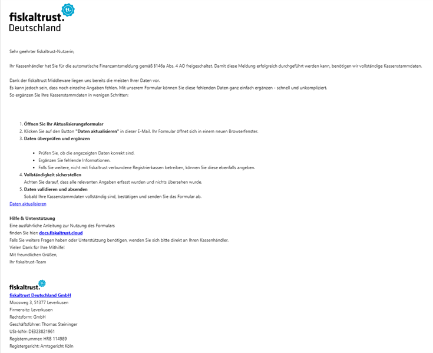

The onboarding email includes:

- A brief explanation of the notifications process
- A link to a **4-step data form** for the Operator to complete:
    1. Company information
    2. Outlet details
    3. Cash register setup
    4. Final review and submission

Form submission is only possible if **all required fields** are completed correctly.

### Why Accurate Data Matters

Notifications rely on **complete and correct data** to be delivered successfully. Missing or malformed inputs like:

- Incorrect **Steuernummer (Tax ID)**
- Missing **POSsystemID**
- Incomplete addresses  
    can all prevent the successful sending of notifications.

### Notification Lifecycle

After form submission:

- The system **schedules** the notification for the next available time slot.
- Frequency and timing are determined by internal scheduling and will be documented in more detail later.

If the Operator hasn’t submitted the form:

- Dealers can **resend the onboarding email** from the portal.

Dealers can also:

- Enable/disable notifications
- Filter by status
- Manually trigger notification sending
- Review **Issues** listed per Operator (e.g., missing data)

If the notification was successful, the operator receives a **confirmation email** with the ELSTER-Übermittlungsprotokoll attached:

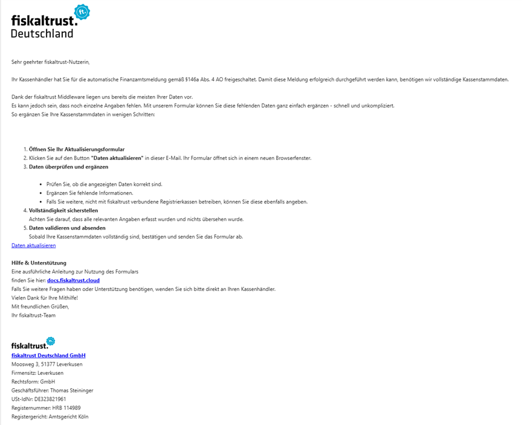

## Troubleshooting & Support  

### Common Problems

- **Wrong Outlet configuration**:  
    If a Queue is linked to the wrong Outlet, Dealers should correct the Outlet configuration.
- **Duplicate Outlets**:  
    If multiple outlets represent the same physical location (e.g., due to virtual duplicates), use the **Location ID** field in the Outlet Edit screen to group them as one.

### Dealing with Notification Failures

If a notification fails:

- Review the **Issues** column for missing or incorrect data
- Assist the Operator in correcting the information
- Resend the onboarding email if needed

If notifications are disabled and later re-enabled:

- The Operator can still access the form
- Notifications are only sent if status is “Enabled”
- Dealers should clearly inform Operators when notifications are paused

### Email & Status Communication

- **Dealers**: See real-time statuses in the portal and may opt into **consolidated email summaries** (weekly or bi-weekly).
- **Operators**: Receive onboarding emails and updates.

### Best Practices for Dealers

- Regularly check notification statuses and Issues column
- Actively assist Operators in form completion
- Use filters to prioritize attention (e.g., failed notifications)
- Use bulk actions for efficient management
- Maintain logs for compliance and support

| Step | Dealer Responsibilities | Operator Responsibilities |
| --- | --- | --- |
| 1\. Subscription Check | \- Check that Operator has an active subscription (fiskaltrust.Carefree without TSE / fiskaltrust.Carefree with TSE-as-a-Service or fiskaltrust. Finanzamtsmeldung).   \- Purchase product if needed via Rollout Management or extend existing subscription via Subscriptions | —   |
| 2\. Enabling Notifications | \- Go to Notifications page in Dealer Portal.   \- Set Operator’s notification status to Enabled (this sends onboarding email).  | —   |
| 3\. Operator Data Entry | —   | \- Open onboarding email.   \- Complete 4-step data form:   \- Company details   \- Outlet information   \- Cash register setup   \- Review and submit form. |
| 4\. Data Validation & Troubleshooting | \- Monitor Operator progress on Notifications page.   \- Resend onboarding email if form not submitted or link to form is requested by operator   \- Check Issues column for missing/incorrect data.   \- Assist Operator in correcting errors. | \- Correct any errors highlighted in the form.   \- Contact Dealer for help if needed. |
| 5\. Notification Sending & Status Tracking | \- Track notification status (scheduled, sent, failed, blocked).   \- Enable/disable or trigger notifications manually.   \- Use filters to prioritize Operators.   \- Keep records for compliance and support.  | \- Monitor confirmation or follow-up emails.   \- Stay informed if notifications are paused or disabled. |
| 6\. Ongoing Support | \- Maintain communication with Operators.   \- Contact fiskaltrust support for technical issues. | \- Reach out to Dealer with questions or for assistance. |

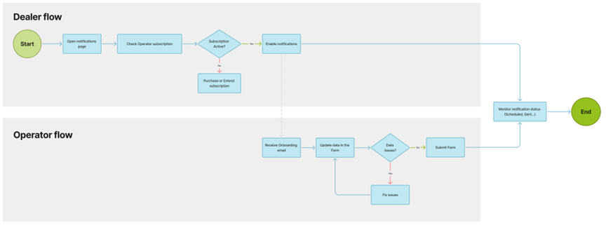

## Legal Baseline
Law: [§ 146a Abs. 4 AO](https://www.gesetze-im-internet.de/ao_1977/__146a.html)
Anwendungserlass: [Anwendungserlass zu § 146a AO](https://www.bundesfinanzministerium.de/Content/DE/Downloads/BMF_Schreiben/Weitere_Steuerthemen/Abgabenordnung/AO-Anwendungserlass/2023-06-30-AEAO-Par-146-AO.pdf?__blob=publicationFile&v=1)

### In which cases is a notification mandatory?
- initial commissioning of the Cashregister: If the fiskaltrust.Middleware is used then this reflects the initial-operation-receipt
- decommissioning of the Cashregister: If the fiskaltrust.Middleware is used then this reflects the out-of-operation-receipt

#### Whenever the mandatory data of the last notification changed a new notification needs to be sent to update the data at the financial authorities
This includes...
- Changing the used TSE
- Changes in the mandatory master data

### Deadlines
A notification is mandatory within a month whenever an initial commissioning, decommissioning, or update/correction of the previous notification occurs.

#### For the start of the notifications in 2025 a transitional period was introduced:
- Cashregisters commissioned before July 1st 2025 need to be included in the notification by July 31st 2025
- Cashregisters decommissioned before July 1st 2025 only need to be included in the notification if this Cashregister has been part of a notification before _fiskaltrust won't notify about Cashregisters before July 1st 2025_
- Cashregisters commissioned on/after July 1st 2025 need to be included in the notification within a month

## Technical Background
_Please note that the following information may be subject to change in the future._

All cash registers at an outlet must be included in the notification. For those using the fiskaltrust.Middleware, we already have most of the necessary information. Cash registers not using the fiskaltrust.Middleware can still be added to the fiskaltrust.Notification through various user-friendly methods. Fiskaltrust will generate the notification and use the ERiC interface to submit the notification to ELSTER.

If we lack some data needed for an outlet's notification, we have a straightforward automated process in place that will prompt the POS operator to provide the missing information.

### Prerequisites for POSDealers/Operators
Since we use data from the fiskaltrust.Middleware and fiskaltrust.Portal to generate the notification, certain master data values must be present in the POSOperator's account. As previously mentioned, the POS operator will be prompted to provide any missing information before we create the notification. However, the more of the following values that are already filled out, the less the POSOperator will need to fill out later.

| Source | Path | Value | Description |
|-----------|-----------------|-----------------------------------------------------|-------------------------|
| POSOperator-Account | Company info / Master Data | tax number | The taxId (Steuernummer) is mandatory for the notification. Using the USt-IdNr is not possible. |
| POSOperator-Account | Company info / Master Data | Address | Streetname and Housenumber are mandatory.|
| POSOperator-Account | Company info / Master Data | Postal code | The postal code is mandatory.|
| POSOperator-Account | Company info / Master Data | City | The city is mandatory.|
| POSOperator-Account | Company info / Outlets | Address | Streetname and Housenumber are mandatory.|
| POSOperator-Account | Company info / Outlets | Postal code | The postal code is mandatory.|
| POSOperator-Account | Company info / Outlets | City | The city is mandatory.|

### Preriquities for POSCreators
The fiskaltrust.Notification product won't require a new implementation. However there are processes, receipts and data that have already been part of the fiskaltrust.Middleware that are now mandatory for the notification. 

#### Receipts
- Initial-Operation-Receipt
- Out-Of-Operation-Receipt
- Initiate-Switch-Receipt
- Finish-Switch-Receipt

#### PosSystemId
The PosSytemId has been mandatory since the beginning. We use the PosSystemId to map the masterdata of your POSSystem to the individual Middleware-Instances. POSSystem masterdata is a mandatory part of the notification.

# Instructions for the Operator Form
Instructions for the form to update cash register data for tax office reporting (§146a Paragraph 4 AO)

## Note
A report to the tax office can only be made if no information is missing in the form and all fields contain valid data.

## The Form

### 1. Overview of Steps
After opening the form link, the steps to be performed are displayed.

You can return to previous steps in the form at any time. Closing and reopening the form via the same link is also possible without issues. The steps are saved, and progress is preserved.  
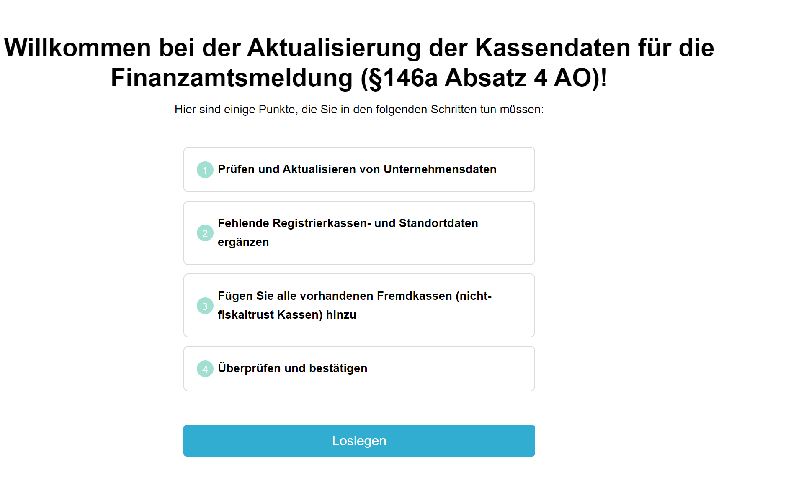

### 2. Verify Company Data
Check and, if necessary, correct the displayed data. This concerns the master data of the company's headquarters, i.e., the address for which the tax office has assigned the tax number to the company. If the displayed information is incorrect, it must be corrected in the form.  
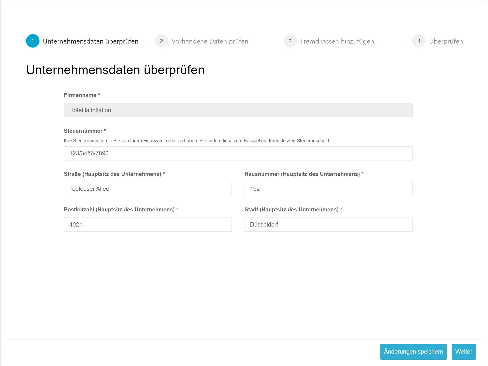

#### Fields to Complete
| Field                        | Explanation                                                                                                                                                            |
|-----------------------------|--------------------------------------------------------------------------------------------------------------------------------------------------------------------|
| Tax Number                | Your tax number assigned by the tax office. You can find it on your last tax notice, typically in the upper left corner. **Important:** Do **not** enter the tax ID number here. Enter the tax number in the format shown on the tax notice. |
| Street (Company Headquarters) | Enter the address registered for the above-mentioned tax number. Individual branch locations, if applicable, will be addressed later in the form. |
| House Number (Company Headquarters) | Enter the address registered for the above-mentioned tax number. Individual branch locations, if applicable, will be addressed later in the form. |
| Postal Code (Company Headquarters) | Enter the address registered for the above-mentioned tax number. Individual branch locations, if applicable, will be addressed later in the form. |
| City (Company Headquarters) | Enter the address registered for the above-mentioned tax number. Individual branch locations, if applicable, will be addressed later in the form. |

#### Tax Number
Example tax notice:  
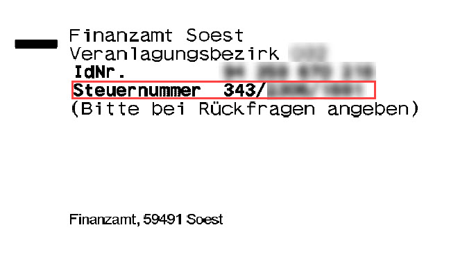

### 3. Review Existing Data
The information already available at fiskaltrust regarding branch locations and cash registers is displayed. Missing or invalid data is marked in red.

Data for each branch location is listed in a separate row.  
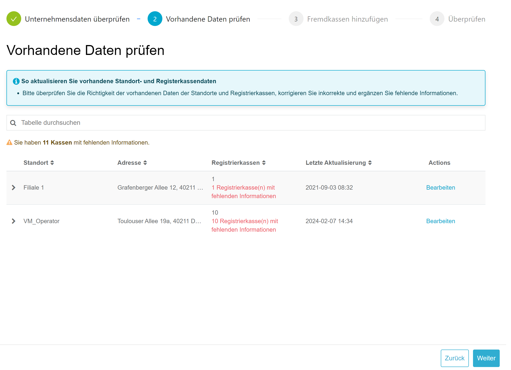

#### Verify and Edit Location Data
First, review the displayed address of the location. If the information is incorrect, it can be edited via the **Edit** button.  
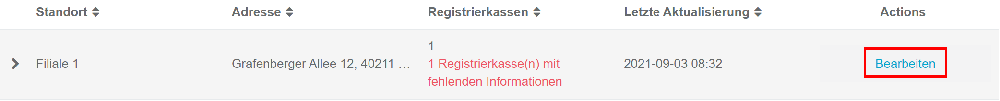

Data for the location can now be adjusted and saved in the edit menu.  
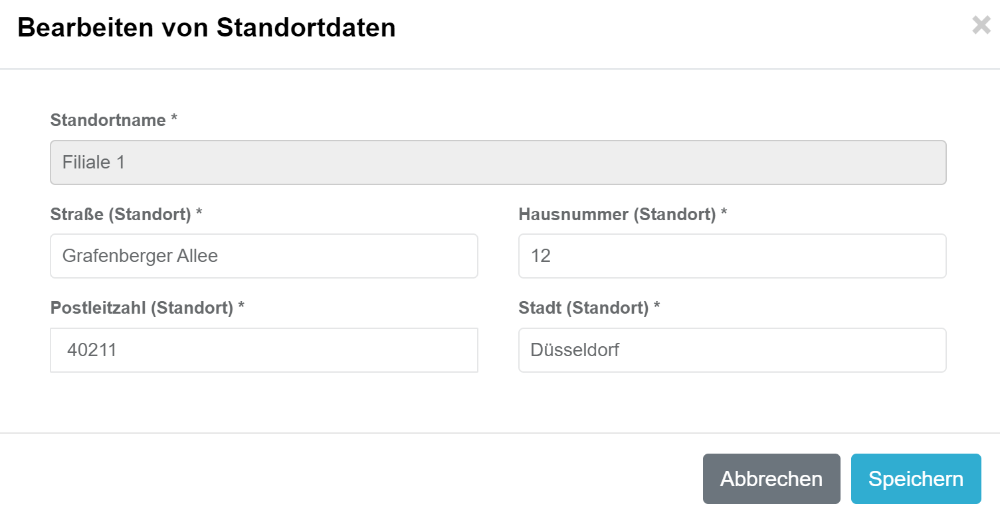

#### Edit Cash Register Data
Missing mandatory information for cash registers is displayed in red. The individual cash registers of a location can be listed by selecting the **>** button next to the location name.

If more cash registers are listed than actually exist at the location, they must be deactivated via the cash register software or in the fiskaltrust.Portal. If in doubt, contact your cash register provider.  
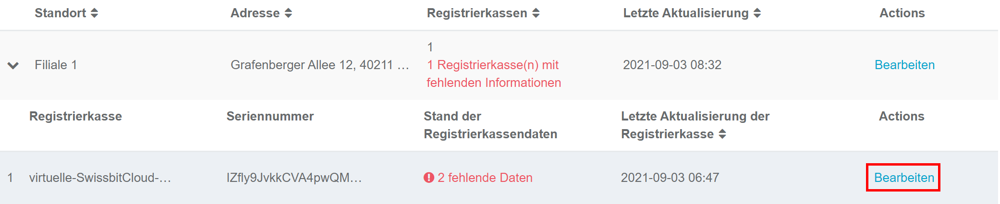

Missing information can be added using the **Edit** button.  
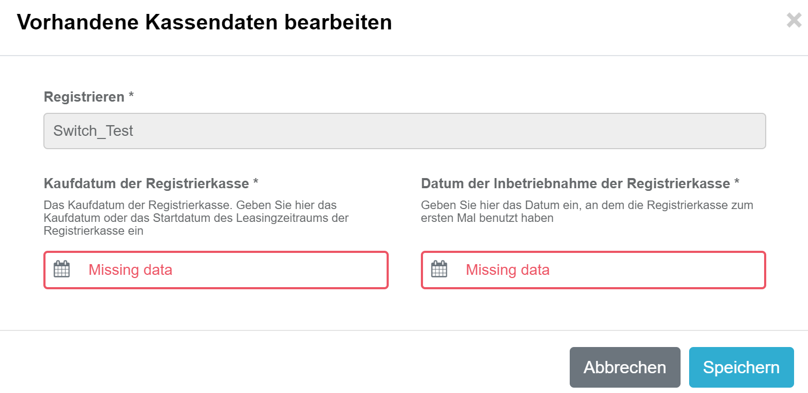

##### Possible Fields
| Field                                 | Explanation                                                                                                                        |
|-------------------------------------|--------------------------------------------------------------------------------------------------------------------------------|
| Purchase Date of the Cash Register       | Enter the purchase date (invoice date) or the lease date of the cash register.                          |
| Date of Cash Register Activation | Enter the date the cash register was activated. This is the point at which the cash register could be used for business transactions. **Note:** TSE activation is not relevant here. |

#### Completion of Review
Once all data has been supplemented or corrected, all locations and cash registers are marked in green.  
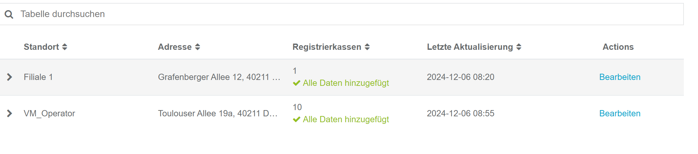

### 4. Add External Cash Registers
If there are additional cash registers at the locations that are not listed on the [3. Review Existing Data](#3-review-existing-data) page, these are so-called **external cash registers**. This usually occurs when there are cash registers from various manufacturers at a location that are not all connected via the fiskaltrust.Middleware.

The law requires that all cash registers at a branch location must be reported according to §146a Paragraph 4 AO. Thus, it is mandatory to add all cash registers not shown on the [3. Review Existing Data](#3-review-existing-data) page to the report.  
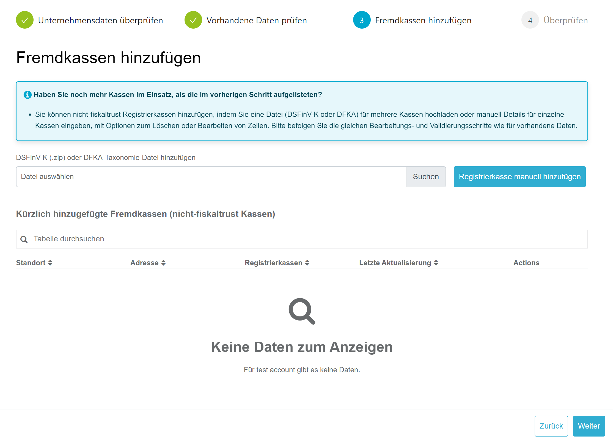

For adding external cash registers, the form provides two options:

#### Import of DSFinV-K (ZIP) or DFKA-Taxonomy (JSON)
The DSFinV-K export is a mandatory feature of every cash register. If a DSFinV-K export is performed on the cash register(s), this file can be used to add missing cash registers to the form. It does not matter whether the DSFinV-K contains all cash registers of a location or just individual cash registers.

**Note:** DSFinV-K import is only possible if the export complies with the legal structure and definition. If errors occur during import, contact the manufacturer.

Select **Choose File** to upload the DSFinV-K in ZIP format.  
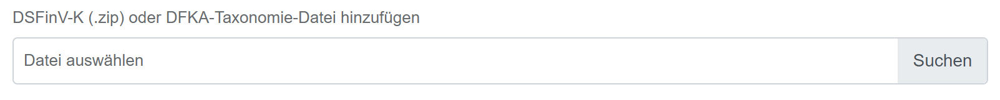

The DSFinV-K is imported into the form by clicking **Import File**.  
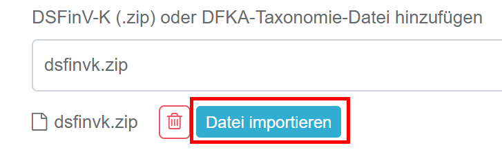

You must now select the location the DSFinV-K originates from. Click **Import** to import the cash registers.  
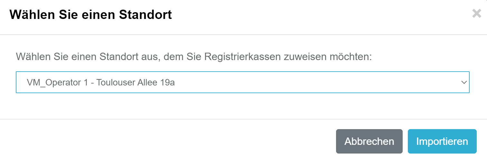

The list now shows imported cash registers by location. The import process can be repeated as often as necessary.  
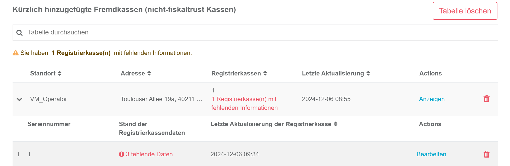

#### Manually Add Cash Register
If a DSFinV-K export is not possible or import errors occur, you can manually add the cash register using the **Manually Add Cash Register** button.  
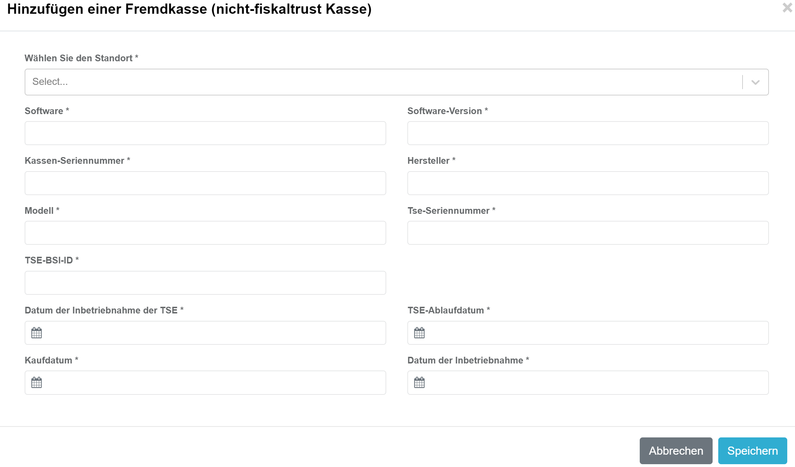

##### Fields
| Field                | Description                                                                                                                      |
|---------------------|----------------------------------------------------------------------------------------------------------------------------------|
| Software            | Enter the name of your cash register's software.                                                                          |
| Software Version    | Enter the software version or designation.                                                         |
| Cash Register Serial Number | The serial number must match the one registered in the TSE. This can be found on receipts. |
| Manufacturer          | Enter the manufacturer of your cash register.                                                                                   |
| Model              | Enter the model name of your cash register.                                                                            |
| TSE Serial Number    | Enter the serial number of the TSE used.                                                                         |
| BSI-ID              | Every TSE is certified by the BSI and receives a BSI-ID. This can be found on [Wikipedia](https://de.wikipedia.org/wiki/Technische_Sicherheitseinrichtung#%C3%9Cbersicht_der_zertifizierten_TSE). Provide the value without `BSI-K-TR-`. Example: 0412-2020 |
| TSE Activation Date  | Enter the date the TSE was activated.                                                           |
| Purchase Date           | Enter the purchase date (invoice date) or the lease date of the cash register.                           |
| Activation Date | Enter the date the cash register was activated. This is the point at which it was usable for business transactions. |

##### Verify and Complete Data
If data is still missing after importing the DSFinV-K or manually adding the cash register, it can be completed or corrected as described in [Edit Cash Register Data](#edit-cash-register-data). Possible fields are described in [Manually Add Cash Register](#fields).

##### Remove Location/Cash Registers
If incorrect cash registers were imported or the wrong location was selected, they can be removed via the _trash icon_.  
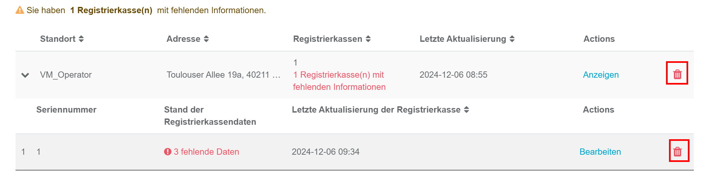

### 5. Completion
All steps performed are displayed. If information is missing or invalid in any step, it will also be displayed in this overview. A report can only be made if all steps are error-free.  
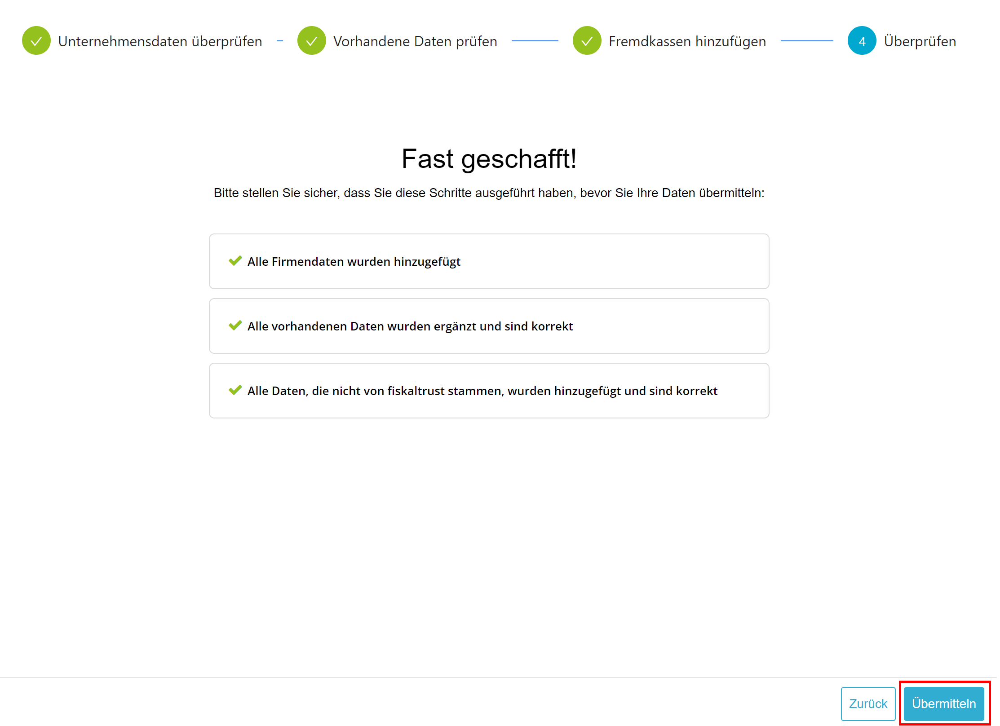

Click **Submit** to open the mandatory confirmation regarding the accuracy and completeness of the data.  
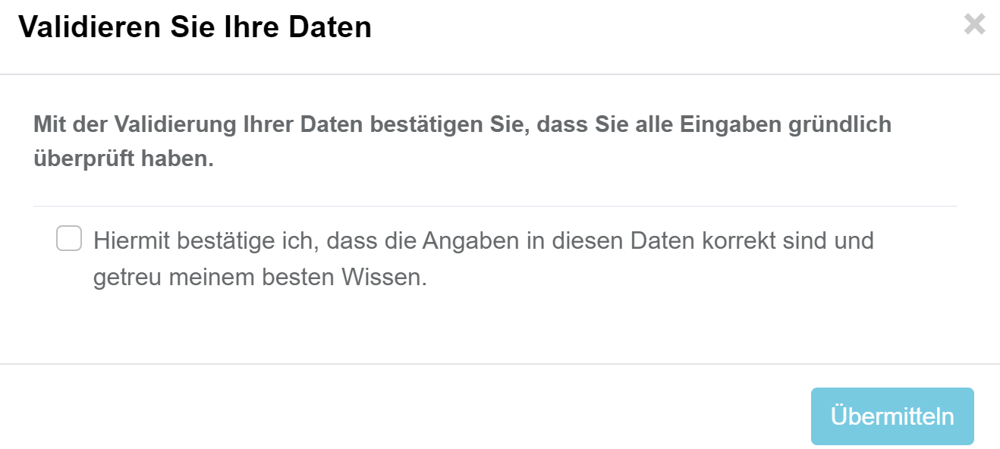

After confirming, the cash register operator will receive an email informing them about the data update. The data will be transmitted to the tax office the following Sunday. The cash register operator will then receive the ELSTER transmission protocol, which we recommend storing in the procedural documentation.

## Finding Data for the ELSTER Form

If the manual entry of data into the ELSTER form is preferred over the convenient fiskaltrust process, the following list can assist in locating the required data.

| XML/ELSTER Formular Feld                                                   | DSFinV-K Table      | DSFinV-K Field       | Data for ELSTER                         | Where to Find                              |
|----------------------------------------------------------------------------|---------------------|----------------------|------------------------------------------|-------------------------------------------|
| Aufzeichnung146a/StNr                                                       | cashpointclosing    | STNR                 | Operator.Account.masterData.TaxId        | Company info/master data            |
| AllgAngabenNichtNatuerlichePerson/Firmenname                                | cashpointclosing    | NAME                 | Operator.Account.masterData.AccountName  | Company info/master data            |
| AllgAngabenNichtNatuerlichePerson/Adresse/AdrInl/Strasse                    | cashpointclosing    | STRASSE              | Operator.Account.masterData.Street       | Company info/master data            |
| AllgAngabenNichtNatuerlichePerson/Adresse/AdrInl/Hausnummer                 | cashpointclosing    | STRASSE              | Operator.Account.masterData.Street       | Company info/master data            |
| AllgAngabenNichtNatuerlichePerson/Adresse/AdrInl/Postleitzahl               | cashpointclosing    | PLZ                  | Operator.Account.masterData.Zip          | Company info/master data            |
| AllgAngabenNichtNatuerlichePerson/Adresse/AdrInl/Ort                        | cashpointclosing    | ORT                  | Operator.Account.masterData.City         | Company info/master data            |
| AngabenZuBetriebsstaette/AnzahlAufzeichnungssysteme                         |                     |                      | Configuration.Queue                      | Total number of active queues              |
| AngabenZuBetriebsstaette/Adresse/Strasse                                    | location            | LOC_STRASSE          | Operator.Account.Outlet.Street           | Company info/outlets              |
| AngabenZuBetriebsstaette/Adresse/Hausnummer                                 | location            | LOC_STRASSE          | Operator.Account.Outlet.Street           | Company info/outlets              |
| AngabenZuBetriebsstaette/Adresse/Postleitzahl                               | location            | LOC_PLZ              | Operator.Account.Outlet.Zip              | Company info/outlets              |
| AngabenZuBetriebsstaette/Adresse/Ort                                        | location            | LOC_ORT              | Operator.Account.Outlet.City             | Company info/outlets              |
| AngabenAufzeichnungssystem/Art                                              |                     |                      |                                          | Select from dropdown in ELSTER form        |
| AngabenAufzeichnungssystem/Software                                         | cashregister        | KASSE_SW_BRAND       | fiskaltrust.Middleware                   | Enter "fiskaltrust.Middleware"             |
| AngabenAufzeichnungssystem/SoftwareVersion                                  | cashregister        | KASSE_SW_VERSION     | 1.3                                      | Enter the Middleware version (1.3)         |
| AngabenAufzeichnungssystem/SeriennummerAS                                   | cashregister        | Z_KASSE_ID           | CashboxIdentification                    | Configuration/Queue/Details                |
| AngabenAufzeichnungssystem/Hersteller                                       | cashregister        | KASSE_BRAND          | Creator.Account.posSystem.Brand          | Provided by the manufacturer               |
| AngabenAufzeichnungssystem/Modell                                           | cashregister        | KASSE_MODELL         | Creator.Account.posSystem.Model          | Provided by the manufacturer               |
| AngabenAufzeichnungssystem/SeriennummerTSE                                  | tse                 | TSE_SERIAL           | Configuration.Signature Creation Unit.Details.SerialNumberOctet | Configuration/Signature Creation Unit/Details/SerialNumberOctet |
| AngabenAufzeichnungssystem/InbetriebnahmeTSE                                |                     |                      | Queue.ActionJournal.Initial-Operation    | Configuration/Queue/ActionJournal (select initial operation receipt and enter the date) |
| AngabenAufzeichnungssystem/BSIID                                            | tse                 | TSE_ZERTIFIKAT       | Configuration.Signature Creation Unit.Details.CertificationIdentification | Configuration/Signature Creation Unit/Details/CertificationIdentification |
| AngabenAufzeichnungssystem/AnschaffungAS                                    |                     |                      | Not provided by fiskaltrust               | Date of cash register acquisition          |
| AngabenAufzeichnungssystem/InbetriebnahmeAS                                 |                     |                      | Not provided by fiskaltrust               | Date of cash register commissioning        |

Guidelines from the Ministry of Finance: [PDF](https://www.bundesfinanzministerium.de/Content/DE/Downloads/Steuern/FAQ-Ausfuellanleitung.pdf?__blob=publicationFile&v=2)

## FAQ
In the following you'll find frequently asked questions. If you have further questions then you can send us an email to support@fiskaltrust.de

### What should be specified as the acquisition date of the cash register?
The acquisition date of the cash register should be the date of purchase or the start of the leasing period of the cash register. Both the acquisition date and the commissioning date of the cash register are independent of the start of fiscalization. If you purchased a cash register in 2005 and connected a TSE to it in 2021, the year 2005 is decisive for this value. We at fiskaltrust are not permitted to provide legal advice. If you have detailed questions about the acquisition date, please contact a tax advisor.

---

### Can the form data also be entered by the manufacturer/dealer?
Both the cash register dealer and the cash register manufacturer will have the ability to manage data in the fiskaltrust.Portal.

---

### In what format must the tax number be provided?
We do not require the nationwide standard tax number (13 digits). However, if you know it, you are welcome to enter it. Generally, please enter the tax number in the format assigned to you by the tax office. You can find it, for example, on any tax assessment notice.

---
### Which contact receives the link to the operator form?

The email with the corresponding link is sent to the primary contact of the operator account that is registered in the fiskaltrust.Portal.

---

### How often must a notification be made?

A notification to the tax office is only required when there is a new entry or a change in the data. For example, a cash register remains active for the tax office until a deactivation is reported.

---

### Will there be an automatic option to update the data?

For customers with a large number of cash registers and locations, there will be an option to update the data collectively.