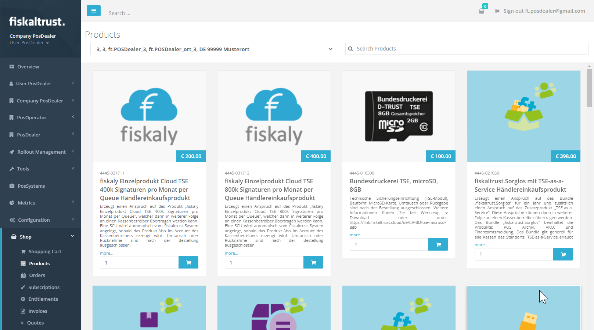

|             Step             | Description                                                  |
| :--------------------------: | ------------------------------------------------------------ |
|  | Go to `Shop` / `Products` in the left-hand navigation menu to buy a product or entitlement. |
|  | Choose an entitlement (in our example we will buy "fiskaltrust.Sorglos mit TSE Händlereinkaufsprodukt" ), **enter** an amount to purchase and **click** on the shopping cart symbol besides.  |
|  | **Click** on the shopping cart in the top right of the window and **click** the `Checkout` button.  | 
|  | **Check** the products, the amount and the price before you **click** the `binding order` button.| 
|  | A confirmation for your order will be shown and also sent to you via E-Mail.  | 