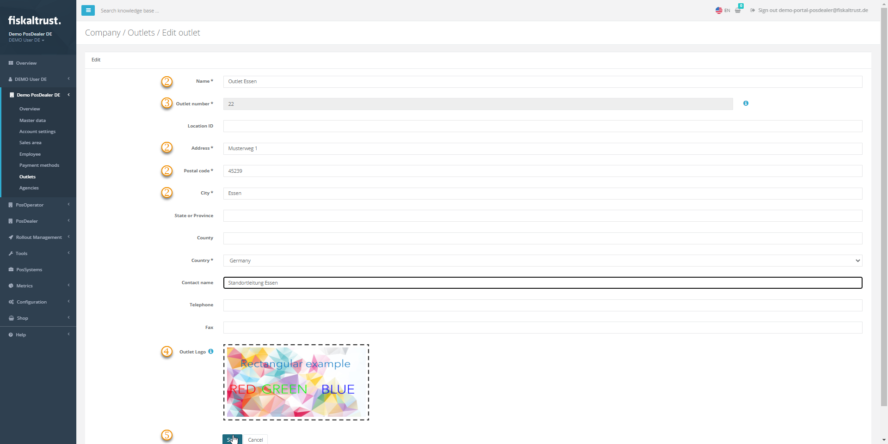

#### Preview

| Steps | Description                                                                                                                |
|:---------------------------:|--------------------------------------------------------------------------------------------------------------------------------|
|...|Choose `Company Info` / `Outlets` and select `Edit` to control or edit the values of the chosen outlet. |
| |Address data are relevant for the automated invoice generation between PosDealer and PosOperators and for the digital receipt.  |
| |You can set the `Outlet number` if you create the outlet manually, but you cannot change it afterward. |
| |With `Select Image File`, you can upload an image file to customize the digital receipts for the chosen outlet.  |
| |`Save` your changes or use `Cancel` to return to `Company` / `Outlets`.  |

