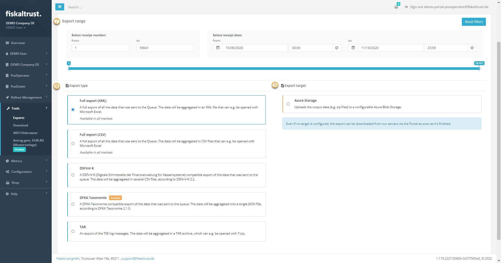

## Export Options

:::info

As a PosDealer or PosOperator, you can only run exports if a PosArchiv is active for the respective Queue. Without an active POSArchiv the exports can be generated on the POS by using the [journal functions](https://middleware-samples.docs.fiskaltrust.cloud/#8e31de31-86eb-4068-a9c8-662fec2409ac) of the fiskaltrust.Middleware. Your POSCreator has to implement these functions.

:::

## Examples of country-specific export types
This presentation is a snapshot and does not claim completeness or correctness.

