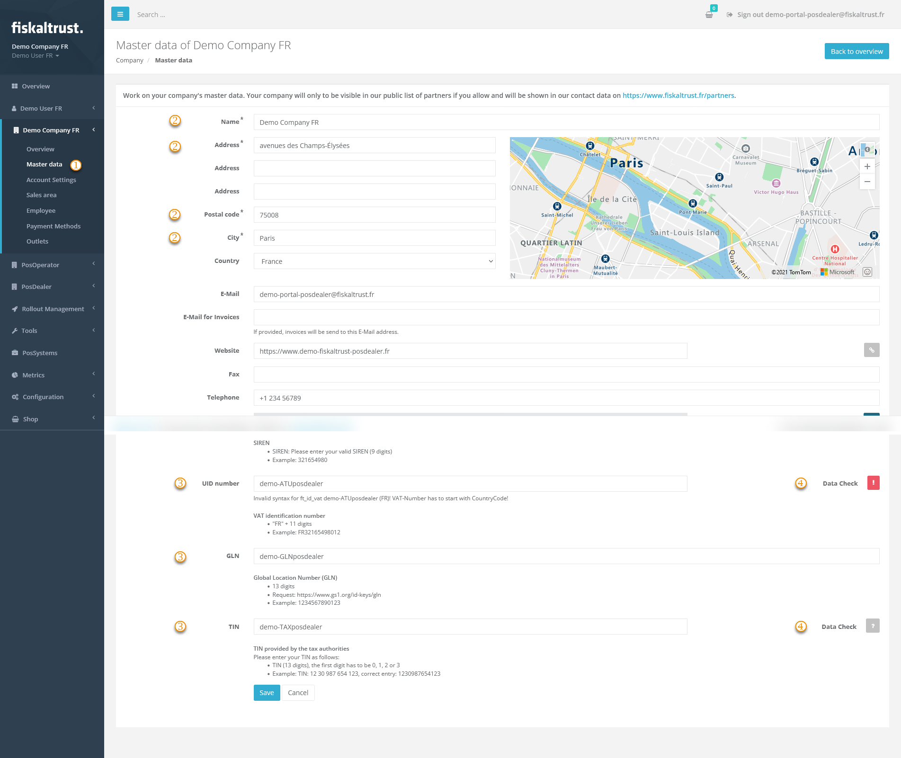

#### Preview

| Steps | Description                                                                                                                |
|:---------------------------:|--------------------------------------------------------------------------------------------------------------------------------|
| |Enter the fiskaltrust.Portal and choose `[COMPANY NAME]` / `Master data`  |
| |Check the fields marked with * for correct and complete data.  |
| |Check the values for tax identification numbers using the explanations arranged below the data fields. Observe the notes on notation, such as the number of digits and the omission of spaces. Also, note the information on whether one or more dates are required, as this varies from country to country.  |
| |Then check the entered values with the `Data Check` on the right of the data fields.  |

| data check results | options                                                                                                                |
|:----------------------:|-------------------------------------------------------------------------------------------------------------------------------------|
| |This symbol represents an unchecked value in the data field.  |
| |This symbol stands for invalid values. Hover with your mouse over the symbol and note the description. Change the values accordingly and repeat the data check. |
| |This symbol validates the value in the data field. Please note that this is no protection from using duplicates.|