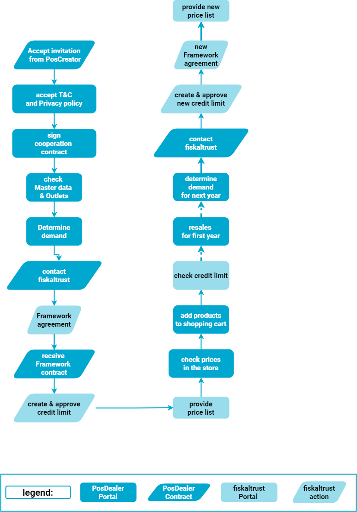

# Framework Agreement

:::info summary

After reading this, you can explain the different agreements for reselling products.

:::

## Explanation

Please also note the following paragraphs if you are not interested in a framework agreement for the time being. A framework agreement can also be concluded later.

### Explanation Credit limit

When the PosDealer role is activated, a credit limit is also granted in the fiskaltrust.portal. Note that the limit in the productive system is significantly lower than in the sandbox.

If the invoice amounts exceed the credit limit during rollout management or purchases in the store, you will be notified of the credit limit by a corresponding message when creating further offers. 
If it is not possible to settle the open invoices in a timely manner, contact the sales department responsible for the country in question with a request to grant you more credit limit. Check the tabs below for country-specific details.

### Explanation Framework Agreement

As mentioned in the section [Business model](../overview/business-model.md), in addition to offering individual products, fiskaltrust also offers more favorable merchant bundles in the fiskaltrust.portal store. If you are planning to purchase ten or more product bundles, you should consider this option. Our products and product bundles are described [here](products.md).  
If you are committing to purchase **large quantities of product bundles** of your choice over the course of a year, a **Framework Agreement** is the best option. This allows you to achieve significant discounts depending on your planned sales volume.

### Legal Framework

* The contract period is open and the evaluation period for the ordered number of entitlements will be set to one year or the period of your choice.
* The agreed purchase price applies to each allocation of each entitlements, regardless of whether you use the rollout management or prefer the store.
* By assigning entitlements in the fiskaltrust.Portal according to your needs, you control purchase and accounting by yourself.
* You avoid processing refunds because unused Entitlements already purchased can also be used in the following year.

## Work steps to achieve a framework agreement

### Prerequisites

* Accept the invitation of the PosCreator.
* Accept the General Terms and Conditions and the Privacy Policy and complete the registration in the fiskaltrust.Portal in full.
* Sign the cooperation agreement as PosDealer.
* Complete and check the master data, the outlets and the credit limit in your account in the fiskaltrust.Portal. 
* Get an overview of the current products and product bundles in the live system.
* Create test scenarios such as invitation and rollout management in the sandbox. 
* Test these test scenarios to successful completion.
* Resolve outstanding rollout planning issues.
 * Determine your need for products, product bundles and their number.

### Negotiation

* Contact fiskaltrust. Check the tabs below for country-specific details.
* Make a request for a framework agreement with the data previously collected.
* Note that it will take a few days to process your request. Only then will you receive the master agreement.
* With the framework agreement, your credit limit and adjusted product prices will be stored in the fiskaltrust.Portal.
* Check the deposited prices, pay attention to the offers in the store as well as the rollout plans. 
* Carry out the resale of the Entitlements in the agreed period.
* Check the remaining stock in good time. This will be invoiced at the end of the agreed period.
* At the end of the agreed period, determine the requirements for the following year.
* Contact fiskaltrust for further agreement.

import Tabs from '@theme/Tabs';
import TabItem from '@theme/TabItem';

## further informations

import FrameworkAT from '../_markets/at/buy-resell/framework/_framework.mdx';
import SalesFR from '../_markets/fr/overview/business-model/_sales.mdx';
import SalesDE from '../_markets/de/overview/business-model/_sales.mdx';

<Tabs groupId="market">

  <TabItem value="AT" label="Austria">
    <FrameworkAT />
  </TabItem>

  <TabItem value="FR" label="France">
    <SalesFR />
  </TabItem>

  <TabItem value="DE" label="Germany">
    <SalesDE />
  </TabItem>

</Tabs>