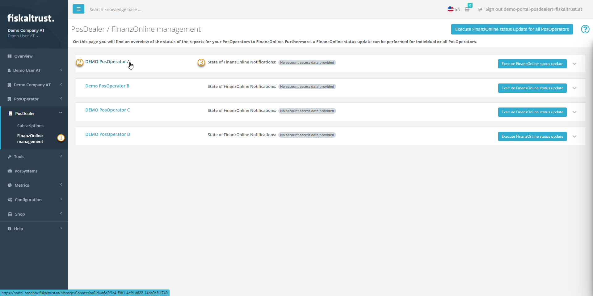
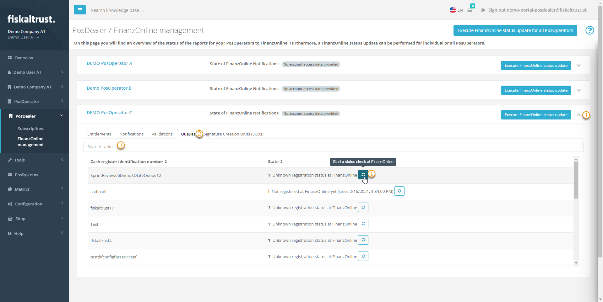
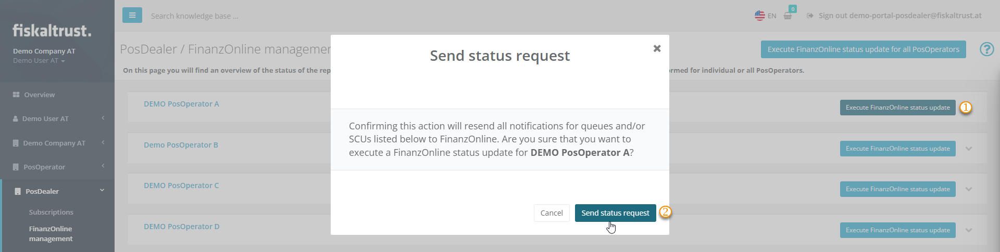
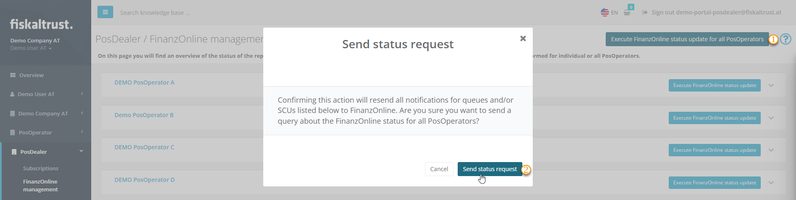

# FinanzOnline Management

:::info summary

After reading this, you will understand the benefits for PosOperators of connecting their fiskaltrust.Account to _FinanzOnline_. Every change in queues or SCUs in PosOperators is forwarded and `FinanzOnline Management` shows you the overview. A reconciliation with FinanzOnline is only necessary if changes to queues or SCUs have been made manually there by you or the PosOperator. 

:::

:::caution Germany / France

As _FinanzOnline Management_ is only available in Austria, this tutorial does not apply to Germany or France.

:::

## FinanzOnline: Overview

The legal basis for FinanzOnline in Austria was created with the FinanzOnline ordinances in 2006.
FinanzOnline provides electronic access to the tax authorities for entrepreneurs and their representatives. FinanzOnline offers round-the-clock access to relevant tax documents without the need for additional software and provides the services of the company service portal (USP), such as _e-Rechnung_.
FinanzOnline is constantly being developed into an information and transaction portal in tax matters.

### FinanzOnline: Prerequisites for PosOperators

You as a PosDealer or as a PosOperator start with creating or collecting the access data of a FinanzOnline user who is authorized for the cash register web service.
After your login to fiskaltrust.Portal, clarify the existing entitlements for the chosen fiskaltrust account (see `Shop` / `Entitlements` for _AT_FON_NOTIFICATION_).
Switch to `Tools` / `FinanzOnline notifications` and register your FinanzOnline data, for further instructions, see [our austrian portal-manual](https://docs.fiskaltrust.cloud/de/docs/portal-manual/austria/fiscalization#enter-and-check-the-finanzonline-access-data-of-the-posoperator) or from [BMF: Anmeldung FinanzOnline](https://finanzonline.bmf.gv.at/eLearning/BMF_Handbuch_Registrierkassen.pdf).  

## FinanzOnline management: 

### Prerequisites for PosDealers 

You as a PosDealer find PosOperators listed at `PosDealer` / `FinanzOnline Management`. 
Prerequisites for listing are:

- [ ] active contract
- [ ] SCU or queue are active in the account of the desired PosOperator
- [ ] notifications for FinanzOnline are created

If you miss a PosOperator on this list, check [Troubleshooting](#troubleshooting) below. 

:::warning

On the page `PosDealer` / `FinancialOnline Management` you will find a button `Perform FinancialOnline status update for all PosOperators`.  
Please do not select it without further information, we recommend to read this section including [Status check for all PosOperators](#status-check-for-all-posoperators).

:::

| steps | description                                                                                                                |
|:----------------------:|-------------------------------------------------------------------------------------------------------------------------------------|
| |Enter the fiskaltrust.Portal and select `PosDealer` / `FinanzOnline Management`.  |
| |For further investigations on a PosOperator you can use the link to switch to a certain PosOperators account. Select `Tools` / `FinanzOnline notifications` to check the state of forwarding or the completeness of the registration data for FinanzOnline.  |
| |Check the actual status of the FinanzOnline Connection at `State of FinanzOnline Notifications`.  |

### Status check for a single Queue or SCU

| steps | description                                                                                                                |
|:----------------------:|-------------------------------------------------------------------------------------------------------------------------------------|
| |Select the collapser for the details of one of your PosOperators. |
| |Open the desired tab for details. You can check the amount of available entitlements.  If none are available, the tab shows a message like `No entitlements to display`.  |
| |If necessary, reduce the number of search results displayed by filter criteria like  `Cash register identification number`. |
| |For a single `Queue` or on the corresponding tab for a single `SCU` you can  `Start a status check at FinanzOnline`. |

### Status check for a single PosOperator

| steps | description                                                                                                                |
|:----------------------:|-------------------------------------------------------------------------------------------------------------------------------------|
| |Select `Execute FinanzOnline status update` for of one of your PosOperators. |
| |You have to confirm to send a status request for all queues and SCUs of the selected PosOperator.  |

### Status check for all PosOperators

 As a PosDealer, the page `PosDealer` / `FinancialOnline Management` provides you with an overview of the data on queues and SCU of the connected accounts. This data is updated when you open the page. You have learned how to check details and update them if necessary in the sections above. Updating is only necessary if, despite automatic data exchange, manual changes have been made in FinanzOnline.

 As a PosDealer, the page `PosDealer` / `FinancialOnline Management` provides you with an overview of the data on queues and SCU of the connected accounts. This data is updated when you open the page. You have learned how to check details and update them if necessary in the sections above. Updating is only necessary if, despite automatic data exchange, manual changes have been made in FinanzOnline.

If you still consider it necessary to completely synchronize the data in the fiskaltrust.portal with the data in finanzOnline, use the action `Execute FinanzOnline status update for all PosOperators`. We recommend to check the PosOperators status individually a first. 

## Troubleshooting

### Question:

I miss some of my PosOperators at `FinancialOnline Management`?

 #### Answer: 

Prerequisites for listing are:

- [ ] active contract
- [ ] SCU or queue are active in the account of the desired PosOperator
- [ ] notifications for FinanzOnline are created

* If you miss some of your PosOperators at `FinancialOnline Management`, select `PosOperator` / `Overview` to check the invitation status.  In case of missing connection, select `PosOperator` / `Invitations` and use `History` to resend the invitation.
* If your check at `PosOperator` / `Overview` results in a valid connection, switch to the account  of your PosOperator for further investigations.
* Switch to `Tools` / `FinanzOnline notifications` to check the access data to FinanzOnline.
* If the access data is proofed, check the status of `Forwarding`, it should be set to `On`
* After checking the connection, check the Tab `Notifications` for notifications. You can either try a new try to send a notification. Or you change to `Configuration` / `Queue` and `Start a status check at FinanzOnline`. 

### FAQ

for further details, see
* [FON-Meldungen](https://docs.fiskaltrust.cloud/de/docs/faq/austria#welche-probleme-k%C3%B6nnen-bei-fon-meldungen-f%C3%BCr-kassenbetreiber-auftreten)

* [Fehler bei eingabe](https://docs.fiskaltrust.cloud/de/docs/faq/austria#welche-h%C3%A4ufigen-fehler-gibt-es-bei-der-eingabe-der-finanzonline-zugangsdaten)

* [Fehlermeldungen](https://docs.fiskaltrust.cloud/de/docs/faq/austria#welche-fehlermeldungen-knnen-bei-der-automatisierten-kommunikation-mit-finanzonline-auftreten)

### Manuals

for first steps and further information, see 

* [BMF: Registrierkassen generell und Anmeldung FinanzOnline](https://finanzonline.bmf.gv.at/eLearning/BMF_Handbuch_Registrierkassen.pdf)
* [BMF: Einstieg, Anmeldung, Abmeldung, Handbücher für Unternehmer](https://www.bmf.gv.at/services/finanzonline/informationen-fuer-unternehmer-und-gemeinden.html)

Please note that the included links in this section lead to FinanzOnline, which only keeps its documentation in German.
