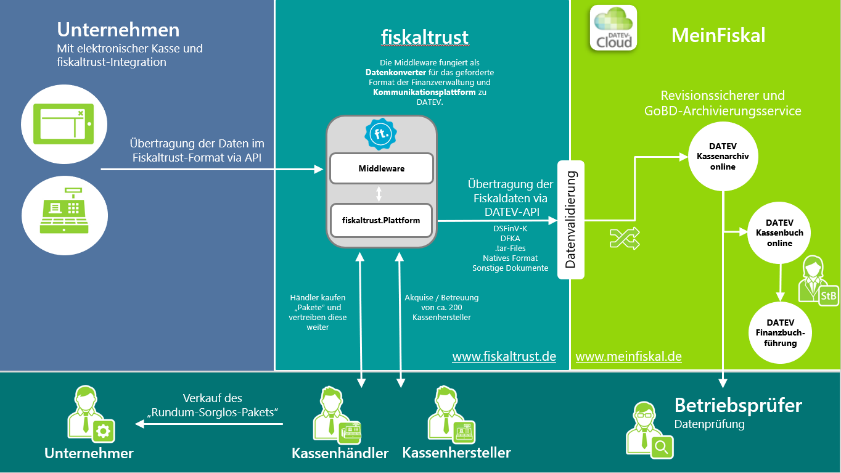
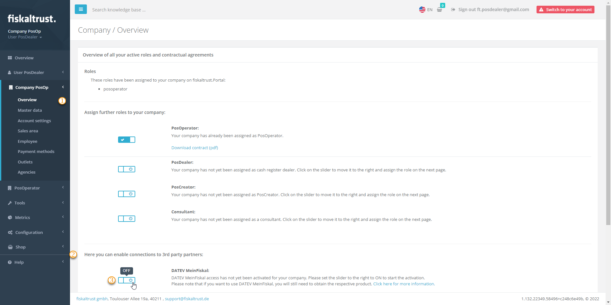
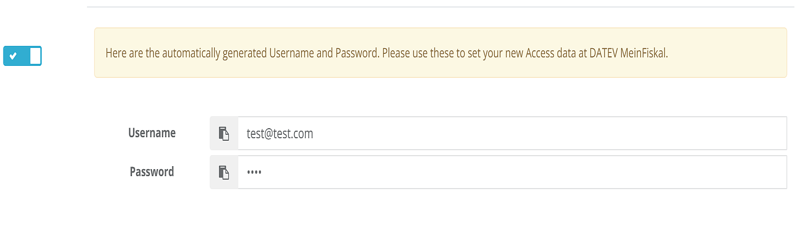
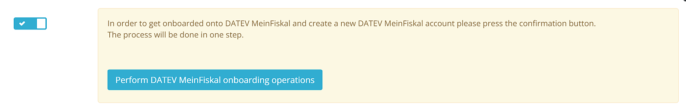

# DATEV MeinFiskal

:::info summary

After reading this, you will understand the benefits for PosOperators of connecting their fiskaltrust.Account to _DATEV MeinFiskal_ and how PosDealers can set up the integration.

:::

:::caution Austria / France

As _DATEV MeinFiskal_ is only available in Germany, this tutorial does not apply to Austria or France.

Please note that the included links in this section lead to DATEV, which only keeps its documentation in German.

:::

  [DATEV](https://www.datev.de/) offers fiscalization solutions for companies in Germany. The solutions for electronic cash management of DATEV meet all legal requirements.   
_[DATEV MeinFiskal](https://www.meinfiskal.de/)_ is an open cloud platform hosted by DATEV. PosCreators, providers of TSE (technical security equipment) and fiskaltrust joined this platform.  
_DATEV MeinFiskal_ is an integral part of the _fiskaltrust.Carefree_ product bundle. The data is transferred from the fiskaltrust.Portal via an automated interface to the _DATEV MeinFiskal_ platform.  

The _fiskaltrust.Carefree_ product bundle also includes the _[DATEV Kassenarchiv online](https://apps.datev.de/help-center/documents/0904340)_. Additionally, this service enables [revision-safe archiving](https://docs.fiskaltrust.cloud/de/docs/posdealers/buy-resell/products/revision-safe-archiving) in fiskaltrust's cloud, daily archiving of end-of-day totals, individual records and other tax-relevant documents as an "extended memory" of the PosSystem. 
By usage of the _DATEV Kassenarchiv online_, your PosOperator reaches a legally compliant kind of higher security:
* Additional storage to prevent loss of the data 
* Proof that nobody can change the PosSystem data
* Accordance with the GoBD
* Audit-proof archive for the duration of the statutory retention period
* Storage of data in DATEV datacenters

Tax consultants and authorities are working on introducing digital workflows to clients. The interface named *[DATEV Kassenbuch-Schnittstelle](https://apps.datev.de/help-center/documents/0904388)* is available from DATEV; data from PosSystems for financial accounting can be forwarded directly to the tax advisor's DATEV software solution. In addition, an up-to-date database without delays creates transparency in the event of an upcoming external audit.

### Process description

The PosCreator adds a PosSystem in the fiskaltrust.Portal. Thereby a **PosSystemId** is assigned. Then the PosCreator invites PosDealers to use this PosSystem.
A valid PosSystemId is a prerequisite for successfully registering PosOperators with MeinFiskal.

The PosDealer activates the _DATEV MeinFiskal_ function in the fiskaltrust.Portal by signing the **user agreement** on behalf of the PosOperator.
Customer data such as **E-Mail address** and **tax number** (St.-ldNr. or USt-ldNr.) are exchanged between the fiskaltrust.Portal and the _[DATEV MeinFiskal](https://www.meinfiskal.de/)_ platform. A MeinFiskal user account and a password is created automatically at DATEV. In that creation, the same E-Mail address is used as in the fiskaltrust.Portal. 
The PosDealer changes the password for the user account at _DATEV MeinFiskal_ and confirms the data transfer between fiskaltrust and DATEV. The PosOperator receives a welcome E-Mail from _DATEV MeinFiskal_ and can use the services _DATEV Kassenarchiv online_. Further services like the _DATEV Kassenbuch-Schnittstelle_ are available at the MeinFiskal platform.

Fiskaltrust takes over the generation of the legally required data formats (DSFinV-K, DFKA taxonomy, .tar files, native format, other documents), as well as the connection and data transfer to _DATEV MeinFiskal_ via the fiskaltrust.Portal.

## Setup

### Prerequisites

As a PosDealer, you can get an overview of all your PosSystems and their **PosSystemId** in use 
1. Log in to **fiskaltrust.Portal** and select `PosSystems`.
2. If no PosSystem should be available, contact your PosCreator.

The PosOperator already has an account in the **fiskaltrust.Portal**, agreed to the general terms and conditions and the PosOperator user agreement of fiskaltrust, checked his master data, and you, as a PosDealer, have the authorization to sign contracts. If these requirements are not met, the [PosOperator Onboarding](../../../getting-started/operator-onboarding/invitation-process.md) must be completed first, or the PosOperator itself must perform the setup.

### Sign contract permission

  1. Log in to **fiskaltrust.Portal** as a PosDealer. 
  2. Go to `PosOperator` / `Overview`. 
  3. If necessary, enter filter criteria to narrow the search results and select `Search`. 
  4. Check with the icon at **Permissions** if `sign contract` is active.
  5. If this permission is not active, contact the PosOperator to give it to you.
  6. Close the dialog box by clicking **OK**. 
  
###  Master data

  1. Select the link at `Name` and go to the account of the PosOperator.
  2. Select `Company` / `Master data`.
  3. Check if every mandatory field, like `Name*` or `Address*`, is filled in.

  5. Check whether you can successfully perform a validity check with either St.-ldNr. or USt-ldNr.
  6. Save your entries with **Save**. 

### Setup instructions

:::tip

Please note that the _DATEV MeinFiskal_ account is created automatically during the connection. Therefore, please **do not create** a _DATEV MeinFiskal_ account for your PosOperator in advance.

:::

#### Setup after the purchase of a Carefree Package

:::info summary

After purchasing a fiskaltrust.Sorglos-bundle, a process starts for connecting your account at fiskaltrust.Portal and DATEV MeinFiskal, running in the background.
Explanations for the necessary requirements for setting up DATEV MeinFiskal you find at [Master data](#master-data). Whether the [fiskaltrust.Sorglos bundle](https://portal.fiskaltrust.de/Shop/Product?productId=4445-021040) was purchased without or [with the additional product TSE-as-a-Service](https://portal.fiskaltrust.de/Shop/Product?productId=4445-021050) is irrelevant when setting up the connection. Furthermore, neither a queue nor a CashBox is necessary when setting up the connection. However, for successful data backup via DATEV MeinFiskal, Queue and CashBox must be set up and also activated if required. In case of problems, please check [Troubleshooting](#troubleshooting) below.

:::

##### Connection set up

| steps | description                                                                                                                |
|:----------------------:|-------------------------------------------------------------------------------------------------------------------------------------|
| |After purchasing of a fiskaltrust.Sorglos bundle, select `Company` / `Overview`.  |
| |Scroll down until **Here you can enable connections to 3rd party partners:**.  |
| |Press the `slider`, if you have not yet.|
| |You will be redirected to the page to read and `sign` the contract (**Nutzungsvertrag über die Nutzung von DATEV MeinFiskal**). With your signature, a background process starts. Please give this the necessary time and refrain from refreshing the page. Changing the page or logging off and on again to the account will not have a negative effect.|

##### Connection set up with success

| steps | description                                                                                                                |
|:----------------------:|-------------------------------------------------------------------------------------------------------------------------------------|
| |If the background process for connecting your account to DATEV MeinFiskal was successful, the fiskaltrust.Portal will show you a `Username` and a `Password` with automatically generated values. |
| |Copy or note these values. |
| |Switch to [kassenarchiv/login](https://meinfiskal.de/kassenarchiv/login).  |
| |Log in with the previously automatically generated values.  |
| |Replace the `Username` with an E-mail address of your choice. |
| |Replace the `Password` with an expression of your choice; please note the restrictions and validations of DATEV. |

##### Connection set up without success

| steps | description                                                                                                                |
|:----------------------:|-------------------------------------------------------------------------------------------------------------------------------------|
| |In case of a problem, we strongly recommend checking [Master data](#master-data). |
| |Then select `Company` / `Overview` again. |
| |Press `Perform DATEV MeinFiskal onboarding operations` for a retry. |

#### Setup after the purchase of a DATEV MeinFiskal standalone

:::info summary

After purchasing a Carefree package, a connection between the company and DATEV MeinFiskal is created in the background. After purchasing a standalone product [DATEV MeinFiskal Kassenarchiv online](https://portal.fiskaltrust.de/Shop/Product?productId=4445-041040), you must create this connection manually. This section explains the necessary steps. In case of problems, please check [Troubleshooting](#troubleshooting) below.

:::

1. The PosDealer activates the _DATEV MeinFiskal_ function in the [fiskaltrust.Portal](https://portal-sandbox.fiskaltrust.de/AccountProfile) on behalf of the PosOperator.

  

  
Screenshot function DATEV MeinFiskal
. 

  

  

2. The PosDealer agrees on behalf of the PosOperator to the `T&C`, the `privacy policy` and the `processing agreement` (of or with fiskaltrust and, in particular, the service descriptions, which you can find in the [download area](https://portal.fiskaltrust.de/AccountProfile/Download) of the fiskaltrust.Portal). The PosOperator receives the **signed contract** by E-Mail.

3. In the _DATEV MeinFiskal_ section, the **user contract** is now available for download. You will also find a button for carrying out the _DATEV MeinFiskal_ onboarding. Select `Perform DATEV MeinFiskal onboarding operations`. In addition, DATEV checks the master data; any errors are displayed, and, if successful, a _DATEV MeinFiskal_ user account is automatically created.

  

  
DATEV MeinFiskal-Onboarding 
  

  

  

4. The _DATEV MeinFiskal_ dialog box for changing the password is displayed. The PosDealer sets a new password and clicks **Save**.

  

  
Screenshot DATEV password change
  

  

  

5. You, as a PosDealer, will get a confirmation of the password change and can select a login button.

  

  
Screenshot DATEV password change successful
  

  

  

6. You enter the _DATEV MeinFiskal_ login data in the login dialog, i.e., the same E-Mail address as in the fiskaltrust.Portal and the previously changed password. Confirm the connection between fiskaltrust and DATEV MeinFiskal. With this step, the fiskaltrust and Datev MeinFiskal accounts are connected. 

  

  
Screenshot DATEV login / connect accounts
  

  

  

7. After successfully logging in to the _DATEV MeinFiskal_ platform, you are asked to confirm the data exchange between fiskaltrust and DATEV MeinFiskal. Tick the checkbox and select *Confirm*. The data transfer between fiskaltrust and _DATEV MeinFiskal_ is now active. 

  

  
Screenshot DATEV data exchange screenshot
  

  

  

8. The PosOperator receives a welcome E-Mail about an hour later with general information and a link to change the password.

9. The PosOperator clicks on the link to change the password and changes his _DATEV MeinFiskal_ password (see screenshot under point 4). 
The PosOperator can now use the services *DATEV Kassenarchiv online* and order the *DATEV Kassenbuch-Schnittstelle* on his own.

## Troubleshooting

- The **PosDealer** cannot sign the _DATEV MeinFiskal_ user agreement for the PosOperator, as he is not authorized to do so. The **PosDealer** must contact the PosOperator to obtain the necessary authorization.

- The **PosDealer** does not succeed on onboarding and receives messages like "Prüfen Sie die Stammdaten". Switch to `Company` / `Master data` and check, if the **E-mail Address** contains no "+". Check further if the **name fields** do not contain a ".". Both would interrupt the onboarding. Also, check that **no blanks** have been entered before or after the values.
Please note that the fiskaltrust.Portal supports up to 100 characters in the fields for **names**, but DATEV MeinFiskal accepts a maximum of 32 characters. 

- The **PosDealer** does not change the password in step 3 and can no longer log on to _DATEV MeinFiskal_ as a PosDealer. After four days at the latest, the welcome E-Mail is sent to the PosOperator. To continue the process with step 4, the **PosDealer** must contact the **PosOperator** to obtain the current password.

- The **PosDealer** can no longer log on to _DATEV MeinFiskal_ because he no longer has the login data. Therefore, he cannot request another E-Mail for a password change on the _DATEV MeinFiskal_ website on his own. This is only possible via the PosOperator once he has received the welcome E-Mail with the link to change the password on the _DATEV MeinFiskal_ website.

- The **PosDealer** cannot complete the linking process between fiskaltrust and _DATEV MeinFiskal_ because the wrong user name (not the same E-Mail address as for the fiskaltrust.Portal) was entered at _DATEV MeinFiskal_ in step 6. Therefore, the PosDealer must contact fiskaltrust support to delete the incorrect link.
