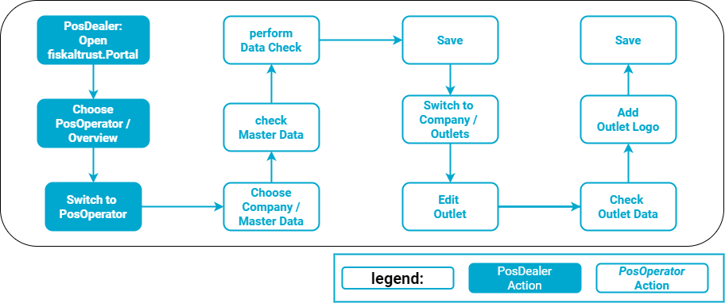

# Digital Receipt

:::info summary

After reading this, you can explain the preparations for PosOperators to use digital receipts.

:::

## Introduction

If you include digital receipts in the sales process, the customer can choose between a digital receipt and a printout.  
With digital receipts, the PosOperator can reduce expenses for printouts and help the environment.  
As a PosDealer, you thus offer a state-of-the-art PosSystem.  

Please note that the visualization in the sandbox may look different than in the productive system.
Please also note that different regulations or requirements may apply depending on the country where your PosSystem is used. Please refer to the country-specific regulations. Please understand that we can only describe these details without claiming to be complete.

## Preparations general

PosDealers or PosOperators can make the preparations for having digital receipts available. For this, only access to the fiskaltrust.Portal with **Write authorizations** is required.  

The Master Data of the PosOperators account in the fiskaltrust.Portal must be complete. The stored tax identification numbers should be verified.  

The details of the Outlet, not the company, are used as the address on the digital receipt. Therefore, these should be checked for completeness and corrected if necessary.  

The digital receipt may list a logo at the top. If this logo is desired, you should add it to the data of the Outlet. 
We recommend using a file in ~.png-format with transparent background for best results. 

## Preparations country-specific

  

  
Work steps to check Master data
  

import Tabs from '@theme/Tabs';
import TabItem from '@theme/TabItem';
import PreviewAT from '../../_markets/at/getting-started/operator-onboarding/master-data/_edit-master.mdx';
import PreviewFR from '../../_markets/fr/getting-started/operator-onboarding/master-data/_edit-master.mdx';
import PreviewDE from '../../_markets/de/getting-started/operator-onboarding/master-data/_edit-master.mdx';

<Tabs groupId="market">

  <TabItem value="AT" label="Austria">
    <PreviewAT />
  </TabItem>

  <TabItem value="FR" label="France">
    <PreviewFR />
  </TabItem>

  <TabItem value="DE" label="Germany">
    <PreviewDE />
  </TabItem>

</Tabs>

  

  

  
Work steps to check outlets
  

import OutletAT from '../../_markets/at/getting-started/operator-onboarding/master-data/_checking-outlets.mdx';
import OutletFR from '../../_markets/fr/getting-started/operator-onboarding/master-data/_checking-outlets.mdx';
import OutletDE from '../../_markets/de/getting-started/operator-onboarding/master-data/_checking-outlets.mdx';

<Tabs groupId="market">

  <TabItem value="AT" label="Austria">
    <OutletAT />
  </TabItem>

  <TabItem value="FR" label="France">
    <OutletFR />
  </TabItem>

  <TabItem value="DE" label="Germany">
    <OutletDE />
  </TabItem>

</Tabs>

  
Edit outlets
  

import EditOutletAT from '../../_markets/at/getting-started/operator-onboarding/master-data/_edit-outlet.mdx';
import EditOutletFR from '../../_markets/fr/getting-started/operator-onboarding/master-data/_edit-outlet.mdx';
import EditOutletDE from '../../_markets/de/getting-started/operator-onboarding/master-data/_edit-outlet.mdx';

<Tabs groupId="market">

  <TabItem value="AT" label="Austria">
    <EditOutletAT />
  </TabItem>

  <TabItem value="FR" label="France">
    <EditOutletFR />
  </TabItem>

  <TabItem value="DE" label="Germany">
    <EditOutletDE />
  </TabItem>

</Tabs>

## Evaluation of retrievals of digital receipts

In an audit case for the tax authorities (or in general), you, as a PosDeler or PosOperator, can verify which documents were transmitted and retrieved or printed using an export via the fiskaltrust.Portal. When using the digital receipt, an additional file is added to the export type called Full export (XML). This file provides information about the status of the individual digital receipts. In addition, linking the data records is possible using the ftReceiptJournalID, which is contained both in the raw and in the print data records.
The file format and its structure were deliberately kept simple for your support. The file format allows the data to be opened and read with a standard spreadsheet (e.g., Excel). The structure of the records is built up as follows:

|**Field name** |ftReceiptMoment |ftReceiptIdentification |ftQueueItemid |ftReceiptJournalId |ftSubmittedMoment |ftDeliveredMoment |ftDeliveredStatus |ftDeliveredStatusData                                                                                                             |
|:----------------------|:---------------------|:---------------------|:---------------------|:---------------------|:---------------------|:---------------------|:---------------------|:---------------------|
|**Description** |Time (UTC +2) at which the fiskaltrust.middleware processed the document.  | The number of the receipt, which was assigned by the fiskaltrust.SecurityMechanism. |Number of the queue by which the receipt was processed |The fiskaltrust.ReceiptJournal draws, hashes and links all receipt requests from the middleware and creates a number from them |Time (UTC +2 ) when the QR code was provided by the taxpayer.|Time (UTC +2) at which the QR code was retrieved by the consumer.|Output or retrieval status of the Receipt: `printed`: _Receipt was printed_, `accepted`: _Receipt was received elsewhere_, `submitted`: _Receipt was provided by the taxpayer_, `delivered`: _Receipt was received by the consumer_|Outputs additional parameters, such as model number of the terminal. _Function currently not yet active_|
|**Example**|04/14/2023 11:20:31|ft1D#24| 9df671cf-d0a8-4824- 9bd0-9000d8dcd8ea|1626d96a-ae5b-4a6bb1f9-6468a83ef749|04/14/2023 11:21:09|04/14/2023 11:21:09|`Printed`|Hobex ViA Pro |
