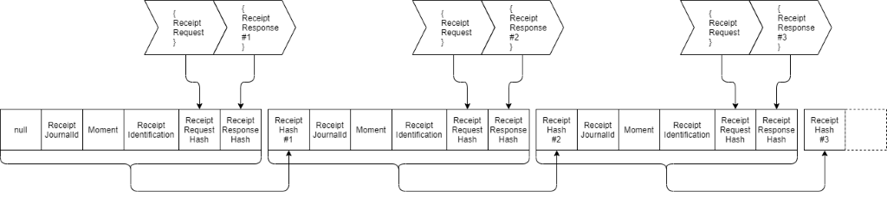
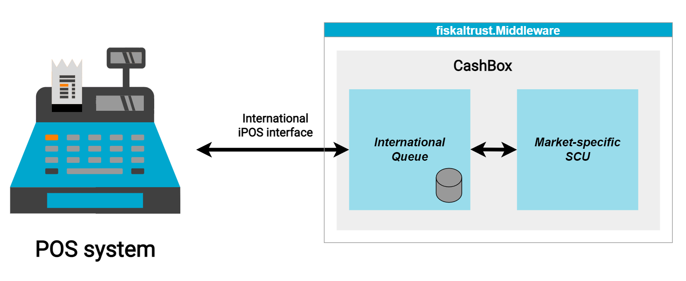

# Middleware
The Middleware is fiskaltrust's core product. It is a freely available software solution that complements your POS System and provides the central service of issuing signatures for POS receipts and keeping track of both receipts and their signatures in its chained receipt datastore. It does so using the relevant and mandatory national signing mechanisms.

The Middleware is available for all supported countries and provides a single, standardized, and unified communication interface.

It features a REST-, gRPC- and SOAP-compatible interface for communication with POS Systems and is available for on-premise deployment on Desktop devices and Android, as well as an off-premise SaaS solution.

## Security mechanism
The fiskaltrust.Middleware processes some of the most essential data fields on the receipt. The receipt number, as a unique identifier of a receipt transmitted by the cash register, is created by the fiskaltrust.Middleware to ensure that each receipt is processed by it.

Compliance is achieved by combining several methods and components.

First, the fiskaltrust.Middleware ensures that all receipts are processed by a third-party in addition to the PosCreator and PosOperator. This is the _organizational_ implementation of security.

As the _technical_ implementation of security, each request and also each response is hashed, ensuring data integrity of requests and responses. To ensure immutability, another hash value is generated that relates to the entire request-response cycle, including the identification of the cycle, the time of operation, the human-readable document number, and the hash values of the request, response, and previous receipt, called the document hash value. This concatenation of the receipt hash value provides immutability and the ability to detect all changes and a deletion in any action provided by the POS System.

To limit the risk of an attack on the chain from the last unlinked hash value, fiskaltrust provides a mechanism that mirrors the current data to the fiskaltrust cloud. This data mirror can detect attacks that would not be detectable at the cash register itself.

As the final component of the security mechanism, the fiskaltrust.Middleware also provides direct implementations for all relevant market-related security mechanisms (e.g., relevant smart cards and online signing in Austria and **all** TSSs in Germany).

To be as open as possible for different platforms and operating systems and fulfill the promise of acting as a stable interface to the POS System, the fiskaltrust.Middleware follows a strict architecture:

The configuration container - identified by the unique `CashboxId` - can be integrated into various platforms and operating systems. The management of the configuration and status of these components takes place in the market-related fiskaltrust.Portal. The fiskaltrust security mechanism is provided by the Queue component and the SCU (Signature Creation Unit) component, which implements the market-related security mechanism requirements.

## Country-specific variants
Wherever possible, fiskaltrust offers a cloud-hosted version of the Middleware to simplify the rollout process. Using this product, the Middleware doesn't need to be installed on-site, drastically reducing the installation effort. Please select the market you're interested in below for further details.

import Tabs from '@theme/Tabs';
import TabItem from '@theme/TabItem';
import HostedMiddlewareAT from '../../_markets/at/buy-resell/products/_hosted-middleware.mdx';
import HostedMiddlewareFR from '../../_markets/fr/buy-resell/products/_hosted-middleware.mdx';
import HostedMiddlewareDE from '../../_markets/de/buy-resell/products/_hosted-middleware.mdx';

<Tabs groupId="market">

  <TabItem value="AT" label="Austria">
    <HostedMiddlewareAT />
  </TabItem>

  <TabItem value="FR" label="France">
    <HostedMiddlewareFR />
  </TabItem>

  <TabItem value="DE" label="Germany">
    <HostedMiddlewareDE />
  </TabItem>

</Tabs>