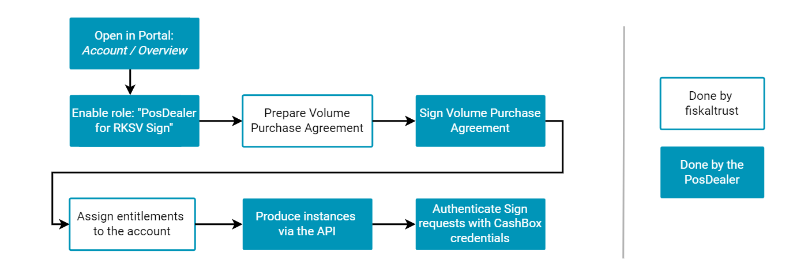
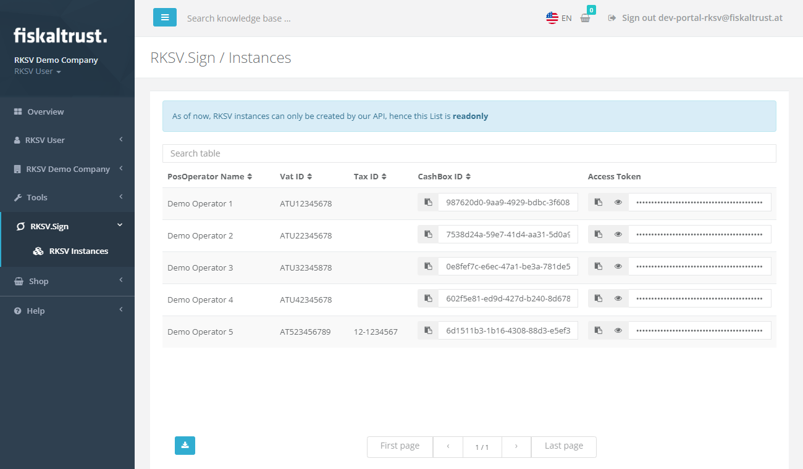

# RKSV.Sign - Receipt signing for Austria

:::info summary

After reading this, you will know how the integration of RKSV.Sign works and how to set it up.

:::

:::caution Germany / France

As RKSV.Sign is only available in Austria, this tutorial does not apply to Germany or France.

:::


RKSV.Sign is a _signing-only_ product for the Austrian market, and offers RKSV-compliant receipt signing. This product is primarily meant for users who have already implemented the Austrian fiscalization laws in their POS systems, and are looking for a cloud signing service they can use. RKSV.Sign can be easily embedded int POS systems with our [public API description](https://docs.fiskaltrust.cloud/docs/poscreators/signing/austria) and [samples](https://rksvsign-samples.docs.fiskaltrust.cloud/), and uses a simplified business flow when compared to our other products - which is described in the following sections.

:::tip

For completely new implementations, we recommend using the cloud-hosted Middleware for Austria (_SignatureCloud_), which completely abstracts the local fiscalization regulations, and can be used together with our archiving solutions for full compliance. More details about the Middleware can be found [here](../middleware.md).

:::

## Rollout process
After the PosCreator has implemented the RKSV.Sign API into the POS system (as described in the documentation mentioned above), PosDealers can go through a simplified process to prepare their Portal account for the actual rollouts. After this preparation work is done, RKSV.Sign instances can be produced via our API, enabling full automation of the process.

:::info

The buy, resell and rollout process of RKSV.Sign differs from our regular processes. Unlike users of the Middleware - where we need various details about the PosOperator to e.g. generate fiscalization exports -, **PosOperators do not need separate accounts when using RKSV.Sign**.\
This simplifies the onboarding process, as there's only a central account needed which is maintained by the PosDealer.

An overview of the process is visualized in the following flow chart. Below, the separate steps are described in more detail.

:::



### 1. Activate role and obtain entitlements
In the first step, the _"PosDealer for RKSV.Sign"_ role needs to be activated in the Portal. This can be done by switching the role's slider to the right on the _Account_ -> _Overview_ page, as illustrated in the following screenshot:


After this role was activated, your account manager at fiskaltrust will reach out to you to agree on a Volume Purchase Agreement.

When this agreement has been made, the account manager will add the required amount of _entitlements_ to your account. These entitlements are later consumed when producing RKSV.Sign instances, and the consumed amount is later used for billing.

### 2. Produce instances via the API
When the entitlements have been assigned to the account, the API can be used to produce RKSV.Sign instances - each produced instance will consume one entitlement.

RKSV.Sign instances are represented as _CashBoxes_, fiskaltrust's configuration- and authentication containers. 

The required API request looks like this:

```
POST https://helipad-sandbox.fiskaltrust.cloud/api/configuration

Headers:
accountid: <your-account-id>
accesstoken: <your-account-accesstoken>

Body:
"{
    \"ftCashBoxId\": \"|[cashbox_id]|\",
    \"ftSignaturCreationDevices\": [
        {
            \"Id\": \"|[scu0_id]|\",
            \"Package\": \"fiskaltrust.RKSVSign\",
            \"Configuration\": {
                \"ProductNumber\": \"4154+020301\",
                \"CompanyName\": \"<Name of the PosOperator company>\",
                \"CompanyEmail\": \"<Email of the PosOperator company>\",
                \"TaxId\": \"<Tax ID of the PosOperator company>\",
                \"VatId\": \"<Vat ID of the PosOperator company>\",
            },
            \"Url\": []
        }
    ],
    \"ftQueues\": []
}"
```

The `-sandbox` part of the URL must be used when using the sandbox system. The production systems behave equally, but use the URL `https://helipad-sandbox.fiskaltrust.cloud/api/configuration`. Either the `TaxId` or the `VatId` of the PosOperator need to be passed (or optionally both).


This call will produce the following response, containing `cashBoxId` and `accessToken` (which are used to authenticate sign calls in the next step):

```json
{
    "cashBoxId": "<generated-cashbox-id>",
    "accessToken": "<generated-access-token>",
    "configuration": "{ ... }"
}
```


This request is also available in our [RKSV.Sign Postman collection](https://rksvsign-samples.docs.fiskaltrust.cloud/#c7c7014d-ce3e-4577-aeff-f5e302d15b4b).

:::tip

Please note that our API immediately returns cashbox credentials, although producing the signing certificate in our backend systems is an asynchronous process. It therefore may take up to 5 minutes until the provided credentials can be used to sign receipts.

:::

### 3. Provide the credentials to the POS system
The `cashBoxId` and `accessToken` that were returned in the last step now need to be used to authenticate the requests to the RKSV.Sign API. The concrete steps to set these values in the POS system depend on the PosCreators implementation.

In case the credentials were not preserved during creating the instance, they can be obtained from the Portal as well - which is described in the next step.

### 4. Get an overview about RKSV.Sign instances
When activating the _PosDealer for RKSV.Sign_ role in the Portal, a new product-specific section is added to the navigation bar. The _RKSV.Sign_ -> _RKSV Instances_ page can be used to obtain an overview about the currently existing instances, as well as to obtain the credentials for these CashBoxes.


