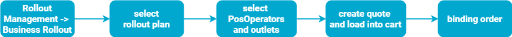

# Rollout Plans

:::info summary

After reading this, you can buy or transfer selected entitlements most easily.

:::

:::caution 🇦🇹 Austria

This tutorial is, unfortunately **, not yet applicable to the Austrian market** as rollout plans are not active there yet. While working on enabling rollout plans in Austria, please use the [shop](./shop.md) to create a SignatureCloud cashbox.

:::

## Introduction

For the scaled rollout of _fiskaltrust_ products, you as PosDealer use the rollout management as described under [`Getting-Started` / `My First CashBox`](../getting-started/my-first-cashbox.md). The Rollout Management consists of two types of plans:

### Business Rollout

The business rollout simplifies acquiring entitlements, transferring them to the PosOperators outlets and activating (generating) them for the PosOperator. You do not have to switch to the PosOperator's account to move and activate the products. The system will automatically select the required products for the chosen Business Rollout plan. This plan reduces the risk of an incorrect composition of the shopping basket. This can be done for multiple PosOperators and outlets at the same time.

This sketch shows the process :

import Tabs from '@theme/Tabs';
import TabItem from '@theme/TabItem';

import BusinessRolloutFR from '../_markets/fr/getting-started/my-first-cashbox/_business.mdx';
import BusinessRolloutDE from '../_markets/de/getting-started/my-first-cashbox/_business.mdx';

<Tabs groupId="market">

  <TabItem value="FR" label="France">
    <BusinessRolloutFR />
  </TabItem>

  <TabItem value="DE" label="Germany">
    <BusinessRolloutDE />
  </TabItem>

</Tabs>

### Technical Rollout

You, as a PosDealer,  can use the [technical rollout](../getting-started/my-first-cashbox.md#technical-rollout-creating-the-cashbox) to create the technical components of CashBoxes for the selected PosOperator and outlet. 

### Benefits of using a rollout plan

#### Saving time

Rollout plans allow you as a PosDealer or your team members to rapidly create the key elements.  
You generate more time for making adjustments to meet the specific requirements of each PosOperator and their different demands.

#### Improving communication

With rollout plans, you clearly can define which action steps designated team members have to take during different rollout phases.
You gain more flexibility to achieve your revenue and customer satisfaction goals.

#### Decreasing stress 

Rollout plans make it easier to identify the critical elements of each phase in the rollout.
In the case of bug fixes, you get fast insight into the actual status.

#### Increasing buy-in

Focusing on rollout plans gives you a helping hand in explaining which products you offer and why. 
This focus can boost the sales process with your PosOperators.

#### Improving organization 

Using rollout plans will support you as a PosDealer with a well-organized rollout strategy.

## Further information

Please check the offers at Rollout Management in your account.
Please note that differences between the productive system and the sandbox are likely.
The content in the sandbox is available to test new features for _fiskaltrust_ and friendly customers.