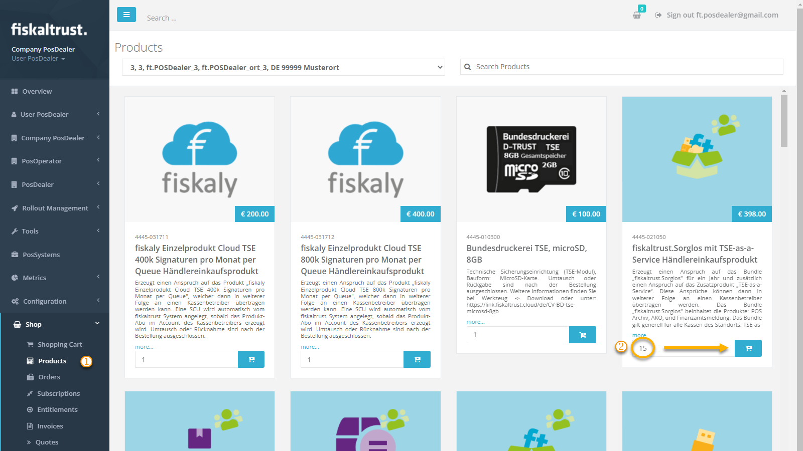
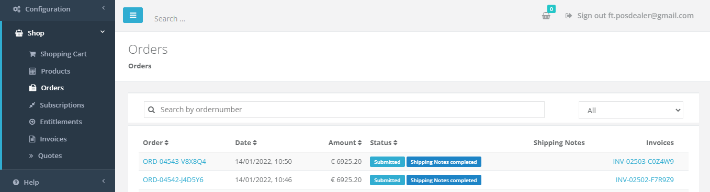
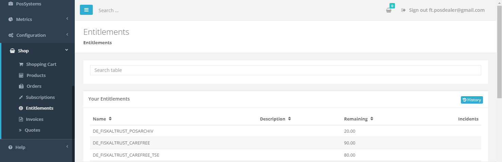

# Shop

:::info summary

After reading this, you can buy and transfer all entitlements manually.

:::

## Introduction

The shop is the most basic way to buy _fiskaltrust_ [products](products) for PosDealers and PosOperators. You can find the price list for these products [here](overview.md#Contact-information-and-pricelists).

:::info prerequisites

As a PosDealer, you should know how to [surrogate](../getting-started/operator-onboarding/surrogating.md), have signed a  [volume purchase agreement](overview.md), have a volume discount and a credit limit. 
As a PosOperator, you should clarify with your PosDealer whether to buy the products directly or via your PosDealer.

:::

## Entitlements

As a PosDealer, you do not buy products directly for your PosOperators. Instead, you purchase "Entitlements", claims to the products, which you can later transfer to the PosOperators outlets individually. You buy these entitlements like other products at `Shop` / `Products`. You will find your existing entitlements at `Shop` / `Entitlements`. 

## Buying Products or Entitlements

In this example, we will go through buying a product using entitlements. The process of purchasing a dedicated product is similar. You choose an outlet, buy a product operating as a PosOperator and do not have to transfer it.

:::tip sandbox

If you want to try how the shop works, you should do this in the [Sandbox](../getting-started/sandbox.md). Orders placed in the sandbox are just for testing purposes and will not cost you anything, but always make sure you are working in the sandbox.

:::

|             Step             | Description                                                  |
| :--------------------------: | ------------------------------------------------------------ |
|  | Go to `Shop` / `Products` in the left-hand navigation menu to buy a product or entitlement. |
|  | If you buy a product as a PosOperator directly, select the desired **outlet** in the top center.  |
|  | Choose a product, enter an amount to purchase and click on the basket symbol.  |
|  | Click on the basket in the top right of the window and click the `Checkout` button.  | 
|  | **Check** the products, the amount, price and outlet if applicable before clicking the `binding order` button.| 
|  | Clicking the `binding order` button shows a confirmation of your order, you get a copy via E-Mail.  | 

## Transfer Entitlements to PosOperators Outlet
To transfer the entitlements to the PosOperator, you have to [surrogate](../getting-started/operator-onboarding/surrogating.md) into that account by clicking the PosOperators name at `PosOperator` / `Overview`. 

import ReactPlayer from "react-player"

<ReactPlayer controls url={require("./images/shop-transfer.mp4").default} /> 

|             Step             | Description                                                  |
| :--------------------------: | ------------------------------------------------------------ |
|  | Go to `Shop` / `Products` in the left-hand navigation menu to transfer an existing entitlements to this PosOperators outlet. |
|  | Select the desired **outlet** in the top center. |
|  | Choose a **transfer entitlement** product and click on the basket symbol besides. Repeat this for all entitlements that you want to transfer to this outlet.  |
|  | Choose a **create entitlement** product and click on the basket symbol besides. Repeat this for all entitlements that you want to transfer to this outlet. Note **to first add the products for transferring claims** to the basket! |
|  | **Switch to your account** by clicking the red button on the top right of the window. |
|  | Click on the basket in the top right of the window and click the `Checkout` button.  | 
|  | The transfer and activation of existing entitlements should be free. **Check** the order, the PosOperator and the outlet before you click the `binding order` button.| 
|  |Clicking the `binding order` button shows a confirmation of your order, you get a copy via E-Mail.  | 

:::tip 

Always make sure you perform the transfer for the desired PosOperator and outlet and place the transfer entitlements products before they create entitlements products into the basket.
You can combine orders for multiple outlets by repeating steps 2 to 4 for different outlets and then go on with step 5.
:::

After transferring the entitlements, you check at `Shop` / `Entitlements` the reduction of your remaining entitlements. You can see the order and invoice, as usual. Additionally, you can see the now activated subscription at `Shop` / `Entitlements`.

## Orders

You can check the status of all your orders at `Shop` / `Orders`:

## Invoices
You can find the corresponding invoices at `Shop` / `Invoices`:

## Entitlements
Once the order is processed successfully, you will find the entitlements you purchased at `Shop` / `Entitlements`. If you want to see the history of your single purchases, you can click on the button `History`. There you also can search for a single order number.

