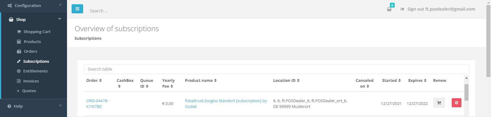

# Shop

:::info summary

After reading this, you can buy and transfer all entitlements manually.

:::

## Introduction

The shop is the most basic way to buy fiskaltrust [products](products) for PosDealers and PosOperators. The pricelist for these products can be found [here](framework-agreement#pricelist).

:::info prerequisites

As a PosDealer, you should know how to [surrogate](../getting-started/operator-onboarding/surrogating), signed a  [Framework Agreement](framework-agreement), have a volume discount and a credit limit. 
As a PosOperator, you should clarify with your PosDealer wether to buy the products directly or via your PosDealer.

:::

## Entitlements

As a PosDealer, you do not buy products directly for your PosOperators. Instead you purchase "Entitlements", claims to the products, which you can later transfer to the PosOperators outlets individually. These entitlements are bought like all other products at `Shop` / `Products`. You will find your existing entitlements at `Shop` / `Entitlements`. 

## Buying Products or Entitlements

In this example we will go through the process of buying a product using entitlements. The process to buy a product directly is similar. You just buy a product directly as a PosOperator instead of buying an entitlement and you will assign it to an outlet directly and do not have to transfer it.

:::info sandbox

If you  want to try how the shop works, you should do this in the [Sandbox](../getting-started/sandbox). Orders placed in the sandbox are just for testing purposes and will not cost you anything, but always make sure you really are working in the sandbox.

:::

|             Step             | Description                                                  |
| :--------------------------: | ------------------------------------------------------------ |
|  | Go to `Shop` / `Products` in the left-hand navigation menu to buy a product or entitlement. |
|  | If you buy a product as a PosOperator directly, select the **outlet** in the top center that you want buy the product for.  |
|  | Choose a product, enter an amount to purchase and click on the shopping cart symbol besides.  |
|  | Click on the shopping cart in the top right of the window and click the `Checkout` button.  | 
|  | **Check** the products, the amount,price and outlet if applicable before you click the `binding order` button.| 
|  | A confirmation for your order will be shown and also sent to you via E-Mail.  | 

## Transfer Entitlements to PosOperators Outlet
To transfer the entitlements to the PosOperator, you have to [surrogate] (../getting-started/operator-onboarding/surrogating) into that account by clicking the PosOperators name at `PosOperator` / `Overview`. 

import ReactPlayer from "react-player"

<ReactPlayer controls url={require("./images/shop-transfer.mp4").default} /> 

|             Step             | Description                                                  |
| :--------------------------: | ------------------------------------------------------------ |
|  | Go to `Shop` / `Products` in the left-hand navigation menu to transfer an existing entitlements to this PosOperators outlet. |
|  | Select the **outlet** in the top center that you want to transfer the entitlements to. |
|  | Choose a **transfer entitlement** product and click on the shopping cart symbol besides. Repeat this for all entitlements that you want to transfer to this outlet.  |
|  | Choose a **create entitlement** product and click on the shopping cart symbol besides. Repeat this for all entitlements that you want to transfer to this outlet. The transfer entitlements products must have been placed into the shopping cart **before**! |
|  | **Switch to your account** by clicking the red button on the top right of the window. |
|  | Click on the shopping cart in the top right of the window and click the `Checkout` button.  | 
|  | The transfer and activation of existing entitlements should be free of charge. **Check** the order, the PosOperator and the Outlet before you **click** the `binding order` button.| 
|  | A confirmation for your order will be shown and also sent to you via E-Mail.  | 

:::info 

Always make sure you perform the transfer for the desired PosOperator and outlet and place the transfer entitlements products before the create entitlements products into the shopping cart.
You can combine orders for multiple outlets by repeating steps 2 to 4 for different outlets and then go on with step 5.
:::

After transfering the entitlements, you will see that your remaining entitlements have been reduced at `Shop` / `Entitlements`. You can see the order and invoice as usual, additionally you can see the now activated subscription at `Shop` / `Entitlements`.

## Orders

You can check the status of all your orders at `Shop` / `Orders`:

## Invoices
The corresponding invoices can be found at `Shop` / `Invoices`:

## Entitlements
Once the order is processed successfully, you will find the entitlements you purchased at `Shop` / `Entitlements`. If you want to see the history of your single purchases, you can click on the Button `History`. There you also can search for a single order number.

## Subscriptions
An overview of your subscriptions can be found at `Shop` / `Subscriptions`.

