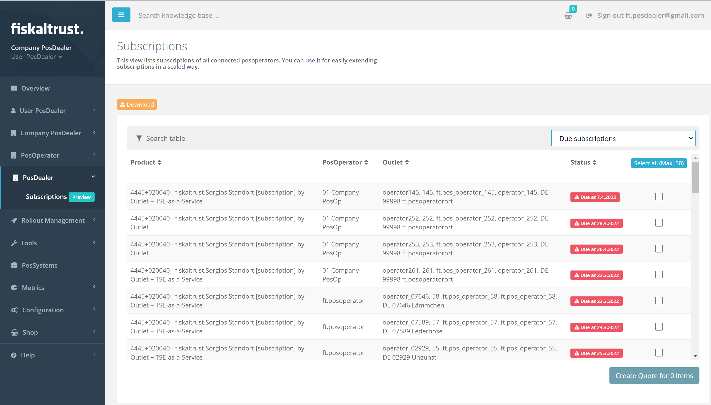

# Shop

:::info summary

After reading this, you can renew the payment or cancel subscriptions.

:::

## Introduction

Many _fiskaltrust_ [products](products) are subscription based and require a renewed payment every year. If you decide on not using a specific product any more, you have to cancel the subscription, which will end it with the last day of the current subscription period. 

## PosDealer: All PosOperators subscriptions
As a PosDealer, you can get an overview of all your PosOperators subscriptions at `PosDealer` / `Subscriptions`.
You can filter the list to only see those, which are overdue or due and renew the payment for multiple subscriptions at the same time.

## PosOperator subscriptions
An overview of a single PosOperators subscriptions can be found at `Shop` / `Subscriptions`.
They can be cancelled or the payment renewed.

