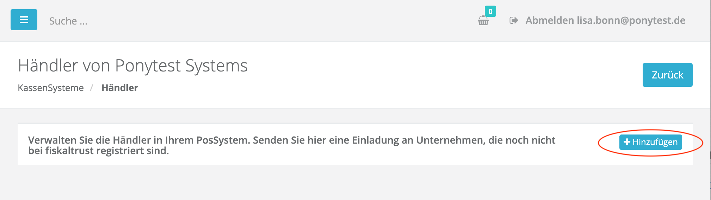
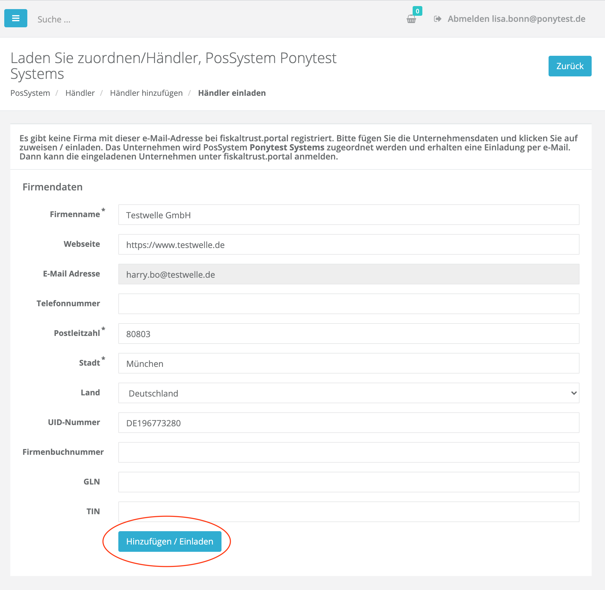
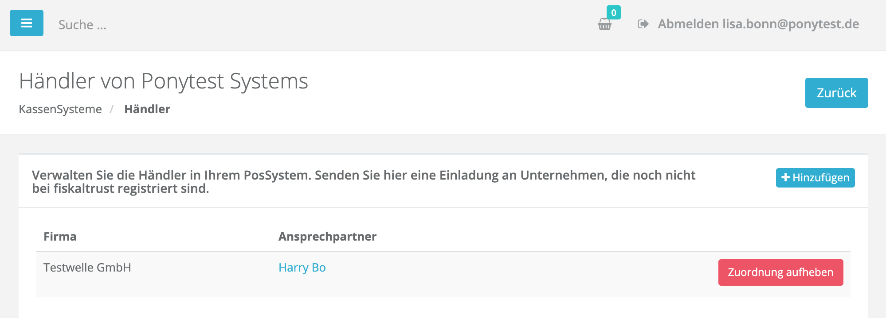
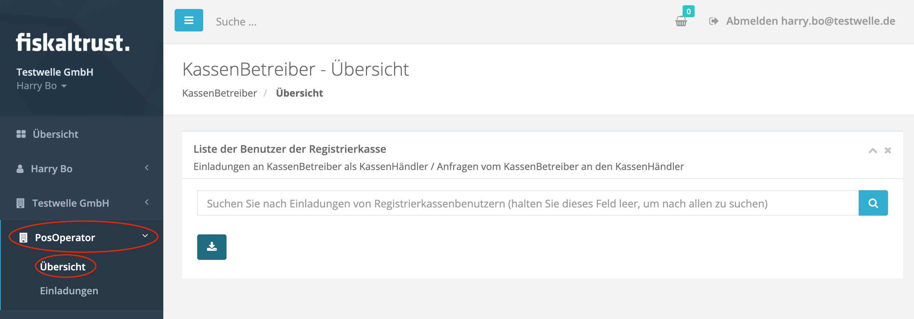

 
<strong>Compliance-As-A-Service für Kassensysteme</strong>
 
 
<h1>Rollout Dokumentation für Deutschland</h1>
 

 

## Einladungsmanagement

Wie in der [Einleitung](../README.md) beschrieben, werden beim Rollout der fiskaltrust.Middleware drei Partnerrollen unterschieden: 

- KassenHersteller (POSCreator)
- KassenHändler (POSDealer)
- und KassenBetreiber (POSOperator)

Das fiskaltrust.Portal wird unter anderem als wichtiges Rolloutmanagement-Tool verwendet. Grundvoraussetzung für die Verwendung des fiskaltrust.Portal als Rolloutmanagement-Tool ist die Registrierung der KassenHersteller, ihrer KassenHändler und KassenBetreiber im fiskaltrust.Portal. Hierzu müss sich zuerst der KassenHersteller im Portal registrieren, um dann seine KassenHändler zur Registrierung mit Hilfe des Portals einzuladen. Daraufhin laden die registrierten KassenHändler wiederum ihre KassenBetreiber zur Registrierung ein (ebenfalls über das fiskaltrust.Portal).

Im Folgenden wird im Detail beschrieben wie der Einladungsprozess funktioniert und auf welche Aspekte dabei besonders zu 8ten ist. 

### KassenHersteller laden KassenHändler ein

Die KassenHersteller integrieren die fiskaltrust.Middleware in ihr Kassensystem (POSSystem). Sie müssen sich dafür im fiskaltrust.Portal selbständig registrieren. Des Weiteren müssen KassenHersteller bei der Registrierung im fiskaltrust.Portal, die Rolle "KassenHersteller" (POSCreator) wählen, den Kooperationsvertrag mit fiskaltrust digital unterzeichnen und Ihr Kassensystem (POSSystem) im fiskaltrust.Portal eintragen. Die Registrierung des Kassensystems ist die Voraussetzung zur Einladung der KassenHändler. Bitte laden Sie so früh wie möglich Ihre KassenHändler ein, denn die KassenHändler benötigen genügend Zeit zum Einladen der KassenBetreiber und zum Vorbereiten und Testen des Massenrollout. 

Als erstes müssen Sie dazu Ihr(e) KassenSystem(e) im fiskaltrust.Portal eintragen/registrieren.  Danach können Sie über das eingetragene KassenSystem die dazugehörigen Händler einladen.

#### KassenSystem (POSSystem) eintragen

Als KassenHändler können Sie wir folgt Ihr Kassensystem (POSSystem) im fiskaltrust.Portal registrieren:

1. Klicken Sie den Menüpunkt "POSSystems" an. Sie gelangen zur Übersicht Ihrer registrieren Kassensysteme:

   

2. Klicken den "Hinzufügen" Button um Ihr KassenSystem anzulegen. Die Erfassung erfolgt über ein Formular:

   

3. Nach Eingabe der Daten, können Sie den Button "Erstellen" zum Anlegen des Kassensystem drücken. Daraufhin erscheint die wieder die Übersicht, in der nun das erfasste Kassensystem angezeigt wird:

#### KassenHändler einladen

4. Wie im oberen Bild sichtbar, sind dem neu erfassten KassenSystem noch keine KassenHändler zugewiesen. Drücken Sie auf "Händler" um zur Übersicht der Ihnen zugeordneten Händler zu gelangen und mit den Einladungen zu beginnen.

5. Drücken Sie nun den "Hinzufügen" Button um einen Händler zu Erfassen und einzuladen. Geben Sie als nächstes die Email-Adresse des Händlers ein (Email-Adresse des Ansprechpartners - diese wird später zum Login vom Händler verwendet.):

6. Drücken Sie nun den "Suchen" Button. Das Portal wird den Händler im System suchen. Falls dieser bereits registriert ist, kann er sofort zugeordnet werden. Ansonsten kommt ein Formular zum Erfassen der Händlerdaten:

7. Drücken Sie nach der Erfassung der Daten im Formular den "Hinzufügen/Einladen" Button. Das Portal wird daraufhin eine Einladung-Email an den KassenHersteller senden. In der Übersicht ist nun der Händler als zugeordnet zu sehen:

   Zudem erhält der KassenHändler 2 Emails (Einladungs-Email und Zuordnung-Email):

**Einladungs-Email an den KassenHändler:**

**Zuordnungs-Email an den KassenHändler:**

8. Als Nächstes drückt der eingeladene Händler den "Link zur Aktivierung", den er in der Einladung-Email erhalten hat. Er gelangt zum fiskaltrust.Portal und muss hier als sein Passwort setzen um die Registrierung abzuschließen:

   

9. Der Händler wird zur "Überisichtseite" seines Accounts im Portal weiter geleitet und MUSS hier die Rolle "KassenHändler" aktivieren:

   

10. Durch das Aktivieren der Rolle "KassenHändler" erscheint der Kooperationsvertrag mit fiskaltrust, den der KassenHändler digital unterschrieben muss:

    

11. Sobald der Händler den Kooperationsvertrag mit fiskaltrust digital unterschrieben hat wird er zurück zur Übersicht geführt. Hier kann er sehen, dass die Rolle "KassenHändler" aktiviert hat:

    

12. Dies bekommt der Händler auch per Email mitgeteilt:

    

Damit sit der KassenHändler eingeladen und dem Kassensystem zugeordnet. Er kann nun mit der Einladung der KassenBetreiber beginnen.

### KassenHändler laden KassenBetreiber ein
Als KassenHändler müssen Sie Ihre KassenBetreiber (POSOperator) im fiskaltrust.Portal einladen um das Portal als Rolloutmanagement-Tool für die fiskaltrust.Middleware und für andere fiskaltrust Produkte nutzen zu können. Sie können einzelne KassenBetreiber aber auch viele KassenBetreiber gleichzeitig einladen (CSV-Import).

Unter dem Menüpunkt "PosOperator -> Überischt" können Sie sich die Liste der bereits Ihnen zugeordneten KassenBetreiber anzeigen lassen. Diese Liste ist Anfangs leer:

Um KassenBetreiber einzuladen, gehen Sie wie folgt vor:

1. Screen "Einladungen" aufrufen. Klicken Sie dazu den Menüpunkt "PosOperator->Einladungen". Hier können Sie die Einladungen vorbereiten und sobald fertig, an die KassenBetreiber versenden:

2. Konfigurieren Sie als nächstes die Einladungs-Email die später an die eingeladenen Betreiber gesendet wird. Sie können hierzu eine PDF Datei anhängen und einen Zusatztext schreiben. Diese werden in die automatisch von fiskaltrust erstellte Einladung-Email übernommen.

3. Geben Sie zudem an, welche Rechte Sie auf den Accout des Betreibers haben möchten. Dazu haben Sie folgende Möglichkeiten:

- "Nur lesen": Sie können sich später in den Account des Betreibers einloggen, können dort aber nichts ändern
- "Lesen und Schreiben": Sie können sich später in den Accoubt des Betreibers einloggen, können dort alles lesen und schreiben, also zum Beispiel die Konfiguration der fiskaltrust.Middelware anlegen, die sie beim Rollout benötigen werden.
- "Voll": Sie können sich später in den Account des Betreibers einloggen, können dort alles lesen und schreiben, zudem können Sie im Namen des Betreibers Produkte von fiskaltrust einkaufen und Verträge unterzeichnen.
- "keine Zugriffsrechte": Sie können sich später nicht in den Account des Betreibers einloggen.

