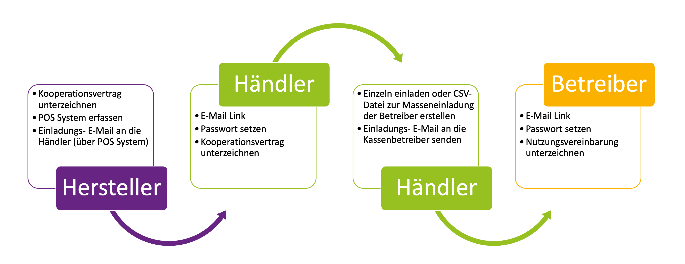
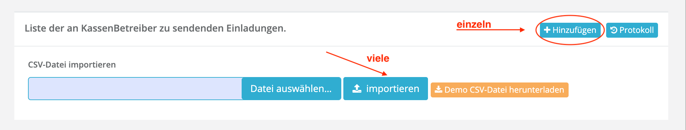
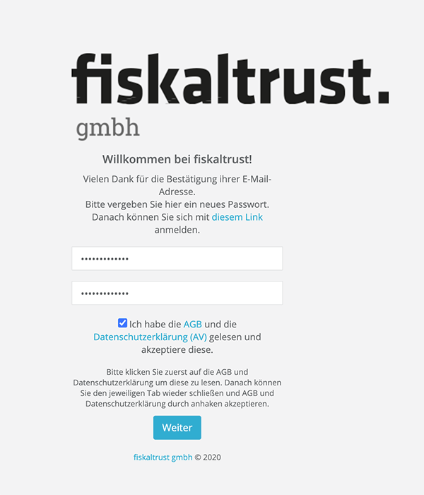

 
<strong>Compliance-as-a-Service für KassenSysteme</strong>
 
 
<h1>Rollout Dokumentation für Deutschland</h1>
 

 

# Einladungsmanagement

## Inhalte

<pre>
├── <a href="#einleitung" title="Einleitung">Einleitung</a>
├── <a href="#kassenhersteller-laden-kassenhändler-ein" title="KassenHersteller laden KassenHändler ein">KassenHersteller laden KassenHändler ein</a>
│   └── <a href="#kassensystem-possystem-eintragen" title="KassenSystem (PosSystem) eintragen">KassenSystem (PosSystem) eintragen</a>
│   └── <a href="#kassenhändler-einladen" title="KassenHändler einladen">KassenHändler einladen</a>
├── <a href="#kassenhändler-laden-kassenbetreiber-ein" title="KassenHändler laden KassenBetreiber ein">KassenHändler laden KassenBetreiber ein</a>
│   └── <a href="#standorte-für-kassenbetreiber-anlegen" title="Standorte für KassenBetreiber anlegen">Standorte für KassenBetreiber anlegen</a>
├── <a href="#schlusswort" title="Schlusswort">Schlusswort</a>

</pre>

## Einleitung

Wie in der [allgemeinen Rollout-Einleitung](../README.md) beschrieben, werden von fiskaltrust beim Rollout der fiskaltrust.Middleware drei Partnerrollen unterschieden: 

- KassenHersteller (PosCreator)
- KassenHändler (PosDealer)
- und KassenBetreiber (PosOperator)

Grundvoraussetzung für die Verwendung des fiskaltrust.Portal als Rolloutmanagement-Tool ist die Registrierung und Zuordnung der oben genannten Partner im fiskaltrust.Portal (https://portal.fiskaltrust.de/). Hierzu registriert sich als erster der KassenHersteller selbständig und erfasst sein(e) KassenSystem(e) (PosSystem) im Portal. Danach lädt er pro KassenSystem seine dazugehörigen KassenHändler zur Registrierung ein. Für die Einladung verwendet er die Einladungsfunktion im Portal. Die registrierten KassenHändler laden dann als nächstes ihre KassenBetreiber ebenfalls über das Portal ein. Dadurch entsteht die eindeutige, systemweite Zuordnung der KassenBetreiber zu ihren KassenHändler und der KassenHändler zum KassenSystem des KassenHersteller:

Der Registrierungs- und Einladungs-Prozess sieht wie folgt aus:

1. Der KassenHersteller registriert sich im fiskaltrust.Portal, aktiviert die Rolle "KassenHersteller" und unterzeichnet digital den dazugehörigen Kooperationsvertrag mit fiskaltrust. Dann erfasst er seine KassenSysteme im Portal und sendet mit Hilfe des Portals pro KassenSystem Einladungen zur Zuordnung an seine KassenHändler. Dabei sendet das fiskaltrust.Portal automatisiert die Einladungs-Emails an die KassenHändler.
2. Der KassenHändler erhält die Einladungen-Email und klickt auf den Link zur Registrierung. Als erstes setzt er sein Passwort, wählt die Partnerrolle: "KassenHändler" und unterzeichnet digital den dazugehörigen Kooperationsvertrag mit fiskaltrust.
3. Nun kann der KassenHändler seine KassenBetreiber über das Portal einladen und sich zuordnen lassen. Das ist wichtig, denn er muss später den Massenrollout der fiskaltrust.Middleware über das Portal vornehmen.
4. Der eingeladenen KassenBetreiber erhält daraufhin die Einladung-Email von fiskaltrust, drückt den Link zur Registrierung, setzt sein Passwort und unterschreibt die Nutzungsvereinbarung damit die fiskaltrust.Middleware auf seiner Kasse installiert werden darf.

Im Folgenden wird im Detail beschrieben wie die einzelnen Schritte im Einladungsprozess vorzunehmen werden und auf welche Aspekte dabei besonders zu achten ist. Wir teilen dabei die Beschreibung in folgende zwei Kapitel auf:

-  [KassenHersteller laden KassenHändler ein](README.md#kassenhersteller-laden-kassenhändler-ein)

- [KassenHändler laden KassenBetreiber ein](README.md#kassenhändler-laden-kassenbetreiber-ein)

## KassenHersteller laden KassenHändler ein

Die KassenHersteller integrieren die fiskaltrust.Middleware in ihr Kassensystem (PosSystem). Sie müssen sich dafür im fiskaltrust.Portal selbständig registrieren. Des Weiteren müssen KassenHersteller bei der Registrierung im fiskaltrust.Portal, die Rolle "KassenHersteller" (PosCreator) wählen, den Kooperationsvertrag mit fiskaltrust digital unterzeichnen und Ihr Kassensystem (PosSystem) im fiskaltrust.Portal eintragen. Die Registrierung des KassenSystems ist die Voraussetzung zur Einladung der KassenHändler. Bitte laden Sie so früh wie möglich Ihre KassenHändler ein, denn die KassenHändler benötigen genügend Zeit zum Einladen der KassenBetreiber und zum Vorbereiten und Testen des Massenrollout. 

Als erstes müssen Sie dazu Ihr(e) KassenSystem(e) im fiskaltrust.Portal eintragen/registrieren.  Danach können Sie über das eingetragene KassenSystem die dazugehörigen KassenHändler einladen und somit dem KassenSystem zuordnen.

### KassenSystem (PosSystem) eintragen

Als KassenHersteller können Sie wie folgt Ihr KassenSystem (PosSystem) im fiskaltrust.Portal registrieren:

1. Klicken Sie den Menüpunkt "KassenSysteme" an. Sie gelangen zur Übersicht Ihrer registrierten KassenSysteme:

   

2. Klicken den "Hinzufügen" Button um Ihr KassenSystem anzulegen. Die Erfassung erfolgt über ein Formular:

   

3. Nach Eingabe der Daten, können Sie den Button "Erstellen" zum Anlegen des KassenSystems drücken. Daraufhin erscheint erneut die Übersicht, in der nun das erfasste KassenSystem angezeigt wird:

### KassenHändler einladen

4. Wie im oberen Bild sichtbar, sind dem neu erfassten KassenSystem noch keine KassenHändler zugewiesen. Drücken Sie auf "Händler" um zur Übersicht der Händler zu gelangen und mit den Einladungen zu beginnen.

5. Drücken Sie nun den "Hinzufügen" Button um einen Händler zu erfassen, einzuladen und somit dem KassenSystem zuzuordnen. Geben Sie als nächstes die Email-Adresse des Händlers ein (Email-Adresse des Ansprechpartners - diese wird später zum Login vom Händler verwendet):

6. Drücken Sie nun den "Suchen" Button. Das Portal wird den Händler im fiskaltrust System suchen. Falls dieser bereits registriert ist, kann er sofort zugeordnet werden. Ansonsten kommt ein Formular zur Erfassung der Händlerdaten:

7. Drücken Sie nach der Erfassung der Daten im Formular den "Hinzufügen/Einladen" Button. Das Portal wird daraufhin eine Einladungs-Email an den KassenHersteller (an den angegebenen Ansprechpartner) senden. In der Übersicht ist nun der Händler als zugeordnet zu sehen:

   Zudem erhält der KassenHändler zwei Emails (eine Einladungs-Email und eine Zuordnung-Email):

**Einladungs-Email an den KassenHändler:**

**Zuordnungs-Email an den KassenHändler:**

8. Als Nächstes drückt der eingeladene Händler den "Link zur Aktivierung", den er in der Einladung-Email erhalten hat. Er gelangt zum fiskaltrust.Portal und muss hier sein Passwort setzen um die Registrierung abzuschließen:

   

9. Der Händler wird zur "Übersichtseite" seines Accounts im Portal weitergeleitet und MUSS hier die Rolle "KassenHändler" aktivieren:

   

10. Durch das Aktivieren der Rolle "KassenHändler" erscheint der Kooperationsvertrag mit fiskaltrust, den der KassenHändler digital unterschrieben muss:

    

11. Sobald der Händler den Kooperationsvertrag mit fiskaltrust digital unterschrieben hat wird er zurück zur Übersicht geführt. Hier kann er sehen, dass die Rolle "KassenHändler" aktiviert wurde:

    

12. Dies bekommt der Händler auch per Email mitgeteilt:

    

Damit ist der KassenHändler eingeladen und dem KassenSystem zugeordnet. Er kann nun mit der Einladung seiner KassenBetreiber beginnen.

## KassenHändler laden KassenBetreiber ein
Als KassenHändler müssen Sie Ihre KassenBetreiber (PosOperator) im fiskaltrust.Portal einladen um das Portal als Rolloutmanagement-Tool für die fiskaltrust.Middleware und für andere fiskaltrust Produkte nutzen zu können. 

Sie können einzelne KassenBetreiber aber auch viele KassenBetreiber gleichzeitig einladen (CSV-Import).

Unter dem Menüpunkt "PosOperator -> Übersicht" können Sie sich die Liste der bereits Ihnen zugeordneten KassenBetreiber anzeigen lassen. Diese Liste ist Anfangs leer:

Um KassenBetreiber einzuladen, gehen Sie wie folgt vor:

1. Screen "Einladungen" aufrufen. Klicken Sie dazu den Menüpunkt "PosOperator->Einladungen". Hier können Sie die Einladungen vorbereiten und sobald fertig, an Ihre KassenBetreiber mit Hilfe des Portals versenden:

2. Konfigurieren Sie als nächstes die Einladungs-Email die später an die eingeladenen Betreiber gesendet wird. Sie können hierzu eine PDF Datei anhängen und einen Zusatztext schreiben. Diese werden in die automatisch von fiskaltrust erstellte Einladung-Email übernommen.

3. Geben Sie zudem an, welche Rechte **Sie** auf den Account des Betreibers haben möchten. Dazu haben Sie folgende Möglichkeiten:

- "Nur lesen": Sie können sich später in den Account des Betreibers einloggen, können dort aber nichts ändern
- "Lesen und Schreiben": Sie können sich später in den Account des Betreibers einloggen, können dort alles lesen und schreiben, also zum Beispiel die Konfiguration der fiskaltrust.Middelware anlegen, die sie beim Rollout benötigen werden.
- "Voll": Sie können sich später in den Account des Betreibers einloggen, können dort alles lesen und schreiben, zudem können Sie im Namen des Betreibers Produkte von fiskaltrust einkaufen und Verträge unterzeichnen.
- "keine Zugriffsrechte": Sie können sich später nicht in den Account des Betreibers einloggen.

4. Nun können Sie eine Einladungsliste mit KassenBetreiber anlegen. Dazu können Sie sowohl einzeln KassenBetreiber erfassen als auch viele geleichzeitig über ein CSV-Datei-Import anlegen.   

4.1 Einzeln erfassen

Drücken Sie den "Hinzufügen" Button oberhalb der Einladungsliste. Es erscheint ein Formular zum Erfassen der Daten des KassenBetreibers. 

Dieses Formular ist in zwei Bereiche unterteilt: 

- 1. Firmendaten
- 2. Benutzerdaten bzw. Accountdaten

Geben Sie zuerst die Firmendaten des KassenBetreibers an. Wichtig: Achten Sie darauf hier die Firmen-Emailadresse anzugeben (z.B. info@...), und nicht die Email-Adresse des Benutzers (z.B. josef.mayer@...). Falls der KassenBetreiber nur eine Email-Adresse besitzt, können Sie sie hier natürlich ebenfalls verwenden.

Geben Sie danach die Benutzerdaten für den Account an. D.h. die Daten der Person, die den Account auf Seite des KassenBetreibers verwalten wird. Wichtig: die hier angegebene Email-Adresse wird später zum Einloggen verwendet, es sollte also nicht die Firmen-Email-Adresse sein, sondern die des Benutzers der den Account verwalten wird. Falls der KassenBetreiber nur eine Email-Adresse besitzt, können Sie sie hier natürlich ebenfalls verwenden.

Drücken Sie "Speichern" im Formular um den Listeneintrag anzulegen. Der neue Eintrag erscheint in der Einladungsliste:

4.2. Viele Einträge gleichzeitig anlegen

Alternativ zu Einzelerfassung können Sie eine CSV-Datei mit mehreren Einträgen importieren. Laden Sie dazu zuerst die Vorlage herunter (Button: "Demo CSV-Datei herunterladen"). Füllen Sie diese analog zur Einzelerfassung für mehrere Betreiber aus (siehe oben):

Wählen Sie die ausgefüllte Datei von Ihrem Rechner aus (Button: "Datei auswählen") und importieren Sie die Einträge, indem Sie den Button "Importieren" drücken: 

Die eingelesenen Einträge erscheinen daraufhin in der Einladungsliste.

5. Nachdem Sie Einträge in Einladungsliste hinzugefügt haben (siehe oben), sind die dazugehörigen KassenBetreiber noch nicht eingeladen. Sie können nun alle hier erfassten KassenBetreiber auf einmal einladen und Ihnen zuordnen (Button: "Alle KassenBetreiber zuordnen") oder einzelne KassenBetreiber aus der Liste einladen und Ihnen zuordnen (Briefumschlag Button im Listeneintrag):

Der KassenBetreiber bekommt daraufhin die Einladungs-Email, in der er über weitere Schritte informiert wird. Die Email beinhaltet auch den von Ihnen in der Konfiguration angegebenen Zusatztext und angehängte PDF-Datei (falls angegeben - siehe oben, Pkt. 2):

Der KassenBetreiber wird in der Email aufgefordert einen Link zu drücken um die Registrierung abzuschließen. Er wird dadurch zum fiskaltrust.Portal weiter geleitet und muss hier als erstes sein Passwort setzen:

Als nächstes wird dem KassenBetreiber die Nutzungsvereinbarung angezeigt. Diese MUSS er digital unterschreiben sonst kann die fiskaltrust.Middleware nicht ausgerollt werden. 

Der Betreiber gilt erst mit Unterschrift der Nutzungsvereinbarung als vollständig Ihnen zugeordnet und hat dann im fiskaltrust.Portal den Status "aktiv". Er erscheint in der Übersicht Ihrer KassenBetreiber unter PosOperator->Übersicht. Die Liste ist bei Aufruf leer. Sie müssen die Einträge über die Suche anzeigen lassen:

Der Firmenname des KassenBetreibers wird in der Liste als Link dargestellt (nur bei Status "aktiv"). Drücken Sie den Link um in den Account des KassenBetreibers zu wechseln. Diese Funktion nennen wir "Surrogate-Funktion". Sie loggen sich dadurch in den Account des KassenBetreibers ein. Sie könne später diese Funktion nutzen um die Konfiguration der auszurollenden fiskaltrust.Middleware Instanz im Account des KassenBetreibers vorzunehmen.

Sollte der Eintrag den Status "inaktiv" besitzen, so hat der KassenBetreiber die Nutzungsvereinbarung noch nicht unterschrieben. 

Fordern Sie den KassenBetreiber auf, die Nutzungsvereinbarung digital zu unterschreiben. 

6. Wiederholen der Einladung eines KassenBetreibers durch einen KassenHändler

6.1. Sollte der KassenBetreiber die Einladung-Email nicht erhalten haben, so können Sie diese mit Hilfe der Funktion zur individuellen Einladung eines KassenBetreibers erneut auslösen, wie unter Punkt 5. <a href="#KassenHändler laden KassenBetreiber ein" title="KassenHändler laden KassenBetreiber ein">KassenHändler laden KassenBetreiber ein</a> beschrieben. 

6.2. Eine weitere Möglichkeit ist, den "Protokoll"-Button zu verwenden. 

Das Protokoll der, in der Vergangenheit versendeten Einladungen, wird angezeigt. Hier können Sie nun im dazugehörigen Listeneintrag mit Hilfe eines Buttons die Einladung-E-Mail erneut senden lassen:

6.3. Es kann auch eine manuelle Mail mit dem Link versendet werden:

Durch Klick auf den Button "Link in die Zwischenablage kopieren" wird der Link um den KassenBetreiber zum KassenHändler zuzuordnen. Danach kann der Link durch den KassenHändler mit eine individuelle Methode (z.B. durch eine Mail aus dem privaten E-Mail-Account des Mitarbeiters des KassenHändlers) an den KassenBetreiber gesendet werden.

###  Standorte für KassenBetreiber anlegen

Sobald sich ein KassenBetreiber über die Einladung eines KassenHändlers im fiskaltrust.Portal registriert hat und die Nutzungsvereinbarung digital unterschrieben hat, legt das fiskaltrust.Portal automatisch einen Standort (Hauptstandort) mit den Stammdaten der Firma an. Sollte der KassenBetreiber mehrere Standort betreiben, so müssen diese im fiskaltrust.Portal angelegt werden, denn bei der Konfiguration der fiskaltrust.Middleware muss der genaue Standort (Outlet-Nummer) angegeben werden damit die Daten separiert werden können. Im Falle einer Finanzprüfung ist der Standort die prüfbare Einheit. 

KassenHändler können Standorte für Ihre KassenBetreiber über die Surrogate-Funktion anlegen und editieren. Dazu benötigen Sie zumindest Schreibrechte auf den Account des KassenBetreiber. Sollte Sie als KassenHändler diese Rechte nicht besitzen, so können Sie alternativ den KassenBetreiber bitten die benötigten Standorte selbst anzulegen.

Um als KassenHändler Standorte (Outlets) für Ihren KassenBetreiber anzulegen oder zu editieren, können Sie wie folgt vorgehen:

1. Loggen Sie sich mit Ihrem Account (als KassenHändler) im fiskaltrust.Portal ein und gehen Sie auf PosOperator -> Übersicht. Drücken Sie hier den "Suchen" Button um dem KassenBetreiber zu finden:

Der gesuchte KassenBetreiber erscheint als Eintrag in der Ergebnisliste. Der Name des KassenBetreibers wird dabei als Link dargestellt. 

2. Drücken Sie den Link um sich in den Account des KassenBetreiber einzuloggen (Surrogate-Funktion). Sie werden zu dem Account des KassenBetreiber weitergeleitet. 
3. Gehen Sie im Menü auf den Firmennamen des KassenBetreiber und drücken Sie auf "Standorte". Eine Übersicht der Standorte des KassenBetreiber erscheint:

4. Sie können hier neue Standorte einzeln anlegen (Button "Fügen Sie einen neuen Standort hinzu") oder mehrer Standorte gelichzeitig aus einer CSV-Datei importieren. Nach dem Anlegen erscheint der neue Standort in der Liste. 

5. Drücken Sie nach getaner Arbeit im oberen Bereich rechts den Button "Zu Ihrem Account wechseln" um wieder zurück zu Ihrem KassenHändler Account zu wechseln.

## Schlusswort

Wir hoffen, dass Ihnen der oben beschriebene Leitfaden bezüglich des Einladungsmanagement weitergeholfen hat. Sollten Sie Fragen dazu haben, bitten wir Sie unsere [FAQ Liste](https://docs.fiskaltrust.cloud/doc/faq/qna/market-de.html) aufzusuchen. Sollten Sie hier nicht fündig werden, so können Sie uns jederzeit gerne unter info@fiskaltrust.de kontaktieren.

Weiter zum [Rollout der fiskaltrust.Middleware](../middleware/README.md)
