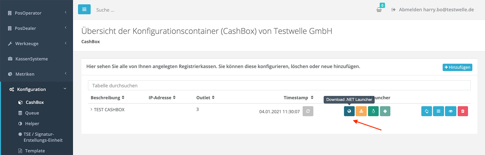
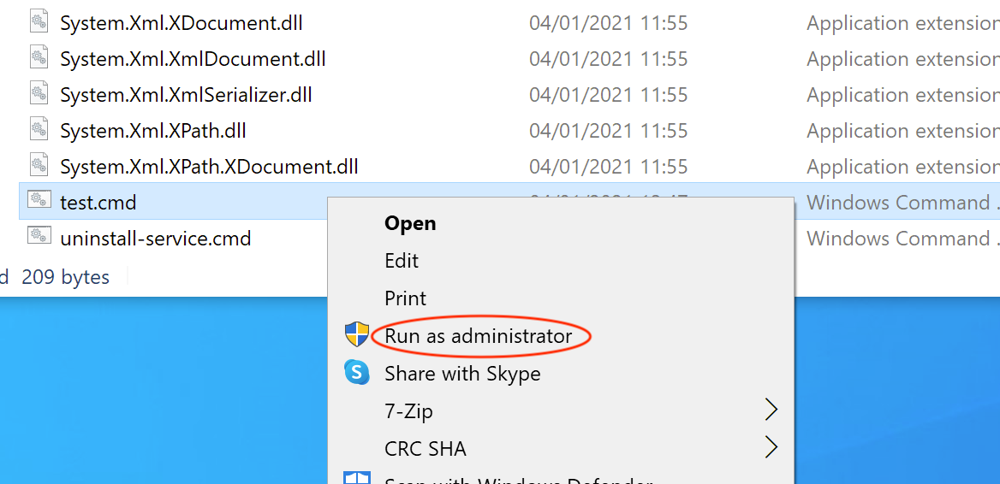

 
<strong>Compliance-As-A-Service für Kassensysteme</strong>
 
 
<h1>Rollout Dokumentation für Deutschland</h1>
 

 

## Rollout der fiskaltrust.Middleware

Die fiskaltrust.Middleware ist das lizenzkostenfreie Basisprodukt von fiskaltrust, dass von KassenHersteller in das KassenSystem integriert wird, um Konformität mit den neuen Fiskalisierungsgesetzen zu implementieren. Die fiskaltrust.Middleware läuft als eigenständiger Service in der Kasse des KassenBetreibers und wird vom KassenSystem über eine Schnittstelle angesprochen. Da die fiskaltrust.Middleware als eigenständiger Service läuft, muss sie auf die Kasse des KassenBetreibers ausgerollt werden. Je nach Gegebenheit muss die jeweilige fiskaltrust.Middleware Instanz vor der Inbetriebnahme entsprechend konfiguriert werden. So muss zum Beispiel angegeben werden, wo das KassenSystem den Service erreichbar kann, in welche Datenbank die verarbeiteten Daten vom Service gespeichert werden sollen, welche TSE für die Signaturen verwendet werden soll und wie die TSE für den Service erreichbar ist. 

In den folgenden Kapitel werden wir erläutern wie die Konfiguration der fiskaltrust.Middleware für den Rollout vorgenommen wird. Zudem zeigen wir Ihnen wie der Service installiert wird und gehen auf diverse Rolloutszenarien ein. Zum Schuss zeigen wir Ihnen welche Automatisierungsmöglichkeiten Ihnen fiskaltrust für einen Massenrollout zur Verfügung stellt.

### Konfiguration der fiskaltrust.Middleware

Die Konfiguration der fiskaltrust.Middleware kann manuell über das fiskaltrust.Portal oder automatisiert über eine API vorgenommen werden. Doch bevor wir uns ansehen wie die Konfiguration vorgenommen wird, gehen wir zuerst auf den Aufbau der fiskaltrust.Middleware ein, um besser verstehen zu können, was genau konfiguriert werden muss.

#### Aufbau der fiskaltrust.Middleware

Die fiskaltrust.Middleware ist modular aufgebaut und besteht aus mehreren Komponenten. Die wichtigsten Komponenten sind die **Queue** und die **SCU** (Signaturerstellungseinheit). Des Weiteren können auch sogenannte Helper zum Einsatz kommen, wie zum Beispiel der Helipad-Helper, der für den regelmäßigen Upload der Daten in die fiskaltrust.Cloud verantwortlich ist. Folgende Illustration zeigt wie die Queue und die SCU zum Einsatz kommen:

Die Queue ist die Komponente der fiskaltrust.Middleware, mit der das KassenSystem kommuniziert. Dafür stellt die Queue eine länderübergreifend gleiche Schnittstelle zur Verfügung, die sogenannte IPOS Schnittstelle (IPOS Interface). Die Art der Kommunikation mit der Queue wird vom KassenHersteller bei der Implementierung des KassenSystems gewählt. So kann z.B. grpc oder WCF zum Einsatz kommen. Die IPOS Schnittstelle stellt dem KassenSystem drei Funktionen zur Verfügung:

- `echo` - zur Prüfung der Verfügbarkeit der Queue
- `sign` - zum Signieren von Belegdaten, sowie zum Ausführen von Funktionalität über Sonderbelege (z.B. Initialisierung-Beleg, Tages-Abschluss-Beleg oder Nullbeleg)
- `journal` - zum Exportieren der Daten in den gesetzlich vorgeschriebenen Formaten

Die Queue erhält also Anfragen vom KassenSystem und verarbeitet diese. Sie ist verantwortlich für die Erstellung der Belegnummer, für die Verkettung der Anfragen und für die Persistenz der Daten.

Für die Signierung der Daten ist die fiskaltrust.Middleware-Komponente "SCU" (Signaturerstellungseinheit) verantwortlich. Dabei werden die zu signierenden Daten von der Queue an die SCU gesendet, die wiederum, in der deutschen Variante, mit einer TSE kommuniziert. Die TSE nimmt schlussendlich die Signierung der Daten vor. Die signierten Daten und alle dazugehörigen Informationen werden dann von der SCU zurück an die Queue gesendet. Die Queue persistiert die Daten und baut die Antwort auf, die an das KassenSystem gesendet wird. In dieser Antwort befinden sich wichtige Angaben, die vom KassenSystem auf den Beleg gedruckt werden müssen.

#### Die CashBox als Konfigurationscontainer

Die Konfiguration einer fiskaltrust.Middleware Instanz wird über eine sogenannte **CashBox** vorgenommen. Die CashBox ist ein Konfigurationscontainer, der wiederum die Konfigurationen der zum Einsatz kommenden fiskaltrust.Middleware Komponenten (z.B. Queue, SCU)  beinhaltet und miteinander verbindet. Im folgenden Beispiel wird eine CashBox dargestellt, die die Konfiguration einer Queue und die Konfiguration einer SCU beinhaltet:

für das obere Beispiel müssen wir also die Konfiguration der Queue und der SCU vornehmen und danach diese beiden Konfigurationen in einen Konfigurationscontainer (CashBox) ablegen und miteinander verbinden. Aber was genau müssen wir für die Queue und für die SCU konfigurieren?

##### Konfiguration der Queue

Wei bereits vorhin erwähnt, ist die Queue die Komponente der fiskaltrust.Middleware die über die IPOS Schnittstelle dem KassenSystem für Anfragen zur Verfügung steht. Zudem ist die Queue für die Persistenz der verarbeiteten Daten verantwortlich. Und genau das sind die zwei Punkte, die wir hier konfigurieren müssen:

- 1. wie und wo genau soll die Queue für das KassenSystem erreichbar sein? (also z.B. per `grpc` auf `localhost:1234`)
- 2. wo genau soll die Queue die Daten speichern? (also z.B. in eine MySql Datenbank mit dem connectionstring: "xyz")

Wie die Kommunikation stattfinden soll, also z.B. per `grpc`, entscheidet der KassenHersteller, der die KassenSoftware entsprechend implementiert. Wo die Queue und somit der Service genau erreichbar sein wird, also z.B. `localhost:1234` entscheidet meist der KassenHändler, je nach Gegebenheit beim KassenBetreiber. 

##### Konfiguration der SCU

Die SCU ist für die Erstellung der Signaturen verantwortlich. Sie bekommt dabei die zu Signierenden Daten von der Queue und übernimmt die Kommunikation mit einer TSE und die Daten signieren zu lassen. Auch bei der SCU sind also zwei Konfigurationsangaben vorzunehmen:

- 1. zum einen muss die Queue wissen, wie und wo sie die SCU erreichen kann (also z.B. über `grpc` auf `localhost:5678`).
- 2. und zum zweiten muss die SCU wissen auf welche TSE sie zugreifen soll und wo sich diese befindet (z.B. Swissbit - USB - TSE im Laufwerk "E:").

Sie werden sich nun sicherlich fragen, warum wir hier konfigurieren müssen, wie die SCU von der Queue erreichbar sein soll, wenn die Queue und SCU doch Komponenten der fiskaltrust.Middleware sind. Ist der Queue nicht schon bekannt, wie sie die SCU erreichen kann? Nun, die Antwort liegt in der Flexibilität des fiskaltrust.Middleware, denn eine Instanz der fiskaltrust.Middleware betreibt nur genau die Komponenten, die in ihrer CashBox angegeben werden. So kann zum Beispiel erreicht werden dass sich drei Kassen eine Hardware-TSE teilen können:

Auf jeder Kasse läuft eine Instanz der fiskaltrust.Middleware, die durch ihre eigene CashBox konfiguriert wird. Die CashBox der ersten Kasse beinhaltet nur die Konfiguration einer Queue. Die CashBox der mittleren Kasse beinhaltet die Konfiguration einer Queue und einer SCU. Die CashBox der unteren Kasse, so wie die obere, beinhaltet nur eine Queue. Damit die SCU aus der mittleren Kasse (z.B. Hauptkasse) für die anderen beiden Kassen bzw. Queues erreichbar ist, müssen wir in der SCU Konfiguration angeben wie und wo die SCU erreichbar ist (und natürlich den entsprechenden Port freigeben). Um sicherzustellen, dass eine Queue sich mit der richtigen SCU verbindet, müssen wir diese Verbindungangabe beim Erstellen der CashBox für die Queue konfigurieren. 

#### CashBox manuell über das fiskaltrust.Portal anlegen

Jede Instanz der fiskaltrust.Middleware muss mit Hilfe einer CashBox (Konfigurationscontainer) konfiguriert werden. Eine solche CashBox kann manuell über das fiskaltrust.Portal angelegt werden oder automatisiert über eine API. In diesem Kapitel zeigen wir Ihnen wie eine CashBox über das fiskaltrust.Portal angelegt wird. Dazu gehen wir von folgenden Szenario aus:

Unsere CashBox soll eine Queue und eine SCU beinhalten. Die SCU greift auf eine USB TSE zu. Konkret werden wir eine Queue konfigurieren, mit der das KassenSystem über `REST` kommuniziert und unter `localhost:1200/fiskaltrust` für das KassenSystem erreichbar ist. Sie legt die verarbeiteten Daten in einer `SQLite` Datenbank ab. Des Weiteren eine SCU die über `grpc` und unter `localhost:1400` für die Queue erreichbar ist und die zum Signieren der Daten auf eine Cryptovision USB-TSE zugreift. Die TSE ist im Laufwerk `E:` eingesteckt.

**Schritt 1: Anlegen der SCU Konfiguration**

Gehen Sie im fiskaltrust.Portal auf "Konfiguration ->  TSE/Signatur-Erstellungs-Einheit". Sie gelangen zur Liste der bereits angelegten SCUs. 

Drücken Sie nun auf den Button "+ Erstellen". Es erscheint ein Formular zum Erfassen der SCU.

1. Geben Sie hier den Namen der SCU an (z.B. "TEST SCU")
2. Wählen Sie je nach TSE das Package (Modul) aus, das die SCU verwenden soll (in unserem Beispiel verwenden wir eine CryptoVision TSE)
3. Bei der Package-Version wird automatisch die neueste gewählt
4. Geben Sie den Standort an, es wird standardmäßig automatisch der Hauptstandort vorselektiert
5. Drücken Sie "Speichern"

Die SCU wurde angelegt und wir werden nun zur zweiten Konfigurationsmaske weitergeleitet. Diese richtet sich nach dem zuvor ausgewählten Package. In unserem Beispiel müssen wir für die Cryptovision TSE den Gerätepfad angeben. Für ein anderes Package kann hier auch was anderes verlangt werden (z.B. Com-Port für eine Diebold-TSE). 

1. Tragen Sie den Gerätepfad ein (also `E:` in unserem Fall)
2. Geben Sie nun an, wie und wo die SCU für eine Queue erreichbar sein soll. Drücken Sie dazu zuerst den entsprechenden Button für die Art der Kommunikation (z.B. grpc) und tragen Sie danach den Pfad ein (z.B. `localhost:1401`).
3. Drücken Sie auf "Speichern und schließen" um die Angaben zu speichern und zurück zur Liste zu gelangen.

In der Liste können wir nun sehen, dass unsere SCU Konfiguration erfolgreich angelegt wurde:

**Schritt 2: Anlegen der Queue Konfiguration**

Als nächstes legen wir die Queue Konfiguration an. Dazu gehen wir auf Konfiguration -> Queue. Die Liste der bereits angelegten Queues wird angezeigt.

Drücken Sie nun auf den Button "Neu erstellen". Es erscheint ein Formular zum Erfassen der Queue.

1. Geben Sie hier den Namen der Queue an (z.B. "TEST QUEUE")
2. Wählen Sie aus, wie die Daten persistiert werden sollen (z.B. SQLite Datenbank). 
3. Bei der Package-Version wird automatisch die neueste gewählt

4. Geben Sie im Feld "CashBox Identification" die Kassenseriennummer an. Achten Sie darauf, dass diese weltweit eindeutig ist und dass es sich um einen [printable string](https://en.wikipedia.org/wiki/PrintableString) mit max. 20 Zeichen länge handelt. Die hier angegebene Kassenseriennummer wird später auch als ClientId in der TSE registriert, um die Signaturen eindeutig der Kasse zuzuordnen. Da die unterschiedlichen TSE Hersteller jeweils andere Vorgaben zur Formatierung und zur Länge der ClientId machen, haben wir uns hier auf den kleinsten gemeinsamen Nenner geeinigt ([printable string](https://en.wikipedia.org/wiki/PrintableString), max. 20 Zeichen)

5. Geben Sie den Standort an, es wird standardmäßig automatisch der Hauptstandort vorselektiert

6. Drücken Sie "Speichern"

Die Queue wurde angelegt und wir werden nun zur zweiten Konfigurationsmaske weitergeleitet. Diese richtet sich nach dem zuvor ausgewählten Persitenz-Package. In unserem Beispiel müssen wir für die SQLite Datenbank keine weiteren Angaben vornehmen, denn sie wird automatisch von der fiskaltrust.Middleware angelegt. Handelt es sich jedoch um ein anderes Package, so müssen hier entsprechende Verbindungsangaben gemacht werden. Zum Beispiel die Angabe eines Connection-String für eine MySQL Datenbank. 

1. Tragen Sie bei Bedarf die Verbindungsangaben ein (in diesem Besipiel nicht notwendig, das SQLite DB)
2. Geben Sie nun an, wie die Queue von dem KassenSystem erreichbar sein soll. Drücken Sie dazu zuerst den entsprechenden Button für die Art der Kommunikation (z.B. `http(REST)`) und tragen Sie danach den Pfad ein (z.B. `localhost:1200/fiskaltrust`).
3. Drücken Sie auf "Speichern und schließen" um die Angaben zu speichern und zurück zur Liste zu gelangen.

In der Liste können wir nun sehen, dass unsere Queue Konfiguration erfolgreich angelegt wurde:

**Schritt 3: Anlegen der Cashbox**

Nach dem Anlegen der SCU und der Queue legen wir als nächstes die Cashbox, also den Konfigurationscontainer für die fiskaltrust.Middleware Instanz, an. Gehen Sie dazu auf Konfiguration->CashBox. Die Liste der bereits angelegten Cashboxen wird angezeigt.

Drücken Sie nun auf den Button "+ Hinzufügen". Es erscheint ein Formular zum Erfassen der Cashbox.

1. Geben Sie hier den Namen der Cashbox an (z.B. "TEST CASHBOX")

2. Geben Sie den Standort an, es wird standardmäßig automatisch der Hauptstandort vorselektiert

3. Drücken Sie "Speichern" um die Angaben zu speichern und zurück zur Liste zu gelangen.

In der Liste können wir nun sehen, dass unsere neue Cashbox erfolgreich angelegt wurde:

**Schritt 4: Cashbox füllen**

Nach dem Anlegen der Cashbox wir diese als nächstes befüllt. In unserem Beispiel wollen wir die zuvor angelegte Queue Konfiguration und die SCU Konfiguration in die Cashbox hineinlegen. Der Listeneintrag mit unserer Cashbox lässt sich aufklappen. Hier können wir sehen, dass sie aktuell noch leer ist.

Um die neu angelegte Cashbox zu füllen drücken Sie den "Bearbeiten per Liste" Knopf im Listeneintrag der Cashbox.

Die Liste der vorhandenen Konfigurationen wird angezeigt. 

Wir können hier wählen, welche Konfigurationen wir unserem Konfigurationscontainer also in die Cashbox hinzufügen möchten. Für unser Beispiel wählen wir die zuvor angelegte Queue und SCU und drücken dann den "Speichern" Button.

Zurück in der Liste können wir erneut den Listeneintrag unserer Cashbox aufklappen und sehen nun, dass sie Queue und SCU beinhaltet.

**Schritt 5: Queue mit SCU verbinden**

Wie bereits oben beschrieben, müssen wir der Queue mitteilen, welche SCU sie zum Signieren der Daten verwenden soll. Wir müssen also die Queue mit der SCU "verbinden". In unserem Fall befinden sich Queue und SCU in der gleichen Cashbox. Dennoch müssen wir die Verbindung anlegen. Dazu drücken wir in dem aufgeklappten Listeneintrag der Cashbox den "Verbinden" Button, der rechts von der Queue angezeigt wird:

Es erscheint ein Popup mit den verfügbaren SCUs. Aus dieser Liste können wir nun unsere zuvor angelegte SCU auswählen, speichern und das Popup schließen.

Die Queue weiß nun, mit welcher SCU sie zu kommunizieren hat und wo diese erreichbar ist.

**Schritt 6: Cashbox publizieren (rebuild configuration)**

Als letzten Schritt müssen wir die angelegte Cashbox publizieren. Dies geschieht mit dem "Rebuild configuration" Button, der in der Listenzeile der Casbox zur Verfügung steht.

Dadurch wird die Cashbox als JSON File zum Download verfügbar gemacht. Dieses JSON Konfigurations-File kann später von einer fiskaltrust.Middleware Instanz heruntergeladen werden und für die Erstinitialisierung oder für ein Update genutzt werden. Im Falle eines Updates, zum Beispiel Update der SCU Package Version aufgrund einer Gesetzesänderung, wird die Änderung in der Cashbox erst zur Verfügung gestellt, nachdem der "Rebuild configuration" Button gedrückt wurde. Wird daraufhin die fiskaltrust.Middleware Instanz, der diese Cashbox zugeordnet ist, neu gestartet, so lädt sie die neue Konfiguration und aktualisiert sich selbst automatisch, z.B. indem sie das neue Package herunterlädt und verwendet. 

### Service starten und testen

Zum Testen des Service, also einer fiskaltrust.Middleware Instanz, laden wir den sogenannten "Launcher" herunter. Dies können wir in dem Listeneintrag der zuvor angelegten Cashbox tun. Drücken Sie dazu den "Download .NET Launcher" Button. 

Sie erhalten ein zip komprimierten Ordner, den sie auf der Kasse entpacken können. Entpacken Sie das Zip-File. 

Der daraus resultierende Ordner kann bei Bedarf auch umbenannt werden. In dem Ordner befinden sich der Launcher `fiskaltrust.exe`, der Service repräsentiert durch die .dll Files, eine Konfigurations-Datei `fiskaltrust.exe.config` und drei Command-Files:

- `install-service.cmd`
- `uninstall-service.cmd`
- `test.cmd`

Die Command-Files können zum parametrisierten Starten oder Stoppen des Service verwendet werden. Sie führen die fiskaltrust.exe aus mit entsprechenden Parameter. der Inhalt des `install-service.cmd` File ist zum Beispiel wie folgt:

`cd /d "%~dp0%"`
`fiskaltrust -cashboxid=259c5a7b-fc44-40d6-af7b-73fde0943ec4 -accesstoken=BL...8D6o= -sandbox -i -servicename=fiskaltrust-259c5a7b-fc44-40d6-af7b-73fde0943ec4`
`timeout 15`

`fiskaltrust.exe` wird also mit der `cashobxid` "259c.." gestartet. Dadurch weiß die gestartete fiskaltrust.Middleware Instanz aus welchem Konfigurationscontainer (Cashbox) sie sich initialisieren soll. Die CashboxId ist die ID der Cashbox und kann im fiskaltrust.Portal im aufgeklappten Listeneintrag der Cashbox eingesehen werden:

Um die Cashbox aus dem fiskaltrust.Portal laden zu können benötigt der Service eine Zugriffsberechtigung. Diese wird über den Parameter `accesstoken` angegeben. Der Wert ist ebenfalls im fiskaltrust.Portal im aufgeklappten Listeneintrag der Cashbox zu finden (s.o.).

Der Parameter `sandbox` gibt an, dass auf das Sandbox-Portal zugegriffen werden soll. Der Parameter `i` gibt an, dass die fiskaltrust.Middleware Instanz als (Windows) Service installiert und gestartet werden soll. Der Parameter `servicename` setzt den Namen des (Windows) Service.

Die vollständige Liste der zur Verfügung stehenden Parameter und weitere technische Angaben zur Installation des Service finden Sie in unserer IPOS Interface-Dokumentation im Kapitel [Installation](https://docs.fiskaltrust.cloud/doc/interface-doc/doc/general/installation/installation.html).

Zum Testen des Service können wir das Command-File `test.cmd` verwenden. Der Inhalt sieht wie folgt aus:

`cd /d "%~dp0%"`
`fiskaltrust -cashboxid=259c5a7b-fc44-40d6-af7b-73fde0943ec4 -accesstoken=BL...8D6o= -sandbox -test`

Die fiskaltrust.Middleware Instanz wird also nicht als (Windows) Service installiert und gestartet, sondern stattdessen mit Hilfe des Parameters `test` direkt im Testmodus in der Konsole (cmd) gestartet. Der Vorteil hier ist, dass wir direkt in der Konsole die Logmeldungen sehen können und entsprechend reagieren können. Um eine erweiterte Logausgabe zu aktivieren können wir das `test.cmd` File vor dem Ausführen editieren und dort noch den Parameter `verbosity` mit dem Wert `Debug` anhängen:

`cd /d "%~dp0%"`
`fiskaltrust -cashboxid=259c5a7b-fc44-40d6-af7b-73fde0943ec4 -accesstoken=BL...8D6o= -sandbox -test -verbosity=Debug`

Speichern und als Administrator starten:

Es erscheint eine Konsole, in der die fisklatrust.Middleware Instanz gestartet wird. Wir können hier sehen, was genau beim Start passiert und bei etwaigen Fehler entsprechende Korrekturen (z.B. in der Cashbox oder in physischen Anschluss der TSE) vornehmen.

Nun können Sie versuchen aus dem KassenSystem Anfragen an die gestartete fiskaltrust.Middleware Instanz zu senden. Als KassenHändler werden Ihnen im KassenSystem entsprechende Knöpfe zur Verfügung stehen. 

In unserem Beispiel simulieren wir ein KassenSystem mit Hilfe von [Postman](https://www.postman.com/). Postman kann Anfragen an die Queue über REST senden. Dazu verwenden wir unsere Collection aus dem [middleware-demo-postman github Repository](https://github.com/fiskaltrust/middleware-demo-postman). In dem Repository findet sich auch die Anleitung zur Konfiguration der postman-collection. Wichtig hierbei ist die Angabe des Endpoint an der die Queue erreichbar ist und die Angabe der cashboxid als Werte für die bereits angelegten Variablen:

#### Verfügbarkeit der Queue testen

Als erstes senden wir einen "echo" Request um die Verfügbarkeit der Queue zu überprüfen. Als KassenHändler wird Ihnen im KassenSystem ein entsprechender Knopf zur Verfügung stehen. In unserem Bespiel verwenden wir den "echo" Request aus der oben beschriebenen Postman-Collection:

Die Queue antwortet und wir wissen nun, das die fiskaltrust.Middleware Instanz erreichbar ist und für weitere Anfragen zur Verfügung steht. Die Anfrage und Ihre Verarbeitung können wir auch in der zuvor gestarteten Konsole als Log-Nachricht sehen:

#### Initialisierung der fiskaltrust.Middleware Instanz

Als nächstes senden wir einen "Initialisierungs-Beleg". Als KassenHändler wird Ihnen im KassenSystem ein entsprechender Knopf zur Verfügung stehen. In unserem Bespiel verwenden wir wieder die oben beschriebene Postman-Collection. Der Initialisierungs-Beleg sorgt dafür, dass die fiskaltrust.Middleware initialisiert wird, sich als Client bei der TSE registriert und falls die TSE noch nicht initialisiert ist, die TSE in Betrieb nimmt.

In der Antwort und in der Konsole können wir nun sehen, dass unsere Queue als Client in der TSE registriert wurde.

#### Test Abrechnungs-Beleg senden

Als nächste können wir einen Test-Beleg zum Abrechnen eines Einkaufs senden. Als KassenHändler wird Ihnen im KassenSystem entsprechende Funktionalität zur Verfügung stehen. In unserem Bespiel verwenden wir wieder die oben beschriebene Postman-Collection. 

Die fiskaltrust.Middleware bearbeitet die Anfrage, und sendet eine Antwort zurück, die wichtige Belegdaten, inklusive der benötigten Signaturen enthält. Im Erfolgfall werden diese vom KassenSystem auf den Beleg gedruckt.

#### Verbindung mit der fiskaltrust.Cloud überprüfen

Auch im fiskaltrust.Portal können wir die oben abgesetzten Anfrage und den daraus resultierenden Beleg einsehen, da diese über den Helipad Helper alle 5 Minuten hochgeladen werden. Gehen Sie dazu auf Konfiguration->Queue und drücken Sie den "ReceiptJournal" Button im Listeneintrag der Queue.

Es erscheint eine Übersicht der Verarbeiteten Beleganfragen:

Hinweis: 

Sollten die Belege hier nicht erscheinen, kann es sein, dass die Kommunikation der fiskaltrust.Middleware mit dem Server nicht geklappt hat. Überprüfen Sie in diesem Fall zuerst ob bereits 5 Minuten seit dem Absetzen der Anfragen vergangen sind. Sollte dies der Fall sein, so überprüfen Sie bitte die Logmeldungen in der Konsole. Es kann sein, dass Sie zuerst entsprechende Firewall Ports freigeben müssen.

Drücken Sie nun als nächstes auf den Button mit dem Auge-Symbol in der Zeile mit dem zuvor gesendeten Abrechnungs-Beleg (s.o.). Sie können nun eine beispielhafte Darstellung des Belegs einsehen. Zudem werden die konkrete Anfrage und Antwort an das KassenSystem angezeigt:

In den oberen Kapitel haben wir beschrieben wie die fiskaltrust.Middleware aufgebaut ist, wie die einzelnen Instanzen manuell über das fiskaltrust.Portal konfiguriert werden kann und wie der Service gestartet und getestet werden kann. Als nächstes möchten wir Ihnen als Inspiration für den Rollout ein einige mögliche Rollout-Szenarien vorstellen. Diese zeigen, wie flexibel die fiskaltrust.Middleware am Standort des Betreibers eingesetzt werden kann. Nach der Präsentation verschiedener Rollout-Szenarien gehen wir dann auf mögliche Automatisierungsoptionen für den Massenrollout ein. 

### Rollout Szenarien

### Automatisierung des Rollout

#### Templates für die Konfiguration

#### Auslieferung der Middleware
