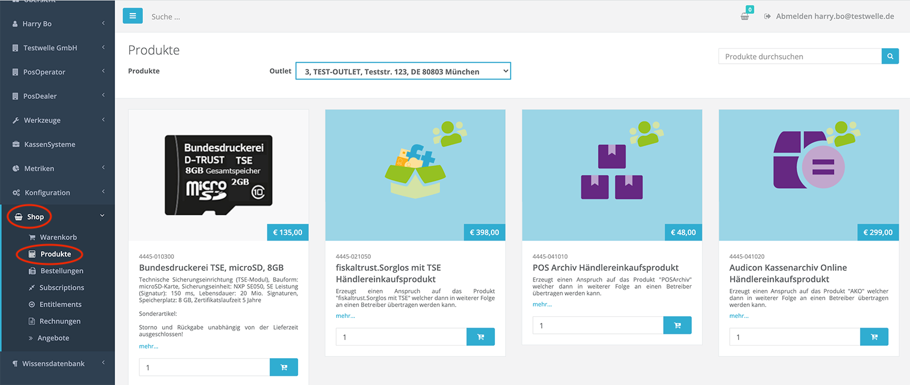
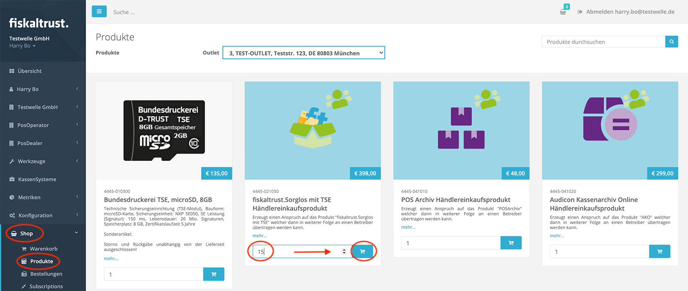
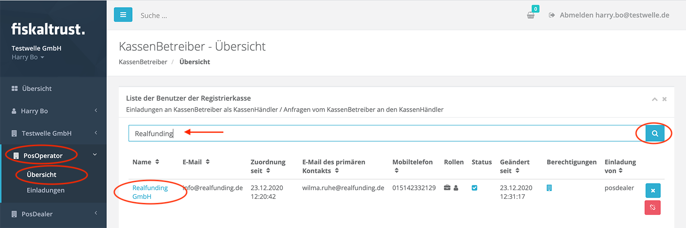
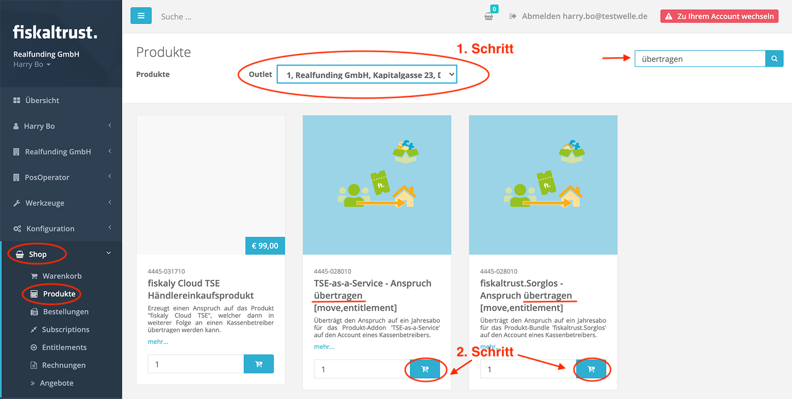
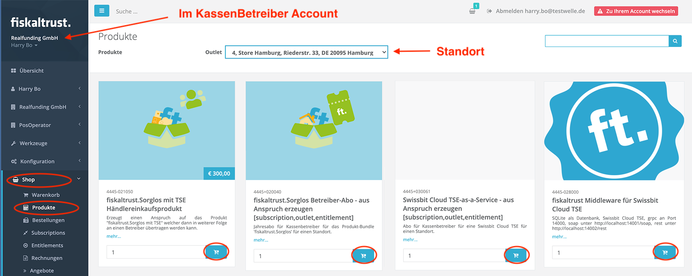
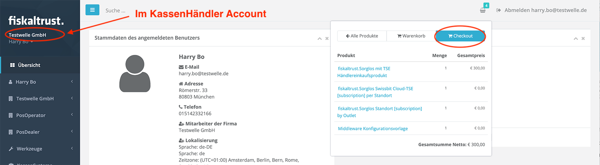

 
<strong>Compliance-as-a-Service für KassenSysteme</strong>
 
 
<h1>Rollout Dokumentation für Deutschland</h1>
 

 

# fiskaltrust Produkte kaufen und weiter verkaufen

## Inhalte

<pre>
├── <a href="#einleitung" title="Einleitung">Einleitung</a>
├── <a href="#fiskaltrustshop" title="fiskaltrust.Shop">fiskaltrust.Shop</a>
├── <a href="#rahmenverträge-für-mengenrabatt" title="Rahmenverträge für Mengenrabatt">Rahmenverträge für Mengenrabatt</a>
├── <a href="#produkte-über-entitlements-kaufen" title="fiskaltrust.Shop">Produkte über Entitlements kaufen</a>
├── <a href="#übertragung-gekaufter-entitlements-an-die-kassenbetreiber" title="Übertragung gekaufter Entitlements an die KassenBetreiber">Übertragung gekaufter Entitlements an die KassenBetreiber</a>
├── <a href="#tipps--tricks" title="Tipps & Tricks">Tipps & Tricks</a>
├── <a href="#lieferoptionen-für-hardware-tses" title="Lieferoptionen für Hardware TSEs">Lieferoptionen für Hardware TSEs</a>
├── <a href="#swissbit-cloud-tse-auschecken-und-einrichten" title="Swissbit Cloud TSE auschecken und einrichten">Swissbit Cloud TSE auschecken und einrichten</a>
├── <a href="#fiskaly-cloud-tse-auschecken-und-einrichten" title="Fiskaly Cloud TSE auschecken und einrichten">Fiskaly Cloud TSE auschecken und einrichten</a>

</pre>

## Einleitung

fiskaltrust bietet neben der lizenzkostenfreien fiskaltrust.Middleware für KassenHersteller kostenpflichtige Add-On Produkte (die auf die fiskaltrust.Middleware aufbauen) und Einzelprodukte (unabhängig von der fiskaltrust.Middleware) für KassenBetreiber an. Diese fiskaltrust Produkte werden ausschließlich über unsere KassenHändler-Partner als Bestandteil ihrer Produkt- bzw. Ihrer Service-Pallette an KassenBetreiber vertrieben. Hierbei handelt es sich um Archivierungsprodukte, automatisierte Meldungen an das Finanzamt, Technische Sicherheitseinrichtungen (TSE) diverser Hersteller und auch um Sorglospakete mit und ohne TSE-as-a-Service. 

Eine aktuelle Auflistung unserer Produkte finden Sie in unserer [Produkt-Dokumentation](https://docs.fiskaltrust.cloud/doc/productdescription-de-doc/for-posdealers/01-produkte/README.html).

Im Rahmen des Rollouts überträgt der KassenHändler die zuvor von fiskaltrust erworbenen Produkte in Form von Ansprüchen an seine KassenBetreiber und aktiviert diese pro Standort des KassenBetreibers.  

In diesem Kapitel gehen wir auf die dazugehörigen Vorgänge ein und zeigen wie diese mit Hilfe des fiskaltrust.Portals von KassenHändlern ausgeführt werden können. Zudem stellen wir Ihnen gerne auch ein [Video](https://www.youtube.com/watch?v=l6IcV7o_LFM&t=8s) mit einer Anleitung zur Verfügung.

## fiskaltrust.Shop

Der Einkauf von fiskaltrust Produkten findet über den fiskaltrust.Shop statt. Dieser ist Bestandteil des fiskaltrust.Portals. Im Bereich "Produkte" werden je nach [Partnerrolle](../README.md#die-unterschiedlichen-rollen-der-fiskaltrust-partner) ausgewählte fiskaltrust Produkte zum Kauf angeboten. Für KassenHändler sind das neben diversen TSE sogenannte "Händlereinkaufsprodukte", die sogenannte Entitlements, also Ansprüche darstellen:

## Rahmenverträge für Mengenrabatt

Vor dem Einkauf von fiskaltrust Produkten sollten Sie als KassenHändler je nach Bedarf eine Einkaufsplanung vornehmen, denn ab einer Menge von 10 Stück gewährt fiskaltrust Mengenrabatte. Bitte kontaktieren Sie als KassenHändler unser Sales Team unter sales@fiskaltrust.de und vereinbaren Sie mit Hilfe eines Rahmenvertrags die Abnahmemenge. Sie erhalten daraufhin einen Mengenrabatt. Mit der ebenfalls vereinbarten Kreditlimit-Freigabe für den fiskaltrust.Shop können Sie die gewünschten Produkte dort zum dem im Rahmenvertrag vereinbarten Preis erwerben. 

## Produkte über Entitlements kaufen

KassenHänder kaufen im fiskaltrust.Portal nicht die fiskaltrust Produkte selbst, sondern sogenannte "Entitlements" also Ansprüche auf die Produkte, die sie dann an die KassenBetreiber einzeln übertragen und für diese pro Standort aktivieren können. Die Entitlements werden im fiskaltrust.Shop auch unter dem Namen "Händlereinkaufsprodukte" geführt.

Im folgenden Beispiel zeigen wir Ihnen, wie Sie als KassenHändler nach der Unterzeichnung eines Rahmenvertrags mit entsprechenden Mengenrabatten und Kreditlimitfreigabe im fiskaltrust.Shop Entitlements erwerben können. 

Gehen Sie im fiskaltrust.Portal auf den Menüpunkt "Shop->Produkte" und legen Sie hier z.B. 15 Stück der Produkts "fiskaltrust.Sorglos mit TSE Händlereinkaufsprodukt" in den Warenkorb:

In der oberen Leiste wird ein Warenkorb-Symbol angezeigt auf das Sie drücken können. Es erscheint ein Popup. Wählen Sie hier "Checkout":

Als Nächstes wird die Zusammenfassung Ihrer Bestellung angezeigt:

Überprüfen Sie die Angaben und die dargestellten Preise. Drücken Sie danach den Button: "Verbindlich Bestellen". Sie erhalten daraufhin eine Bestätigung zu Ihrer Bestellung:

Sie erhalten auch eine entsprechende Bestätigung der Bestellung per Email.

Sie können zudem in dem Bereich "Shop->Bestellungen" jederzeit Ihre Bestellungen einsehen:

Die dazugehörige Rechnung finden Sie unter "Shop->Rechnungen".

Nach der Bearbeitung der Bestellung durch das fiskaltrust System, erscheinen im Bereich "Shop->Entitlements" die Ihnen gutgeschriebenen Entitlements. In unserem Beispiel erhalten wir 15 Entitlements zur Einlösung des Sorglospakets und 15 Entitlements zur Einlösung der dazugehörigen TSE-as-a-Service:

## Übertragung gekaufter Entitlements an die KassenBetreiber

Die Übertragung der gekauften Ansprüche/Entitlements und die Aktivierung der dazugehörigen Produkte für den KassenBetreiber wird bei fiskaltrust ebenfalls mit der Hilfe des Shops im fiskaltrust.Portal abgebildet.

Zur Übertragung der zuvor gekauften Entitlements an den KassenBetreiber wechseln Sie mit Hilfe der surrogate-Funktion im fiskaltrust.Portal aus Ihrem Account als KassenHändler heraus in den Account des KassenBetreibers. Gehen Sie dazu in den Bereich "POSOperator->Übersicht" und suchen Sie hier den KassenBetreiber dem Sie das oder die Entitlements übertragen möchten:

Drücken Sie nun auf den Namen des KassenBetreibers, der in der Liste als Link dargestellt wird (sollte hier der Name des KassenBetreibers nicht als Link erscheinen, dann hat er die Nutzungsvereinbarung noch nicht unterschrieben). Wenn Sie auf den Link drücken, werden Sie zu dem Account des KassenBetreibers weitergeleitet. Das erkennen Sie daran, dass im oberen Bereich rechts ein Button namens "Zu Ihrem Account wechseln" erscheint und zudem daran, dass in der Menüleiste nun der Firmenname des KassenBetreibers angezeigt wird.

Gehen Sie nun im Menü zu "Shop->Produkte". Wählen Sie hier zuerst im oberen Bereich den Standort des KassenBetreibers, welchem Sie die Ansprüche übertragen möchten und legen Sie dann die gewünschten "Übertragungsprodukte" in den Warenkorb. In unseren Beispiel: "TSE-as-a-Service - Anspruch übertragen" und "fiskaltrust.Sorglos -Anspruch übertragen":

Legen Sie zur Aktivierung beim KassenBetreiber als nächstes die entsprechenden "Erzeugungsprodukte" ebenfalls in den Warenkorb. Wir entscheiden uns in diesem Beispiel für eine Swissbit USB Hardware-TSE. In unserem Beispiel sind also die "Erzeugungsprodukte": "Swissbit USB Hardware TSE-as-a-Service - aus - Anspruch erzeugen" und "fiskaltrust.Sorglos Betreiber-Abo - aus Anspruch erzeugen" in den Warenkorb zu legen. 
Hinweis: Achten Sie bitte darauf, dass beim Legen in den Warenkorb im oberen Bereich der richtige Standort ausgewählt ist.

Die oben beschriebenen Schritte können Sie, wenn gewünscht, auch für andere Standorte und auch für andere Ihrer KassenBetreiber wiederholen und auch für diese die Ansprüche und Aktivierungen in den Warenkorb legen:

1. Schritt: Standort wählen - (im Dropdown oben)
2. Schritt: Ansprüche übertragen - (in Warenkorb legen)
3. Schritt: Produkt in dem oben gewählten Standort aktivieren/aus Anspruch erzeugen - (in Warenkorb legen)

Hinweis: Der dritte Schritt (aktivieren/erzeugen) bezieht sich immer auf den zuvor von Ihnen oben gewählten Standort. Dieser kann nach dem auschecken nicht mehr geändert werden. Handelt es sich im dritten Schritt um die Aktivierung eine Hardware TSE, so wird diese in der Folge an den angegebenen Standort des KassenBetreibers geliefert. 
Wenn Sie als KassenHändler jedoch möchten, dass die Hardware TSE an ihren eigenen Standort gesendet wird, so folgen Sie bitte der Anleitung im Kapitel [Lieferoptionen für Hardware TSEs](#lieferoptionen-für-hardware-tses).

Wichtig: Um den zusammengestellten Warenkorb auszuchecken, **müssen** Sie nun in Ihren KassenHändler Account zurückkehren. Drücken Sie hierzu den "Zu Ihrem Account wechseln" Knopf im oberen Bereich rechts:

Zurück in Ihrem Account können sie nun sehen, dass die zuvor gewählten Produkte ebenfalls in Ihrem Warenkorb erscheinen:

Drücken Sie hier auf "Checkout" und überprüfen Sie dann den Warenkorb bevor Sie die Bestellung abschicken. Überprüfen Sie vor allem die Richtigkeit der Standortangaben. Diese Übertragungen und Aktivierungen von Produkten für den KassenBetreiber sollten natürlich kostenlos sein.

Als Nächstes wird Ihnen die erfolgreiche Bestellung angezeigt und eine Bestätigung per Email versandt. Ihre Bestellungen können Sie jederzeit im Bereich "Shop->Bestellungen" einsehen. Die dazugehörigen Rechnungen befinden sich im Bereich "Shop->Rechnungen"

Nach der Bearbeitung der Bestellung durch das fiskaltrust System (kann 2-3 Minuten dauern) werden Ihnen die verbrauchten Ansprüche abgezogen. In unserem Beispiel sind jetzt nur noch 14 von zuvor 15 übrig geblieben.

Zudem können wir im Account des KassenBetreibers sehen, dass das Sorglospaket für den zuvor bei der Aktivierung angegebenen Standort aktiviert wurde:

## Tipps & Tricks

1. Neben den Produkten zur Übertragung und Aktivierung der Ansprüche pro Standort des KassenBetreibers können Sie im gleichen Schritt auch Templates zur automatischen Generierung der benötigten Cashboxen (Konfigurationscontainer) in den Warenkorb des KassenBetreibers legen. 
Mit Templates optimieren Sie den Rollout-Prozess. Dabei können Sie sowohl zuvor von Ihnen erstellte, angepasste Templates als auch die von fiskaltrust zur Verfügung gestellten Standard-Templates verwenden. Ein Beispiel dazu finden sie weiter unten im Kapitel [Swissbit Cloud TSE auschecken und einrichten](#swissbit-cloud-tse-auschecken-und-einrichten).

2. Sie können, falls gewünscht, die "Händlereinkaufsprodukte", also die Ansprüche, auch direkt im Account der KassenBetreiber erwerben. D.h. in den gleichen Warenkorb wie (s.o.) deren Übertragung und Aktivierung legen. In diesem Fall müssen Sie keine "Übertragung" mehr vornehmen, erhalten aber dafür eine separate Rechnung. Ein Beispiel dazu finden sie weiter unten im Kapitel [Swissbit Cloud TSE auschecken und einrichten](#swissbit-cloud-tse-auschecken-und-einrichten).

Diese beiden Tipps werden auch in unserem  [Video](https://www.youtube.com/watch?v=l6IcV7o_LFM&t=8s) detailliert dargestellt.

3. Sie können im Warenkorb Bestell-Vorlagen aus Bestellungen erstellen, um diese später wiederverwenden zu können. 

## Lieferoptionen für Hardware TSEs

Als KassenHändler können Sie Hardware TSEs entweder an den Standort des KassenBetreibers liefern lassen oder an Ihren eigenen Standort. Wenn Sie dem im oberen Beispiel dargestellten Vorgang folgen, dann wird die aktivierte Hardware TSE an den für die Aktivierung ausgewählten Standort des KassenBetreiber gesendet. 

Möchten Sie jedoch, dass die Hardware TSE aus dem Sorglospaket nicht an den Standort des KassenBetreiber gesendet werden, sondern an Ihren eigenen Standort gesendet wird, dann aktivieren (erzeugen) Sie bitte die Hardware TSE aus dem Anspruch in Ihrem eigenen Account und nicht im Account des KassenBetreiber.

Bezogen auf das obere Beispiel würden dann die Schritte wie folgt aussehen:

1. Schritt: Im eigenen Account in den Shop gehen und im oberen Bereich Ihren eigenen Standort wählen.
2. Schritt: Im eigenen Account das Hardware TSE Aktivierungsprodukt, z.B. das Produkt "Swissbit USB Hardware TSE-as-a-Service - aus Anspruch erzeugen", in den Warenkorb legen - damit wird die Hardware TSE direkt an Sie versandt.
3. Schritt: In den Account des KassenBetreiber mit Hilfe der surrogate-Funktion wechseln  (wie oben beschrieben).
4. Schritt: Im Account des KassenBetreiber in den Shop gehen und im oberen Bereich den gewünschten Standort des KassenBetreibers auswählen.
5. Schritt: Im Account des KassenBetreiber im Shop die Übertragung des Anspruchs auf das Sorglospaket an den KassenBetreiber vornehmen, also das Produkt "fiskaltrust.Sorglos -Anspruch übertragen" in den Warenkorb legen.
6. Schritt: Im Account des KassenBetreiber im Shop die Aktivierung des Sorglospakets vornehmen, also das Produkt "fiskaltrust.Sorglos Betreiber-Abo - aus Anspruch erzeugen" in den Warenkorb legen.
7. Schritt: Zurück in Ihren eigenen Account wechseln und dort den Warenkorb auschecken und die Bestellung vornehmen.

Der Unterschied zu dem in dem oberen Kapitel beschriebenen Vorgang ist, dass der Anspruch auf die Hardware-TSE nicht mehr auf den KassenBetreiber übertragen und unter seinem Account aktiviert wird, sondern direkt in Ihrem eigenen Account. Somit erfolgt die Lieferung der Hardware TSE aus dem Sorglospaket direkt an Sie als KassenHändler. Wichtig hierbei ist jedoch, dass Sie den "fiskaltrust.Sorglos" Anspruch weiterhin an den KassenBetreiber übertragen und im Account des KassenBertreiber für den richtigen Standort des KassenBetreibers aktivieren.

## Swissbit Cloud TSE auschecken und einrichten

In diesem Kapitel möchten wir Ihnen anhand eines Beispiels das Auschecken und Einrichten einer Swissbit Cloud TSE als Bestandteil eines Sorglospakets mit TSE-as-a-Service vorführen. Dabei werden wir als Erweiterung zur oben beschriebenen Vorgehensweise den Erwerb des Anspruchs für das Sorglospaket ("fiskaltrust.Sorglos mit TSE Händlereinkaufsprodukt") direkt im Account des KassenBetreibers vornehmen. Zudem werden wir für die Einrichtung, also für die Erstellung der Cashbox, das für die Swissbit Cloud TSE von fiskaltrust zur Verfügung gestellte Default-Template im selben Warenkorb auschecken. Diese beiden Erweiterungen/Optimierungen sind auch im Kapitel [Tipps & Tricks](#tipps--tricks) beschrieben.

Loggen Sie sich in Ihren KassenHändler Account ein und wechseln Sie im ersten Schritt mit Hilfe der surrogate-Funktion in den Account des KassenBetreiber. Suchen Sie dazu unter dem Menüpunkt "POSOperator->Übersicht" den KassenBetreiber für den Sie die Swissbit Cloud TSE auschecken und einrichten möchten:

Drücken Sie nun auf den Namen des KassenBetreibers, der in der Liste als Link dargestellt wird (sollte hier der Name des KassenBetreibers nicht als Link erscheinen, dann hat er die Nutzungsvereinbarung noch nicht unterschrieben). Mit Klick auf den Link werden Sie zu dem Account des KassenBetreibers weitergeleitet. Das erkennen Sie daran, dass im oberen Bereich rechts ein Button namens "Zu Ihrem Account wechseln" erscheint und daran, dass in der Menüleiste nun der Firmenname des KassenBetreibers angezeigt wird.

Drücken Sie nun hier im Account des KassenBetreiber auf den Menüpunkt: "Shop->Produkte". Wählen Sie zuerst im oberen Bereich den gewünschten Standort des KassenBetreibers aus.

Legen Sie als Nächstes folgende Produkte in den Warenkorb:

- fiskaltrust.Sorglos mit TSE Händlereinkaufsprodukt
- Swissbit Cloud TSE-as-a-Service - aus - Anspruch erzeugen
- fiskaltrust.Sorglos Betreiber-Abo - aus Anspruch erzeugen
- fiskaltrust.Middleware mit Swissbit Cloud TSE (das ist das fiskaltrust Template zum Erstellen der Cashbox)

Wichtig: Um den zusammengestellten Warenkorb auszuchecken, **müssen** Sie nun in Ihren KassenHändler Account zurückkehren. Drücken Sie hierzu den "Zu Ihrem Account wechseln" Knopf im oberen Bereich rechts:

Zurück in Ihrem Account können sie nun sehen, dass die zuvor gewählten Produkte ebenfalls in Ihrem Warenkorb erscheinen:

Drücken Sie hier auf "Checkout" und überprüfen Sie dann den Warenkorb bevor Sie die Bestellung abschicken. Überprüfen Sie vor allem die Richtigkeit der Standortangaben.

Als Nächstes wird Ihnen die erfolgreiche Bestellung angezeigt und eine Bestätigung per Email versandt. Ihre Bestellungen können Sie jederzeit im Bereich "Shop->Bestellungen" einsehen. Die dazugehörigen Rechnungen befinden sich im Bereich "Shop->Rechnungen"

Nach der Bearbeitung der Bestellung durch das fiskaltrust System (kann 2-3 Minuten dauern) können Sie im Account des KassenBetreibers sehen, dass das zuvor bestellte Sorglospaket im Standort des KassenBetreibers aktiviert wurde. Wechseln Sie dafür mit Hilfe der surrogate-Funktion in den Account des KassenBetreibers und gehen Sie im Menü auf "[Firmenname] -> Standorte":

Zudem wurde die CashBox ebenfalls angelegt, weil wir davor das Template in den Warenkorb gelegt haben und ausgescheckt haben. Um dies zu überprüfen, gehen Sie im Menü auf "Konfiguration -> Cashbox":

Damit ist die Cashbox für die Swissbit-Cloud TSE eingerichtet. Sie können nun den gewünschten Launcher downloaden und starten, er verwendet zur Konfiguration die zuvor angelegte Cashbox für die Swissbit Cloud TSE.

## Fiskaly Cloud TSE auschecken und einrichten

Der Vorgang zum Auschecken und Einrichten einer Fiskaly Cloud TSE ist analog zu dem oben im Kapitel [Swissbit Cloud TSE auschecken und einrichten](#swissbit-cloud-tse-auschecken-und-einrichten) beschrieben Vorgang. Der Unterschied ist nur, dass Sie hierbei die Fiskaly Cloud TSE statt der Swissbit Cloud TSE beziehen und einrichten. Legen Sie dazu statt dem Produkt "Swissbit Cloud TSE-as-a-Service - aus - Anspruch erzeugen" das Produkt "Fisklay Cloud TSE-as-a-Service - aus - Anspruch erzeugen" in den Warenkorb. Legen Sie zudem statt dem Template-Produkt "fiskaltrust.Middleware mit Swissbit Cloud TSE" das Template-Produkt "fiskaltrust.Middleware mit Fiskaly Cloud TSE" in den Warenkorb. Ansonsten ist die Vorgehensweise identisch mit der oben beschriebenen für die Swissbit Cloud TSE.
