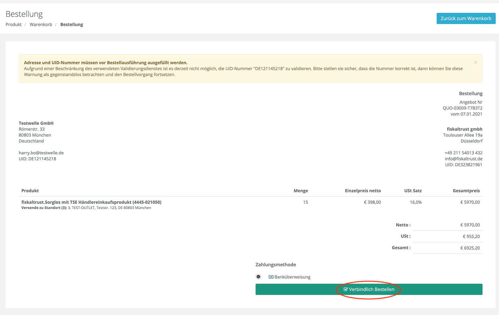
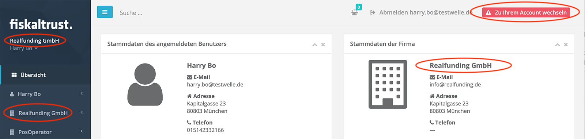
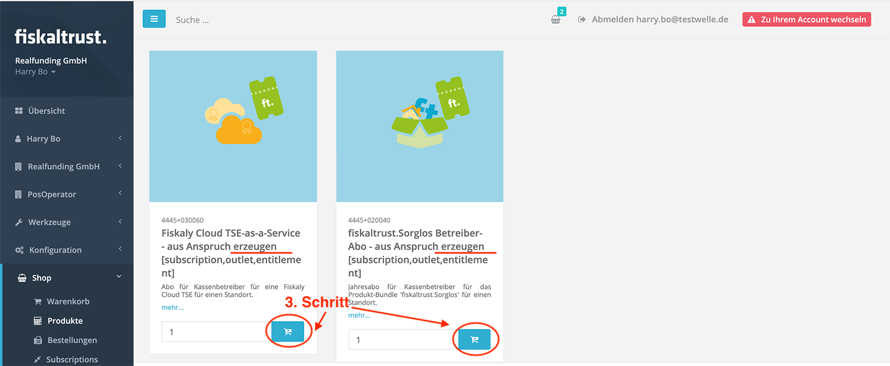

 
<strong>Compliance-As-A-Service für Kassensysteme</strong>
 
 
<h1>Rollout Dokumentation für Deutschland</h1>
 

 

# fiskaltrust Produkte kaufen und weiter verkaufen

## Inhalte

<pre>
├── <a href="#einleitung" title="Einleitung">Einleitung</a>
├── <a href="#fiskaltrustshop" title="fiskaltrust.Shop">fiskaltrust.Shop</a>
├── <a href="#rahmenverträge-für-mengenrabatt" title="Rahmenverträge für Mengenrabatt">Rahmenverträge für Mengenrabatt</a>
├── <a href="#produkte-über-entitlements-kaufen" title="fiskaltrust.Shop">Produkte über Entitlements kaufen</a>
├── <a href="#übertragung-gekaufter-entitlements-an-die-kassenbetreiber" title="Übertragung gekaufter Entitlements an die KassenBetreiber">Übertargung gekaufter Entitlements an die KassenBetreiber</a>
├── <a href="#tipps--tricks" title="Tipps & Tricks">Tipps & Tricks</a>
├── <a href="#lieferoptionen-für-hardware-tses" title="Lieferoptionen für Hardware TSEs">Lieferoptionen für Hardware TSEs</a>
├── <a href="#swissbit-cloud-tse-auschecken-und-einrichten" title="Swissbit Cloud TSE auschecken und einrichten">Swissbit Cloud TSE auschecken und einrichten</a>
├── <a href="#fiskaly-cloud-tse-auschecken-und-einrichten" title="Fiskaly Cloud TSE auschecken und einrichten">Fiskaly Cloud TSE auschecken und einrichten</a>

</pre>

## Einleitung

fiskaltrust bietet neben der lizenzkostenfreien fiskaltrust.Middleware für KassenHersteller kostenpflichtige Add-On Produkte (die auf die fiskaltrust.Middleware aufbauen) und Einzelprodukte (unabhängig von der fiskaltrust.Middleware) für KassenBetreiber an. Diese fiskaltrust Produkte werden ausschließlich über unsere KassenHändler-Partner als Bestandteil ihrer Produkt- bzw. Ihrer Service-Pallette an KassenBetreiber vertrieben. Hierbei handelt es sich um Archivierungsprodukte, automatisierte Meldungen an das Finanzamt, Technische Sicherheitseinrichtungen (TSE) diverser Hersteller und auch um Sorglospakete mit und ohne TSE-as-a-Service. 

Eine aktuelle Auflistung unserer Produkte finden Sie in unserer [Produkt-Dokumentation](https://docs.fiskaltrust.cloud/doc/productdescription-de-doc/for-posdealers/01-produkte/README.html).

Im Rahmen des Rollouts überträgt der KassenHändler die zuvor von fiskaltrust erworbenen Produkte in Form von Ansprüchen an seine KassenBetreiber und aktiviert diese pro Standort des KassenBetreiber.  

In diesem Kapitel gehen wir auf die dazugehörigen Vorgänge ein und zeigen wie diese mit Hilfe des fiskaltrust.Portals von KassenHändlern ausgeführt werden können. Zudem stellen wir Ihnen gerne auch ein [Video](https://www.youtube.com/watch?v=l6IcV7o_LFM&t=8s) mit einer Anleitung zur Verfügung.

## fiskaltrust.Shop

Der Einkauf von fiskaltrust Produkten findet über den fiskaltrust.Shop statt. Dieser ist Bestandteil des fiskaltrust.Portals. Im Bereich "Produkte" werden je nach [Partnerrolle](../README.md#die-unterschiedlichen-rollen-der-fiskaltrust-partner) passende fiskaltrust Produkte zum Kauf angeboten. Für KassenHändler sind das neben diversen TSE sogenannte "Händlereinkaufsprodukte", die sogenannte Entitlements, also Ansprüche darstellen:

## Rahmenverträge für Mengenrabatt

Vor dem Einkauf von fiskaltrust Produkten sollten Sie als KassenHändler je nach Bedarf eine Einkaufsplanung vornehmen, denn ab einer Menge von 10 Stück gewährt fiskaltrust Mengenrabatte. Bitte kontaktieren Sie als KassenHändler unser Sales Team unter sales@fiskaltrust.de und vereinbaren Sie mit Hilfe eines Rahmenvertrags die Abnamhmemenge. Sie erhalten daraufhin einen Mengenrabatt und eine Kreditlimit-Freigabe für den fiskaltrust.Shop, so dass Sie die gewünschten Produkte dort zum dem im Rahmenvertrag vereinbarten Preis erwerben können. 

## Produkte über Entitlements kaufen

KassenHersteller kaufen im fiskaltrust.Portal nicht die fiskaltrust Produkte selbst, sondern sogenannte "Entitlements" also Ansprüche auf die Produkte, die sie dann an die KassenBetreiber einzeln übertragen können und für diese pro Standort aktivieren können. Die Entitlements werden im fiskaltrust.Shop auch unter dem Namen "Händlereinkaufsprodukte" geführt.

Im folgenden Beispiel zeigen wir Ihnen wie Sie als KassenHändler nach der Unterzeichnung eines Rahmenvertrags mit entsprechenden Mengenrabatten und Kreditlimitfreigabe im fiskaltrust.Shop Entitlements erwerben können. 

Gehen Sie im fiskaltrust.Portal auf den Menüpunkt "Shop->Produkte" und legen Sie hier z.B. 15 Stück der Produkts "fiskaltrust.Sorglos mit TSE Händlereinkaufsprodukt" in den Warenkorb:

In der oberen Leiste wird ein Warenkorb-Symbol angezeigt auf das Sie drücken können. Es erscheint ein Popup. Wählen Sie hier "Checkout":

Als Nächstes wird die Zusammenfassung Ihrer Bestellung angezeigt:

Überprüfen Sie die Angaben und die dargestellten Preise. Drücken Sie danach den Button: "Verbindlich Bestellen". Sie erhalten daraufhin eine Bestätigung zu Ihrer Bestellung:

Sie erhalten auch eine entsprechende Bestätigung der Bestellung per Email.

Sie können zudem in dem Bereich "Shop->Bestellungen" jederzeit Ihre Bestellungen einsehen:

Die dazugehörige Rechnung finden Sie unter "Shop->Rechnungen".

Nach der Bearbeitung der Bestellung durch das fiskaltrust System, erscheinen im Bereich "Shop->Entitlements" die Ihnen gutgeschriebenen Entitlements. In unserem Beispiel erhalten wir 15 Entitlements zur Einlösung des Sorglospakets und 15 Entitlements zur Einlösung der dazugehörigen TSE-as-a-Service:

## Übertragung gekaufter Entitlements an die KassenBetreiber

Die Übertragung der gekaufen Ansprüche/Entitlements und die Aktivierung der dazugehörigen Produkte für den KassenBetreiber wird bei fiskaltrust ebenfalls mit der Hilfe des Shops im fiskaltrust.Portal abgebildet.

Zur Übertragung der zuvor gekauften Entitlements an den KassenBetreiber wechseln Sie mit Hilfe der surrogate Funktion im fiskaltrust.Portal aus Ihrem Account als KassenHändler heraus in den Account des KassenBetreibers. Gehen Sie dazu in den Bereich "POSOperator->Übersicht" und suchen Sie hier den KassenBetreiber dem Sie das oder die Entitlements übertragen möchten:

Drücken Sie nun auf den Namen des KassenBetreibers, der in der Liste als Link dargestellt wird (sollte hier der Name des KassenBetreibers nicht als Link erscheinen, dann hat er die Nutzungsvereinbarung noch nicht unterschrieben). Wenn Sie auf den Link drücken, werden Sie zu dem Account des KassenBetreibers weitergeleitet. Das erkennen Sie daran, dass im oberen Bereich rechts ein Button Namens "Zu Ihrem Account wechseln" erscheint und zudem in der Menüleiste nun der Firmenname es KassenBetreibers angezeigt wird.

Gehen Sie nun im Menü zu "Shop->Produkte". Wählen Sie hier zuerst im oberen Bereich den Standort des KassenBetreibers, welchem Sie die Ansprüche übertragen möchten und legen Sie dann die gewünschten "Übertragungsprodukte" in den Warenkorb. In unseren Beispiel: "TSE-as-a-Service - Anspruch übertragen" und "fiskaltrust.Sorglos -Anspruch übertragen":

Legen Sie als nächstes zur Aktivierung beim KassenBetreiber die zu den Ansprüchen dazugehörigen "Erzeugungsprodukte" ebenfalls in den Warenkorb. Wir entscheiden uns nun in diesem Beispiel für eine Fiskaly Cloud-TSE. In unserem Beispiel sind also die "Erzeugungsprodukte": "Fiskaly Cloud TSE-as-a-Service - aus - Anspruch erzeugen" und "fiskaltrust.Sorglos Betreiber-Abo - aus Anspruch erzeugen" in den Warenkorb zu legen. Hinweis: Achten Sie bitte darauf, dass beim Legen in den Warenkorb im oberen Bereich der richtige Standort ausgewählt ist.

Die oben beschriebenen Schritte können Sie, wenn gewünscht, auch für andere Standorte wiederholen und auch für diese die Ansprüche und Aktivierungen in den Warenkorb legen:

1. Schritt: Standort wählen - im Doropdown oben
2. Schritt: Ansprüche übertragen - (in Warenkorb legen)
3. Schritt: Produkt aktivieren/aus Anspruch erzeugen - (in Warenkorb legen)

Der 2te und 3te Schritt (aktivieren/erzeugen) bezieht sich immer auf den oben gewählten Standort und kann nach dem auschecken nicht mehr geändert werden. Um den Warenkorb auszuchecken, **müssen** Sie nun in Ihren KassenHändler Account zurückkehren. Drücken Sie hierzu den "Zu Ihrem Account wechseln" Knopf im oberen Bereich rechts:

Zürück in Ihrem Account können sie nun sehen, dass die zuvor gewählten Produkte ebenfalls in Ihrem Warenkorb erscheinen:

Drücken Sie hier auf "Checkout" und überprüfen Sie dann den Warenkorb bevor Sie die Bestellung abschicken. Überprüfen Sie vor allem die Richtigkeit der Standortangaben. Diese Übertragungen und Aktivierungen von Produkten für den KassenBetreiber sollten natürlich kostenlos sein.

Als Nächstes wird Ihnen die erfolgreiche Bestellung angezeigt und sie erhalten auch eine Bestätigung per Email dazu. Ihre Bestellungen können Sie jederzeit im Bereich "Shop->Bestellungen" einsehen. Die dazugehörigen Rechnungen befinden sich im Bereich "Shop->Rechnungen"

Nach der Bearbeitung der Bestellung durch das fiskaltrust System (kann 2-3 Minuten dauern) werden Ihnen die verbrauchten Ansprüche abgezogen. In unserem Beispiel sind jetzt nur noch 14 von zuvor 15 übrig geblieben.

Zudem können wir im Account des KassenBetreibers sehen, dass das Sorglospaket für den zuvor bei der Aktivierung angegebenen Standort aktiviert wurde:

## Tipps & Tricks

1. Neben den Produkten zur Übertragung und Aktivierung der Ansprüche pro Standort des KassenBetreibers können Sie im gleichen Schritt auch Templates zur automatischen Generierung der benötigten Cashboxen (Konfigurationscontainer) in den Warenkorb des KassenBetreibers legen. Dadurch können Sie den Rollout-Prozess optimieren und müssen die Templates nicht extra auschecken.

2. Sie können, falls gewünscht, die "Händlereinkausprodukte" also die Ansprüche auch direkt im Account der KassenBetreiber erwerben, also in den gleichen Warenkorb wie deren Übertragung und Aktivierung legen. Dadurch erhalten sie pro KassenBetreiber eine separate Rechnung.

Beide oben beschriebenen Tipps werden auch in unserem  [Video](https://www.youtube.com/watch?v=l6IcV7o_LFM&t=8s) detailliert dargestellt.

## Lieferoptionen für Hardware TSEs

Als KassenHändler können Sie Hardware TSEs entweder an den Standort des KassenBetreibers liefern lassen oder an Ihren eigenen Standort. Wenn Sie dem im oberen Beispiel dargestellten Prozess folgen, werden die aktivierten Hardware TSE(s) an den für die Aktivierung ausgewählten Standort des KassenBetreiber gesendet. 

Möchten Sie, dass die Hardware TSE(s) nicht an den Standort des KassenBetreiber gesendet werden, so gehen Sie wie folgt vor:

## Swissbit Cloud TSE auschecken und einrichten

## Fiskaly Cloud TSE auschecken und einrichten
