

 
<strong>Compliance-as-a-Service for PosSystems</strong>
 
 
<h1>Rollout documentation for Germany</h1>
 

 

# Invitation Management

## Table of contents

<pre>
├── <a href="#introduction" title="Introduction">Introduction</a>
├── <a href="#poscreator-invite-posdealer" title="PosCreator invite PosDealer">PosCreator invite PosDealer</a>
│   └── <a href="#adding-a-possystem" title="Adding a PosSystem">Adding a PosSystem</a>
│   └── <a href="#inviting-posdealer" title=" Inviting PosDealer">Inviting PosDealer</a>
├── <a href="#posdealer-invite-posoperator" title="PosDealer invite PosOperator">PosDealer invite PosOperator</a>
│   └── <a href="#adding-outlet-for-posoperator" title="Adding outlet for PosOperator">Addiing outlet for PosOperator</a>
├── <a href="#closing-words" title="Closing words">Closing words</a>

</pre>

## Introduction

As described in the [Getting Started Guide](../README.md), fiskaltrust distinguishes between three partner roles during the rollout process of fiskaltrust.Middleware: 

- PosCreator (developer of the PosSystem)
- PosDealer
- and PosOperator

The basic prerequisite for using the fiskaltrust.Portal as a rollout management tool is the registration and assignment of the above-mentioned partners in the fiskaltrust.Portal. For this purpose, the PosCreator registers first and enters his PosSystem(s) in the portal. He then invites his associated PosDealers to register for the corresponding PosSystem. For the invitation, he uses the invitation function in the portal. The registered PosDealers then invite their PosOperators via the portal as well. This creates a unique, system-wide assignment of the PosOperators to their PosDealers and of the PosDealers to the PosSystem of the PosCreator:

The registration and invitation process is as follows:

1. The PosCreator registers in the fiskaltrust.Portal, activates the role "PosCreator" and digitally signs the associated cooperation agreement with fiskaltrust. Then he registers his PosSystems in the portal and sends invitations for assignment to his PosDealers with the help of the portal (for each registered PosSystem). The fisklatrust.Portal automatically sends the invitation e-mails to the PosDealers.
2. The PosDealer receives the invitation e-mail and clicks on the link to register. First, he sets his password, selects the partner role: "PosDealer" and digitally signs the associated cooperation agreement with fiskaltrust.
3. Now the PosDealer can invite his PosOperators via the portal and have them assigned to him. This is important, because he must later carry out the mass rollout of the fiskaltrust.Middleware via the portal.
4. The invited PosOperator then receives the invitation email from fiskaltrust, presses the link to register, sets his password and signs the user agreement so that the fiskaltrust.Middleware can be installed on his cash register.

In the following, we will describe in detail how the individual steps in the invitation process are to be carried out and which aspects are to be paid particular attention to. We divide the description into the following two chapters:

-  [PosCreators invite PosDealers](README.md#poscreators-invite-posdealers)

- [PosDealers invite PosOperators](README.md#posdealers-invite-posoperators)

## PosCreator invite PosDealer

The PosCreators integrate the fiskaltrust.Middleware into their PosSystem. To do this, they must register independently in the fiskaltrust.Portal. Furthermore, PosCreators must select the role "PosCreator" when registering in the fiskaltrust.Portal, sign the contract with fiskaltrust digitally and register their PosSystem(s) in the fiskaltrust.Portal. The registration of the PosSystem is the prerequisite for inviting the PosDealers. Please invite your PosDealers as early as possible, because the PosDealers need enough time to invite the PosOperators and to prepare and test the mass rollout. 

First you have to enter/register your PosSystem(s) in the fiskaltrust.Portal. Then you can invite the associated PosDealers via the registered PosSystem and thus assign them to the PosSystem.

### Adding a PosSystem

As a PosCreator, you can register your PosSystem in the fiskaltrust.Portal as follows:

1. Click on the menu item "PosSystems". You will be taken to the overview of your registered PosSystems:

   

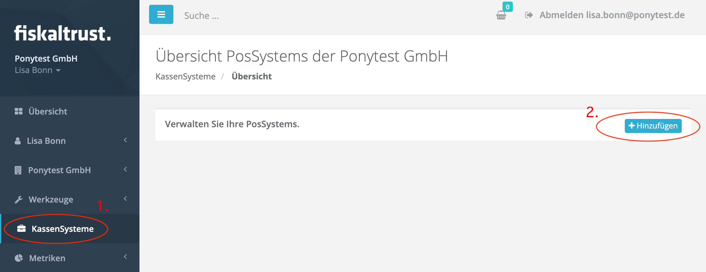

2. Click the "Add" button to add your PosSystem. The registration is done via a form:

   

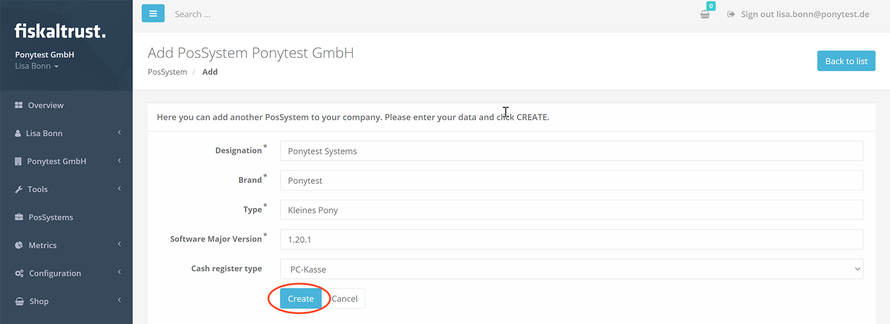

3. After entering the data, you can press the "Create" button to add the PosSystem. The overview appears again, in which the entered PosSystem is now displayed:

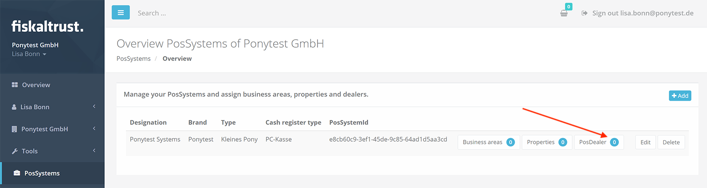

### Inviting PosDealer

4. As you can see in the picture above, there are no PosDealer assigned to the newly added PosSystem yet. Press "PosDealer" to go to the PosDealer overview and start inviting PosDealers.

5. Now press the "Add" button to enter a PosDealer, invite him and thus assign him to the PosSystem. Next, enter the email address of the PosDealer (email address of the contact person - this will later be used by the PosDealer to log in):

6. Now press the "Search" button. The portal will search for the PosDealer in the fiskaltrust system. If he is already registered, he can be assigned immediately. Otherwise, a form for entering the PosDealer data will appear:

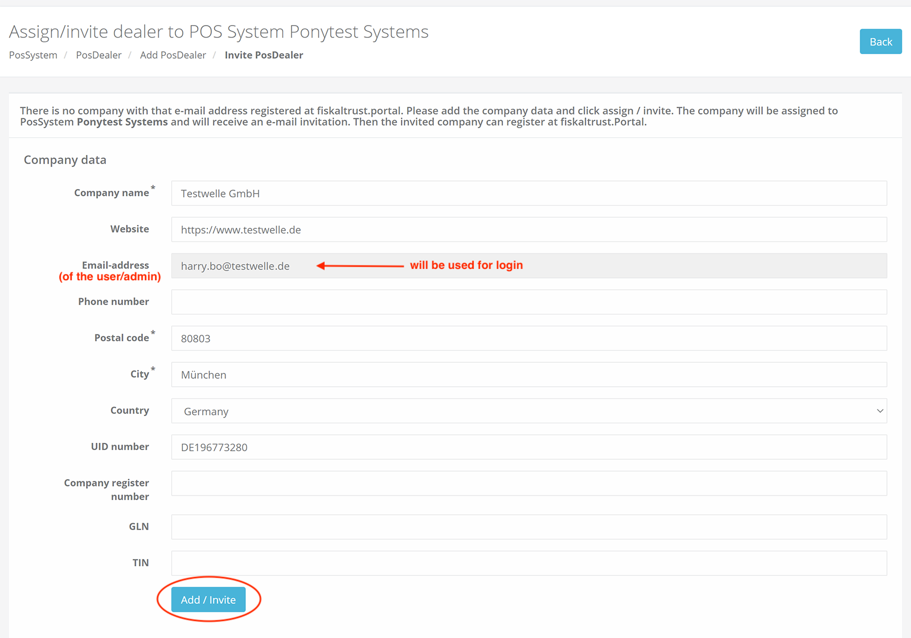

7. After entering the data in the form, press the "Add/Invite" button. The portal will then send an invitation email to the PosDealer (to the specified contact person). In the overview, the PosDealer can now be seen as assigned:

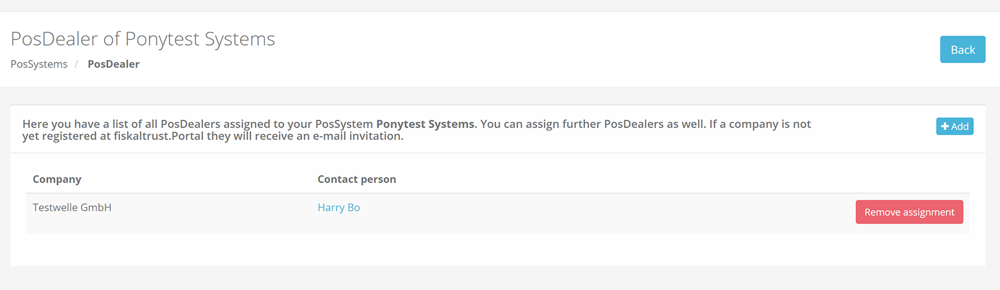

 In addition, the PosDealer receives two emails (an invitation email and an assignment email):

**Invitation email to the PosDealer:**

**Assignment email to the PosDealer:**

8. Next, the invited PosDealer presses the "link for activation" he received in the invitation email. He gets to the fiskaltrust.Portal and has to set his password here to complete the registration:

   

9. The PosDealer will be redirected to the "Overview page" of his account in the portal and MUST activate the role "PosDealer" here:

   

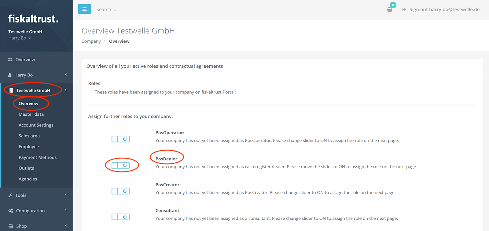

10. By activating the role "PosDealer" the cooperation agreement with fiskaltrust appears, which the PosDealer has to sign digitally:

    

11. As soon as the PosDealer has signed the cooperation agreement with fiskaltrust digital, he is taken back to the overview. Here he can see that the role "PosDealer" has been activated:

    

12. The dealer will also be informed of this by email:

    

The PosDealer is now invited and assigned to the PosSystem. He can now start inviting his PosOperators.

## PosDealer invite PosOperator
As a PosDealer, you need to invite your PosOperators to the fiskaltrust.Portal in order to use the portal as a rollout management tool for the fiskaltrust.Middleware and for other fiskaltrust products. 

You can invite single PosOperators but also many PosOperators at the same time (CSV import).

Under the menu item "PosOperator -> Overview" you can display the list of PosOperators already assigned to you. This list is empty at the beginning:

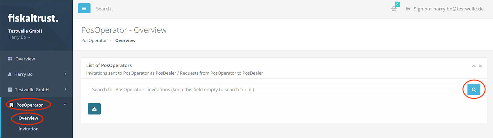

To invite PosOperators, proceed as follows:

1. Call up the "Invitations" screen. To do this, click the menu item "PosOperator->Invitations". Here you can prepare the invitations and once ready, send them to your PosOperators by using the portal:

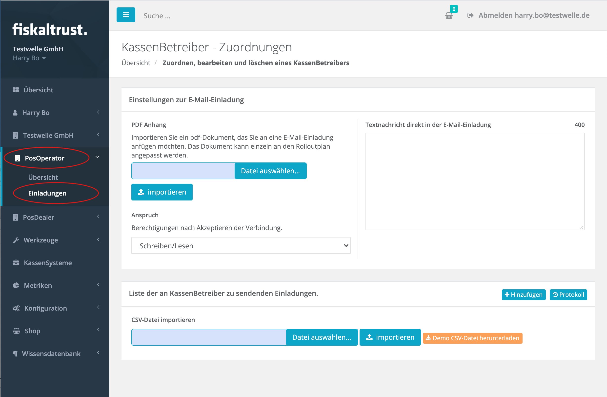

2. Next, configure the invitation email that will later be sent to the invited PosOperators. You can attach a PDF file and write an additional text. These will be included in the invitation email automatically created by fiskaltrust.

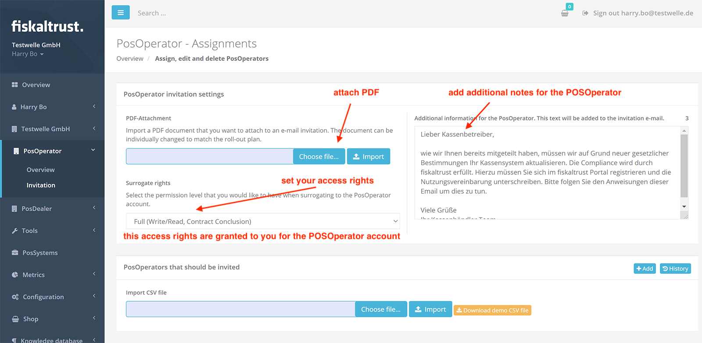

3. Also, specify which rights **you** would like to have on the operator's account. You have the following options for this:

- "Read only": you can log into the operator's account later, but you cannot change anything there.
- "Read and write": you can log into the operator's account later, read and write everything there, for example, create the configuration of the fiskaltrust.Middelware that you will need during the rollout.
- "Full": you can log in to the operator's account later, you can read and write everything there, moreover, you can purchase products from fiskaltrust and sign contracts on behalf of the operator.
- "no access rights": you will not be able to log into the operator's account later.

4. Now you can create an invitation list with PosOperators. For this purpose, you can enter PosOperators individually or add many at the same time via a CSV file import.   

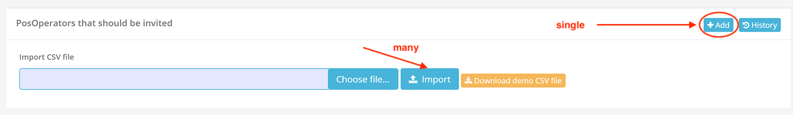

4.1 Record individually

Press the "Add" button above the invitation list. A form for entering the data of the PosOperator will appear. 

This form is divided into two sections: 

1. Company data
2. User data or account data

First enter the company data of the PosOperator. Important: Make sure to enter the company email address here (e.g. info@...), and not the user's email address (e.g. josef.mayer@...). If the PosOperator has only one email address, you can of course also use it here.

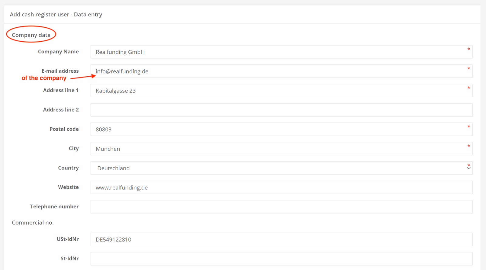

Then enter the user data for the account. Meaning the data of the person who will manage the account on the PosOperator's side. Important: the email address specified here will be used later for logging in, so it should not be the company email address, but the one of the user who will manage the account. If the PosOperator has only one email address, you can of course use it here as well.

Press "Save" in the form to create the list entry. The new entry appears in the invitation list:

4.2. Create many entries at the same time

As an alternative to single entry, you can import a CSV file with multiple entries. To do this, first download the template (button: "Download demo CSV file"). Fill it out analogous to single entry for multiple operators (see above):

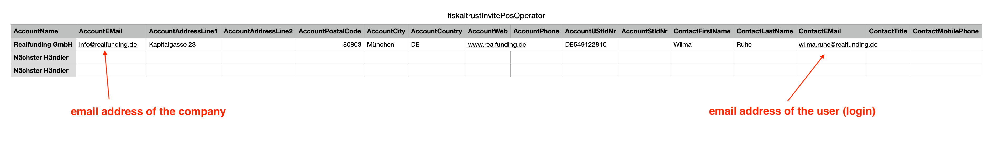

Select the completed file from your computer (button: "Select file") and import the entries by pressing the "Import" button: 

The entries read in then appear in the invitation list.

5. After you have added entries to the invitation list (see above), the corresponding PosOperators are not yet invited. You can now invite all PosOperators entered here at once and assign them to you (button: "Assign all cash register operators") or invite individual PosOperators from the list and assign them to you (envelope button in the list entry):

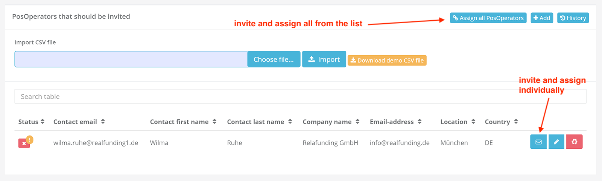

The PosOperator will then receive the invitation email informing him about further steps. The email also contains the additional text you specified in the configuration and attached PDF file (if specified - see above, point 2):

The PosOperator is requested in the email to press a link to complete the registration. He will be redirected to the fiskaltrust.Portal and has to set his password first:

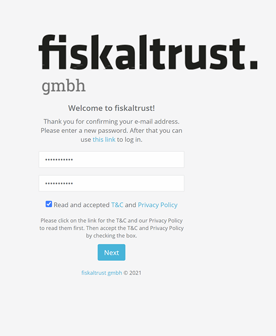

Next, the user agreement is displayed to the PosOperator. This MUST be signed digitally by the PosOperator, otherwise the fiskaltrust.Middleware cannot be rolled out. 

The operator is only considered to be fully assigned to you when the user agreement is signed and then has the status "active" in the fiskaltrust.Portal. He appears in the overview of your PosOperators under PosOperator->Overview. The list is empty when called up. You must display the entries via the search:

The company name of the PosOperator is displayed in the list as a link (only with the "active" status). Press the link to switch to the account of the PosOperator. This function is called "Surrogate function". You can log in to the account of the PosOperator with this function. You can later use this function to configure the fiskaltrust.Middleware instance to be rolled using the the PosOperator account.

If the entry has the status "inactive", the PosOperator has not yet signed the user agreement. 

Ask the PosOperator to digitally sign the user agreement. 

6. Repeat invitation of a PosOperator by the PosDealer

6.1. If the PosOperator has not received the invitation email, you can resend it using the function to invite individual PosOperator as shown above in point 5. #posdealers-invite-posoperators.

6.2. An additional option is, using the the "History"-button: 

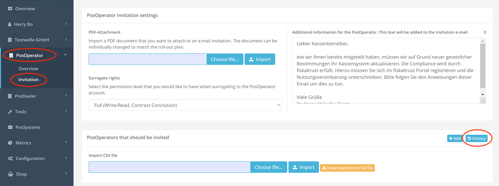

The history of your invitations sent in the past is displayed. Here you can now resend the invitation email in the associated list entry with the help of a button:

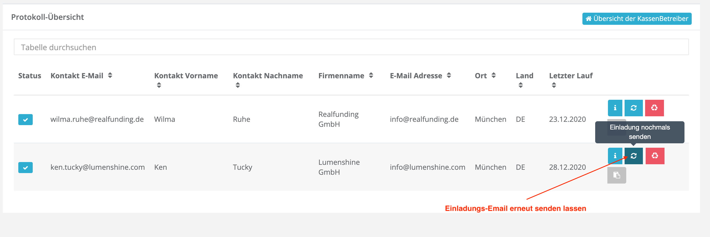

Sending a manual e-mail by using the link:

6.3. By clicking on "Copy link to clipboard" button , the link to assign the PosOperator is copied to the clipboard. Subsequently, this link can be sent from the PosDealer to the PosOperator via another method - e.g. with an individual e-mail from the private e-mail-account of the PosDealer-employee.

###  Adding outlet for PosOperator

As soon as a PosOperator has registered in the fiskaltrust.Portal via the invitation of a PosDealer and has digitally signed the user agreement, the fiskaltrust.Portal automatically creates an outlet (main outlet) with the master data of the company. If the PosOperator operates several locations, these must be added in the fiskaltrust.Portal, because the exact outlet (outlet number) must be specified when configuring the fiskaltrust.Middleware so that the data can be separated. In case of a financial audit, the outlet is the auditable entity. 

PosDealers can add and edit outlets for their PosOperators via the surrogate function. To do this, you need at least write access to the account of the PosOperator. If you do not have these rights as a PosDealer, you can alternatively ask the PosOperator to add the required outlet himself.

To add or edit outlets for your PosOperator as a PosDealer, you can proceed as follows:

1. Log in to the fiskaltrust.Portal with your account (as a PosDealer) and go to PosOperator -> Overview. Press the "Search" button to find the PosOperator:

The PosOperator searched for appears as an entry in the results list. The name of the PosOperator is displayed as a link. 

2. Press the link to log in to the account of the PosOperator (surrogate function). You will be redirected to the account of the PosOperator. 
3. In the menu, go to the company name of the cash register operator and press "Outlets". An overview of the cash register operator's outlets appears:

4. You can add new outlets here individually (button "Add a new outlet") or import several outlets at once from a CSV file. After creating, the new outlet will appear in the list. 

5. When you are done, press the "Switch to your account" button in the upper area on the right to switch back to your PosDealer account.

   

### Closing words

We hope that the above guide regarding invitation management has been helpful to you. If you have any questions, please visit our [FAQ list](https://docs.fiskaltrust.cloud/doc/faq/qna/market-de.html). If you do not find what you are looking for here, please feel free to contact us at info@fiskaltrust.de.

Continue to [Rollout of the fiskaltrust.Middleware](../middleware/README.md)
