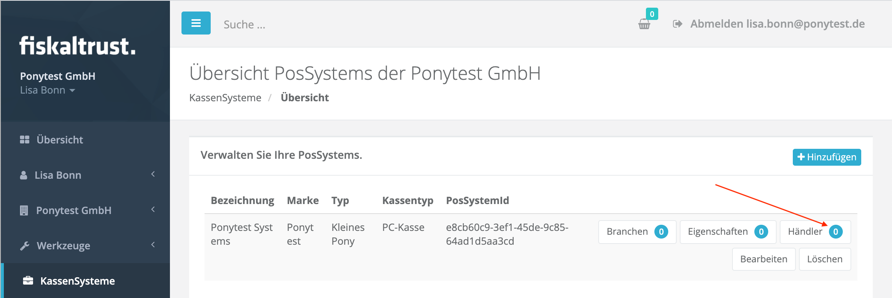
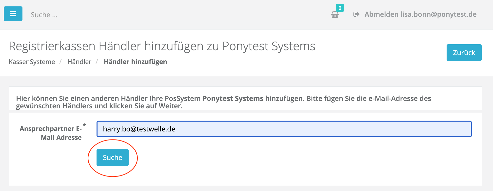
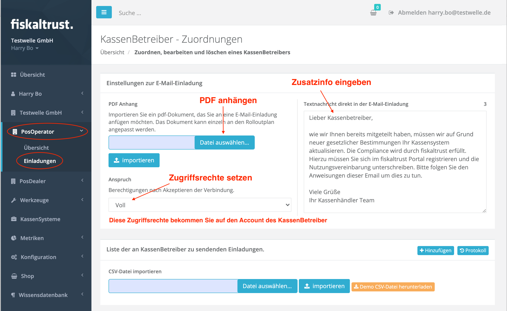
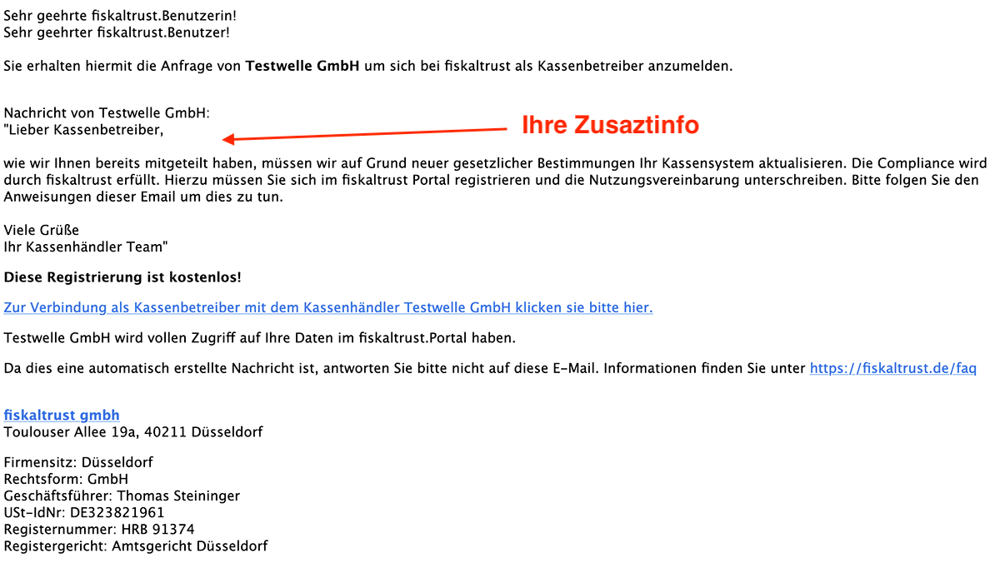
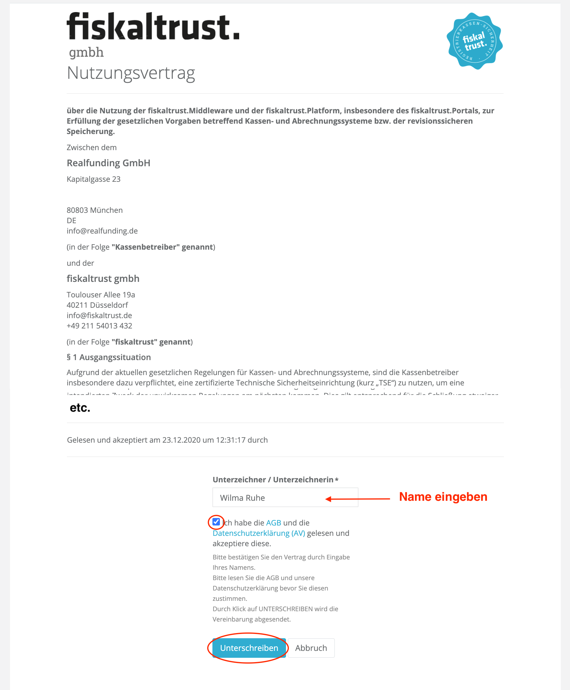

 
<strong>Compliance-As-A-Service for POSSystems</strong>
 
 
<h1>Rollout documentation for Germany</h1>
 

 

## Invitation Management

As described in the [Getting Started Guide](../README.md), fiskaltrust distinguishes between three partner roles during the rollout process of fiskaltrust.Middleware: 

- POSCreator (developer of the POSSystem)
- POSDealer
- and POSOperator

The basic prerequisite for using the fiskaltrust.Portal as a rollout management tool is the registration and assignment of the above-mentioned partners in the fiskaltrust.Portal. For this purpose, the POSCreator registers first and enters his POSSystem(s) in the portal. He then invites his associated POSDealers to register for the corresponding POSSystem. For the invitation, he uses the invitation function in the portal. The registered POSDealers then invite their POSOperators via the portal as well. This creates a unique, system-wide assignment of the POSOperators to their POSDealers and of the POSDealers to the POSSystem of the POSCreator:

The registration and invitation process is as follows:

1. The POSCreator registers in the fiskaltrust.Portal, activates the role "POSCreator" and digitally signs the associated cooperation agreement with fiskaltrust. Then he registers his POSSystems in the portal and sends invitations for assignment to his POSDealers with the help of the portal (for each registered POSSystem). The fisklatrust.Portal automatically sends the invitation e-mails to the POSDealers.
2. The POSDealer receives the invitation e-mail and clicks on the link to register. First, he sets his password, selects the partner role: "POSDealer" and digitally signs the associated cooperation agreement with fiskaltrust.
3. Now the POSDealer can invite his POSOperators via the portal and have them assigned to him. This is important, because he must later carry out the mass rollout of the fiskaltrust.Middleware via the portal.
4. The invited POSOperator then receives the invitation email from fiskaltrust, presses the link to register, sets his password and signs the user agreement so that the fiskaltrust.Middleware can be installed on his cash register.

In the following, we will describe in detail how the individual steps in the invitation process are to be carried out and which aspects are to be paid particular attention to. We divide the description into the following two chapters:

-  [PosCreators invite POSDealers](README.md#poscreators-invite-posdealers)

- [POSDealers invite POSOperators](README.md#posdealers-invite-posoperators)

### PosCreators invite POSDealers

The POSCreators integrate the fiskaltrust.Middleware into their POSSystem. To do this, they must register independently in the fiskaltrust.Portal. Furthermore, POSCreators must select the role "POSCreator" when registering in the fiskaltrust.Portal, sign the contract with fiskaltrust digitally and register their POSSystem(s) in the fiskaltrust.Portal. The registration of the POSSystem is the prerequisite for inviting the POSDealers. Please invite your POSDealers as early as possible, because the POSDealers need enough time to invite the POSOperators and to prepare and test the mass rollout. 

First you have to enter/register your POSSystem(s) in the fiskaltrust.Portal. Then you can invite the associated POSDealers via the registered POSSystem and thus assign them to the POSSystem.

#### Adding a POSSystem

Als KassenHändler können Sie wie folgt Ihr KassenSystem (POSSystem) im fiskaltrust.Portal registrieren:

1. Klicken Sie den Menüpunkt "POSSystems" an. Sie gelangen zur Übersicht Ihrer registrieren KassenSysteme:

   

2. Klicken den "Hinzufügen" Button um Ihr KassenSystem anzulegen. Die Erfassung erfolgt über ein Formular:

   

3. Nach Eingabe der Daten, können Sie den Button "Erstellen" zum Anlegen des KassenSystems drücken. Daraufhin erscheint erneut die Übersicht, in der nun das erfasste KassenSystem angezeigt wird:

#### KassenHändler einladen

4. Wie im oberen Bild sichtbar, sind dem neu erfassten KassenSystem noch keine KassenHändler zugewiesen. Drücken Sie auf "Händler" um zur Übersicht der Händler zu gelangen und mit den Einladungen zu beginnen.

5. Drücken Sie nun den "Hinzufügen" Button um einen Händler zu erfassen, einzuladen und somit dem KassenSystem zuzuordnen. Geben Sie als nächstes die Email-Adresse des Händlers ein (Email-Adresse des Ansprechpartners - diese wird später zum Login vom Händler verwendet):

6. Drücken Sie nun den "Suchen" Button. Das Portal wird den Händler im fiskaltrust System suchen. Falls dieser bereits registriert ist, kann er sofort zugeordnet werden. Ansonsten kommt ein Formular zur Erfassung der Händlerdaten:

7. Drücken Sie nach der Erfassung der Daten im Formular den "Hinzufügen/Einladen" Button. Das Portal wird daraufhin eine Einladung-Email an den KassenHersteller (an den angegebenen Ansprechpartner) senden. In der Übersicht ist nun der Händler als zugeordnet zu sehen:

   Zudem erhält der KassenHändler zwei Emails (eine Einladungs-Email und eine Zuordnung-Email):

**Einladungs-Email an den KassenHändler:**

**Zuordnungs-Email an den KassenHändler:**

8. Als Nächstes drückt der eingeladene Händler den "Link zur Aktivierung", den er in der Einladung-Email erhalten hat. Er gelangt zum fiskaltrust.Portal und muss hier sein Passwort setzen um die Registrierung abzuschließen:

   

9. Der Händler wird zur "Übersichtseite" seines Accounts im Portal weitergeleitet und MUSS hier die Rolle "KassenHändler" aktivieren:

   

10. Durch das Aktivieren der Rolle "KassenHändler" erscheint der Kooperationsvertrag mit fiskaltrust, den der KassenHändler digital unterschrieben muss:

    

11. Sobald der Händler den Kooperationsvertrag mit fiskaltrust digital unterschrieben hat wird er zurück zur Übersicht geführt. Hier kann er sehen, dass die Rolle "KassenHändler" aktiviert wurde:

    

12. Dies bekommt der Händler auch per Email mitgeteilt:

    

Damit ist der KassenHändler eingeladen und dem KassenSystem zugeordnet. Er kann nun mit der Einladung seiner KassenBetreiber beginnen.

### POSDealers invite POSOperators
Als KassenHändler müssen Sie Ihre KassenBetreiber (POSOperator) im fiskaltrust.Portal einladen um das Portal als Rolloutmanagement-Tool für die fiskaltrust.Middleware und für andere fiskaltrust Produkte nutzen zu können. 

Sie können einzelne KassenBetreiber aber auch viele KassenBetreiber gleichzeitig einladen (CSV-Import).

Unter dem Menüpunkt "PosOperator -> Überisicht" können Sie sich die Liste der bereits Ihnen zugeordneten KassenBetreiber anzeigen lassen. Diese Liste ist Anfangs leer:

Um KassenBetreiber einzuladen, gehen Sie wie folgt vor:

1. Screen "Einladungen" aufrufen. Klicken Sie dazu den Menüpunkt "PosOperator->Einladungen". Hier können Sie die Einladungen vorbereiten und sobald fertig, an Ihre KassenBetreiber mit Hilfe des Portals versenden:

2. Konfigurieren Sie als nächstes die Einladungs-Email die später an die eingeladenen Betreiber gesendet wird. Sie können hierzu eine PDF Datei anhängen und einen Zusatztext schreiben. Diese werden in die automatisch von fiskaltrust erstellte Einladung-Email übernommen.

3. Geben Sie zudem an, welche Rechte **Sie** auf den Account des Betreibers haben möchten. Dazu haben Sie folgende Möglichkeiten:

- "Nur lesen": Sie können sich später in den Account des Betreibers einloggen, können dort aber nichts ändern
- "Lesen und Schreiben": Sie können sich später in den Account des Betreibers einloggen, können dort alles lesen und schreiben, also zum Beispiel die Konfiguration der fiskaltrust.Middelware anlegen, die sie beim Rollout benötigen werden.
- "Voll": Sie können sich später in den Account des Betreibers einloggen, können dort alles lesen und schreiben, zudem können Sie im Namen des Betreibers Produkte von fiskaltrust einkaufen und Verträge unterzeichnen.
- "keine Zugriffsrechte": Sie können sich später nicht in den Account des Betreibers einloggen.

4. Nun können Sie eine Einladungsliste mit KassenBetreiber anlegen. Dazu können Sie sowohl einzeln KassenBetreiber erfassen als auch viele geleichzeitig über ein CSV-Datei-Import anlegen.   

4.1 Einzeln erfassen

Drücken Sie den "Hinzufügen" Button oberhalb der Einladungsliste. Es erscheint ein Formular zum Erfassen der Daten des KassenBetreibers. 

Dieses Formular ist in zwei Bereiche unterteilt: 

- 1. Firmendaten
- 2. Benutzerdaten bzw. Accountdaten

Geben Sie zuerst die Firmendaten des KassenBetreibers an. Wichtig: Achten Sie darauf hier die Firmen-Emailadresse anzugeben (z.B. info@...), und nicht die Email-Adresse des Benutzers (z.B. josef.mayer@...). Falls der KassenBetreiber nur eine Email-Adresse besitzt, können Sie sie hier natürlich ebenfalls verwenden.

Geben Sie danach die Beutzerdaten für den Account an. D.h. die Daten der Person, die den Account auf Seite des KassenBetreibers verwalten wird. Wichtig: die hier angegebene Email-Adresse wird später zum Einloggen verwendet, es sollte also nicht die Firmen-Email-Adresse sein, sondern die des Benutzers der den Account verwalten wird. Falls der KassenBetreiber nur eine Email-Adresse besitzt, können Sie sie hier natürlich ebenfalls verwenden.

Drücken Sie "Speichern" im Formular um den Listeneintrag anzulegen. Der neue Eintrag erscheint in der Einladungsliste:

4.2. Viele Einträge gleichzeitig anlegen

Alternativ zu Einzelerfassung können Sie eine CSV-Datei mit mehreren Einträgen importieren. Laden Sie dazu zuerst die Vorlage herunter (Button: "Demo CSV-Datei herunterladen"). Füllen Sie diese analog zur Einzelerfassung für mehrere Betreiber aus (siehe oben):

Wählen Sie die ausgefüllte Datei von Ihrem Rechner aus (Button: "Datei auswählen") und importieren Sie die Einträge, indem Sie den Button "Importieren" drücken: 

Die eingelesenen Einträge erscheinen daraufhin in der Einladungsliste.

5. Nachdem Sie Einträge in Einladungsliste hinzugefügt haben (siehe oben), sind die dazugehörigen KassenBetreiber noch nicht eingeladen. Sie können nun alle hier erfassten KassenBetreiber auf einmal einladen und Ihnen zuordnen (Button: "Alle KassenBetreiber zuordnen") oder einzelne KassenBetreiber aus der Liste einladen und Ihnen zuordnen (Briefumschalg Button im Listeneintrag):

Der KassenBetreiber bekommt daraufhin die Einladungs-Email, in der er über weitere Schritte informiert wird. Die Email beinhaltet auch den von Ihnen in der Konfiguration angegebenen Zusatztext und angehängte PDF-Datei (falls angegeben - siehe oben, Pkt. 2):

Der KassenBetreiber wird in der Email aufgefordert einen Link zu drücken um die Registrierung abzuschließen. Er wird dadurch zum fiskaltrust.Portal weiter geleitet und muss hier als erstes sein Passwort setzen:

Als nächstes wird dem KassenBetreiber die Nutzungsvereinbarung angezeigt. Diese MUSS er digital unterschreiben sonst kann die fiskaltrust.Middleware nicht ausgerollt werden. 

Der Betreiber gilt erst mit Unterschrift der Nutzungsvereinbarung als vollständig Ihnen zugeordnet und hat dann im fiskaltrust.Portal den Status "aktiv". Er erscheint in der Übersicht Ihrer KassenBetreiber unter PosOperator->Übersicht. Die Liste ist bei Aufruf leer. Sie müssen die Einträge über die Suche anzeigen lassen:

Der Firmenname des KassenBetreibers wird in der Liste als Link dargestellt (nur bei Status "aktiv"). Drücken Sie den Link um in den Account des KassenBetreibers zu wechseln. Diese Funktion nennen wir "Surrogate-Funktion". Sie loggen sich dadurch in den Account des KassenBetreibers ein. Sie könne später diese Funktion nutzen um die Konfiguration der auszurollenden fiskaltrust.Middleware Instanz im Account des KassenBetreibers vorzunehmen.

Sollte der Eintrag den Status "inaktiv" besitzen, so hat der KassenBetreiber die Nutzungsvereinbarung noch nicht unterschrieben. 

Fordern Sie den KassenBetreiber auf, die Nutzungsvereinbarung digital zu unterschreiben. Sollte der KassenBetreiber die Einladung-Email nicht erhalten haben, so können Sie diese mit Hilfe des Portals erneut senden. Gehen Sie dazu in den Bereich POSOperator->Einladungen und drücken Sie hier auf den "Protokoll" Button. 

Die Historie (Protokoll) Ihrer in der Vergangenheit versendeten Einladungen wird angezeigt. Hier können Sie nun im dazugehörigen Listeneintrag mit Hilfe eines Buttons die Einladung-Email erneut senden lassen:

### Schlusswort

Wir hoffen, dass Ihnen der oben beschriebene Leitfaden bezüglich des Einladungsmanagement weitergeholfen hat. Sollten Sie Fragen dazu haben, bitten wir Sie unsere [FAQ Liste](https://docs.fiskaltrust.cloud/doc/faq/qna/market-de.html) aufzusuchen. Sollten Sie hier nicht fündig werden, so können Sie uns jederzeit gerne unter info@fiskaltrust.de kontaktieren.
