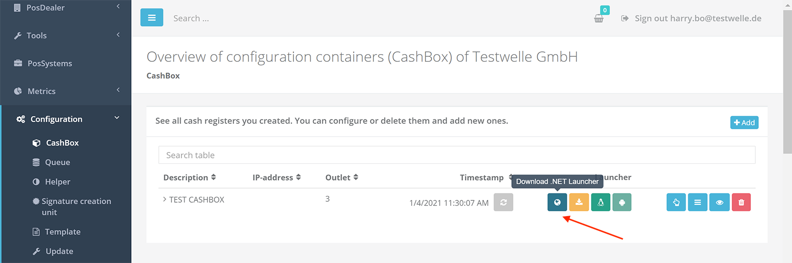
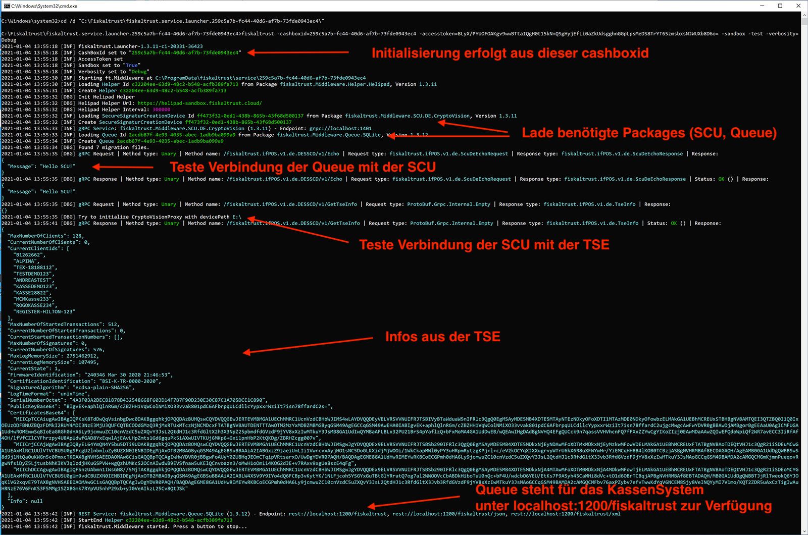
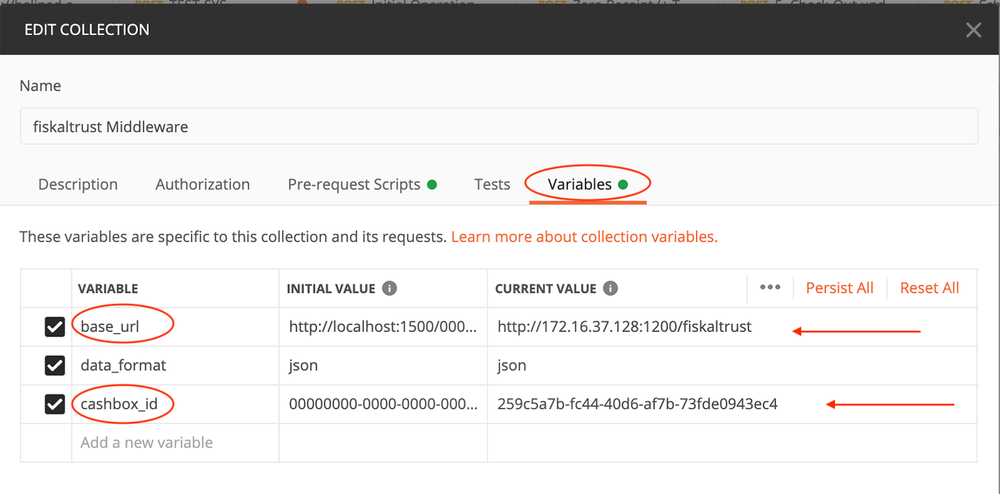
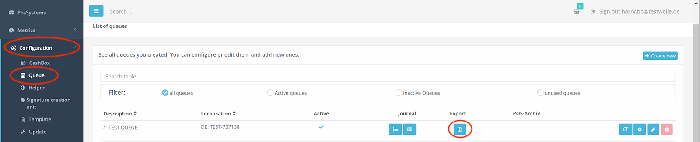
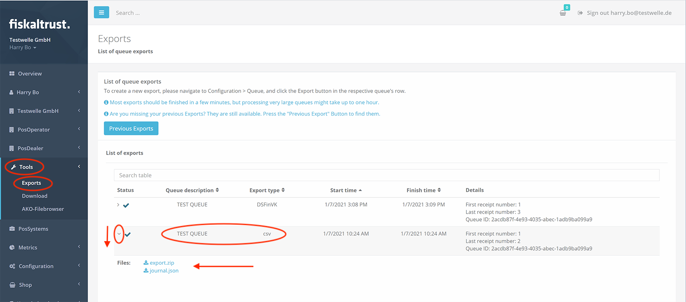
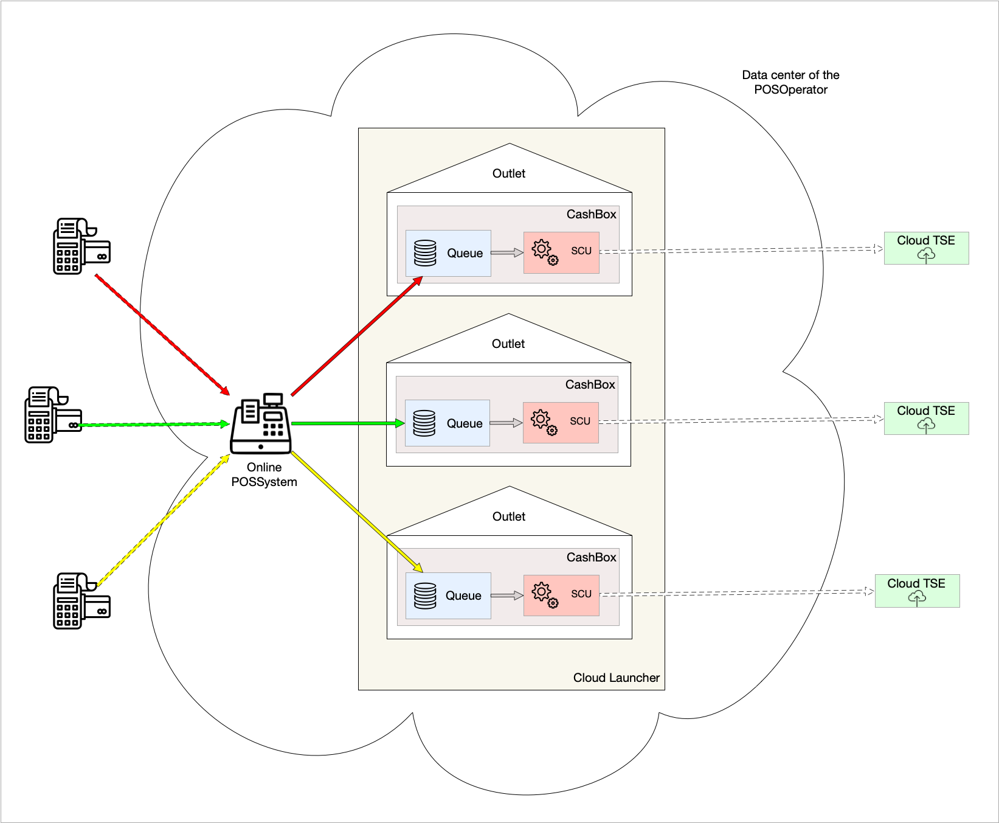

<div align="center">

<br/>
<strong>Compliance-As-A-Service for POSSystems</strong>
<br/>
<br/>
<h1>Rollout documentation for Germany</h1>
<br/>
</div>
<p align="center">
<a href="../../de/README.md"></a>
<a href="../README.md"></a>
</p>
<br/>

# Rollout of the fiskaltrust.Middleware

## Table of contents

<pre>
├── <a href="#introduction" title="Introduction">Introduction</a>
├── <a href="#configuration-of-the-fiskaltrustmiddleware" title="Configuration of the fiskaltrust.Middleware">Configuration of the fiskaltrust.Middleware</a>
│   └── <a href="#structure-of-the-fiskaltrustmiddleware" title="Structure of the fiskaltrust.Middleware">Structure of the fiskaltrust.Middleware</a>
│   └── <a href="##the-cashbox-as-a-configuration-container" title="The CashBox as a configuration container">The CashBox as a configuration container</a>
│       └── <a href="#configuration-of-the-queue" title="Configuration of the queue">Configuration of the queue</a>
│       └── <a href="#configuration-of-the-scu" title="Configuration of the SCU">Configuration of the SCU</a>
│   └── <a href="#create-cashbox-manually-via-the-fiskaltrustportal" title="Create CashBox manually via the fiskaltrust.Portal">Create CashBox manually via the fiskaltrust.Portal</a>
├── <a href="#start-and-test-the-service" title="Start and test the service">Start and test the service</a>
│   └── <a href="#test-the-availability-of-the-queue" title="Test the availability of the queue">Test the availability of the queue</a>
│   └── <a href="#initialization-of-the-fiskaltrustmiddleware-instance-via-an-initial-operation-receipt" title="Initialization of the fiskaltrust.Middleware instance via an initial-operation receipt">Initialization of the fiskaltrust.Middleware instance via an initial-operation receipt</a>
│   └── <a href="#send-a-pos-receipt" title="Send a pos-receipt">Send a pos-receipt</a>
│   └── <a href="#check-connection-with-the-fiskaltrustcloud" title="Check connection with the fiskaltrust.Cloud">Check connection with the fiskaltrust.Cloud</a>
│   └── <a href="#test-data-export" title="Test data export">Test data export</a>
│       └── <a href="#local-data-export" title="Local data export ">Local data export </a>
│       └── <a href="#notes-on-the-dsfinv-k-export" title="Notes on the DSFinV-K export">Notes on the DSFinV-K export</a>
│       └── <a href="#notes-on-the-tar-file-export" title="Notes on the TAR file export">Notes on the TAR file export</a>
│       └── <a href="#data-export-via-the-fiskaltrustportal" title="Data export via the fiskaltrust.Portal">Data export via the fiskaltrust.Portal</a>
├── <a href="#rollout-scenarios" title="Rollout scenarios">Rollout scenarios</a>
│   └── <a href="#introduction-1" title="Introduction">Introduction</a>
│   └── <a href="#a-tse-per-cash-register" title="A TSE per cash register">A TSE per cash register</a>
│   └── <a href="#hardware-tses-at-local-server-for-multiple-cash-registers" title="Hardware TSE(s) at local server for multiple cash registers">Hardware TSE(s) at local server for multiple cash registers</a>
│   └── <a href="#hardware-tse-at-the-main-cash-register-for-several-additional-cash-registers" title="Hardware TSE at the main cash register for several additional cash registers">Hardware TSE at the main cash register for several additional cash registers</a>
│   └── <a href="#a-cloud-tse-for-multiple-cash-registers" title="A cloud TSE for multiple cash registers">A cloud TSE for multiple cash registers</a>
│   └── <a href="#rollout-scenario-with-terminals" title="Rollout scenario with terminals">Rollout scenario with terminals</a>
│   └── <a href="#data-center-as-operational-environment" title="Data center as operational environment">Data center as operational environment</a>
│   └── <a href="#connection-variants-of-the-tse-to-the-scu" title="Connection variants of the TSE to the SCU">Connection variants of the TSE to the SCU</a>
│   └── <a href="#proposed-solutions-for-virtualization-within-an-outlet" title="Proposed solutions for virtualization within an outlet">Proposed solutions for virtualization within an outlet</a>
│   └── <a href="#performance-recommendations" title="Performanceempfehlungen">Performanceempfehlungen</a>
├── <a href="#rollout-automation" title="Rollout automation">Rollout automation</a>
│   └── <a href="#introduction-2" title="Introduction">Introduction</a>
│   └── <a href="#overview-manual-process" title="Overview manual process">Overview manual process</a>
│   └── <a href="#templating-to-create-cashboxes" title="Templating to create CashBoxes">Templating to create CashBoxes</a>
│   └── <a href="#automated-rollout-of-the-fiskaltrustmiddleware" title="Automated rollout of the fiskaltrust.Middleware">Automated rollout of the fiskaltrust.Middleware</a>
│   └── <a href="#high-degree-of-automation" title="High degree of automation">High degree of automation</a>

</pre>

## Introduction

The fiskaltrust.Middleware is the license-free base product of fiskaltrust, which is integrated by POSCreators into their POSSystems in order to implement conformity with the new fiscalization laws. The fiskaltrust.Middleware runs as an independent service on the cash register of the POSOperator and is addressed by the POSSystem via an interface. 

Since fiskaltrust.middleware runs as a standalone service, it must be rolled out to the cash register of the POSOperator. Depending on the circumstances, the respective fiskaltrust.Middleware instance must be configured accordingly before going live. For example, it must be specified where the POSSystem can reach the service, in which database the processed data is to be stored by the service, which TSE is to be used for the signatures, and how the TSE can be reached by the service. 

In the following chapters we will explain how to configure the fiskaltrust.Middleware for the rollout. In addition, we will show you how to install and test the service and we will discuss various rollout scenarios. Finally, we will describe which automation options fiskaltrust provides for a mass rollout.


## Configuration of the fiskaltrust.Middleware

The configuration of the fiskaltrust.Middleware can be done manually via the fiskaltrust.Portal or automated via an API. But before we look at how the configuration is created, we will first go into the structure of the fiskaltrust.Middleware.

### Structure of the fiskaltrust.Middleware

The fiskaltrust.Middleware is modular and consists of several components. The most important components are the **Queue** and the **SCU** (signature creation unit). Furthermore, so-called **Helpers** can also be used, such as the Helipad Helper, which is responsible for the regular upload of the processed data to the fiskaltrust.Cloud. The following illustration shows how the Queue and the SCU are used:


The Queue is the component of the fiskaltrust.Middleware with which the POSSystem communicates. For this purpose, the Queue provides an interface that is the same for all countries, the so-called IPOS Interface. The type of communication with the Queue is selected by the POSCreator when implementing the POSSystem. For example, grpc or WCF can be used. The IPOS Interface provides the POSSystem following three functions:

- `echo` - to check the availability of the Queue
- `sign` - for signing receipt data, as well as for executing functionality via special receipts (e.g. initial operation receipt, daily closing receipt or zero receipt)
- `journal` - to export the data in the formats required by law

The Queue receives requests from the POSSystem and processes them. It is responsible for the creation of the receipt number, for the chaining of the requests and for the persistence of the data.

The fiskaltrust.Middleware component SCU (signature creation unit) is responsible for signing the data. The data to be signed is sent from the Queue to the SCU, which in turn, in the German variant, communicates with a TSE. The TSE finally signs the data. The signed data and all associated information are then sent back to the Queue by the SCU. The Queue persists the data and builds the response that is returned to the POSSystem. This response contains important information that must be printed on the receipt by the POSSystem.

### The CashBox as a configuration container

The configuration of a fiskaltrust.Middleware instance is done via a so-called **CashBox**. The CashBox is a configuration container. It contains the configurations of the fiskaltrust.Middleware components used in the fiskaltrust.Middleware instance (e.g. Queue, SCU). The following example shows a CashBox that contains the configuration of a Queue and the configuration of an SCU:


So for the example above we need to configure the Queue and the SCU and then put these two configurations into a configuration container (CashBox). But what exactly do we have to configure for the Queue and for the SCU?

#### Configuration of the queue

As mentioned above, the Queue is the component of the fiskaltrust.Middleware that is available to the POSSystem for queries via the IPOS Interface. In addition, the Queue is responsible for the persistence of the processed data. And these are exactly the two points that we have to configure here:

1. how and where exactly should the Queue be accessible for the POSSystem? (e.g. via `grpc` on `localhost:1234`)
2. where exactly should the Queue store the data? (e.g. in a MySql database with the connectionstring: "xyz")

How the communication is to take place, e.g. via `grpc`, is decided by the POSCreator, who implements the POSSystem accordingly. Where the Queue and thus the service exactly will be attainable, thus e.g. `localhost:1234` decides usually the POSDealer, depending upon conditions with the POSOperator. 

#### Configuration of the SCU

The SCU is responsible for creating the signatures. It receives the data to be signed from the Queue and handles communication with a TSE to have the data signed. Two configuration entries must also be made for the SCU:

1. on the one hand the Queue must know how and where it can reach the SCU (i.e. via `grpc` on `localhost:5678`).

2. and on the other hand the SCU must know which TSE it should access and where it is located (e.g. Swissbit - USB - TSE in drive `E:`).

Now you will surely ask yourself why we have to configure here how the SCU should be reachable by the Queue, if the Queue and SCU are components of the fiskaltrust.Middleware after all. Isn't the Queue already aware of how to reach the SCU? Well, the answer lies in the flexibility of the fiskaltrust.Middleware, because an instance of the fiskaltrust.Middleware operates only exactly those components, which are specified in its CashBox. For example, three cash registers can share one SCU and thus one hardware TSE:


Each cash register runs an instance of the fiskaltrust.Middleware, which is configured by its own CashBox. The CashBoxes of the upper and lower cash registers contain only the configuration of a Queue. The CashBox of the middle cash register contains the configuration of a Queue and a SCU. To make the SCU from the middle cash register (e.g. main cash register) reachable for the other two cash registers or Queues, we have to specify in the Queue configuration how and where the SCU is reachable (and of course release the corresponding port). To ensure that a Queue connects to the correct SCU, we must specify this connection when creating the CashBox for the queue. 

### Create CashBox manually via the fiskaltrust.Portal

Each instance of the fiskaltrust.Middleware must be configured using a CashBox. Such a CashBox can be created manually via the fiskaltrust.Portal or automated via an API. In this chapter we will show you an example of how to create a CashBox via the fiskaltrust.Portal. For this purpose, we assume the following scenario:


Our CashBox shall contain a Queue and a SCU. The SCU accesses a USB TSE. Specifically, we will configure a Queue that the POSSystem communicates with via `REST` and is accessible to the POSSystem at `localhost:1200/fiskaltrust`. The Queue stores the processed data in a `SQLite` database. Furthermore we configure in this example a SCU which is accessible for the Queue via `grpc` and under `localhost:1400` and which accesses a Cryptovision USB-TSE for signing the data. The TSE is plugged into the `E:` drive.

**Step 1: Create the SCU configuration**

In the fiskaltrust.Portal, go to "Configuration -> Signature creation unit". The list of SCUs already created appears. 


Now press the "+ Create" button. A form for entering the SCU data appears.


1. Enter the name of the SCU here (e.g. "TEST SCU").
2. Depending on the TSE, select the package (module) that the SCU should use (in our example we use a CryptoVision TSE).
3. For the package version, the latest one is automatically selected
4. Specify the outlet, the main outlet is automatically preselected by default
5. Press "Save"

The SCU has been created and we are now forwarded to the second configuration form. This form depends on the previously selected package. In our example, we must specify the device path for the Cryptovision TSE. For another package, something else may be required here (e.g. Com-Port for a Diebold TSE). 


1. Enter the device path (i.e. `E:` in our case).
2. Now specify how and where the SCU is to be accessible for a Queue. First press the corresponding button for the type of communication (e.g. `grpc`) and then enter the path (e.g. `localhost:1401`).
3. Press "Save and close" to save the data and to return to the list.

In the list we can now see that our SCU configuration has been successfully created:


**Step 2: Create the Queue configuration**

Next, we create the Queue configuration. To do this, we go to "Configuration -> Queue". The list of already created Queues is displayed.


Now press the "+ Create new" button. A form for entering the Queue data appears.


1. Enter the name of the Queue here (e.g. "TEST QUEUE"). 2.
2. Select how the data should be persisted (e.g. SQLite database). 
3. The latest package version is automatically selected.

4. Enter the **cash register serial number** in the "CashBox Identification" field. Make sure that this is unique worldwide and that it is a [printable string](https://en.wikipedia.org/wiki/PrintableString) with a maximum length of 20 characters. The cash register serial number specified here will later also be registered as the ClientId in the TSE in order to uniquely assign the signatures to the cash register. Since the different TSE manufacturers have different specifications for the formatting and for the length of the ClientId, we have agreed on the lowest common denominator ([printable string](https://en.wikipedia.org/wiki/PrintableString), max. 20 characters).

5. Specify the outlet, the main outlet is automatically preselected by default

6. Press "Save"

The Queue has been created and we are now forwarded to the second configuration form. This form depends on the previously selected persistence package. In our example, we do not have to make any further entries for the SQLite database, because it is automatically created by the fiskaltrust.Middleware. However, if it was a different package, then appropriate connection specifications must be made here. For example, the specification of a connection string for a MySQL database. 


1. If necessary, enter the database connection details (not necessary in this example, the SQLite DB). 
2. Now specify how the Queue should be accessible from the POSSystem. First press the corresponding button for the type of communication (e.g. `http(REST)`) and then enter the path (e.g. `localhost:1200/fiskaltrust`).
3. Press "Save and close" to save the information and to return to the list.

In the list we can now see that our Queue configuration has been successfully created:


**Step 3: Create the CashBox**

After creating the SCU and the Queue, we next create the CashBox, meaning the configuration container for the fiskaltrust.Middleware instance. To do this, go to "Configuration->CashBox". The list of already created CashBoxes will be displayed.


Now press the "+ Add" button. A form for entering the CashBox data will appear.


1. Enter the name of the CashBox here (e.g. "TEST CASHBOX")

2. Enter the outlet, by default the main outlet will be preselected automatically

3. Press "Save" to save the data and to return to the list.

In the list we can now see that our new CashBox has been successfully created:


**Step 4: Fill the CashBox**

After creating the CashBox, it is to be filled next. In our example, we want to put the previously created Queue configuration and the SCU configuration into the CashBox. The list entry with our CashBox can be expanded. Here we can see that it is currently still empty.


To fill the newly created CashBox press the "Edit by list" button in the list entry of the CashBox.


The list of existing configurations is displayed.

We can choose here which configurations we want to add to our configuration container so into the CashBox. For our example we select the Queue and the SCU we created before and then press the "Save" button.


Back in the list, we can expand the list entry of our CashBox again and now see that it contains Queue and SCU.


**Step 5: Connect the Queue with the SCU**

As described above, we need to tell the Queue which SCU to use to sign the data. So we have to "connect" the Queue with the SCU. In our case, the Queue and SCU are in the same CashBox. Nevertheless, we have to create the connection. To do this, we press the "Connect" button in the expanded list entry of the CashBox, which is displayed to the right of the Queue:


A popup appears with the available SCUs. From this list we can now select our previously created SCU, save and close the popup.


The queue now knows with which SCU it has to communicate and where the SCU can be reached.

**Step 5: Publish the CashBox (rebuild configuration)**

The last step is to publish the created CashBox. This is done with the "Rebuild configuration" button available in the list line of the CasBox.


This makes the CashBox available for download as a JSON file. This JSON configuration file can later be downloaded by a fiskaltrust.Middleware instance and used for initial initialization or for an update. In case of an update, for example update of the SCU package version due to a change in the law, the change is only made available in the CashBox after the "Rebuild configuration" button has been pressed. If the fiskaltrust.Middleware instance to which this CashBox is assigned is then restarted, it loads the new configuration and updates itself automatically, e.g. by downloading and using the new package. 

## Start and test the service

To test the service, meaning a fiskaltrust.Middleware instance, we download the so-called "Launcher". We can do this in the list entry of the previously created CashBox. To do this, press the "Download .NET Launcher" button. 



You will receive a zip compressed folder that you can unzip on the cash register. Unzip the zip file. 


The resulting folder can also be renamed if necessary. The folder contains the launcher `fiskaltrust.exe`, the service represented by the `.dll` files, a configuration file named `fiskaltrust.exe.config` and three command files:

- `install-service.cmd`
- `uninstall-service.cmd`
- `test.cmd`

The command files can be used for parameterized starting or stopping of the service. They execute the `fiskaltrust.exe` with specification of appropriate parameters. The content of the `install-service.cmd` file is for example as follows:

`cd /d "%~dp0%"`
`fiskaltrust -cashboxid=259c5a7b-fc44-40d6-af7b-73fde0943ec4 -accesstoken=BL...8D6o= -sandbox -i -servicename=fiskaltrust-259c5a7b-fc44-40d6-af7b-73fde0943ec4`
`timeout 15`

Thus `fiskaltrust.exe` is started with the `cashobxid` "259c..". Thus the started fiskaltrust.Middleware instance knows from which configuration container (CashBox) it should initialize itself. The `cashboxid` is the ID of the CashBox and can be seen in the fiskaltrust.Portal in the expanded list entry of the CashBox:


To be able to load the CashBox from the fiskaltrust.Portal the service needs an access authorization. This is specified via the `accesstoken` parameter. The value can also be found in the fiskaltrust.Portal in the expanded list entry of the CashBox (see above).

The `sandbox` parameter specifies that the sandbox portal is to be accessed. The parameter `i` specifies that the fiskaltrust.Middleware instance should be installed and started as a (Windows) service. The `servicename` parameter sets the name of the (Windows) service.

For the complete list of available parameters and further technical information about the installation of the service, please refer to our IPOS Interface documentation in chapter [Installation](https://docs.fiskaltrust.cloud/doc/interface-doc/doc/general/installation/installation.html).

To test the service we can use the command file `test.cmd`. The content looks like this:

`cd /d "%~dp0%"`
`fiskaltrust -cashboxid=259c5a7b-fc44-40d6-af7b-73fde0943ec4 -accesstoken=BL...8D6o= -sandbox -test`

So the fiskaltrust.Middleware instance is not installed and started as a (Windows) service, but instead started directly in test mode in the console (cmd) using the `test` parameter. The advantage here is that we can see the log messages directly in the console and react accordingly. To activate an extended log output we can edit the `test.cmd` file before running it and add the parameter `verbosity` with the value `Debug`:

`cd /d "%~dp0%"`
`fiskaltrust -cashboxid=259c5a7b-fc44-40d6-af7b-73fde0943ec4 -accesstoken=BL...8D6o= -sandbox -test -verbosity=Debug`

Save and run as administrator:


A console appears in which the fisklatrust.Middleware instance is started. We can see here what exactly happens at startup and make appropriate corrections (e.g. in the CashBox or in the connection of the TSE) in case of any errors.




Now you can try to send requests from the POSSystem to the started fiskaltrust.Middleware instance. As a POSDealer, corresponding buttons will be available to you in the POSSystem UI. 

In our example we simulate a POSSystem using [Postman](https://www.postman.com/). Postman can send requests to the queue via `REST`. For this we use our collection from the fiskaltrust [middleware-demo-postman github repository](https://github.com/fiskaltrust/middleware-demo-postman). The repository also contains the instructions for configuring the Postman collection. Important here is the specification of the endpoint at which the Queue is accessible and the specification of the CashBoxId as values for the already created variables:



### Test the availability of the queue

First we send a `echo` request to check the availability of the Queue. As a POSDealer, you will have a corresponding button available in the POSSystem. In our example we use the "Echo" request from the Postman collection described above:


The queue responds and we now know that the fiskaltrust.Middleware instance is reachable and available for further requests. We can also see the request and its processing in the previously started console as a log message:


### Initialization of the fiskaltrust.Middleware instance via an initial-operation receipt

Next, we send an "initial-operation receipt". As a POSDealer, you will have a corresponding button available in the POSSystem. In our example we again use the Postman collection described above. The initial-operation receipt ensures that the fiskaltrust.Middleware is initialized, registers the Queue as a client in the TSE and if the TSE is not yet initialized, the TSE is also put into operation.


In the response and in the console we can now see that our Queue has been registered as a client in the TSE.

### Send a pos-receipt

Next, we can send a pos-receipt to settle a purchase. As a POSDealer, the corresponding functionality will be available to you in the POSSystem. In our example, we again use the Postman Collection described above. 


The fiskaltrust.Middleware processes the request and sends back a response containing important receipt data, including the required signatures. If successful, these signatures are printed on the receipt by the POSSystem.

### Check connection with the fiskaltrust.Cloud

In the fiskaltrust.Portal we can see the above submitted request and the resulting receipt, because they are uploaded via the Helipad Helper every 5 minutes. To do this, go to "Configuration->Queue" and press the "ReceiptJournal" button in the list entry of the queue.


An overview of the processed receipt requests appears:


Notice: 

If the receipts do not appear here, it is possible that the communication of the fiskaltrust.Middleware with the server did not work. In this case, first check whether 5 minutes have already passed since the requests were sent. If this is the case, please check the log messages in the console. It may be that you have to release the corresponding firewall ports first.

Now press the button with the eye symbol in the line with the previously sent pos-receipt request (see above). You can now view an exemplary representation of the receipt. In addition, the concrete request and the answer to the POS system are displayed:


### Test data export

A data export can be performed locally via the fiskaltrust.Middleware or via the fiskaltrust.Portal. The local export of data directly from the fiskaltrust.Middleware is free of license fees. The export via the fiskaltrust.Portal is subject to a fee and is activated via the fiskaltrust product POSArchiv per POSOperator and cash register. The product POSArchiv is also included in our carefree packages and refers to all cash registers of the outlet (but is limited to a maximum number of cash registers - see also the current product description).

#### Local data export 

The following data can be exported directly locally via the fiskaltrust.Middleware:

- Action journal in internal fiskaltrust format (JSON)
- Receipt journal in internal fiskaltrust format (JSON)
- QueueItemes journal in internal fiskaltrust format (JSON)
- DSFinV-K - a DSFinV-K (digital interface of the financial administration for POSSystems) compatible export of the data sent to the Queue. The data is aggregated in several CSV files, according to DSFinV-K 2.2
- TAR file export of the TSE data aggregated in a TAR file (an archive for packaging files) that can be opened with 7-zip, for example.

The export always refers to a Queue (with the exception of the TSE-TAR, see note below). The data export from the fiskaltrust.Middleware is provided by the POSCreator via the POSSystem. For this purpose, the POSSystem uses the 'journal' function of the IPOS interface, which is provided by the fiskaltrust.Middleware. As a POSDealer, the corresponding functionality is then available to you at the POSSystem. Please test the data export in this case directly with the POSSystem. Please also note the information on the DSFinV-K export and the TAR file export below.

#### Notes on the DSFinV-K export

The DSFinV-K export always refers to a closed day. It requires that each day is closed with a so-called daily closing receipt. The daily closing receipt must be sent to the fiskaltrust.Middleware via the POSSystem. As a POSDealer, the POSSystem provides you with a corresponding button.  

#### Notes on the TAR file export

The TAR file export refers to all data of the TSE, even if the TSE is used by several Queues. The TSE-TAR export therefore contains the data of all Queues that use the same TSE. 

The TAR export is automatically triggered by the fiskaltrust.Middleware with the daily closing receipt. The data is transferred to the database of the executing Queue and then deleted from the TSE. Furthermore, the data is uploaded to the fiskaltrust.Cloud where it is available in the fiskaltrust.Portal after activation of the POSArchive product.

Therefore, in case several Queues use the same TSE, we recommend to define a "leading Queue" which receives the TSE data at the daily-closing receipt. For the other Queues accessing the same TSE, POSCreators should ensure that the POSSystem uses the receipt case flag [0x0000000004000000](https://docs.fiskaltrust.cloud/doc/interface-doc/doc/appendix-de-kassensichv/reference-tables/type-of-receipt-ftreceiptcase.html#ftreceiptcaseflag) for the daily-closing receipt. This prevents the automatic TAR export by the fiskaltrust.Middleware and thus the data is not distributed to different Queues, but always ends up in the leading Queue. As a POSDealer, you should have two different functions available in the POSSystem for this case (e.g. daily closing with automatic TAR file export - for the leading Queue - and daily closing without automatic TAR file export for the other Queues that use the same TSE).

We are also currently working on a outlet-based export in the fiskaltrust.Portal, which will then lead to a handling simplification.

The direct export of the TSE-TAR data can be called from the POSSystem via the journal function of the IPOS Interface.

The ftJournalType can be used to distinguish between two variants:

[0x44450000000001](https://docs.fiskaltrust.cloud/doc/interface-doc/doc/appendix-de-kassensichv/reference-tables/type-of-journal-ftjournaltype.html) - exports the TAR-TSE data currently in the TSE (I.e. from the last daily-closing to the time of the call).
[0x44450000000003](https://docs.fiskaltrust.cloud/doc/interface-doc/doc/appendix-de-kassensichv/reference-tables/type-of-journal-ftjournaltype.html) - exports the TAR-TSE data that is in the Queue database.

As a POSDealer, you should also have corresponding buttons available in the POSSystem for this purpose.

#### Data export via the fiskaltrust.Portal

The following data can be exported per queue:

- Full export (XML or CSV) - export of all data sent to the Queue. The data is aggregated in the form of an XML file or CSV file.
- Action journal in internal fiskaltrust format (JSON)
- Receipt journal in internal fiskaltrust format (JSON)
- DSFinV-K - a DSFinV-K (digital interface of the financial administration for cash register systems) compatible export of the data sent to the Queue. The data is aggregated in several CSV files, according to DSFinV-K 2.2
- TAR file export of the TSE data aggregated in a TAR file (an archive for packaging files) that can be opened with 7-zip, for example.


To test the data export via the fiskaltrust.Portal you can proceed as follows:

##### Export ReceiptJournal and ActionJournal

In the fiskaltrust.Portal, go to the menu item "Configuration -> Queue". You will find a list entry for each Queue. The list entry of the Queue contains the buttons for exporting the journals:


##### Full export (XML or CSV), DSFinV-K export or TAR file export

To do this, first go to the "Configuration -> Queue" menu item in the fiskaltrust.Portal. You will find a list entry for each Queue. In the list entry of the Queue there is an "Export" button:



The export view for the selected Queue appears. Here you can select the type of export and trigger the export:


Set the desired filters in the upper filter area, then select e.g. "Full export (CSV)" and press the "Start export" button at the bottom. You will be redirected to the list of triggered exports, where you will see that the export is currently being processed. As soon as the desired export is available, you can expand the list entry and download the finished export.



The procedure described above can be performed analogously to all export formats offered in the export view. When testing the DSFinV-K and TAR file export, make sure that a corresponding dayly closing receipt has been sent to the fiskaltrust.Middelware from the POSSystem.


### Closing words

In the upper chapters we have described how the fiskaltrust.Middleware is structured, how the individual instances can be configured manually via the fiskaltrust.Portal and how the service can be started and tested. Next, we would like to present a few possible rollout scenarios as inspiration for the rollout. These show how flexibly the fiskaltrust.Middleware can be deployed at the operator's outlet. After presenting various rollout scenarios, we will then go into possible automation options for mass rollout. 

## Rollout scenarios

### Introduction
Instances of the fiskaltrust.Middleware can be configured and can work together in different ways depending on the situation or scenario. Each scenario presented in this chapter is related to one outlet. The following basic requirements must be fulfilled, regardless of the scenario:

- At least one SCU including TSE must be used per outlet. The TSE can either be an on-site hardware TSE or a certified cloud TSE.
- A TSE can only be used by one company and therefore by POSOperator (account) in the fiskaltrust.Portal. Even if two companies share an outlet, two TSEs must still be used.
- Each Queue must be reported to the tax office as an electronic cash or recording system (cash register).
- All Queues, SCUs and TSEs must be located in the POSOperator's operational environment. The cloud component of a certified cloud TSE is an exception. This is located in the data center of the cloud TSE provider.
- Only one SCU can be assigned to each Queue and each SCU can only be responsible for one TSE. I.e. each cash register can only use one TSE.
- Several terminals can be operated per cash register. (A terminal is a device without a cash register function).

  

*Cloud TSE Info*
In a cloud TSE, a component runs in the data center of the cloud TSE provider. If this TSE component is no longer accessible, the fiskaltrust.middleware switches to failure mode. When using cloud TSEs, we would like to additionally refer to our [Fair-Use-Policy](https://github.com/fiskaltrust/productdescription-de-doc/blob/master/for-posoperators/market-de-fair-use-policy.md).

 *Hardware TSE Info*
 Basically, hardware TSE are connected directly to the cash register via micro SD card or USB port.


### A TSE per cash register
From a technical point of view, this is the simplest scenario, but it requires a higher number of TSEs, since a separate TSE is used for each cash register. One advantage of this solution is that if one TSE fails or is lost, other cash registers are not affected. Another advantage is that performance bottlenecks are avoided because each cash register uses its own TSE and thus only the requests of this one cash register have to be processed or signed by the TSE.


### Hardware TSE(s) at local server for multiple cash registers

The fiskaltrust.Middleware runs on each cash register and on the local server. The hardware TSE is connected to the local server (e.g. via USB). The server's CashBox configures the fiskaltrust.Middleware instance with an SCU. The SCU configured for the server accesses a hardware TSE. The CashBoxes of the individual cash registers are configured in such a way that their fiskaltrust.Middleware instance is equipped with only one Queue. The Queues used here connect to the server's SCU. This scenario enables a saving of TSEs. However, since all requests have to pass through the server's SCU, the server becomes a bottleneck. The TSE also becomes a bottleneck. If the server or the TSE fails, all cash registers are affected. Furthermore, this scenario can lead to [performance bottlenecks](#performance recommendation) in the hardware TSE. 


If you decide to use this scenario, we recommend using one or more additional TSEs if you have a large number of requests. This is visualized in the image below as an example.


### Hardware TSE at the main cash register for several additional cash registers
The fiskaltrust.Middleware runs on each cash register. The CashBox of the main cash register configures the fiskaltrust.Middleware instance with a Queue and an SCU. The SCU configured for the main cash register accesses a TSE. The CashBoxes of the other cash registers are configured so that their fiskaltrust.Middleware instances are only equipped with a Queue. The Queues used here connect to the SCU of the main cash register. This scenario enables a saving of TSEs. However, since all requests have to run via the SCU of the main checkout, the main checkout becomes a bottleneck. The hardware TSE also becomes a bottleneck. If the main cash register or the hardware TSE fails, all other cash registers are affected. Furthermore, in this scenario, [performance bottlenecks](#performancerecommendation) may occur in the TSE. If you decide to use this scenario, we recommend using one or more additional TSEs if you have a large number of requests.


### A cloud TSE for multiple cash registers
The fiskaltrust.Middleware runs on each cash register. The CashBox of each cash register configures the fiskaltrust.Middleware instance with its own queue and its own SCU. Each SCU accesses the same cloud TSE. This scenario enables cloud TSEs to be saved. One advantage here is that the SCU does not become a bottleneck, since each POS has its own SCU. However, since all requests are sent to the same cloud TSE, the TSE becomes a bottleneck. Furthermore, both possible [performance bottlenecks](#performance recommendation) in the cloud TSE and our [fair use policy](https://github.com/fiskaltrust/productdescription-de-doc/blob/master/for-posoperators/tse-fiskaly-fair-use-policy.md) must also be taken into account here.


### Rollout scenario with terminals
Terminals are input devices such as tablets, handhelds or similar (without cash register function), where it is not possible to connect a hardware TSE or to install the fiskaltrust.Middleware on the device itself. In this case the fiskaltrust.Middleware is operated at a cash register or at a server and is always accessible for the terminals. The terminals only serve as input devices and connect to the server or to the cash register. If there are many simultaneous requests, [performance bottlenecks](#performancerecommendation) may occur in the TSE. If you decide to use this scenario, we recommend using multiple cash registers with additional TSEs (alternatively: multiple fiskaltrust.Middleware instances with their own SCU and TSE on a server) if you have a large number of requests.


Another possible variation of this scenario is to assign each terminal to its own Queue.


### Data center as operational environment
If the cash register is operated in a data center and the terminals cannot function without an (Internet) connection to it, the data center can be assumed to be the "operational environment" under certain conditions. In this case, the fiskaltrust.Middleware should be operated entirely in the data center. In this scenario, the terminals connect to the fiskaltrust.Middleware in the data center via the online POSSystem.
However, in the event of a failure of the (Internet) connection, the fiskaltrust.Middleware can no longer be reached and therefore no signatures generated by the fiskaltrust.Middleware can be printed on the receipts. If you are interested in this solution (BYOD - Bring your own datacenter), where the fiskaltrust.middleware runs in the datacenter of the cash register operator, you can find more information in our [BYOD github repository](https://github.com/fiskaltrust/product-de-bring-your-own-datacenter). 



### Connection variants of the TSE to the SCU

For the following connection variants we have prepared a legend showing the meaning of the individual arrows:


#### Cash register with hardware TSE
In the classic connection variant, the POSSystem is located in the local environment of the outlet and a hardware TSE is connected directly to the POSSystem, e.g. via USB or micro SD.


#### Network printer with hardware TSE
Another variant in the local environment is the use of a network printer with hardware TSE. The hardware TSE can be integrated directly in the printer or connected via USB. One or more cash registers use the printer.


#### Local TSE server with hardware TSEs
The third connection variant in the local environment is implemented via a TSE server in the local network. Several hardware TSEs can be connected to one TSE server. Several cash registers access the TSE server via their SCU.


#### Cash register with cloud TSE
A cloud TSE must be accessed over the Internet. In the following scenario, a POSSystem accesses a cloud TSE over the Internet using the SCU.


#### POSSystem in the operator's data center with cloud TSE

Here, too, the POSSystem accesses a cloud TSE via the Internet with the help of the fiskaltrust SCU. In the local environment, there are only terminals without a cash register function that access the electronic POSSystem in the POSOperator's data center via the Internet.


### Proposed solutions for virtualization within an outlet

When virtualizing the electronic cash register or recording system including fiskaltrust.Middleware, experience has shown that problems occur when accessing a hardware TSE directly connected to the local server via USB or as micro SD. An exception to this is the Diebold-Nixdorf TSE, since communication with it takes place via COM port. Due to the aforementioned access problems, we have presented proposed solutions for this scenario in the following sketches. Instead of connecting a hardware TSE directly to the local server, we recommend the following options:

#### SCU is within the virtual instance

- Connection to a local network printer with TSE
- Connection to a TSE server in the local network
- Connection of cloud TSEs
- Connection to a Diebold-Nixdorf hardware TSE, as communication takes place via COM port here


#### SCU is outside the virtual instance

A fiskaltrust.middleware runs on a second local server with this option. It is not operated in the virtualized environment. The CashBox used for this purpose merely configures an SCU that accesses the hardware TSE. The hardware TSE, in turn, is connected directly to this second server via USB or micro-SD. In the first server, in which the virtual instances run, the CashBoxes used configure the fiskaltrust.Middelware instances in such a way that they each operate only one Queue, which accesses the SCU in the second server.


A possible optimization of the option described above could be that the fiskaltrust.Middleware that runs the SCU runs on the same server as the virtual instances, but is not virtualized. This can then also access the hardware TSE.


### Performance recommendations
In internal tests, we have found that 3 signatures per second can be processed well by each TSE. More than 3 signatures per second will cause delays. Please note that 2 signatures per request are sent in an implicit flow. We therefore recommend that if a higher number of signatures per second is expected, additional TSEs should be taken into account in the planning. 


## Rollout automation

This chapter is intended to support the rollout process by showing ways to simplify and optimize the rollout through automation. 

### Introduction

Each fiskaltrust.Middleware instance is configured with a so-called CashBox. This configuration container is rolled out together with the fiskaltrust.Middleware at the POSOperator. For doing so, the launcher can be downloaded from the portal and started in the cash register. The downloaded launcher contains the fiskaltrust.Middleware and its configuration in the form of a CashBox. The CashBox mainly contains the configurations of the Queue and the SCU but can also contain helper configurations. 


For example, communication endpoints, database access, TSE access, etc. are defined in the included configurations. Normally, one such CashBox is required per cash register. A rollout with many cash registers is therefore very time-consuming if done manually, since a separate CashBox must basically be created, compiled and published in the portal for each cash register. Furthermore, the launcher must be downloaded and executed in the cash register. 

In order to optimize this process, fiskaltrust provides various tools. A central role is played by the possibility of templating for the creation of CashBoxes and the possibility of automated execution of the templates with the help of the fiskaltrust.Portal API. 

In the following, we will discuss these and other optimization options and show how you, as a POSDealer, can make use of them as needed.


### Overview manual process

As already mentioned in the introduction, basically one CashBox is required per cash register. Normally, the configuration of a queue and a SCU is made here and these are linked with each other. 

There are also other scenarios (see [Rollout scenarios](./README.md#rollout-scenarios ) which we will discuss later. The configuration of the CashBox is described in the chapter [Configuration of the fiskaltrust.Middleware](./README.md#configuration-of-the-fiskaltrustmiddleware).

As soon as the CashBox for the cash register has been created, configured and published in the portal, the Launcher can already be downloaded from the fiskaltrust.Portal and started on the cash register. As soon as the launcher is started for the first time, the included configuration is applied. Thereby the middleware is ready and will be started by the launcher in the next step. 

This means that in the manual process, at least the following initial steps must be taken for each cash register during the rollout:

1. Creation and configuration of the Queue
2. Creation and configuration of the SCU
3. Linking the Queue with the SCU
4. Create and configure the CashBox
5. Rebuild configuration for the CashBox (assembling/publishing the CashBox)
6. Download the Launcher
7. Start the Launcher

If you want to update the configuration later (e.g. use a new SCU package version), the following steps must be performed:

1. Update of the affected configuration in the portal (e.g. SCU configuration).
2. Rebuild configuration for the CashBox in the portal (assembling/publishing the CashBox)
3. Stop the middleware and restart the launcher at the cash register. 

The launcher then automatically loads the new version of CashBox, applies it and starts the fiskaltrust.Middleware with the new configuration.

With a large number of cash registers, the initial rollout is very time-consuming if it is performed using the manual processes described above. 


### Templating to create CashBoxes

When templating, it is possible to automatically create CashBoxes for the POSOperator with the help of a configuration template. A template is prepared for this and stored for the POSOperator in the fisklatrust.Portal. The template then appears in the fisklatrust.Shop within the POSOperator account as a free product. It can be checked out there in any quantity. The quantity represents the number of CashBoxes that are to be generated automatically. As soon as the checkout process is completed, the fiskaltrust.Portal automatically generates the corresponding number of CashBoxes by applying the template and stores them in the POSOPerators account. 

In the following, the individual steps of the process described above are presented in detail. In addition, we provide a [video](https://www.youtube.com/watch?v=l6IcV7o_LFM&t=8s) on the topic of tempalting.

#### Creation and contents of the configuration template

The template is a JSON string that represents a parameterizable variant of the CashBox (configuration container as JSON string) and can thus contain the configurations of Queues, SCUs and Helpers. It is parameterizable in that the structure for the CashBox to be generated can be defined here (e.g. five Queues, one SCU). In addition, variables can be used as placeholders for the values. As soon as the resulting CashBox is generated, the variables are filled with concrete, final values.

In the following picture an example of such a template is visualized - download under [template1.json](raw/template1.json)


Variables are marked by specifying them within ``|[``` and ```]|```. Possible is the specification of [system variables](#system-variables). Their values are generated by the fiskaltrust system during the generation. Also possible is the specification of own variables. Their values can be transferred later via an API call to generate the CashBox (see also [parameterization of the API call](#parameterization)). 

In line 1 of the above example, the system variable: ```|[cashbox_id]|`` is specified as the value for ``"ftCashBoxId"```. This is the CashBoxID, a value that is automatically generated by the system and used when generating the CashBox at this point.

Line 31, on the other hand, uses its own variables (```|[my_shopcode]|`` and ```|[my_tillcode]|`` ) whose concrete values can be passed later during the API call. 

As can also be seen in line 31, the JSON string values can consist of a combination of variables and static parts. However, they can also contain only static "text" or only one variable.

The following tables show the possible contents (data structure) of a template:

| **Fieldname**        | **Mandatory**              | **Content**          | **Description**          |
|----------------------|--------------------------|--------------------------|---------------------|
| `ftCashBoxId` |yes | ```GUID String``` | Identifies the CashBox in the fiskaltrust system and must therefore be unique. Will later be part of the authentication of the cash register with fiskaltrust. The system variable ```|[cashbox_id]|``` can be used here to automatically generate and use the value when generating the CashBox from fiskaltrust. |
| `ftSignaturCreationDevices` |no | `PackageConfiguration [ ]` | Array, contains the configurations of the SCUs to be used. |
| `ftQueues` |no | `PackageConfiguration [ ]` | Array, contains the configurations of the queues to be used. |
| `helpers` |no | `PackageConfiguration [ ]` | Array, contains the configurations of the helpers to be used. |
| `TimeStamp` |no | ```DateTime.UtcNow.Ticks``` | Time of creation of the template.|

A **`PackageConfiguration`** object is structured as follows:

| **Fieldname**        | **Mandatory**              | **Content**          | **Description**          |
|----------------------|--------------------------|--------------------------|---------------------|
| `Id` |yes |  ```GUID String```  | Identifies the instance of the element that is configured here (SCU, Queue or Helper). For the Queue, the system variable `queue{0-9}_id` can be used. For SCU the system variable `scu{0-9}_id` can be used here. For Helper `helper{0-9}_id`. |
| `Package` |yes | ```String``` | Name of the package that should be used to create the element. E.g. `fiskaltrust.Middleware.SCU.DE.CryptoVision` for a SCU that should communicate with a Cyptovision TSE. Currently supported packages can be found below. |
| `Description` |no |  ```String```| Name of the element. E.g. the Queue or SCU |
| `Version` |no |  ```String```| Version of the package to be used for creating the element. If no version is specified, the latest version is used.|
| `Configuration` |no | `<String, Object>`| Configuration parameters of the element. E.g. drive letter of the TSE for the Cryptovision SCU, so that the SCU knows how to access the TSE. To be filled depending on the element type. See below. |
| `URL` |yes | `String []` | Array, communication endpoints of the element. E.g. REST endpoint for communication with the Queue. |

**Queue**
The following packages are currently available for Queues:

| **Package Name**        | **Description**          |
|----------------------|----------------------|
| `fiskaltrust.Middleware.Queue.SQLite` |A SQLite database is used as a local persistence layer. |
| `fiskaltrust.Middleware.Queue.EF` |Entity Framework is used as a local persistence layer. |
| `fiskaltrust.Middleware.Queue.MySQL` | A MySQL database is used as a local persistence layer. |

The following key-value pairs are used in the **`Configuration`** object of a Queue:

| **Fieldname**        | **Mandatory**              | **Content**          | **Description**          |
|----------------------|--------------------------|--------------------------|---------------------|
| `init_ftQueue` |yes |  ```Configuration``` | Initialization parameters for the Queue (general part of the Queue configuration).|
| `init_ftQueueDE` |yes |  ```Configuration``` | Initialization parameters for the Queue (country-specific part of the Queue configuration).|
| `init_ftSignaturCreationUnitDE` |no |  ```Configuration``` | Initialization parameter for linking the Queue with an SCU. Connection values are stored here.|
| `connectionstring` |no |  ```String``` | Connection string to the persistence layer. Example see below. With SQLite this field can be omitted if no own database is available. In this case fiskaltrust automatically creates an SQLite database. |

Example of a `connectionstring` when using Entity Framework:

`Data Source=.\\!sql-instanz!;Initial Catalog=!fiskaltrust!;User ID=!user!;Password=!password!;MultipleActiveResultSets=True` 

Example of a `connectionstring` when using MySQL:

`Server=myServerAddress;Database=myDataBase;Uid=myUsername;Pwd=myPassword;` 

Example of a `connectionstring` when using SQLite:

`Data Source=c:\mydb.db;Version=3;Password=myPassword;` 

The following key-value pairs are used in the **`Configuration` **object of a queue in the **`init_ftQueue`** field:

| **Fieldname**        | **Mandatory**              | **Content**          | **Description**          |
|----------------------|--------------------------|--------------------------|---------------------|
| `ftQueueId` |yes |  ```GUID String``` | Identifikation der Queue. Die Systemvariable `queue{0-9}_id` kann verwendet werden.|
| `ftCashBoxId` |yes |  ```GUID String``` | Identifikation  der Cashbox. Die Systemvariable ```|[cashbox_id]|```  kann hier verwendet werden.|
| `CountryCode` |yes |  ```String``` | Länderkürzel. Für Deutschland: "DE".|
| `Timeout` |no |  ```Int``` | Timeout in Millisekunden. |

Folgende Schlüssel-Wert Paare werden in dem **`Configuration`** Objekt einer Queue im Feld **`init_ftQueueDE`**  verwendet:

| **Fieldname**        | **Mandatory**              | **Content**          | **Description**          |
|----------------------|--------------------------|--------------------------|---------------------|
| `ftQueueDEId` |yes |  ```GUID String``` | Identifikation der Queue. Die Systemvariable `queue{0-9}_id` kann verwendet werden. (Hier muss der gleiche Wert wie bei `ftQueueId` verwendet werden.) |
| `CashBoxIdentification` |yes |  ```printable String (20)``` | Kassenseriennummer. Wird auch als Client-ID für die TSE verwendet. Printable String, max. 20 Zeichen.|
| `ftSignaturCreationUnitDEId` |yes |  ```GUID String```  | Die ID der SCU mit der sich diese Queue verbinden soll.|

Folgende Schlüssel-Wert Paare werden in dem **`Configuration`** Objekt einer Queue im Feld **`init_ftSignaturCreationUnitDE`**  verwendet:

| **Fieldname**        | **Mandatory**              | **Content**          | **Description**          |
|----------------------|--------------------------|--------------------------|---------------------|
| `ftSignaturCreationUnitDEId` |yes |  ```GUID String``` | Identifikation der SCU mit der sich diese Queue verbinden soll. Die Systemvariable `scu{0-9}_id` kann verwendet werden. |
| `Url` |yes |  ```String``` | Kommunikationsendpunkte der SCU. Als Array im String Bsp: ```"[\"grpc://localhost:10081\", \"grpc://localhost:10082\"]"```. Normalerweise wird nur ein Endpunkt benötigt. |

**SCU**

Folgende Packages stehen aktuell für SCUs zur Verfügung:

| **Package Name**        | **Description**          |
|----------------------|----------------------|
| `fiskaltrust.Middleware.SCU.DE.CryptoVision` | Dieses Package ermöglicht die Kommunikation mit einer Cryptovision TSE.|
| `fiskaltrust.Middleware.SCU.DE.DieboldNixdorf` | Dieses Package ermöglicht die Kommunikation mit einer Diebold Nixdorf TSE.|
| `fiskaltrust.Middleware.SCU.DE.Epson` | Dieses Package ermöglicht die Kommunikation mit einer Epson TSE.|
| `fiskaltrust.Middleware.SCU.DE.Fiskaly` | Dieses Package ermöglicht die Kommunikation mit eine Fiskaly TSE.|
| `fiskaltrust.Middleware.SCU.DE.Swissbit` | Dieses Package ermöglicht die Kommunikation mit einer Swissbit TSE. |

Folgende Schlüssel-Wert Paare werden in dem **`Configuration`** Objekt einer **SCU** je nach Hersteller der TSE verwendet:

**Swissbit TSE**

| **Fieldname**        | **Mandatory**              | **Content**          | **Description**          |
|----------------------|--------------------------|--------------------------|---------------------|
| `devicePath` |yes |  ```String``` | Laufwerksbuchstabe gefolgt von Doppelpunkt (z.B. `E:`). Repräsentiert das Laufwerk an dem die Swissbit TSE an der Kasse angeschossen wird. |
| `adminPin` |no |  ```String``` | Admin PIN. Nur anzugeben wenn es sich um eine außerhalb von fiskaltrust initialisierte TSE handelt. Falls die TSE noch nicht initialisiert ist, wird dieser Wert nicht benötigt.|
| `timeAdminPin` |no |  ```String``` | Time Admin PIN. Nur anzugeben wenn es sich um eine außerhalb von fiskaltrust initialisierte TSE handelt. Falls die TSE noch nicht initialisiert ist, wird dieser Wert nicht benötigt.|

**Cryptovision TSE**

| **Fieldname**        | **Mandatory**              | **Content**          | **Description**          |
|----------------------|--------------------------|--------------------------|---------------------|
| `devicePath` |yes |  ```String``` | Laufwerksbuchstabe gefolgt von Doppelpunkt (z.B. `E:`). Repräsentiert das Laufwerk an dem die Cryptovision TSE an der Kasse angeschossen wird. |
| `adminPin` |no |  ```String``` | Admin PIN. Nur anzugeben wenn es sich um eine außerhalb von fiskaltrust initialisierte TSE handelt. Falls die TSE noch nicht initialisiert ist, wird dieser Wert nicht benötigt.|
| `timeAdminPin` |no |  ```String``` | Time Admin PIN. Nur anzugeben wenn es sich um eine außerhalb von fiskaltrust initialisierte TSE handelt. Falls die TSE noch nicht initialisiert ist, wird dieser Wert nicht benötigt.|

**Diebold Nixdorf**

| **Fieldname**        | **Mandatory**              | **Content**          | **Description**          |
|----------------------|--------------------------|--------------------------|---------------------|
| `comPort` |yes (nur USB) |  ```String``` | Definiert den Com Anschluß an, an dem die TSE angeschlossen wird. Zum Beispiel `COM6`. Nur zu verwenden wenn es sich um eine USB-TSE ohne Connect Box handelt. |
| `url` |yes (nur Connect Box) |  ```String``` | Verbindungs-Url falls es sich um eine Diebold Nixdorf Connect Box handelt. |
| `adminUser` |no |  ```String``` | Admin Username. Nur anzugeben wenn es sich um eine außerhalb von fiskaltrust initialisierte TSE handelt. Falls die TSE noch nicht initialisiert ist, wird dieser Wert nicht benötigt.|
| `adminPin` |no |  ```String``` | Admin PIN. Nur anzugeben wenn es sich um eine außerhalb von fiskaltrust initialisierte TSE handelt. Falls die TSE noch nicht initialisiert ist, wird dieser Wert nicht benötigt.|
| `timeAdminUser` |no |  ```String``` | Time Admin Username. Nur anzugeben wenn es sich um eine außerhalb von fiskaltrust initialisierte TSE handelt. Falls die TSE noch nicht initialisiert ist, wird dieser Wert nicht benötigt.|
| `timeAdminPin` |no |  ```String``` | Time Admin PIN. Nur anzugeben wenn es sich um eine außerhalb von fiskaltrust initialisierte TSE handelt. Falls die TSE noch nicht initialisiert ist, wird dieser Wert nicht benötigt.|
| `slotNumber` |yes (nur Connect Box) |  ```Int``` | Slot-Nummer der TSE falls hierbei eine Diebold Nixdorf Connect Box verwendet wird. |

**Epson** 

| **Fieldname**        | **Mandatory**              | **Content**          | **Description**          |
|----------------------|--------------------------|--------------------------|---------------------|
| `tseurl` |yes |  ```String``` | Url zum Verbinden mit der TSE. Hier wird die TSE erreichbar sein |
| `tseport` |no |  ```String``` | Port zum Verbinden mit der TSE. Hier wird die TSE erreichbar sein|
| `deviceid` |no |  ```String``` | Device Id beim Epson Server.|
| `timeout` |no | Int | Timeout in Millisekunden |

**Fiskaly**

| **Fieldname**        | **Mandatory**              | **Content**          | **Description**          |
|----------------------|--------------------------|--------------------------|---------------------|
| `apiKey` |yes |  ```String``` | Fiskaly API Schlüssel |
| `apiSecret` |yes |  ```String``` | Fiskaly API Secret |
| `tssId` |yes |  ```GUID String``` | ID der TSE von Fiskaly |

#### System variables

Folgende Systemvariablen stehen Ihnen zur Verwendung im Template zur Verfügung:

| Variable                                  | Wert                                                         |
| ----------------------------------------- | ------------------------------------------------------------ |
| `cashbox_id`                              | Random GUID                                                  |
| `scu{0-9}_id`                             | Random GUID                                                  |
| `helper{0-9}_id`                          | Random GUID                                                  |
| `queue{0-9}_id`                           | Random GUID                                                  |
| `queue{0-9}_id_base64withoutspecialchars` | `{queue_id}`, converted to Base64 without special characters |

_Dynamische Werte werden in dieser Tabelle durch {} hervorgehoben._


#### Making the configuration template available via the portal

KassenHersteller, KassenHändler und KassebBetreiber können Konfigurations-Templates im fiskaltrust.Portal ablegen und freigeben. Dies können sie unter dem Menüpunkt `Konfiguration->Templates` vornehmen. 

Das Template selbst (JSON String) wird dabei im das Formularfeld `Content`  hinterlegt.

Beim Anlegen des Template kann gewählt werden an welche Zielgruppe das Template freigegeben werden soll. 

Optionen für **KassenHersteller**:

| **Option**        | **Description**          |
|----------------------|----------------------|
| `Deaktiviert` | Keine Freigabe, Template befindet sich noch in Vorbereitung oder wurde pausiert. |
| `Privat (nur Besitzer)` | Freigabe nur für dem Kassenhersteller selbst (z.B. zum Testen) |
| `Geteilt mit Händler` | Freigabe für den Kassenhersteller selbst und für alle mit ihm verbundenen Kassenhändler. |
| `Getielt mit Betreiber` | Freigabe für den Kassenhersteller selbst und für alle mit seinen Kassenhändler verbundenen Kassenbetreiber.|

Optionen für **KassenHändler**:

| **Option**        | **Description**          |
|----------------------|----------------------|
| `Deaktiviert` | Keine Freigabe, Template befindet sich noch in Vorbereitung oder wurde pausiert. |
| `Privat (nur Besitzer)` | Freigabe nur für dem Kassenhändler selbst (z.B. zum Testen). |
| `Getielt mit Betreiber` | Freigabe für den Kassenhändler selbst und für alle mit ihm verbundenen Kassenbetreiber.|

Optionen für **KassenBetreiber**:

| **Option**        | **Description**          |
|----------------------|----------------------|
| `Deaktiviert` | Keine Freigabe, Template befindet sich noch in Vorbereitung oder wurde pausiert. |
| `Privat (nur Besitzer)` | Freigabe nur für dem Kassenbetreiber selbst. |

Des Weiteren kann das Template mit einem Bild und Link personalisiert werden. Da später das Template im fiskaltrust.Webshop für freigegebene Accounts erscheint, wird durch dieses Branding eine bessere Erkennung ermöglicht.

Stellt der KassenHersteller ein Template für seine KassenHändler zur Verfügung, so können diese das Template klonen, eventuell anpassen und als neues Template ihren KassenBetreibern zur Verfügung stellen.


#### Manual execution of the configuration template

Sobald ein Template für einen Account freigeben wurde, so erscheint dieses als kostenloses Produkt im fiskaltrust.Shop innerhalb des freigegebenen Account. Der Account-Besitzer kann das Template nun in beliebiger Menge auschecken. Die Menge stellt dabei die Anzahl der CashBoxen dar, die automatisch generiert werden sollen. Sobald der Checkout-Prozess abgeschlossen ist, wird vom Portal durch Anwendung des Templates die entsprechende Anzahl von CashBoxen automatisch generiert und im Account bei den Konfigurationen hinterlegt (Menüpunkt: `Konfiguration->CashBox`). 

Handelt es sich hierbei um den Account eines KassenBetreibers, besteht die Möglichkeit je nach Outlet unterschiedliche Templates auszuchecken. Deshalb sollte vor der Übernahme des Templates in den Warenkorb auf die Standortauswahl geachtet werden (Auswahl: Standort-Dropdown oben links im Shop).

Unter bestimmten Umständen kann der KassenHändler selbst für den KassenBetreiber das Auschecken des Template vornehmen. Dies stellt eine zeitsparende Optimierung dar, die es KassenHändlern ermöglicht beim Rollout ohne das Zutun des KassenBetreibers zu operieren. Dafür benötig jedoch der KassenHändler eine generelle Erlaubnis des KassenBetreibers zur sog. "Surrogating Funktion". Mit dieser Funktion kann der KassenHändler in den Account des KassenBetreiber switchen.

#### FAQ: Template for one customer only

Eine häufig gestellte Frage in diesem Kontext ist, ob ein Template auch nur für einen bestimmten Endkunden (KassenBetreiber) zur Verfügung gestellt werden kann. Um dies zu erreichen, kann der KassenHändler mit der "Surrogating Funktion" in den Account des KassenBetreiber wechseln und dort unter das Template anlegen und mit der Freigabestufe `Privat (nur Besitzer)` freigeben. Somit wird dieses Template über den fiskaltrust.Shop nur im Account dieses KassenBetreibers sichtbar.


#### Use of API and PowerShell for automated execution of the templates


fiskaltrust stelle eine HTTP-API zur Verfügung mit der Sie die Automatisierung der CashBoxgenerierung mit Hilfe von Konfigurations-Templates vornehmen können. Im diesem Kapitel wird die API beschrieben und ein Aufruf am Beispiel PowerShell vorgeführt.

#### API
Die Ausführung von Templates kann über unsere HTTP-API leicht automatisiert werden. Sie benötigen dazu das Template als JSON String, die AccountId und den AccessToken des Accounts (z.B. des KassenBetreibers) für den das Template ausgeführt werden soll. AccountId und Accesstoken finden Sie im fiskaltrust.Portal innerhalb des entsprechenden Account (Menüpunkt: [`Firmanname -> Übersicht`](https://portal.fiskaltrust.de/AccountProfile) im unteren Bereich befindet sich die Sektion `API Zugriff`).


Ihr Request sollte wie folgt aussehen:

- _Method_: **POST**
- _Headers_: 
  - `accountid`: `<your-account-id>`
  - `accesstoken`: `<your-access-token>`
- _Body_: JSON template
- _URLs_: 
  - Sandbox: `https://helipad-sandbox.fiskaltrust.cloud/api/configuration`
  - Production: `https://helipad.fiskaltrust.cloud/api/configuration`

#### Parameterization

Zusätzlich können Variablen zum Query-String der URL hinzugefügt werden, die dann automatisch im Template ersetzt werden.  Ändern Sie beispielsweise die obige URL auf den Wert:

`https://helipad.fiskaltrust.cloud/api/configuration?my_variable=123` 

so werden vor dem Ausführen des Template die Vorkommnisse `|[my_variable]|` mit dem String  `123`  ersetzt.

Falls nicht über den Query-String überschrieben, werden [Systemvariablen](#systemvariablen) im Template wie oben beschrieben automatisch vom System ersetzt.

Des Weiteren besteht die Möglichkeit folgende zusätzliche (optionale) Parameter über den Query-String der URL zu übergeben:

| Variable                 | Beschreibung                                                 | Default Wert falls nicht übergeben                        |
| ------------------------ | ------------------------------------------------------------ | --------------------------------------------------------- |
| `outlet_number`          | Nummer des Standorts                                         | `{max(outlets used in account's existing cashboxes) + 1}` |
| `description`            | Name allgemein. Wird für die Cashbox, enthaltene Queues und SCUs verwendet, falls nicht einzeln mit eigenem Parameter überschrieben. | `ft{yyyyMMddHHmmss}`                                      |
| `cashbox_description`    | Name für die Cashbox. Überschreibt  `description`            | `ft{yyyyMMddHHmmss}`                                      |
| `cashbox_id`             | ID der Cashbox. Kann bei Neuanlage und bei Änderung verwendet werden. Bei Neuanlage empfehlen wir diesen Parameter nicht anzugeben und dessen automatische Generierung dem fiskaltrust System zu überlassen. Achtung: wird vom Template-Feld  `ftCashBoxId` überschrieben. | Random GUID                                               |
| `cashbox_ipaddress`      | IP Adresse der Cashbox.                                      | Empty string                                              |
| `cashbox_producttype`    | Cashbox Product Type                                         | Empty string                                              |
| `queue{0-9}_id`          | ID der Queue. Kann bei Neuanlage und bei Änderungen verwendet werden. Bei Neuanlage empfehlen wir diesen Parameter nicht anzugeben und dessen automatische Generierung dem fiskaltrust System zu überlassen. Achtung: wird vom Template-Feld  `PackageConfiguration.Id` überschrieben. | Random GUID                                               |
| `queue{0-9}_description` | Name für die Queue. Überschreibt  `description`. Achtung: wird von `PackageConfiguration.Description`  überschrieben. | `{description}`                                           |
|`queue{0-9}_package` |  Name des Package zum Erstellen der Queue. Achtung: wird von `PackageConfiguration.Package`  überschrieben. | Empty String |
|`queue{0-9}_version` |  Version des Package zum Erstellen der Queue. Achtung: wird von `PackageConfiguration.Version`  überschrieben. | Empty String |
| `queue{0-9}_url` | JSON Array mit URLs (Strings) für die Queue. Achtung: wird von `PackageConfiguration.Url`  überschrieben.  | `http://localhost:1200/fiskaltrust` for the first queue, `http://localhost:1200/fiskaltrust{1-9}` for others |
| `queue{0-9}_configuration` | JSON Element zur Konfiguration der Queue. Wie   `PackageConfiguration.Configuration`  aus dem Template. Achtung: wird von `PackageConfiguration.Configuration`  überschrieben. | Empty |
| `queue{0-9}_countrycode` | Länderkürzel für die Queue. Wie   `PackageConfiguration.Configuration.CountryCode`  aus dem Template. Achtung: wird von `PackageConfiguration.Configuration.CountryCode`  überschrieben.  | Empty |
| `queue{0-9}_timeout` | Timeout für die Queue. Wie   `PackageConfiguration.Configuration.Timeout`  aus dem Template. Achtung: wird von `PackageConfiguration.Configuration.Timeout`  überschrieben.  | 15000 |
| `scu{0-9}_id`                            | ID der SCU. Kann bei Neuanlage und bei Änderungen verwendet werden. Bei Neuanlage empfehlen wir diesen Parameter nicht anzugeben und dessen automatische Generierung dem fiskaltrust System zu überlassen. Achtung: wird vom Template-Feld  `PackageConfiguration.Id` überschrieben. | Random GUID                                                  |
| `scu{0-9}_description`                   | Name für die SCU. Überschreibt  `description` . Achtung: wird von `PackageConfiguration.Description`  überschrieben. | `{description}`                                              |
|`scu{0-9}_package` |  Name des Package zum Erstellen der SCU. Achtung: wird von `PackageConfiguration.Package`  überschrieben. | Empty String |
|`scu{0-9}_version` |  Version des Package zum Erstellen der SCU. Achtung: wird von `PackageConfiguration.Version`  überschrieben. | Empty String |
| `scu{0-9}_url` | JSON Array mit URLs (Strings) für die SCU. Achtung: wird von `PackageConfiguration.Url`  überschrieben.  | `net.pipe://localhost/{scu_id}` |
| `scu{0-9}_configuration` | JSON Element zur Konfiguration der SCU. Wie   `PackageConfiguration.Configuration`  aus dem Template. Achtung: wird von `PackageConfiguration.Configuration`  überschrieben. | Empty |
| `helper{0-9}_id`                         | ID des Helper. Kann bei Neuanlage und bei Änderungen verwendet werden. Bei Neuanlage empfehlen wir diesen Parameter nicht anzugeben und dessen automatische Generierung dem fiskaltrust System zu überlassen. Achtung: wird vom Template-Feld  `PackageConfiguration.Id` überschrieben. | Random GUID                                                  |
| `helper{0-9}_description`                | Name für den Helper. Überschreibt  `description` . Achtung: wird von `PackageConfiguration.Description`  überschrieben.  | `{description}`                                              |
| `helper{0-9}_url`                        | JSON Array mit URLs (Strings) für den Helper. Achtung: wird von `PackageConfiguration.Url`  überschrieben.  | `net.pipe://localhost/{helper_id}`                           |
|`helper{0-9}_package` |  Name des Package zum Erstellen des Helper. Achtung: wird von `PackageConfiguration.Package`  überschrieben. | Empty String |
|`helper{0-9}_version` |  Version des Package zum Erstellen des Helper. Achtung: wird von `PackageConfiguration.Version`  überschrieben. | Empty String |
| `helper{0-9}_configuration` | JSON Element zur Konfiguration des Helper. Wie   `PackageConfiguration.Configuration`  aus dem Template. Achtung: wird von `PackageConfiguration.Configuration`  überschrieben.  | Empty |


Bsp:

`https://helipad-sandbox.fiskaltrust.cloud/api/configuration?outlet_number=55&description=Mdedarh999&queue0_description=Mdedarh999_Q1&queue1_description=Mdedarh999_Q2&queue2_description=Mdedarh999_Q3`

#### Response

Als Antwort gibt die API einen JSON String zurück, der die `cashboxid` der angelegten CashBox, den `accesstoken` und das Template beinhaltet. Die erhaltene `cashboxid` ist wichtig für die vollständige Automatisierung des Rollout. Siehe dazu auch [Automatisierter Rollout der fiskaltrust.Middleware](#automatisierter-rollout-der-fiskaltrust.middleware).

#### PowerShell

Das folgende Beispiel zeigt wie mit Hilfe der PowerShell der Request an unsere API gesendet werden kann:

```powershell
$headers = @{ accountid = "your-account-id" ; accesstoken = "your-access-token" }
$uri = "https://helipad-sandbox.fiskaltrust.cloud/api/Configuration"
# Read from template.json and escape JSON string
$template = (Get-Content .\template.json -Raw).Replace('\', '\\').Replace('"', '\"')

Invoke-WebRequest -uri  $uri -Headers $headers -Method POST -ContentType "application/json" -Body "`"$template`""
```

#### Handling of outlets

Wie weiter oben bereits erwähnt, kann das Auschecken von Templates mit dem Standort des KassenBetreibers verknüpft werden. In diese Kapitel wird aufgezeigt wie diese Funktion automatisiert über die API vrogenommen werden kann.

##### Creating or importing the outlets in the portal

Standorte (sogenannte Outlets) können manuell über das Portal im Account des KassenBetreibers angelegt werden. Siehe Menüpunkt `Outlets` . Des Weiteren kann als Optimierungsvariante unter dem selben Menüpunkt mit Hilfe einer csv. Datei eine ganze Liste von Standorten importiert werden. Der Aufbau einer solchen Liste ist im Portal beschrieben.

Das Anlegen der Standorte ist nur über das Portal möglich und kann nicht über die API erfolgen.

##### Specification of the outlet in the API call

Über den Parameter `outlet_number` kann im Query-String die Outlet-Nummer angebenen werden für die das Template ausgeführt werden soll:

`https://helipad-sandbox.fiskaltrust.cloud/api/configuration?outlet_number=12`

##### Example automated execution of different templates considering the outlets

Powershell:

```powershell
$headers = @{ accountid = "your-account-id" ; accesstoken = "your-access-token"  }

$outlets = Import-Csv -Path .\fiskaltrustOutletsWithTemplateFile.csv -Delimiter ';'

foreach ($outlet in $outlets)
{
    $template = (Get-Content .\$($outlet.Template) -Raw).Replace('\', '\\').Replace('"', '\"')

    $uri = "https://helipad-sandbox.fiskaltrust.cloud/api/configuration?description=$([uri]::EscapeDataString($outlet.Name))&outlet_number=$([uri]::EscapeDataString($outlet.OutletNumber))&my_shopcode=$($outlet.OutletNumber)&my_tillcode=$($outlet.TillCode)"

    Write-Output $uri
    Invoke-WebRequest -uri  $uri -Headers $headers -Method POST -ContentType "application/json" -Body "`"$template`""
}
```
Schritt 1: Header definieren (accountId und accesstoken setzen)

Schritt 2: Outlets aus der [`fiskaltrustOutletsWithTemplateFile.csv`](media/fiskaltrustOutletsWithTemplateFile.csv) Datei einlesen. Diese Datei wird sowohl für das Anlegen der Outlets (Import im Portal) als auch zum Ausführen der Templates verwendet. Nach dem Import im Portal wird sie hier eingelesen. Beispielhafter Inhalt:

`
LocationId;OutletNumber;Name;Address;ContactName;Telephone;Fax;PostalCode;City;County;StateOrProvince;Country;Template;TillCode
;15;Outlet 5;street address5;;;;80803;München;;;DE;template1.json;till1
;16;Outlet 6;street address6;;;;80803;München;;;DE;template2.json;till2
;17;Outlet 7;street address7;;;;80803;München;;;DE;template1.json;till3
`

Schritt 3: Iteration über die eingelesenen Zeilen aus der Outlet Datei.

Schritt 4: für jede eingelesene Zeile wird das entsprechende Template eingelesen und vorbereitet. Z.B. für Zeile 1 wird der Inhalt der Datei [`template1.json`](media/template1.json) eingelesen. In Zeile 2 wird für ein anderes Outlet ein anderes Template [`template2.json`](media/template2.json) benötigt.

Schritt 5: für jede eingelesene Zeile wird die Uri für den API Aufruf aufgebaut. Hierbei wird die Outlet Nummer als Parameter im Query-String übergeben.

Schritt 6: für jede eingelesene Zeile wird ein Aufruf der HTTP-API mit dem zuvor vorbereiteten Header, Uri und Template abgesetzt.

Zusammenfassung: In dem obigen Beispiel wurden mit Hilfe der [`fiskaltrustOutletsWithTemplateFile.csv`](media/fiskaltrustOutletsWithTemplateFile.csv) Datei sowohl die Outlets im Portal angelegt (Bulk-Import) als auch für jedes Outlet das dazugehörige Template (einmalig - als Beispiel) ausgeführt.

### Automated rollout of the fiskaltrust.Middleware

Über das fiskaltrust.Portal haben Sie die Möglichkeit den Launcher herunterzuladen. Drücken Sie dazu den "Download online Launcher" Button einer beliebigen Cahsbox im Portal. Den heruntergeladenen Launcher können Sie nun als Teil Ihres Rollouts automatisiert auf alle Kassen der Betreiber ausliefern und starten. 

Wichtig ist es hierbei beim ersten Start darauf zu achten, dass die fiskaltrust.Middleware richtig, d.h. mit der dazugehörigen CashBox initialisiert wird. Dafür stellt der Launcher ein Konfigurationsfile (fiskaltrust.exe.config) zur Verfügung. Dieses können Sie vor dem Ausrollen des Launcher auf die Kasse des Betreibers entsprechend anpassen. 

Bitte geben Sie dazu in dem Bereich `appSetting` die Werte für `cashboxid` und `accesstoken` an. Diese Werte erhalten Sie als Rückgabewerte des [API Aufruf](#antwort) zum Ausführen des Konfigurations-Template.

```xml
<configuration>
<appSettings>
  <add key="cashboxid" value="your-cashbox-id" />
  <add key="accesstoken" value="your-access-token" />
```
Nun können Sie den Launcher mit der angepassten Konfigurationsdatei auf die Kasse des Betreibers ausliefern und mit `fiskaltrust.exe` starten. Der Launcher wird sich automatisch die CashBox (Konfigurationscontainer) zur in `fiskaltrust.exe.config` angegebenen `cashboxid`  vom fiskaltrust Server herunterladen und die fiskaltrust.Middleware entsprechend konfigurieren und starten.

Alternativ zur Anpassung der Konfiguration in der`fiskaltrust.exe.config` Datei können Sie beim Starten des Launcher (`fiskaltrust.exe` ) die `cashboxid` und den `accesstoken` als Parameter übergeben. Diese Angabe überschreibt die vorhandene Konfiguration. Die Beschreibung der möglichen Start-Parameter fnden sie [hier](https://github.com/fiskaltrust/interface-doc/blob/master/doc/general/installation/installation.md).

### High degree of automation

Durch die oben beschriebene Vorgehensweisen zum Ausführen der Konfigurations-Templates über die API und zum automatisierten Rollout der fiskaltrust.Middleware ist ein hoher Automatisierungsgrad des Rollouts erreichbar. Lediglich die Outlets müssen mit Hilfe des Bulk-Import im Portal manuell angelegt werden.

## Closing words

Wir hoffen, dass Ihnen der oben beschriebenen Vorgänge zum Rollout der fiskaltrust.Middleware weitergeholfen haben. Sollten Sie weitere Fragen dazu haben, bitten wir Sie unsere [FAQ Liste](https://docs.fiskaltrust.cloud/doc/faq/qna/market-de.html) aufzusuchen. Sollten Sie hier nicht fündig werden, so können Sie uns jederzeit gerne unter info@fiskaltrust.de kontaktieren.

Weiter zum Bereich: [fiskaltrust Produkte kaufen und weiter verkaufen](../shop/README.md)
