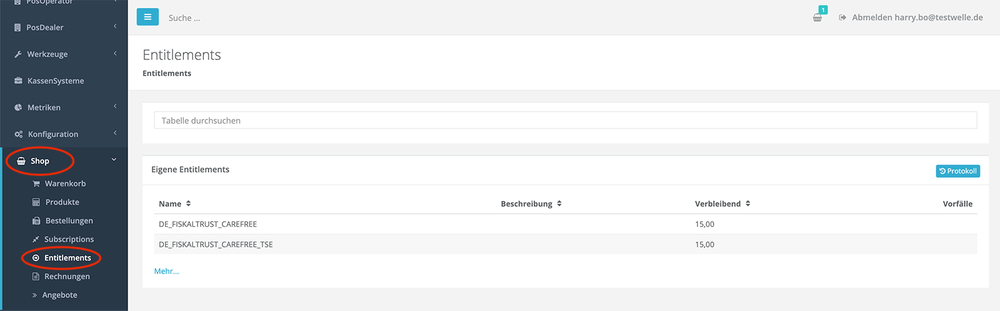
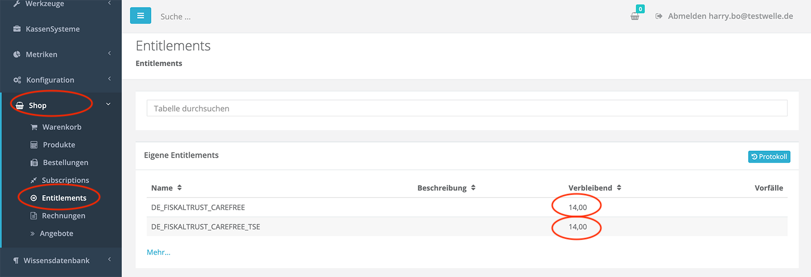
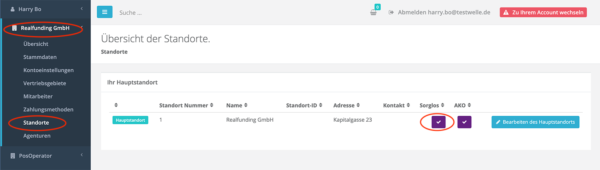

 
<strong>Compliance-As-A-Service for POSSystems</strong>
 
 
<h1>Rollout documentation for Germany</h1>
 

 

## Buying and reselling fiskaltrust products

## Table of contents

<pre>
├── <a href="#einleitung" title="Einleitung">Einleitung</a>
├── <a href="#fiskaltrustshop" title="fiskaltrust.Shop">fiskaltrust.Shop</a>
├── <a href="#rahmenverträge-für-mengenrabatt" title="Rahmenverträge für Mengenrabatt">Rahmenverträge für Mengenrabatt</a>
├── <a href="#produkte-über-entitlements-kaufen" title="fiskaltrust.Shop">Produkte über Entitlements kaufen</a>
├── <a href="#übertragung-gekaufter-entitlements-an-die-kassenbetreiber" title="Übertragung gekaufter Entitlements an die KassenBetreiber">Übertargung gekaufter Entitlements an die KassenBetreiber</a>
├── <a href="#tipps--tricks" title="Tipps & Tricks">Tipps & Tricks</a>
├── <a href="#lieferoptionen-für-hardware-tses" title="Lieferoptionen für Hardware TSEs">Lieferoptionen für Hardware TSEs</a>
├── <a href="#swissbit-cloud-tse-auschecken-und-einrichten" title="Swissbit Cloud TSE auschecken und einrichten">Swissbit Cloud TSE auschecken und einrichten</a>
├── <a href="#fiskaly-cloud-tse-auschecken-und-einrichten" title="Fiskaly Cloud TSE auschecken und einrichten">Fiskaly Cloud TSE auschecken und einrichten</a>

</pre>

## Introduction

In addition to the license-free fiskaltrust.Middleware for POSCreators, fiskaltrust offers fee-based add-on products (which are based on the fiskaltrust.Middleware) and individual products (independent of the fiskaltrust.Middleware) for POSOperators. These fiskaltrust products are exclusively distributed to POSOperators by our POSDealer partners as part of their product or service portfolio. These are archiving products, automated reports to the tax office, technical security equipment (TSE) from various manufacturers and also carefree packages with and without TSE-as-a-Service. 

For a current listing of our products, please refer to our [Product Documentation](https://docs.fiskaltrust.cloud/doc/productdescription-de-doc/for-posdealers/01-produkte/README.html).

As part of the rollout, the POSDealer transfers the products previously acquired from fiskaltrust in the form of entitlements to his POSOperators and activates the products per POSOperator outlet. 

In this chapter, we will go into the associated processes and show how they can be carried out by POSDealers with the help of the fiskaltrust.Portal. In addition, we provide you a [german video](https://www.youtube.com/watch?v=l6IcV7o_LFM&t=8s) with instructions.

## fiskaltrust.Shop

The purchase of fiskaltrust products takes place via the fiskaltrust.Shop. It is part of the fiskaltrust.Portal. In the "Products" area, suitable fiskaltrust products are offered for purchase depending on the [partner role](../README.md#the-different-roles-of-the-fiskaltrust-partners). For POSDealers, these are, in addition to various TSEs, so-called "Händereinkaufsprodukt", which represent entitlements:

## Framework agreements for volume discount

Before purchasing fiskaltrust products, you as a POSDealer should plan your purchase according to your needs, because fiskaltrust grants volume discounts for quantities of 10 or more. As a POSDealer, please contact our sales team at sales@fiskaltrust.de and agree on the purchase quantity with the help of a framework agreement. You will then receive a volume discount and a credit limit release for the fiskaltrust.Shop, so that you can purchase the desired products there at the price agreed in the framework agreement. 

## Buy products via Entitlements

POSDealers do not buy the fiskaltrust products themselves in the fiskaltrust.Portal, but so-called "Entitlements", claims to the products, which they can then transfer to the POSOperators individually and activate for them per outlet. The entitlements are also listed in the fiskaltrust.Shop under the name "Händereinkaufsprodukt".

In the following example, we show you how you as a POSDealer can purchase entitlements in the fiskaltrust.Shop after signing a framework agreement with corresponding volume discounts and after the credit limit approval. 

In the fiskaltrust.portal, go to the menu item "Shop->Products" and place e.g. 15 pieces of the product "fiskaltrust.Sorglos mit TSE Händlereinkaufsprodukt" (entitlement for a carefree package with TSE-as-a-service) in the shopping cart:

In the top bar you will see a shopping cart icon that you can press. A popup will appear. Select "Checkout" here:

Next, the summary of your order will be displayed:

Check the information and the displayed prices. Then press the button: "Binding order". You will receive a confirmation of your order:

You will also receive a corresponding confirmation of the order by email.

You can also view your orders at any time in the "Shop->Orders" section:

You can find the corresponding invoice under "Shop->Invoices".

After the order has been processed by the fiskaltrust system, the Entitlements credited to you will appear in the "Shop->Entitlements" area. In our example, we receive 15 Entitlements for redeeming the Carefree package and 15 Entitlements for redeeming the associated TSE-as-a-Service:

## Transfer of purchased entitlements to the POSOperator

The transfer of the purchased entitlements and the activation of the associated products for the POSOperator is also mapped at fiskaltrust with the help of the shop in the fiskaltrust.portal.

To transfer the previously purchased entitlements to the POSOperator, use the surrogate function in the fiskaltrust.Portal to switch from your account as a POSDealer to the account of the POSOperator. To do this, go to the "POSOperator->Overview" area and search for the POSOperator to whom you want to transfer the entitlement(s):

Now press on the name of the POSOperator, which is displayed in the list as a link (if the name of the POSOperator does not appear here as a link, then he has not yet signed the user agreement). If you click on the link, you will be redirected to the account of the POSOperator. You can recognize this by the fact that a button named "Switch to your account" appears in the upper area on the right and the company name of the POSOperator is now displayed in the menu bar.

Now go to "Shop->Products" in the menu. Here, first select in the upper area the outlet of the POSOperator to which you want to transfer the entitlements and then put the desired "transfer products" in the shopping cart. In our example: "TSE-as-a-Service - Anspruch übertragen" (transfer claim for a TSE-as-a-Service)  and "fiskaltrust.Sorglos - Anspruch übertragen" (transfer claim for the carefree package):

Next, add the "activation products" associated with the claims to the shopping cart for activation at the POSOperator. In this example, we now decide to use a Swissbit USB hardware TSE. In our example, the "activation products": "Swissbit USB Hardware TSE-as-a-Service - aus - Anspruch erzeugen" (activate Swissbit USB TSE-as-a-Service by using the entitlement/claim) and "fiskaltrust.Sorglos Betreiber-Abo - aus Anspruch erzeugen" (activate the carefree package by using the entitlement/claim) are to be added to the shopping cart. Note: Please make sure that the correct outlet is selected in the upper area before adding to the shopping cart.

If desired, you can repeat the steps described above for other outlets and also for other of your POSOperators and add the claims and activations to the shopping cart for them as well:

1. st step: Select location - in outlet doropdown above.
2. nd step: transfer entitlements/claims - (add to shopping cart)
3. rd step: Activate product in the selected outlet - (add to shopping cart).

The 2nd and 3rd step (activate) always refers to the outlet selected above and can no longer be changed after checkout. If the 3rd step is the activation of a hardware TSE, it will be delivered later to the specified outlet of the POSOperator. However, if you as a POSDealer want the hardware TSE to be sent to your own location, please follow the instructions in the chapter [Delivery options for hardware TSEs](#delivery-options-for-hardware-tses).

Important: To check out the shopping cart, **you must** now return to your POSDealer account. To do this, press the "Switch to your account" button in the upper area on the right:

Back in your account you can now see that the previously selected products also appear in your shopping cart:

Press "Checkout" here and then check the shopping cart before submitting the order. Above all, check the correctness of the outlet information. These transfers and activations of products for the POSOperator should of course be free of charge.

Next, you will see the successful order and you will also receive a confirmation email about it. You can view your orders at any time in the "Shop->Orders" area. The corresponding invoices are in the area "Shop->Invoices".

After the order is processed by the fiskaltrust system (can take 2-3 minutes), the used entitlements will be deducted from you. In our example, there are now only 14 left from 15 before.

In addition, we can see in the POSOperator's account that the carefree package has been activated for the outlet previously specified during activation:

## Tips & Tricks

1. In addition to the products for transferring and activating the entitlements per POSOperator outlet, you can also add templates for automatic generation of the required CashBoxes (configuration containers) to the POSOperator shopping cart in the same step. This allows you to optimize the rollout process and you do not have to check out the templates separately. You can use your own templates as well as the default templates provided by fiskaltrust. An example of this can be found below in the chapter [Swissbit Cloud TSE checkout and setup](#swissbit-cloud-tse-checkout-and-setup).

2. If desired, you can also purchase the needed "Händlereinkausprodukte", meaning the entitlements, directly in the account of the POSOperators. Meaning that you can put them in the same shopping cart as (see above) their transfer and activation. In this case, you do not need to "transfer" any more, but you will receive a separate invoice for the entitlement. An example of this can be found below in the chapter [Swissbit Cloud TSE checkout and setup](#swissbit-cloud-tse-checkout-and-setup).

Both tips described above are also detailed in our [video](https://www.youtube.com/watch?v=l6IcV7o_LFM&t=8s).

3. You can save order-templates from orders in the shopping cart to be able to reuse them later. 

## Delivery options for hardware TSEs

As a POSDealer, you can have hardware TSEs delivered either to the POSOperator's outlet or to your own outlet/location. If you follow the process shown in the example above, the activated hardware TSE will be sent to the POSOperator's outlet as selected for activation. 

However, if you want the hardware TSE from the carefree package to be sent to your own outlet instead of the POSOperator's outlet, please activate the hardware TSE from the entitlement/claim in your own account and not in the POSOperator's account.

Referring to the example above, the steps would then be as follows:

Step 1: Go to the fisklatrtust.Shop in your own account and select your own desired outlet in the upper area.
Step 2: In your own account, add the hardware TSE activation product, e.g. the product "Swissbit USB Hardware TSE-as-a-Service - aus Anspruch erzeugen", to the shopping cart - this will ensure that the hardware TSE is sent directly to you.
Step 3: Switch to the account of the POSOperator using the surrogate function (as described above).
Step 4: Go to the fiskaltrust.Shop in the POSOperator's account and select the desired outlet of the POSOperator in the upper area.
Step 5: In the POSOperator's account, transfer the entitlement to the carefree package to the POSOperator, i.e. place the product "fiskaltrust.Sorglos -Anspruch übertragen" in the shopping cart.
Step 6: Activate the carefree package in the account of the POSOperator in the shop, i.e. add the product "fiskaltrust.Sorglos Betreiber-Abo - aus Anspruch erzeugen" to the shopping cart.
Step 7: Switch back to your own account and check out the shopping cart there and place the order.

The difference to the process described in the above chapter is that the entitlement/claim to the hardware TSE is no longer transferred to the POSOperator and activated under his account, but is activated directly in your own account. Thus, the delivery of the hardware TSE from the carefree package is made directly to you as the POSDealer. However, it is important that you continue to transfer the "fiskaltrust.Sorglos" (carefree package) claim to the POSOperator and activate it in the account of the POSOperator for the correct outlet of the POSOperator.

## Swissbit Cloud TSE auschecken und einrichten

In diesem Kapitel möchten wir Ihnen anhand eines Beispiels das Auschecken und Einrichten einer Swissbit Cloud TSE als Bestandteil eines Sorglospakets mit TSE-as-a-Service vorführen. Dabei werden wir als Erweiterung zur oben beschriebenen Vorgehensweise das Erwerben des Anspruchs für das Sorglospaket ("fiskaltrust.Sorglos mit TSE Händlereinkaufsprodukt") direkt im Account des KassenBetreibers vornehmen. Zudem werden wir für die Einrichtung, also für die Erstellung der Cashbox, das für die Swissbit Cloud TSE von fiskaltrust zur Verfügung gestellte Default-Template im selben Warenkorb auschecken. Diese beiden Erweiterungen/Optimierungen sind auch im Kapitel [Tipps & Tricks](#tipps--tricks) beschrieben.

Loggen Sie sich in Ihren KassenHändler Account ein und wechseln Sie im ersten Schritt mit Hilfe der surrogate Funktion in den Account des KassenBetreiber. Suchen Sie dazu unter dem Menüpunkt "POSOperator->Übersicht" den KassenBetreiber für den Sie die Swissbit Cloud TSE auschecken und einrichten möchten:

Drücken Sie nun auf den Namen des KassenBetreibers, der in der Liste als Link dargestellt wird (sollte hier der Name des KassenBetreibers nicht als Link erscheinen, dann hat er die Nutzungsvereinbarung noch nicht unterschrieben). Dadurch werden Sie zu dem Account des KassenBetreibers weitergeleitet. Das erkennen Sie daran, dass im oberen Bereich rechts ein Button Namens "Zu Ihrem Account wechseln" erscheint und zudem in der Menüleiste nun der Firmenname es KassenBetreibers angezeigt wird.

Drücken Sie nun hier im Account des KassenBetreiber auf den Menüpunkt: "Shop->Produkte". Wählen Sie zuerst im oberen Bereich den gewünschten Standort des KassenBetreibers aus.

Legen Sie als Nächstes folgende Produkte in den Warenkorb:

- fiskaltrust.Sorglos mit TSE Händlereinkaufsprodukt
- Swissbit Cloud TSE-as-a-Service - aus - Anspruch erzeugen
- fiskaltrust.Sorglos Betreiber-Abo - aus Anspruch erzeugen
- fiskaltrust.Middleware mit Swissbit Cloud TSE (das ist das fiskaltrust Template zum Erstellen der Cashbox)

Wichtig: Um den zusammengestellten Warenkorb auszuchecken, **müssen** Sie nun in Ihren KassenHändler Account zurückkehren. Drücken Sie hierzu den "Zu Ihrem Account wechseln" Knopf im oberen Bereich rechts:

Zurück in Ihrem Account können sie nun sehen, dass die zuvor gewählten Produkte ebenfalls in Ihrem Warenkorb erscheinen:

Drücken Sie hier auf "Checkout" und überprüfen Sie dann den Warenkorb bevor Sie die Bestellung abschicken. Überprüfen Sie vor allem die Richtigkeit der Standortangaben.

Als Nächstes wird Ihnen die erfolgreiche Bestellung angezeigt und Sie erhalten auch eine Bestätigung per Email dazu. Ihre Bestellungen können Sie jederzeit im Bereich "Shop->Bestellungen" einsehen. Die dazugehörigen Rechnungen befinden sich im Bereich "Shop->Rechnungen"

Nach der Bearbeitung der Bestellung durch das fiskaltrust System (kann 2-3 Minuten dauern) können Sie im Account des KassenBetreibers sehen, dass das zuvor bestellte Sorglospaket im Standort des KassenBetreibers aktiviert wurde. Wechseln Sie dafür mit Hilfe der surrogation Funktion in den Account des KassenBetreibers und gehen Sie im Menü auf "[Firmenname] -> Standorte":

Zudem wurde die CashBox ebenfalls angelegt, weil wir davor das Template in den Warenkorb gelegt haben und ausgescheckt haben. Um dies zu Überprüfen, gehen Sie im Menü auf "Konfiguration -> Cashbox":

Damit ist die Cashbox für die Swissbit-Cloud TSE eingerichtet. Sie können nun den gewünschten Launcher downloaden und starten, er verwendet zur Konfiguration die zuvor angelegte Cashbox für die Swissbit Cloud TSE.

## Fiskaly Cloud TSE auschecken und einrichten

Der Vorgang zum Auschecken und Einrichten einer Fiskaly Cloud TSE ist analog zu dem oben im Kapitel [Swissbit Cloud TSE auschecken und einrichten](#swissbit-cloud-tse-auschecken-und-einrichten) beschrieben Vorgang. Der Unterschied ist nur, dass Sie hierbei die Fiskaly Cloud TSE statt der Swissbit Cloud TSE beziehen und einrichten. Legen Sie dazu statt dem Produkt "Swissbit Cloud TSE-as-a-Service - aus - Anspruch erzeugen" das Produkt "Fisklay Cloud TSE-as-a-Service - aus - Anspruch erzeugen" in den Warenkorb. Legen Sie zudem statt dem Template-Produkt "fiskaltrust.Middleware mit Swissbit Cloud TSE" das Template-Produkt "fiskaltrust.Middleware mit Fiskaly Cloud TSE" in den Warenkorb. Ansonsten ist die Vorgehensweise identisch mit der oben beschriebenen für die Swissbit Cloud TSE.
