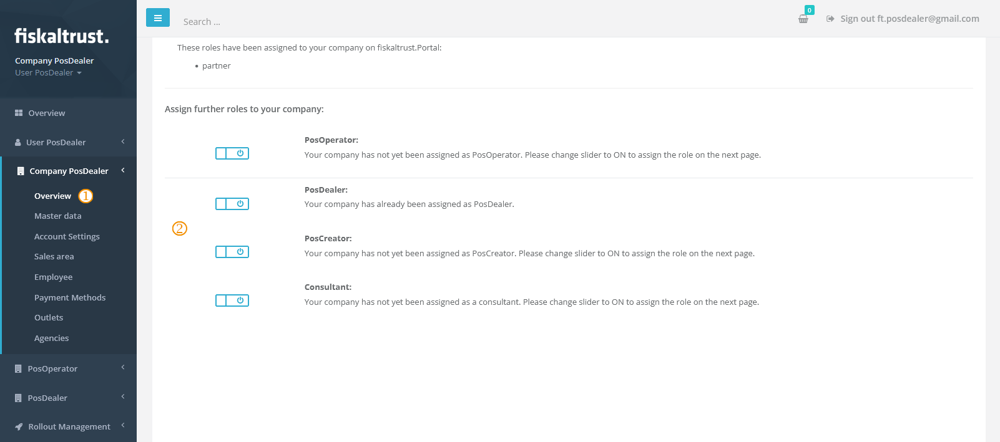
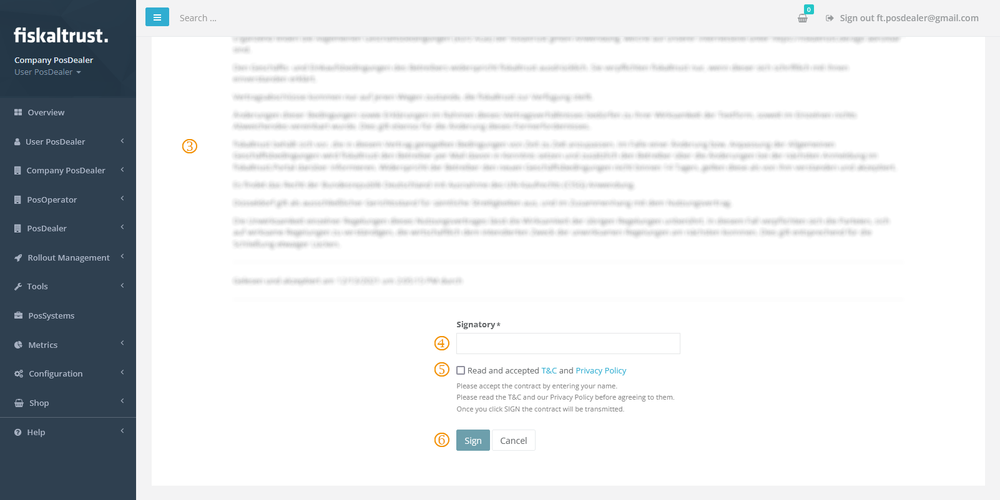
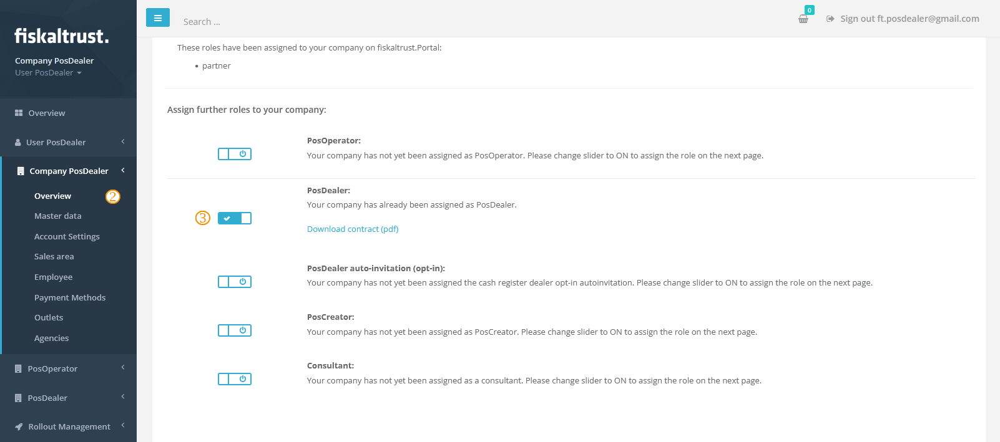
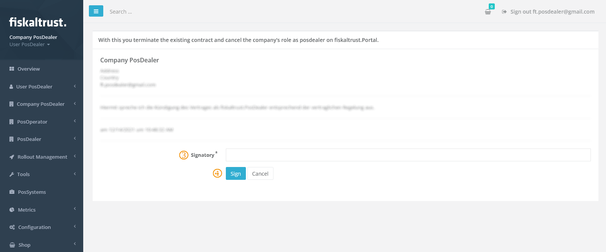

:::info summary

After reading, you can activate or deactivate appropriate roles for customers and explain their effects.

:::

## Introduction

*fiskaltrust* distinguishes between four principal **company roles** in the portal context and its role management.

       | **PosOperator** This role is for **end-users of POS Systems** who manage their POS receipts in the context of the services of *fiskaltrust*. They purchased the POS platform from their *PosDealer* and operate the POS System.  *Accounts with this role use the portal primarily to access their fiscal data and perform maintenance steps not covered by their PosDealer.* |
|             | **PosDealer** This role is for **POS System distributors** who sell POS Systems to *PosOperators* and support and maintain these setups.  *Accounts with this role use the portal primarily to act on behalf of their PosOperators. The PosDealers Role includes invitation management, a credit limit, rollouts of CashBox setups and maintenance for PosOperators.* |
|  | **PosDealer auto-invitation** (Germany-only) This is an *optional* add-on role for **German POS System distributors** who wish to automate the onboarding of their customers/operators as much as possible.  *Accounts with this role will have an extended onboarding user interface, allowing them to fully and legally activate an operator's account, as opposed to a regular invitation the operator first has to accept.*  **Please note that this role is only available on the German market and may require particular attention to legal aspects on your side.** |
|             | **PosCreator** This role is for **POS System manufacturers** who develop the respective POS software. They are not primarily involved in rollouts or deployments but focus on the **technical integration** of the Middleware.  *Accounts with this role use the portal primarily to set up their POS System definitions within the portal, create test configurations, and invite associated PosDealers.* |
|             | **Consultant** This role is for **tax consultants** who advise *PosOperators* on related topics.  *Accounts with this role use the portal primarily to access fiscal data of the associated (and authorized) operator accounts.* |

 

:::caution

While you can select more than one role, please **only pick roles applicable to your business case** and no others, as each role entails different contractual requirements and obligations.

:::

 

## How to activate a role

The following steps will activate a new role for your account.

|             Step             | Description                                                  |
| :--------------------------: | ------------------------------------------------------------ |
|  | Open your **company profile page** from `[COMPANYNAME]` / `Overview` in the left-hand navigation menu |
|  | **Set the slider** of the role you'd like to activate from right  to left  |

After enabling the switch, a new page will load where you need to sign the respective agreement.

|             Step             | Description                                                  |
| :--------------------------: | ------------------------------------------------------------ |
|  | Read the **agreement**                                       |
|  | Enter your **legal name** in the signature field at the bottom of the page |
|  | Check the box that you read and accepted the **terms and conditions** |
|  | **Click** the `Sign` button                                  |

**Done**, the selected role is active for your account. You'll also receive an additional E-Mail confirming the activation of that role.  

## How to deactivate a role

The following steps will deactivate an existing role of your account.

|             Step             | Description                                                  |
| :--------------------------: | ------------------------------------------------------------ |
|  | Open your **company profile page** from `[COMPANYNAME]` / `Overview` in the left-hand navigation menu |
|  | **Switch the slider** of the role you'd like to deactivate from left  to right  |

After disabling the switch, a new page will load where you must confirm the step.

|             Step             | Description                                                  |
| :--------------------------: | ------------------------------------------------------------ |
|  | Enter your **legal name** in the signature box at the bottom of the page |
|  | **Click** the `Sign` button                                  |

**Done**, the selected role is inactive for your account. You'll also receive an additional E-Mail confirming the deactivation of that role.