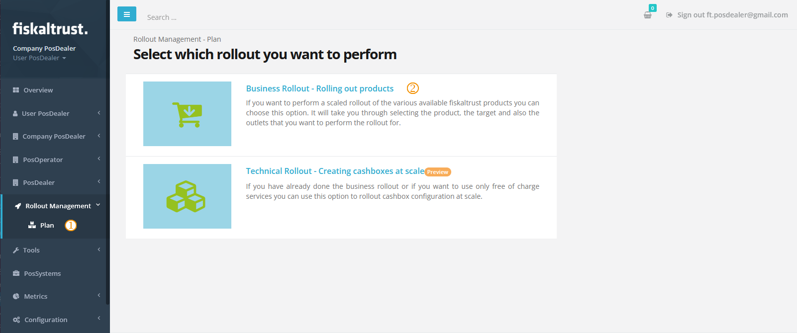
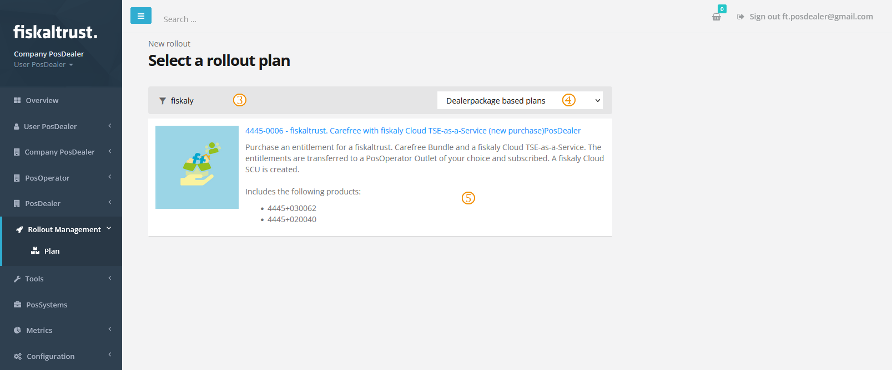
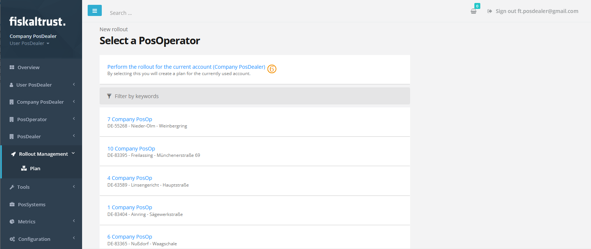
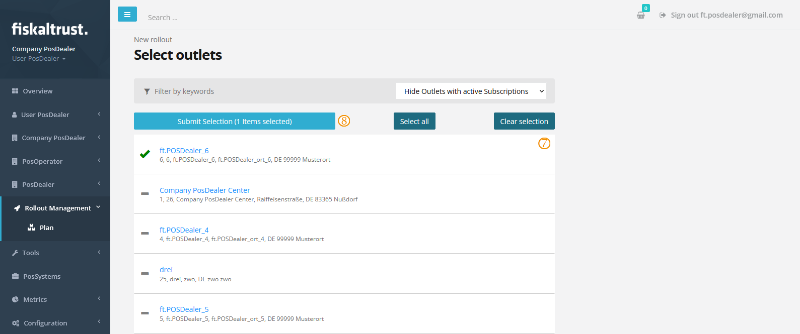
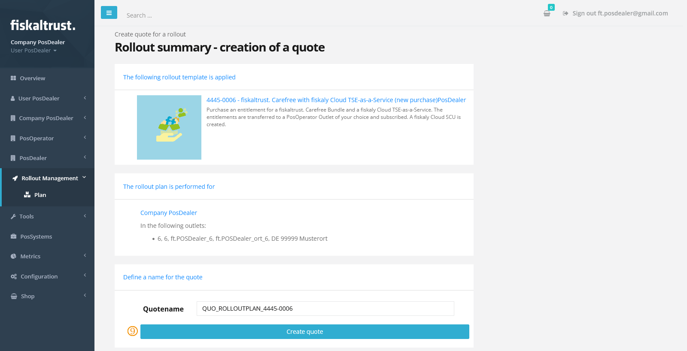
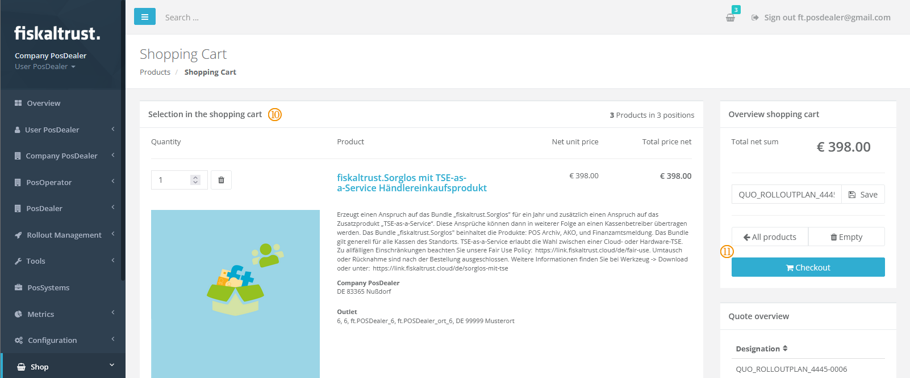
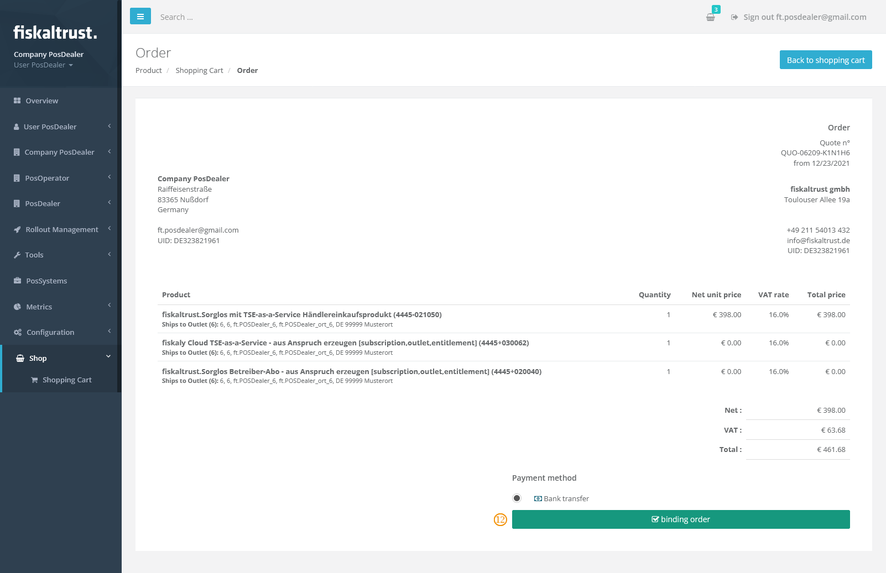

|             Step             | Description                                                  |
| :--------------------------: | ------------------------------------------------------------ |
|  | Open your the rollout management plan page from `Rollout Management` / `Plan` in the left-hand navigation menu |
|  | Select `Business Rollout - Rolling out products`             |

|             Step             | Description                                      |
| :--------------------------: | ------------------------------------------------ |
|  | Filter for `fiskaly` in the search field         |
|  | Limit the entries to `Dealerpackage based plans` |
|  | Select plan **4445-0006**                        |

|             Step             | Description                                          |
| :--------------------------: | ---------------------------------------------------- |
|  | Select `Perform the rollout for the current account` |

|             Step             | Description                                                  |
| :--------------------------: | ------------------------------------------------------------ |
|  | Tick the desired outlet where you would like to roll out the Middleware |
|  | Click `Submit Selection`                                     |

|             Step             | Description          |
| :--------------------------: | -------------------- |
|  | Click `Create quote` |

Creating the quote can take a few seconds. Once it is ready, the button will change to `Load quote into cart`. Click the button again to place the quote into your shopping cart. This will redirect you to the shopping cart page.

|             Step              | Description                                                  |
| :---------------------------: | ------------------------------------------------------------ |
|  | Verify that the items in your shopping cart match the selected products  \* 1 TSE-as-a-Service fiskaltrust.Sorglos entitlement \* 1 entitlement-based fiskaly TSE \* 1 entitlement-based fiskaltrust.Sorglos bundle |
|  | Click `Checkout`                                             |

|             Step              | Description                                 |
| :---------------------------: | ------------------------------------------- |
|  | Click `binding order` to complete the order |

At this point should have the order listed under `Shop` / `Orders`. Finishing the order can take a couple of minutes, but once it has been  completed there should be the following items active in your account

- two **demo subscriptions**, for Carefree and TSE-as-a-Service, under `Shop` / `Subscriptions`
- a **fiskaly TSE** for the selected outlet under `Configuration` / `Signature Creation Unit`