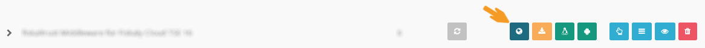

# My First Cashbox

:::info summary

After reading this, you have completed all necessary steps to create a CashBox and have a functioning Middleware instance.

:::

:::danger 🇦🇹 austria

This tutorial, unfortunately, is **not yet applicable to the Austrian market**.

:::

## Prerequisites

The following prerequisites must be first in place before we can roll out our Middleware instance

* A working **Internet connection** (_please see [Network Requirements](../technical-operations/middleware/network-requirements.md)_)
* An active _fiskaltrust_ **PosDealer account** (*either by [registration](registration.md) or by invitation through your PosCreator*)
* A system meeting the hardware and software **[requirements](../technical-operations/middleware/supported-environments.md)** (*in this tutorial we focus on rollouts on Windows*)
* Any **SSCD components** (*hardware or SaaS credentials*) required for the setup, unless created during the setup itself

## Rollout Plans

[Rollout plans](../buy-resell/rollout-plans.md) are guided **deployment wizards** in the portal, which assist you in **setting up CashBoxes** and their components for your PosOperators. A rollout plan typically follows these five steps

1. Select the **product** you'd like to roll out
2. Select the **account** for which it should be rolled out
3. Select one or more **account outlets** where the product should be rolled out
4. Create a **quote** and load the quote into your **shopping cart**
5. Perform the **checkout**

:::tip

Being a demo CashBox, these steps are best performed in the [Sandbox](sandbox.md) as this ensures your account is not going to be billed for this test setup.

Please make sure you are using your Sandbox account in this case. If you don't have one yet, please contact your *PosCreator* for invitation details or [register](registration.md) a new dedicated PosDealer Sandbox account yourself.

:::

import Tabs from '@theme/Tabs';
import TabItem from '@theme/TabItem';

### Business Rollout (getting the SCU)

As first step, we will be running a *Business* rollout which will create for us all the necessary backend components for the CashBox.

import BusinessRolloutFR from '../_markets/fr/getting-started/my-first-cashbox/_business.mdx';
import BusinessRolloutDE from '../_markets/de/getting-started/my-first-cashbox/_business.mdx';

<Tabs groupId="market">

  <TabItem value="FR" label="France">
    <BusinessRolloutFR />
  </TabItem>

  <TabItem value="DE" label="Germany">
    <BusinessRolloutDE />
  </TabItem>

</Tabs>

### Technical Rollout (creating the CashBox)

The second step is the *Technical* rollout which will use a [template](../technical-operations/rollout-automation/templates.md) to create a new CashBox and a new Queue. On top of that, it will also link the previously created SCU (*from the Business rollout*) to the new Queue.

import TechnicalRolloutFR from '../_markets/fr/getting-started/my-first-cashbox/_technical.mdx';
import TechnicalRolloutDE from '../_markets/de/getting-started/my-first-cashbox/_technical.mdx';

<Tabs groupId="market">

  <TabItem value="FR" label="France">
    <TechnicalRolloutFR />
  </TabItem>

  <TabItem value="DE" label="Germany">
    <TechnicalRolloutDE />
  </TabItem>

</Tabs>

## Deploying the CashBox

You should now have a working CashBox and be able to download its package and deploy it on your machine.

### Download

To download the Middleware package for your newly created CashBox, go to your list of CashBoxes in the portal (at `Configuration` / `CashBox`) and click the download button for the *Online Launcher*.

This assembles the appropriate binary packages for your CashBox and may take a couple of seconds. Once your browser prompts you for the file download, save the file to your hard disk.

### Deployment

Unzip the archive you just downloaded into the directory where you'd like to deploy the Middleware. Once that is complete you can start your Middleware instance with the test script `test.cmd` (_please make sure to launch it with **administrative privileges**_).

For a proper service installation, please refer to the chapter [Deployment](../technical-operations/middleware/deployment.md).

:::info

As we downloaded the online launcher the archive only comes with the launcher stub and the Middleware will fetch all additionally required packages upon the first start. This may delay the first start by a couple of seconds.

:::

## Running a test request

Once the Middleware has been deployed and started, it is advisable to perform a quick check if the Middleware is generally available on the network and responds to requests.

For that purpose, the Middleware features an echo/ping request type which responds back with the data it received. If you successfully get a response, the Middleware should be ready to receive your signing requests as well.

:::tip postman collection

For Postman, you can download a request collection from the [Github repository](https://github.com/fiskaltrust/middleware-demo-postman).

:::

### Request details

import EchoFR from '../_markets/fr/getting-started/my-first-cashbox/_echo.mdx';
import EchoDE from '../_markets/de/getting-started/my-first-cashbox/_echo.mdx';

<Tabs groupId="market">

  <TabItem value="FR" label="France">
    <EchoFR />
  </TabItem>

  <TabItem value="DE" label="Germany">
    <EchoDE />
  </TabItem>

</Tabs>