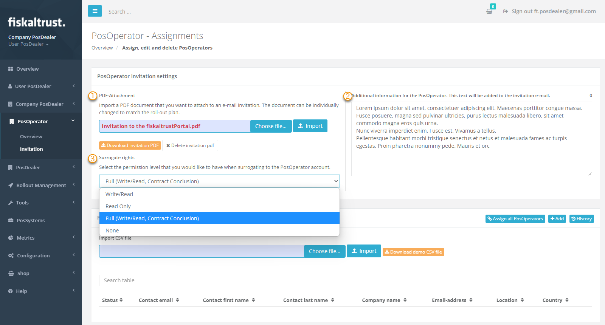
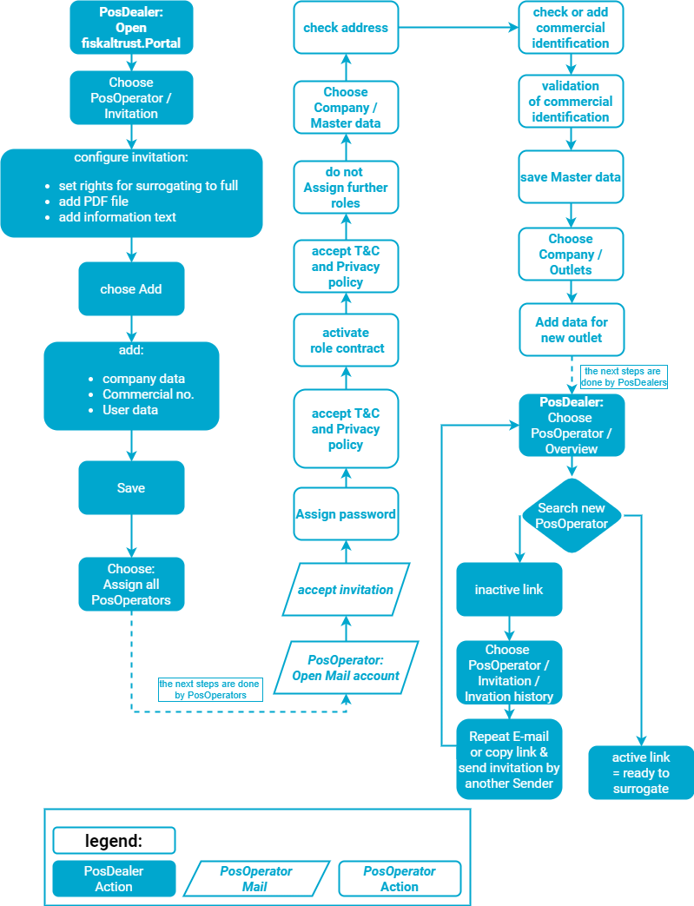
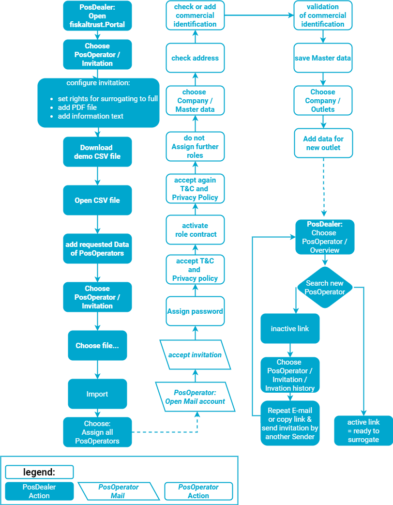
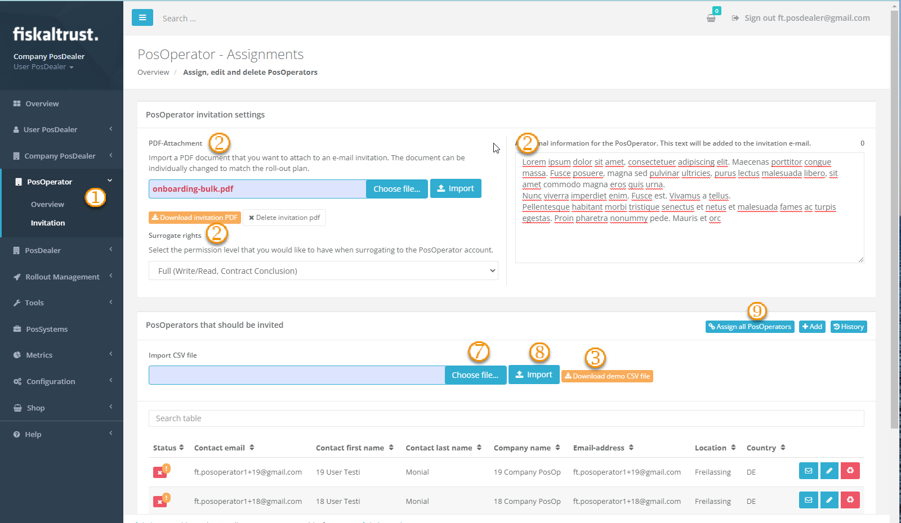
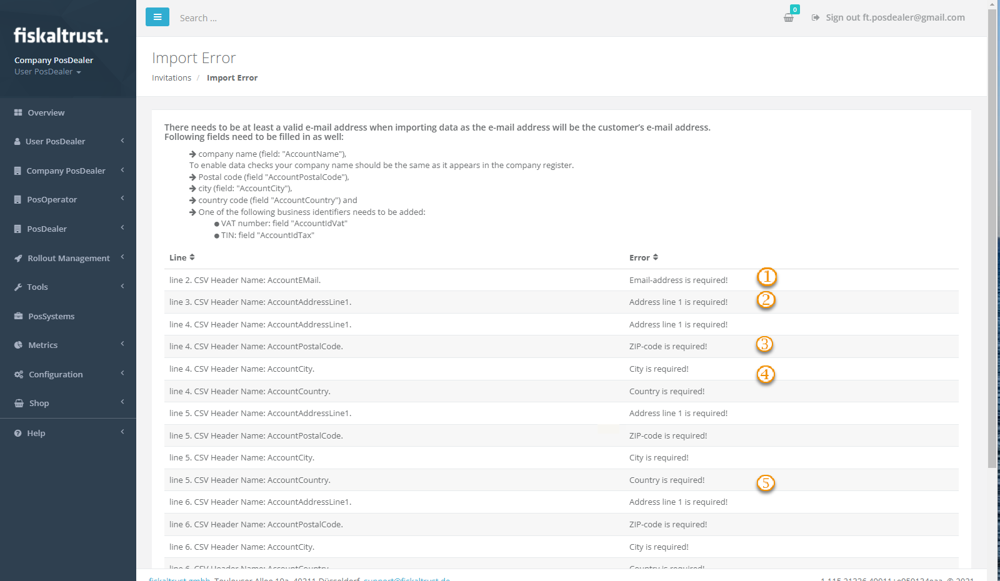
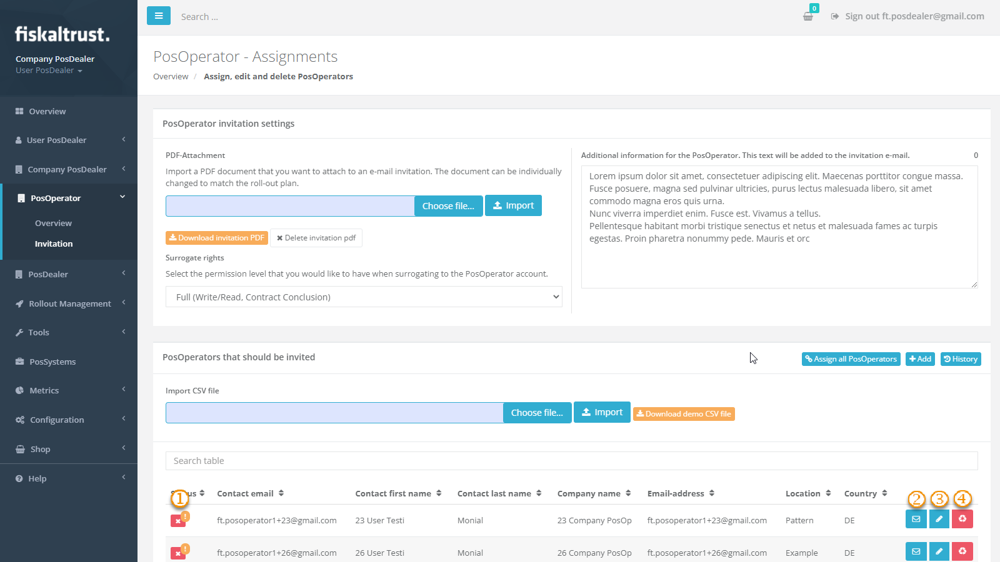
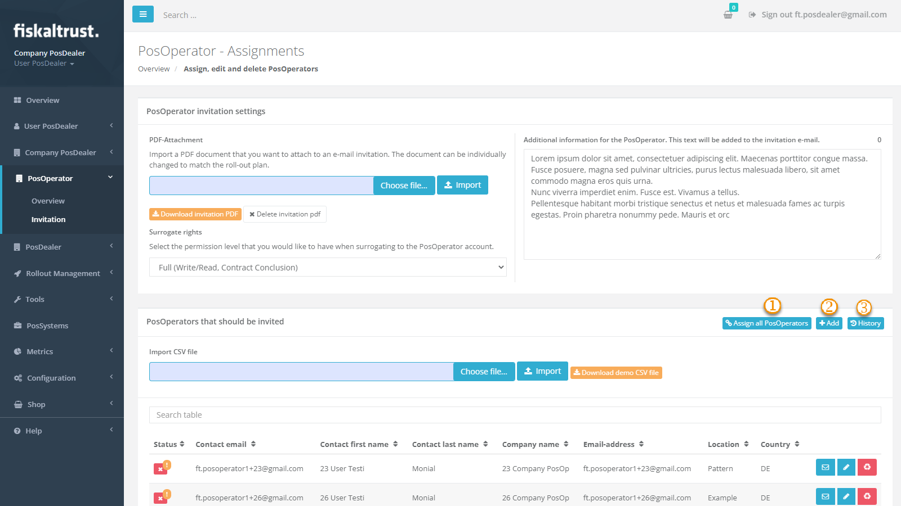
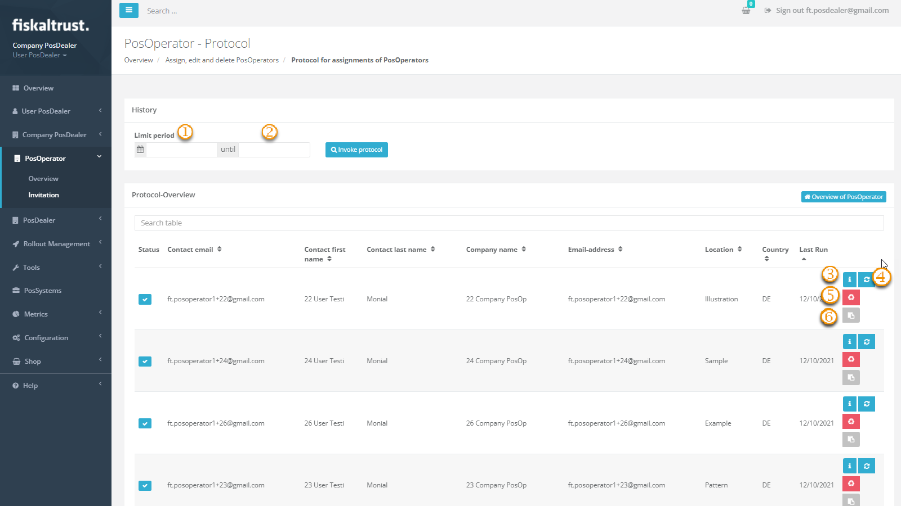

# Invitation process

:::info summary
After reading this, you can invite a single PosOperator and perform a bulk operation to invite several PosOperators.
:::

You as a PosDealer can do the invitation of a PosOperator only, this can not be made by a PosCreator or consultant.
However, the role of a PosDealer can also be activated by these parties and thus be assumed in parallel with another role. If you are in doubt,  
please refer to [Company Roles](../company-roles.md)

## Preparation of Invitations

There are two ways to add and assign PosOperators to your Account as a PosDealer:
1. Choose `PosOperator` / `Overview`.  
2. A list of the already assigned PosOperators is shown.  
3. With `PosOperator` / `Invitation` you will find options to add PosOperators.  
4. For adding a single PosOperator, finish reading this chapter and see afterwards [_Invitation of a single PosOperator_](#invitation-of-a-single-posoperator).
5. For adding several PosOperators, finish reading this chapter and change then to [_Invitation of PosOperators_](#bulk-invitation-of-posoperators).
6.  Checking or changing the settings for the invitations is **inevitable for both ways**. Therefore, regardless of the further way, prepare the settings first.  To do this, select `PosOperator` / `Invitation`.  
  
7. Control or change the settings for the invitation:  

| options | description                                                                                                                |
|:----------------------:|-------------------------------------------------------------------------------------------------------------------------------------|
|| PDF-Attachment: Avoid confusing your PosOperators when they receive an E-mail invitation from an expectable unknown source like sandbox@fiskaltrust.TLD or robot@fiskaltrust.TLD. Explain in an accompanying letter that you as PosDealer are extending your offers and invite your PosOperators to register with the fiskaltrust.Portal via the confirmation link. With `Choose file...`and `Import` your document will be added as an attachment to the invitation.  |
|| add information text:  The automated E-mail invitation to your PosOperator from an source like like sandbox@fiskaltrust.topleveldomain or robot@fiskaltrust.TLD can be supplemented with your text. Use this text block up to a maximum of 400 characters to inform your PosOperators personally. Explain that you as PosDealer extend your offers and invite your PosOperators to register with the fiskaltrust.Portal via the confirmation link.  |
|| Surrogate rights:  Set the rights you should have as PosDealer after switching to the PosOperator's account to `FULL`. Otherwise, you would have access to the PosOperator's account, but you would not be able to conclude contracts on his behalf. But these are necessary for the cooperation with third parties.  |

## Invitation of a single PosOperator

### Overview individual invitation

  

### Explanation individual invitation

The single invitation is particularly interesting for the on-site support that you  as a PosDealer give, if a PosOperator wants to use the fiskaltrust.Services immediately - in connection with the commissioning of a POS-System. Further, you may want to learn about and test the portal and its processes in the sandbox. The invitation of a single PosOperator is also useful here.

### Work steps individual invitation

1. Choose `PosOperator` / `Invitation`
2. Check the settings previously described [_here_](#preparation-of-invitations).
3. Choose `Add`

4. The following fields are mandatory fields. They must be filled in to guarantee that the PosOperator can be found correctly in the fiskaltrust.Portal via his E-mail address and can be assigned:
    * Company data - Company name
    * E-mail address
    * Address line 1
    * Postal code
    * City
    * Country
    * User data - First name
    * Last name
    * Contact E-mail address
5. The commercial identification is no mandatory field for the invitation.  
But for the correct management of the cash register systems, these data (AccountIdVat, ~IdGln, ~UStIdNr) and their validation are essential.
6. Save your values with `Save` 
7. Choose `Assign all PosOperators`
8. If the invitation does not reach the PosOperator, please read the chapter [_Managing the invitations_](#managing-the-invitations)

### Preview of the E-mail invitation 

import Tabs from '@theme/Tabs';
import TabItem from '@theme/TabItem';
import PreviewAT from '../../_markets/at/getting-started/operator-onboarding/invitation-process/_preview-email.mdx';
import PreviewFR from '../../_markets/fr/getting-started/operator-onboarding/invitation-process/_preview-email.mdx';
import PreviewDE from '../../_markets/de/getting-started/operator-onboarding/invitation-process/_preview-email.mdx';

<Tabs groupId="market">

  <TabItem value="AT" label="Austria">
    <PreviewAT />
  </TabItem>

  <TabItem value="FR" label="France">
    <PreviewFR />
  </TabItem>

  <TabItem value="DE" label="Germany">
    <PreviewDE />
  </TabItem>

</Tabs>

## Bulk invitation of PosOperators

### Overview bulk process

  

### Explanation bulk process

Inviting PosOperators to a PosDealer account with an import file is especially interesting if you want to invite a larger number of business partners. Since the invitations are created and sent automatically via the fiskaltrust.portal, the information of your business partners is relevant. Therefore, please note the section on preparation to avoid irritation, loss of time or effort due to invitations mistakenly treated as SPAM. The necessary structure of the CSV file is described using an example. This example can be obtained in the fiskaltrust.Portal. 

### Work steps bulk process

  

| steps | description                                                                                                                |
|:----------------------:|-------------------------------------------------------------------------------------------------------------------------------------|
| |Choose the fiskaltrust.Portal and `PosOperator` / `Invitation`|
| |Check the configurations of the invitations as previously described [_here_](#preparation-of-invitations) |
| |Use `Download demo CSV file`.  |
| |Open the the demo CSV file.  |
| |See the explanations [_below_](#fields-of-the-csv-file), add the requested data of the PosOperators and save the date as a CSV file.  |
| |Change  again to the fiskaltrust.Portal and choose `PosOperator` / `Invitation`.|
| |In the section named `PosOperators that should be invited` use `Choose file...` to set your CSV file.  |
| |With `Import` the data are uploaded and analyzed to avoid duplicate or incomplete records. You can control or add data to each record.  |
| |Choose `Assign all PosOperators` to send the invitation-E-mail to each business partner in your CSV file.  For a preview to the sent E-mails refer [here](#preview-of-the-e-mail-invitation)  |
 
### Fields of the CSV file

import FieldsAT from '../../_markets/at/getting-started/operator-onboarding/invitation-process/_fields-details.mdx';
import FieldsFR from '../../_markets/fr/getting-started/operator-onboarding/invitation-process/_fields-details.mdx';
import FieldsDE from '../../_markets/de/getting-started/operator-onboarding/invitation-process/_fields-details.mdx';

<Tabs groupId="market">

  <TabItem value="AT" label="Austria">
    <FieldsAT />
  </TabItem>

  <TabItem value="FR" label="France">
    <FieldsFR />
  </TabItem>

  <TabItem value="DE" label="Germany">
    <FieldsDE />
  </TabItem>

</Tabs>

### Handling error messages

* If not all of the mandatory fields of the csv file are completed, error messages with the wrong or missing data are shown.
* Please note the error messages and add the necessary data in the respective lines of the CSV file 

| messages | description                                                                                                                |
|:----------------------:|-------------------------------------------------------------------------------------------------------------------------------------|
| |Email-address is required! |
| |Address line 1 is required! |
| |ZIP-code is required!  |
| |City is required!  |
| |Country is required!  |

## Managing the invitations

### Explanation 

If the preparations are done, the invitation process should work automatized. However, if problems arise, you can fix the most of them on yourself. Have a look at the protocol of invitations, if a PosOperator claims, that there was no E-mail invitation for him.  
There a several ways to help.

### Troubleshooting 

| steps | description                                                                                                                |
|:----------------------:|-------------------------------------------------------------------------------------------------------------------------------------|
| |Check the status  of the invitation. A red symbol shows, that the E-mail invitation has not yet been sent.|
| |Use `Assign` to send / resend this single E-mail invitation or `Assign all PosOperators` to send all.|
| |With `Edit` you can open a screen to edit the data of the PosOperator, if they are not correct or complete and can not be assigned to the PosDealers account.|
| |Use `Delete` to remove the data of a not yet assigned PosOperator.|

### Assigning PosOperators in a bulk process

| steps | description                                                                                                                |
|:----------------------:|-------------------------------------------------------------------------------------------------------------------------------------|
| |By clicking on `Assign all PosOperator users` the E-mail invitation can be sent to **all**  PosOperators who have not yet been invited.  |
| |`+Add` is used for a manual invitation, see chapter [_Invitation of a single PosOperator_](#invitation-of-a-single-posoperator). |
| |Choose `History` for control or also repair of E-mail invitations.|

### Options with invited PosOperators

After choosing `PosOperator` / `Invitation`
 / `History` the Protocol for assignments of PosOperators offers you several features:

| options | description                                                                                                                |
|:----------------------:|-------------------------------------------------------------------------------------------------------------------------------------|
| |The start date of the log overview can be restricted using this field.    |
| |The last date of the log overview can be restricted using this field. Start the search with `Invoke protocol`. If the two fields are empty, the whole protocol without any filter is shown. Entering a text filters at `Search table` reduces the overview. By deleting all entered data in the search field the whole overview data is shown.   |
| |Check the details of the data of a PosOperator.    |
| |Resend the E-mail invitation for this data record.    |
| |Delete the data record. Please note that once an email address has been assigned, it cannot be completely deleted for fiscal reasons. Therefore, it cannot be assigned to any other account in fiskaltrust.Portal.   |
| |Shows a window with the direct link for the invitation. You can copy that link and send it to your PosOperator by direct message.      |

Return to the Invitation module with [Overview of PosOperator].
