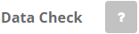
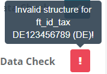

# Master Data

:::info summary
After reading this, you can keep your and the PosOperators Master data up-to-date and explain why that is important.
:::

## Introduction

The Master data of a company in the fiskaltrust.Portal are essential for various reasons:  

* Complete and verified Master data are fundamental for the accounting between fiskaltrust and you as PosDealer - this way you can use all options of the fiskaltrust.portal faster and more comprehensively.

* Accurate and validated Master data are essential for the accounting between you as PosDealer and your PosOperators in the fiskaltrust.portal - with correct data you avoid queries and additional effort.

* Various signing products require a tax registration number  - this is the only way to achieve compliance. 

* Complete Master data also contained fiscal registration numbers - these are used for authentication towards fiscal authorities or third-party services.  

Therefore, it is essential to check the completeness of Master data in the fiskaltrust.Portal. Country-specific check mechanisms are also available for checking the data entered.
Such check mechanisms check, depending on the legal situation and the technical equipment of the fiscal administration, whether an entered value meets the formal requirements.   
Under country-specific circumstances, when a PosOperator is first registered, the other Master data can be retrieved from the relevant authority and checked by entering a tax number.

After logging on to the fiskaltrust.Portal, as a PosDealer, you should check the completeness and use the available checking mechanisms.

The information about the user at `[USERNAME]` / `Data` is only essential for using the fiskaltrust.Portal. For data protection reasons, fictitious names or function designations can also be used instead of accurate data (like _fiscalizing_).  
But the E-Mail address must be a real, working one because you use this address for login to the fiskaltrust.Portal. You can avoid using real names using functional designations (like fiscalizing@PosOperator.TLD).

For PosOperators, it is equally essential to check the Master data for completeness and correctness. 

To illustrate the processes of checking and validating Master data, we show the procedure for checking your Master data in detail.  
Having this and the import of PosOperators done, you use surrogating to change into the account of your PosOperators. Please refer to the section [Surrogating](surrogating.md) to check the Master data for completeness and correctness.

### Work steps to check Master data

import Tabs from '@theme/Tabs';
import TabItem from '@theme/TabItem';
import PreviewAT from '../../_markets/at/getting-started/operator-onboarding/master-data/_edit-master.mdx';
import PreviewFR from '../../_markets/fr/getting-started/operator-onboarding/master-data/_edit-master.mdx';
import PreviewDE from '../../_markets/de/getting-started/operator-onboarding/master-data/_edit-master.mdx';

<Tabs groupId="market">

  <TabItem value="AT" label="Austria">
    <PreviewAT />
  </TabItem>

  <TabItem value="FR" label="France">
    <PreviewFR />
  </TabItem>

  <TabItem value="DE" label="Germany">
    <PreviewDE />
  </TabItem>

</Tabs>

| Steps | Description                                                                                                                |
|:---------------------------:|--------------------------------------------------------------------------------------------------------------------------------|
| |Enter the fiskaltrust.Portal and choose `[COMPANY NAME]` / `Master data`  |
| |Check the fields marked with * for correct and complete data.  |
| |Check the values for commercial identification using the explanations arranged below the data fields. Observe the notes on notation, such as the number of digits and the omission of spaces. Also, note the information on whether one or more dates are required, as this varies from country to country.  |
| |Then check the entered values with the `Data Check` on the right of the data fields.  |

| data check results | options                                                                                                                |
|:----------------------:|-------------------------------------------------------------------------------------------------------------------------------------|
| |This symbol represents an unchecked value in the data field.  |
| |This symbol stands for invalid values. Hover with your mouse over the symbol and note the description. Change the values accordingly and repeat the data check. |
| |This symbol validates the value in the data field. Please note that this is no protection from using duplicates.|

### Add or check outlets

import OutletAT from '../../_markets/at/getting-started/operator-onboarding/master-data/_checking-outlets.mdx';
import OutletFR from '../../_markets/fr/getting-started/operator-onboarding/master-data/_checking-outlets.mdx';
import OutletDE from '../../_markets/de/getting-started/operator-onboarding/master-data/_checking-outlets.mdx';

<Tabs groupId="market">

  <TabItem value="AT" label="Austria">
    <OutletAT />
  </TabItem>

  <TabItem value="FR" label="France">
    <OutletFR />
  </TabItem>

  <TabItem value="DE" label="Germany">
    <OutletDE />
  </TabItem>

</Tabs>

| Steps | Description                                                                                                                |
|:---------------------------:|--------------------------------------------------------------------------------------------------------------------------------|
| |Choose `[COMPANY NAME]` / `Outlets` and control the existing values. |
| |If several outlets are missing, use `Download demo CSV file`.  |
| |Open the CSV file, add the desired values and save it. Change back to the fiskaltrust.Portal / `[COMPANY NAME]`/ `Outlet` and `Choose file`. |
| |With `Import`, the data is checked and listed in `Bulk import of Outlets`, where you choose `Proceed with valid outlets`.  |
| |If only a single outlet is missing, choose `+Add new Outlet`.  |
| |Please note that `Edit Primary Outlet` changes the address values that you have previously checked under `[COMPANY NAME]` / `Master data`.  |
| |For changes to the data of an outlet, select `Edit`.|

### Edit outlets

import EditOutletAT from '../../_markets/at/getting-started/operator-onboarding/master-data/_edit-outlet.mdx';
import EditOutletFR from '../../_markets/fr/getting-started/operator-onboarding/master-data/_edit-outlet.mdx';
import EditOutletDE from '../../_markets/de/getting-started/operator-onboarding/master-data/_edit-outlet.mdx';

<Tabs groupId="market">

  <TabItem value="AT" label="Austria">
    <EditOutletAT />
  </TabItem>

  <TabItem value="FR" label="France">
    <EditOutletFR />
  </TabItem>

  <TabItem value="DE" label="Germany">
    <EditOutletDE />
  </TabItem>

</Tabs>

| Steps | Description                                                                                                                |
|:---------------------------:|--------------------------------------------------------------------------------------------------------------------------------|
|...|Choose `[COMPANY NAME]` / `Outlets` and select `Edit` to control or edit the values of the chosen outlet. |
| |Address data are relevant for the automated invoice generation between PosDealer and PosOperators and for the digital receipt.  |
| |You can set the `Outlet number` if you create the outlet manually, but you cannot change it afterward. |
| |With `Select Image File`, you can upload an image file to customize the digital receipts for the chosen outlet.  |
| |`Save` your changes or use `Cancel` to return to `Company` / `Outlets`.  |

