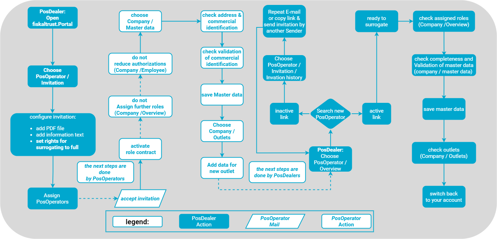
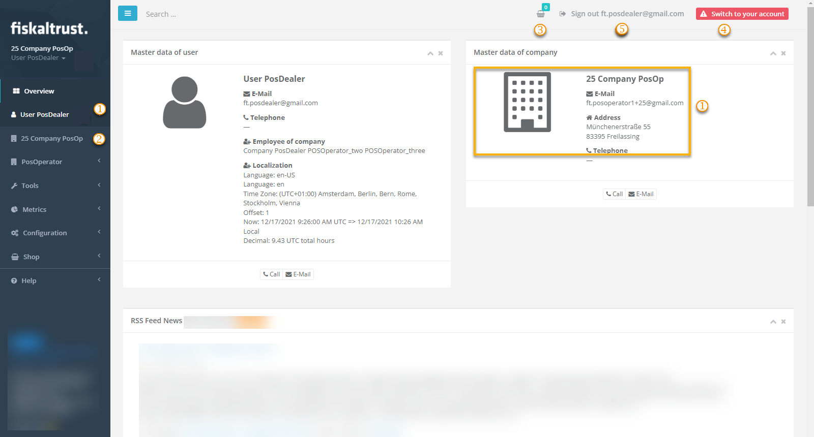
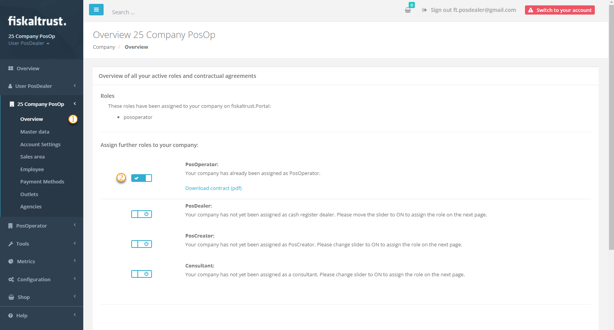
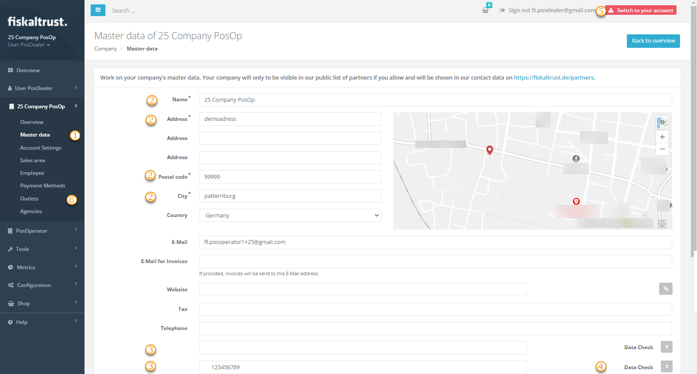

# Surrogating

:::info summary
After reading this, you can explain the prerequisites to act in the fiskaltrust.Portal on behalf of a PosOperator and can do it.
:::

## Introduction

As mentioned in the section [Company Roles](../company-roles.md), _fiskaltrust_ distinguishes company roles in the context of the fiskaltrust.Portal and its role management. The end-users of the POS-Systems activate the role contract of an **PosOperator**, POS-System distributors activate the role contract of an **PosDealer**.

To support and maintain a PosOperator's POS-System, PosDealers switch from their account to the PosOperator's account, change settings, assign contracts or order products and switch back to their own account - they use **surrogating**.
For your visualization, the process of surrogating is described here with the example of checking the master data of an PosOperator. Please note, that there is no bulk action, surrogating is a method to work with your fiskaltrust.account and one PosOperators account only.

### Prerequisites

1. You as a PosDealer have prepared your own account ready-to-use.
2. You have configured invitations to PosOperators like described under [Preparation of Invitations](invitation-process.md/#preparation-of-invitations).
3. The PosOperator followed the invitation by activating the role contract.
4. There have no changes been, neither with other role contracts, nor to your authorizations.
5. You as a PosDealer check the status of our invited PosOperators with `PosOperator` / `Overview`:

* If the name of the PosOperator is an active link, the account is active.
* If the name of the PosOperator is an inactive link, your invitation is not yet accepted. Please read and follow the instructions at [Invitation process / Troubleshooting](invitation-process.md#troubleshooting).

6. Under the table of PosOperators (`PosOperator` / `Overview`) you will find a `download` opportunity. This may help you with an overview of active and inactive PosOperator-Accounts and to contact them.  

### Work steps for surrogating

| steps | description                                                                                                                |
|:----------------------:|-------------------------------------------------------------------------------------------------------------------------------------|
| |Choose `PosOperator` / `Overview`  |
| |Enter a search term for the desired PosOperator.  |
| |With `Enter` or the Symbol for `Search` the datasets of those PosOperators, whose names or E-mail addresses matches your criteria will be displayed. Without a search term, all PosOperators are displayed.  |
| |If the name of the PosOperator is an active link, the account is active. Choose that link to switch to the PosOperators account.  |

| steps | description                                                                                                                |
|:----------------------:|-------------------------------------------------------------------------------------------------------------------------------------|
| |In the Account of the chosen PosOperator, you act with your own user. This is displayed with your original `USERNAME` and E-Mailaddress.  |
| |The portal looks similar to the own one for you as a PosDealer when surrogating into the account of a PosOperator. The account of a PosOperator is to be recognized with the PosOperators COMPANY NAME. |
| |Every product, you as a surrogated PosDealer buy in the store will be added to the **shopping cart** and will be available after you switch to your own account.   |
| |You switch back to your own account with the `Switch to your account`- button on the right upper corner.   |
| |Avoid to leave the account of a PosOperator by signing out, your **shopping cart** would get lost.   |

### Check PosOperators Master data

| steps | description                                                                                                                |
|:----------------------:|-------------------------------------------------------------------------------------------------------------------------------------|
| |After signing in (for PosOperators) or surrogating in the Account of a PosOperator (for PosDealers), choose `[COMPANY NAME]`/ `Overview`.  |
| |Determine if the role PosOperator has been activated as well as no other. Otherwise, cancel the undesired role. Please check [Company Roles](../Company%20Roles) for further questions |

| steps | description                                                                                                                |
|:----------------------:|-------------------------------------------------------------------------------------------------------------------------------------|
| |After checking the roles change to `[COMPANY NAME]`/ `Master data`.  |
| |Check the values in the address fields. Optionally, a dedicated billing address for invoices can be provided at `E-Mail for Invoices`. |
| |The fields for commercial identification are not mandatory for the invitation process. But these identification criteria are the basis for correct cash management and a prerequisite for the use of third party services. Control the completeness of the values.|
| |Validate the values with `Data Check`. Save your changes before you leave this page.  |
| |Do not yet return to your own account as a PosDealer with `Switch to your own account` or sign out as a PosOperator. |
| |Choose `Outlets` to check these for completeness and correctness. |
|  |Choose `Switch to your own account` to get back to your own account and to check further accounts of other PosOperators. |
