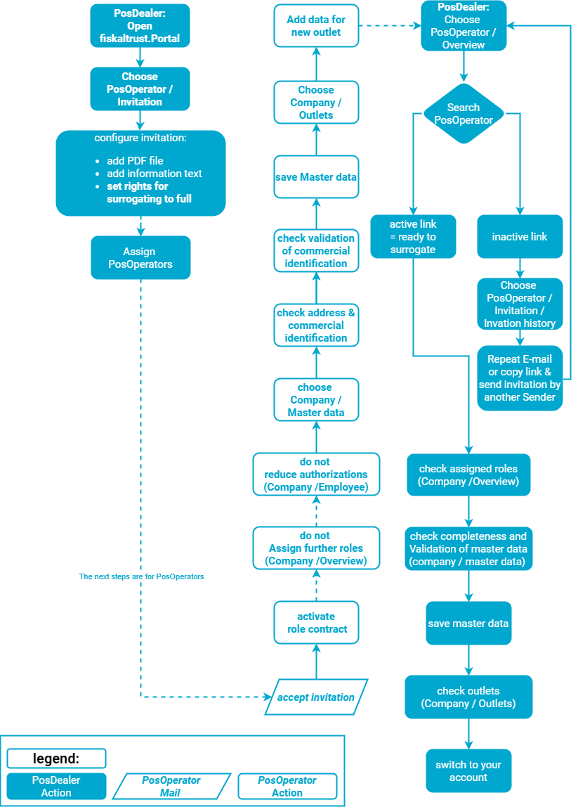

# Surrogating

:::info summary
After reading this, you can explain the prerequisites to act in the name of a PosOperator and can do it.
:::

## Explanation

As mentioned in the section [Company Roles](company-roles), _fiskaltrust_ distinguishes company roles in the context of the portal and its role management. The end-users of the Pos-Systems activate the role contract of an **PosOperator**, Pos-System distributors activate the role contract of an **PosDealer**.

To support and maintain a PosOperator's pos systems, PosDealers switch from their account to the PosOperator's account, make the desired changes, and switch back to their own account - they use **surrogating**.
For your visualization, the process of surrogating is described here with the example of checking the master data of an PosOperator.

### Prerequisites

1. You as a PosDealer have prepared your own account ready-to-use.
2. You have configured invitations to PosOperators like described under [Preparation of Invitations](preparation-of-invitations).
3. The PosOperator followed the invitation by activating the role contract.
4. There have no changes been, neither with other role contracts, nor to your authorizations.
5. You as a PosDealer check the status of our invited PosOperators with PosOperator / Overview:
* If the name of the PosOperator is an active link, the account is active.
* If the name of the PosOperator is an inactive link, your invitation is not yet accepted. Please read and follow these [### Workarounds for failed e-mail invitations](workarounds-for-failed-e-mail-invitations).
6. Under the table of PosOperators (PosOperator / Overview) you will find a download opportunity. This may help you with an overview of active and inactice PosOperator-Acounts and to contact them.  

### work steps for surrogating
