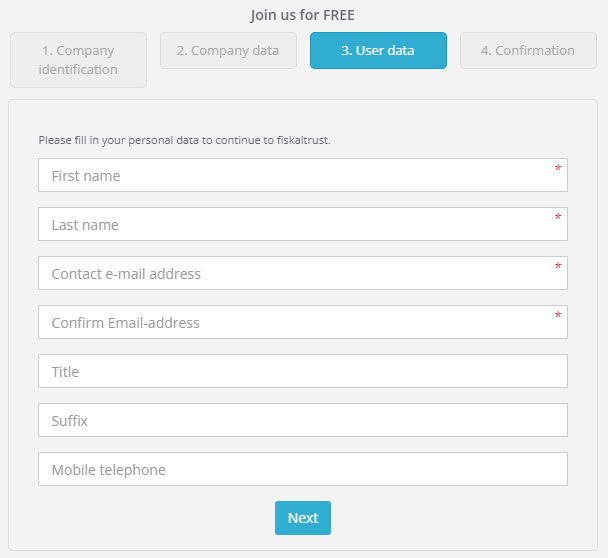

# Registration

:::info summary
After reading this, you can create an account, log into and start working with the fiskaltrust.Portal.
:::

The registration or login can be reached by clicking the `PORTAL-LOGIN` button on the fiskaltrust website or directly going to the URL:

import Tabs from '@theme/Tabs';
import TabItem from '@theme/TabItem';

<Tabs groupId="market"
  values={[
    {label: 'Austria', value: 'AT'},
    {label: 'France', value: 'FR'},
    {label: 'Germany', value: 'DE'},
  ]}
  defaultValue="AT">

  <TabItem value="AT">
    https://portal.fiskaltrust.at/Account/login
  </TabItem>

  <TabItem value="FR">
    https://portal.fiskaltrust.fr/Account/login
  </TabItem>

  <TabItem value="DE">
    https://portal.fiskaltrust.de/Account/login
  </TabItem>

By clicking `Register` you can start the process to register a user, as well as the associated company, in four steps. It is independent of the companys future role (PosCreator, PosDealer, Consultant or PosOperator) in the fiskaltrust.Portal. 

# Confirm CAPTCHA

First you have to confirm the captcha by checking the checkbox. Sometimes reCAPTCHA will open a new popup where you have to solve a task (e.g. select all images with bycicles) before reCAPTCHA will finish the verification.

# Company Data

You can now go directly to the company data by clicking on `Enter company data manually` or optionally enter one of the different commercial numbers and let the system prefill the company data.

All the fields marked with a red star are mandatory and must be filled out with the correct data.

| element | description                                                                                                                |
|:----------------------:|-------------------------------------------------------------------------------------------------------------------------------------|
| |The correct company has to be entered. The name will be verified later on against any entered commercial number. This name has to be the same as the one used in the commercial registers. for example the name from the K-bis should be used here. The name of the company may not already be in use for registration.  |
| |A valid email-address must be entered in this field. The email-address for company data may not be used already for another company. |
| |The address,zip-code and the name of the city of the company's headquarter must be entered.  |
| |You can already enter some or all commercial numbers for the company. This will facilitate the further registration process and usage of the fiskaltrust.Portal. |
| |By clicking on `Next` you proceed to the 3rd step _User data_ of the registration process. |

:::info  Error message
If the data entered in _Company name_ and/or _email-address_ was already used for registration, the registration will jump to the last step and an informational page will be displayed.
This page contains the information of the registered company. Click on the link with the name of the primary contact to open your email application and ask the primary contact to invite you into the company as a new user.
:::

# User data

The 3rd step of the registration process queries the personal data of the primary user. All the fields marked with a red star must be filled out with the correct data. The primary user is the key contact used in the fiskaltrust.Portal.
This contact is the the designated administrator of the newly registered company. With this account other employees of the company can be invited. 
A valid email address must be entered and it cannot have been used already for another registration. This will be the primary contact and all messages from the ft.Portal will be sent to this address.

:::info  Error message
If the email address entered in _email address_ was already used for registration, an information will be displayed, that a user with this emailadress already exists. By clicking the link in this information, you can initiate the password reset for this user.
:::

# Confirm registration

In the last step the information about the successfull registration is shown. The fiskaltrust.Portal sends an email with all the necessary information to your primary contact's email.

When the email is received in the primary contact's inbox, open it and click on the confirmation link. If you don't find the email in your inbox, look at the spam folder of your email application. 
Depending on whether you are registering on the _sandbox_ or on the _portal_ you'll receive this email from the sender 

<Tabs groupId="market"
  values={[
    {label: 'Austria', value: 'AT'},
    {label: 'France', value: 'FR'},
    {label: 'Germany', value: 'DE'},
  ]}
  defaultValue="AT">

  <TabItem value="AT">
    _sandbox@fiskaltrut.at_ or _portal@fiskaltrust.at_

    To complete the registration process and activate the account, the link _ce lien_ has to be clicked. This link will be opened in a new browser window where you choose your password and confirm the activation of your account.
  </TabItem>

  <TabItem value="FR">
    _sandbox@fiskaltrut.fr_ or _portal@fiskaltrust.fr_

    To complete the registration process and activate the account, the link _Link zum Zurücksetzen des Passwortes_ has to be clicked. This link will be opened in a new browser window where you choose your password and confirm the activation of your account.
  </TabItem>

  <TabItem value="DE">
    _sandbox@fiskaltrut.de_ or _portal@fiskaltrust.de_

    To complete the registration process and activate the account, the link _ce lien_ has to be clicked. This link will be opened in a new browser window where you choose your password and confirm the activation of your account.
  </TabItem>

::: info Warning
If this link is invalidated or expired (after 24 hours), an informational page is shown and you will receive a new confirmation email automatically.
:::

Now your account is active and the link  _this link_ in the final comfirmation screen or the `PORTAL-LOGIN` button on the fiskaltrust website can be used, to log into the fiskaltrust.Portal.

# Reset password

If the password for logging into the fiskaltrust.Portal is lost or forgotten, you can request a password reset:

1. Got to the login screen of the fiskaltrust.Portal and click on the link 'If you have forgotten your password please click here'.
2. Solve the CAPTCHA and enter the email address you used, when you registered your account.
3. A confirmation will be shown, that the link for resetting the password was sent to the entered email address.
4. After a few minutes, the email with the link should be delivered to the inbox. When you click the link in the email, a browser window will open. 
5. Enter the email address of your fiskaltrust account, the new password and confirm it by entering it a second time. After clicking `RESET` the new password will be saved, a confirmation page is shown and you can login into the fiskaltrust.Portal again.
