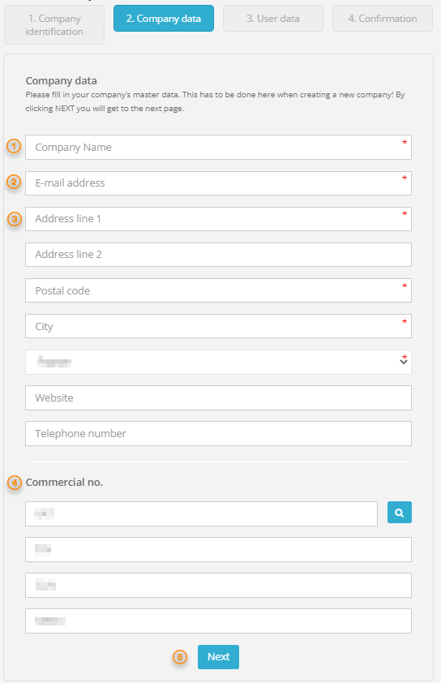
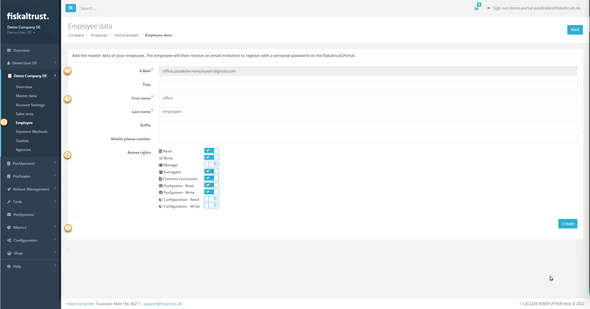
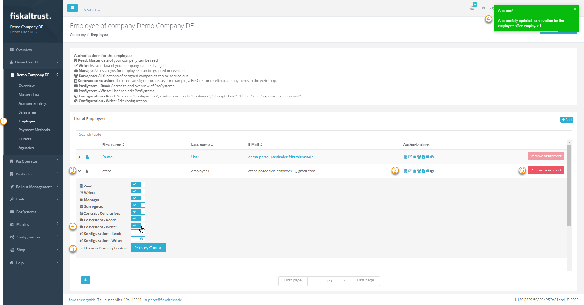
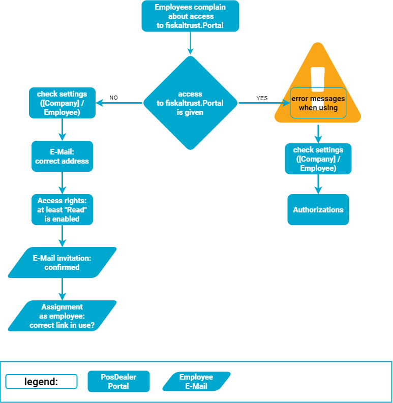
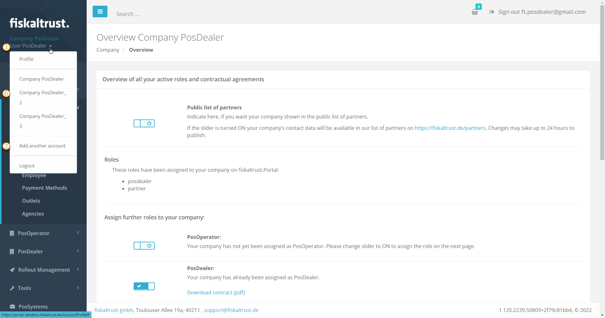

# Registration

:::info summary

After reading this, you can create an account, log into, invite employees and start working with the fiskaltrust.Portal.

:::
## Explanation

You create an account for your company and a contact for yourself on the fiskaltrust.portal. With this, you can log in.  
For security reasons, you can create another contact for yourself, as well as additional contacts for employees of your company.  
With different authorizations you define the options that the contacts have in the fiskaltrust.portal. 

### Country-specific information

The registration or login can be reached via a link on the _fiskaltrust_ website or directly going to the URL:

import Tabs from '@theme/Tabs';
import TabItem from '@theme/TabItem';
import RegistrationAT from '../_markets/at/getting-started/registration/_registration.mdx';
import RegistrationFR from '../_markets/fr/getting-started/registration/_registration.mdx';
import RegistrationDE from '../_markets/de/getting-started/registration/_registration.mdx';

<Tabs groupId="market">

  <TabItem value="AT" label="Austria">
    <RegistrationAT />
  </TabItem>

  <TabItem value="FR" label="France">
   <RegistrationFR />
  </TabItem>

  <TabItem value="DE" label="Germany">
   <RegistrationDE />
  </TabItem>

</Tabs>

By clicking `Register` you can start the process to register a user, as well as the associated company, in four steps. It is independent of the companys future role (PosCreator, PosDealer, Consultant or PosOperator) in the fiskaltrust.Portal.

:::caution Login Security
Whenever you enter your username and password for the fiskaltrust.Portal, make sure the URL is one of the above and look for the "lock" symbol in the browser. A secure site always has a closed padlock in the URL bar. That way you can be sure, you are actually entering the data on the correct website and avoid becoming a victim of website or login spoofing.
:::

## Work steps for registration

### Confirm CAPTCHA

First you have to confirm the captcha by checking the checkbox. Sometimes reCAPTCHA will open a new popup where you have to solve a task (e.g. select all images with traffic lights) before reCAPTCHA will finish the verification.

import ReactPlayer from "react-player"

<ReactPlayer controls url={require("./images/registration/captcha.mp4").default} /> 

### Company Data

You can now go directly to the company data by clicking on `Enter company data manually` or optionally enter one of the different commercial numbers and let the system prefill the company data.

All the fields marked with a red star are mandatory and must be filled out with the correct data.

| steps | description                                                                                                                |
|:----------------------:|-------------------------------------------------------------------------------------------------------------------------------------|
| |The correct company has to be entered. The name will be verified later on against any entered commercial number. This name has to be the same as the one used in the commercial registers. The name of the company may not already be in use for registration.  |
| |A valid E-mail address must be entered in this field. This E-mail address can only be used once for a company in the portal. If your mailserver supports the use of "+" in your E-mail address (meaning username+tag@domain will be delivered to username@domain) you can use such E-mailadresses especially for testing purposes and the portal will treat each of them as a unique E-mail-adress. |
| |The address,zip-code and the name of the city of the company's headquarter must be entered.  |
| |You can already enter some or all commercial numbers for the company. This will facilitate the further registration process and usage of the portal. |
| |By clicking on `Next` you proceed to the 3rd step _User data_ of the registration process. |

:::tip  Error message
If the data entered in _Company name_ and/or _email address_ was already used for registration, the registration will jump to the last step and an informational page will be displayed.
This page contains the information of the registered company. Click on the link with the name of the primary contact to open your E-mail application and ask the primary contact to invite you into the company as a new user.
:::

### User data

The 3rd step of the registration process queries the personal data of the primary user. All the fields marked with a red star must be filled out with the correct data. The primary user is the key contact used in the fiskaltrust.Portal.
This contact is the designated administrator of the newly registered company. With this account other employees of the company can be invited. 
A valid E-mail address must be entered and it cannot have been used already for another registration. This will be the primary contact and all messages from the ft.Portal will be sent to this address.

:::tip  Error message
If the E-mail address entered in _email address_ was already used for registration, an information will be displayed, that a user with this E-mailadress already exists. By clicking the link in this information, you can initiate the password reset for this user.
:::

### Confirm registration

In the last step the information about the successfull registration is shown. The fiskaltrust.Portal sends an E-mail with all the necessary information to your primary contact's E-mail.

When the E-mail is received in the primary contact's inbox, open it and click on the confirmation link. If you don't find the E-mail in your inbox, look at the spam folder of your E-mail application. 
Depending on whether you are registering on the _sandbox_ or on the _portal_ you'll receive this E-mail from the sender 

<Tabs groupId="market">

  <TabItem value="AT" label="Austria">
     sandbox@fiskaltrust.at or portal@fiskaltrust.at
 
  </TabItem>

  <TabItem value="FR" label="France">
     sandbox@fiskaltrust.fr or portal@fiskaltrust.fr

  </TabItem>

  <TabItem value="DE" label="Germany">
    sandbox@fiskaltrust.de or portal@fiskaltrust.de

  </TabItem>

</Tabs>

:::info Information
If this link is invalidated or expired (after 24 hours), an informational page is shown and you will receive a new confirmation E-mail automatically.
:::

Now your account is active and the link  _this link_ in the final confirmation screen or the `PORTAL-LOGIN` button on the _fiskaltrust_ website can be used, to log into the fiskaltrust.Portal.

## Reset password

If the password for logging into the fiskaltrust.Portal is lost or forgotten, you can request a password reset:

| steps | description                                                                                                                |
|:----------------------:|-------------------------------------------------------------------------------------------------------------------------------------|
| |Go to the login screen of the fiskaltrust.Portal and click on the link `If you have forgotten your password please click here`.  |
| |Solve the CAPTCHA..  |
| |Enter the E-mail address you used, when you registered your account.  |
| |A confirmation will be shown, that the link for resetting the password has been sent to the entered E-mail address. If not, check whether the E-mail address in usage is definitely the very same you used, when you registered your account..  |
| |After a few minutes, the E-mail with the link will be delivered to the inbox of this E-mail address. When you click the link in the E-mail, a browser window will open and show the password reset page of the fiskaltrust.Portal.  |
| |Enter the E-mail address of your _fiskaltrust_ account, the new password and confirm it by entering it a second time. After clicking `RESET` the new password will be saved, a confirmation page is shown and you can login into the fiskaltrust.Portal again..  |

## Invitation of new contacts

You can create another contact for yourself, for example, for security reasons. You can also create additional contacts for employees of your company. 
With different authorizations you define the options that the contacts have in the fiskaltrust.portal.

### Work steps to invite new contacts

| steps | description                                                                                                                |
|:----------------------:|-------------------------------------------------------------------------------------------------------------------------------------|
| |Tick [`COMPANY`] / `Employee` and `+Add`.   |
| |Enter as new contact the E-Mail Address and tick `Search`. |
| |Complete the **necessary** master data for the new contact with entries for `First name` and `Last name` and, if desired, additional information.  |
| |Design the authorizations by enabling the desired access rights, at least `Read` must be enabled. To activate, slide the slider to the right; to deactivate, slide it to the left. A confirmation message appears at the top right.|
| |By clicking on `Create` an invitation e-Mail is sent to the new contact`s E-Mail Address. Inform her or him of the next steps to confirm their email address and associate it with your company. |

With the rights shown in the screenshot, an employee could read and change content, switch to the accounts of cash register operators, conclude contracts and create or change pos systems This employee would neither have access to `[COMPANY]` nor to configurations in the account of his own company.

:::tip  Attention

Note that with the default access rights no access is possible, at least `Read` must be enabled.  

:::

### Work steps for new contacts

| steps | description                                                                                                                |
|:----------------------:|-------------------------------------------------------------------------------------------------------------------------------------|
| |The new contact checks the inbox of that E-Mail Address, that was used by the invitator. |
| |The invitation has to be activated with using the confirmation link. Read and accept the T&C and Privacy Policy and add a password. |
| |The employee activates the new contact with using the confirmation link and adding a password. |

In the future, all contacts use the login listed up [as above or in the assignment message](registration.md#Country-specific-information) 

## Managing user rights

### Expand user rights

| steps | description                                                                                                                |
|:----------------------:|-------------------------------------------------------------------------------------------------------------------------------------|
| |Tick [`COMPANY`] / `Employee`. |
| |Check the existing `Authorizations`. Inactivate rights are shown with a black symbol, activated rights with a blue symbol. |
| |To change the access rights of a particular contact, expand the buttons with the arrow on the left edge of the line.  |
| |To activate, slide the slider to the right; to deactivate, slide it to the left. A confirmation message appears at the top right. |
| |Choose `Set to new Primary Contact` **only, if you want to hand over** all `Authorizations`. |
| |With `Remove assignment` you delete the contacts assignment. |

### Remove Access rights

| action | description                                                                                                                |
|:----------------------:|-------------------------------------------------------------------------------------------------------------------------------------|
|`Remove assignment` |This action only removes the assignment of the e-mail address to the company, but does not delete it for security reasons. |
|`Set to new Primary Contact`| The previous access rights are **completely and at once withdrawn from the own contact** with this action. This action **immediately and completely** revokes the access rights of the previously privileged contact. After the next logout, the former primary contact cannot even log in to the fiskaltrust.portal. The new primary contact must reassign access rights to his own company to him. |

## Troubleshooting

### Employees complain about access

### PosDealers have several companies

The E-mail address of a contact is binding because this is used as a one-to-one assignment of a record to an account. So a usage for two or more companies is not possible for employees.

#### Solution for employees

**We strongly recommend to check this process at first in the sandbox!**

2. Select [`Company`] / `Employees` / `+Add`.
3. Add data records, if necessary also with fictitious information, only the e-mail address must be correct, e.g. peter.pattern@mycomany.com.
4. If employees are assigned to several accounts, create alias addresses and use these, e.g.:
* peter.pattern+1@mycomany.com
* peter.pattern+2@mycomany.com  
etc.

#### Solution for primary contacts

**We strongly recommend to check this process at first in the sandbox!**

One email address can be used to access different companies, but with three prerequisites only:

* The companies are not yet created in the fiskaltrust.Portal and can be added manually.
* The companies are not created more than once.
* The e-mail address is used exclusively as the primary contact in the new companies.

1. Select the `arrow symbol` next to your user name at the top left.
2. Select `Add another company`.
3. Add the desired data, for the E-mail address the same as for the current registration.
4. Add an existing, correct VAT number to prevent problems with orders and commissioning.
5. Create the new company with the `Create` button.
6. Switch from company to company with another click on the arrow symbol next to your user name.
7. Note **not to create the same company** more than once this way.
8. Note, that several companies means **different legal bindings**, e. g. contracts