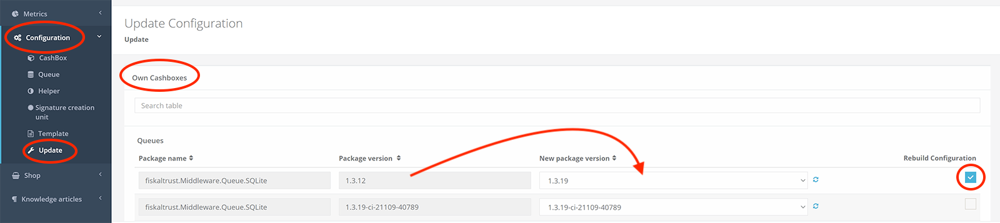
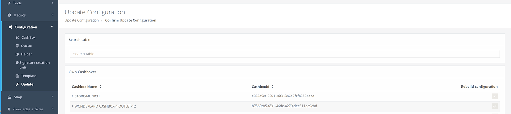

# How-To: Bulk update cashboxes

This tutorial describes how you can update many cashboxes at the same time using the fiskaltrust.Portal. This is useful for example in case fiskaltrust provides a newer version of a software package and you need it for many of your running fiskaltrust.Middleware instances (e.g. the package version of the SQLite Queue needs to be replaced for all customers). 

## Update via the fiskaltrust.Portal

In the fiskaltrust.Portal you can access the view for the bulk update of the cashboxes via the menu item `Configuration->Update`.  Here you have the choice to update the cashboxes of the current account and/or to update the cashboxes of all PosOperators assigned to you, if you are logged in to your fiskaltrust.Account as a PosDealer.

Each CashBox can contain the modules `Queue`, `Helper` and `SCU`. Depending on the module for which you want to update the package version (e.g. for `fiskaltrust.Middleware.Queue.SQLite` from version `1.3.8` to `1.3.9`) you can specify your update request here using the dropdowns displayed. Furthermore, you have the possibility to re-publish the cashboxes to be updated by checking the checkbox "Rebuild Configuration" for each update selection. 

After making the update settings and optionally selecting "Rebuild Configuration", you can use the "Submit" button to submit your selection for processing by the fiskaltrust.Portal. The fiskaltrust.Portal checks your entries and provides you with an overview of the cashboxes to be changed for review. 

Check the overview and if you are satisfied with the information, next press the "Execute" button to perform the update.

## Republish cashboxes

If you did not select the "Rebuild Configuration" option in the step described above for updating the cashboxes, you must do this manually for each affected CashBox before rolling it out. You can do this under `Configuration -> CashBox`. Only then will the configuration change be available for download for the affected fiskaltrust.Middleware instances.

 

## Restart the fiskaltrust.Middleware

After deploying the new configurations (CashBoxes), they are available for download for the fiskaltrust.Middlware instances. However, the fiskaltrust.Middleware instance will download and apply the updated CashBox only after restart. This can happen automatically, for example, as part of a nightly reboot of the computer, or can be manually triggered by you with stopping and restarting the fiskaltrust.Middleware instance.
