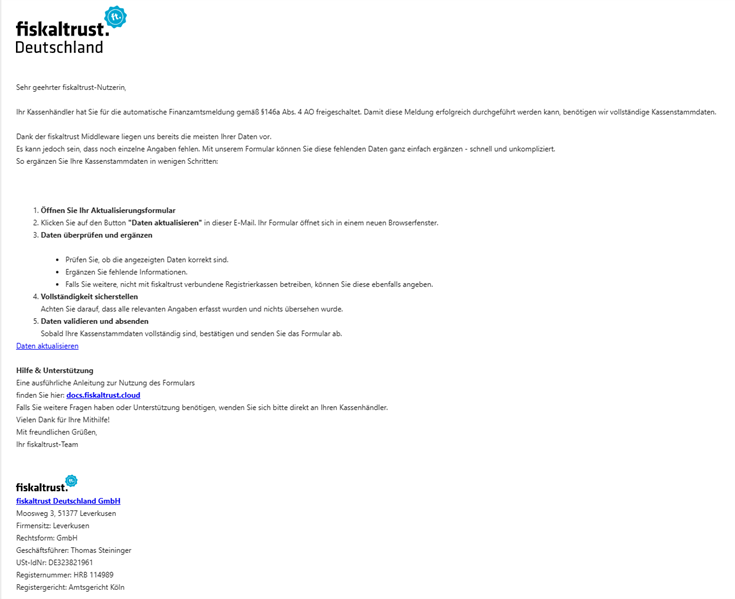
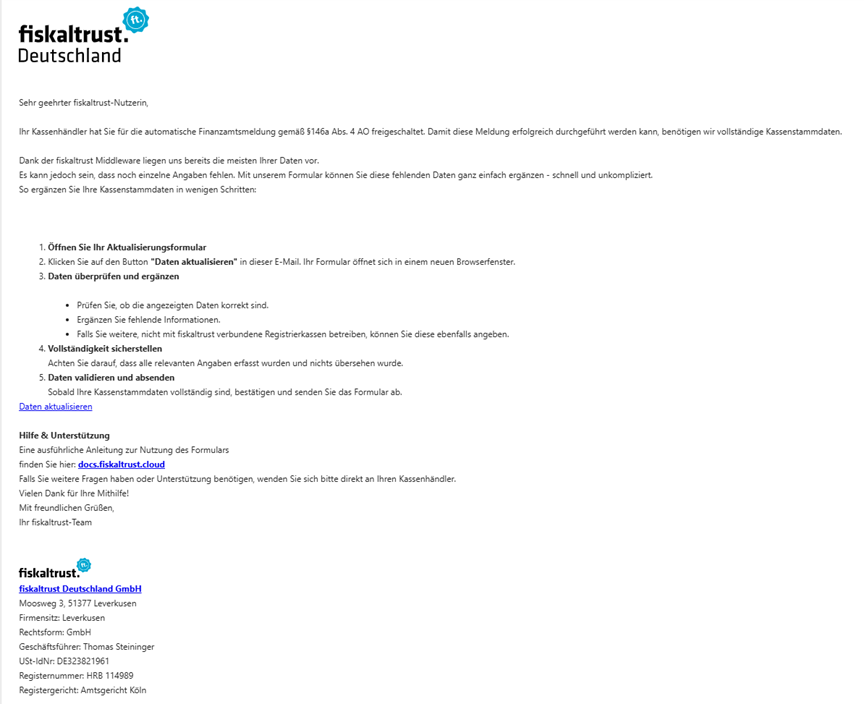
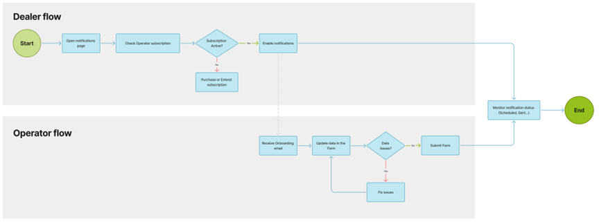

## Funktionsübersicht

Der Hauptzweck des Meldungs-Workflows besteht darin, **Händlern die Möglichkeit zu geben, Betreiber** durch die Verwaltung ihres Onboarding-Prozesses mithilfe strukturierter und nachverfolgbarer Meldungen **zu unterstützen**. Dadurch wird sichergestellt, dass Unternehmens-, Standort- und Kassendaten korrekt ausgefüllt werden, was für eine erfolgreiche Fiskalisierung und Compliance unerlässlich ist.

### Rollen und Verantwortlichkeiten

• **Händler**: Aktiviert Meldungen, hilft bei der Dateneingabe und Fehlerbehebung, verfolgt den Status und stellt sicher, dass die Betreiber das Onboarding-Formular ausfüllen.

• **Betreiber**: Gibt genaue Unternehmens-, Standort- und Kasseninformationen ein und reicht das erforderliche Onboarding-Formular ein.

• **fiskaltrust**: Bietet technischen Support für Händler und hilft bei der Lösung von System- oder Datenproblemen.

### Zugriff und Navigation

Händler können über das Händlerportal auf die Seite „**Meldungen**” zugreifen, indem sie zu folgendem Pfad navigieren:
**KassenHändler → Meldungen.**

Auf dieser Seite werden alle zugehörigen Betreiber und deren Meldungsstatus aufgelistet.

### Abonnementanforderungen

Meldungen können nur aktiviert werden, wenn der Betreiber ein aktives Abonnement für eines der erforderlichen Produkte hat:

• **fiskaltrust.Sorglos ohne TSE** oder

• **fiskaltrust.Sorglos mit TSE-as-a-Service** oder

**• fiskaltrust.Finanzamtsmeldung**

Diese Abonnements können über das **Rollout-Management** erworben werden.

Wenn für einen Betreiber kein gültiges Abonnement vorliegt, wird:

• ist das Dropdown-Menü für Meldungen deaktiviert, und

• Händler müssen zunächst sicherstellen, dass das Produkt gekauft wurde, bevor Meldungen gesendet werden können.

### Senden und Verwalten von Meldungen

So aktivieren Sie Meldungen:

• Händler setzen die Dropdown-Liste für BetreiberMeldungen auf „**Aktiviert**”.

• Durch diese Aktion wird eine **Onboarding-E-Mail** an den Betreiber gesendet:

Die Onboarding-E-Mail enthält:

• Eine kurze Erläuterung des Meldungsprozesses

• Einen Link zu einem **4-stufigen Datenformular**, das der Betreiber ausfüllen muss:

1\. Unternehmensinformationen

2\. Angaben zu Standorten

3\. Registrierkassen-Setup

4\. Abschließende Überprüfung und Übermittlung

Das Formular kann nur übermittelt werden, wenn **alle erforderlichen Felder** korrekt ausgefüllt sind.

### Warum korrekte Daten wichtig sind

Meldungen sind auf vollständige und korrekte Daten angewiesen, um erfolgreich zugestellt werden zu können. Fehlende oder fehlerhafte Eingaben wie:

• Falsche **Steuernummer**

• Fehlende **POSsystemID**

• Unvollständige Adressen

können die erfolgreiche Zustellung von Meldungen verhindern.

### Meldungsprozess

Nach dem Absenden des Formulars:

• Das System plant die Meldung für das nächste verfügbare Zeitfenster ein.

• Häufigkeit und Zeitpunkt werden durch die interne Planung festgelegt und später ausführlicher dokumentiert.

Wenn der Betreiber das Formular nicht abgeschickt hat:

• Händler können die **Onboarding-E-Mail** über das Portal **erneut versenden.**

Händler können außerdem:

• Meldungen aktivieren/deaktivieren

• Nach Status filtern

• Das Versenden von Meldungen manuell auslösen

• Pro Betreiber aufgelistete Probleme überprüfen (z. B. fehlende Daten)

Wenn die Meldung erfolgreich war, erhält der Betreiber eine Bestätigungs-E-Mail mit dem ELSTER-Übermittlungsprotokoll im Anhang:

## Fehlerbehebung und Support

### Häufige Probleme

• **Falsche Standort-Konfiguration:**

Wenn eine Queue mit dem falschen Standort verknüpft ist, muss der Händler die Standort-Konfiguration korrigieren.

• **Doppelte Outlets:**

Wenn mehrere Standorte denselben physischen Standort repräsentieren (z. B. aufgrund virtueller Standort-Duplikate), verwenden Sie das Feld „Location-ID“ in der Ansicht „Outlet bearbeiten“, um sie zu einem zu gruppieren.

### Umgang mit fehlgeschlagenen Meldungen

Wenn eine Meldung fehlschlägt:

• Überprüfen Sie die Spalte **Probleme** auf fehlende oder falsche Daten.

• Unterstützen Sie den Betreiber bei der Korrektur der Informationen.

• Senden Sie die Onboarding-E-Mail bei Bedarf erneut.

Wenn Meldungen deaktiviert und später wieder aktiviert werden:

• Der Betreiber kann weiterhin auf das Formular zugreifen.

• Meldungen werden nur gesendet, wenn der Status „**Aktiviert**“ ist.

• Händler sollten Betreiber klar darüber informieren, wenn Meldungen pausiert werden.

### E-Mail- und Statusmitteilungen

• **Händler**: Sehen Sie den Status in Echtzeit im Portal und melden Sie sich für E-Mail-Zusammenfassungen (wöchentlich oder zweiwöchentlich) an.

• **Betreiber**: Erhalten Sie Onboarding-E-Mails und Updates.

### Best Practices für Händler

• Überprüfen Sie regelmäßig den Meldungsstatus und die Spalte „Probleme”.

• Unterstützen Sie die Betreiber aktiv beim Ausfüllen des Formulars.

• Verwenden Sie Filter, um Prioritäten zu setzen (z. B. fehlgeschlagene Meldungen).

• Verwenden Sie Massenaktionen für eine effiziente Verwaltung.

• Führen Sie Protokolle für Compliance und Support.

| Schritt | Verantwortlichkeiten des Händlers | Verantwortlichkeiten des Betreibers |
| --- | --- | --- |
| 1\. Abonnement Check | \- Überprüfen Sie, ob der Betreiber über ein aktives Abonnement verfügt (fiskaltrust.Carefree ohne TSE / fiskaltrust.Carefree mit TSE-as-a-Service oder fiskaltrust. Finanzamtsmeldung).  \- Bei Bedarf erwerben Sie das Produkt über das Rollout-Management oder verlängern das bestehende Abonnement (über Abonnements). | —   |
| 2\. Meldungen aktivieren | \- Gehen Sie zur Seite „Meldungen“ im Händlerportal.  \- Setzen Sie den Benachrichtigungsstatus des Betreibers auf „Aktiviert“ (dadurch wird eine Onboarding-E-Mail versendet). | —   |
| 3\. Dateneingabe des Betreibers | —   | \- Öffnen Sie die Onboarding-E-Mail.  \- Füllen Sie das 4-stufige Datenformular aus:  \- Unternehmensdaten  \- Informationen zu Standorten  \- Registrierkassensetup  \- Überprüfen und senden Sie das Formular |
| 4\. Datenvalidierung und Fehlerbehebung | \- Überwachen Sie den Fortschritt des Betreibers auf der Seite „Meldungen“.  \- Senden Sie die Onboarding-E-Mail erneut, wenn das Formular nicht übermittelt wurde oder der Betreiber einen Link zum Formular anfordert.  \- Überprüfen Sie die Spalte „Probleme“ auf fehlende/falsche Daten.  \- Unterstützen Sie den Betreiber bei der Korrektur von Fehlern. | \- Korrigieren Sie alle im Formular hervorgehobenen Fehler.  \- Wenden Sie sich bei Bedarf an den Händler, um Hilfe zu erhalten. |
| 5\. Versand der Meldungen und Statusverfolgung | \- Verfolgen Sie den Status von Meldungen (geplant, gesendet, fehlgeschlagen, blockiert).  \- Aktivieren/deaktivieren oder lösen Sie Meldungen manuell aus.  \- Verwenden Sie Filter, um Betreiber zu priorisieren.  \- Führen Sie Aufzeichnungen für Compliance und Support. | \- Überprüfen Sie Bestätigungs- oder Folge-E-Mails.  \- Bleiben Sie auf dem Laufenden, wenn Benachrichtigungen pausiert oder deaktiviert sind. |
| 6\. Laufender Support | \- Halten Sie die Kommunikation mit den Betreibern aufrecht.  \- Wenden Sie sich bei technischen Problemen an den Support von fiskaltrust. | \- Wenden Sie sich bei Fragen oder für Unterstützung an Ihren Händler. |

## Rechtliche Grundlagen
Abgabenordnung : [§ 146a Abs. 4 AO](https://www.gesetze-im-internet.de/ao_1977/__146a.html)
Anwendungserlass: [Anwendungserlass zu § 146a AO](https://www.bundesfinanzministerium.de/Content/DE/Downloads/BMF_Schreiben/Weitere_Steuerthemen/Abgabenordnung/AO-Anwendungserlass/2023-06-30-AEAO-Par-146-AO.pdf?__blob=publicationFile&v=1)

### In welchen Fällen ist die Meldung von Kassen verpflichtend?

- Erstinbetriebnahme der Kasse: Wenn die fiskaltrust.Middleware verwendet wird, dann entspricht dies dem Zeitpunkt des Initial-Operation-Beleg
- Außerbetriebnahme der Kasse: Wenn die fiskaltrust.Middleware verwendet wird, dann entspricht dies dem Zeitpunkt des Out-Of-Operation-Beleg

#### Wenn sich die in der letzten Meldung enthaltenden Daten geändert haben, muss eine neue Meldung mit den aktualisierten Daten gesendet werden
Dies betrifft u.A.:
- Den Wechsel der verwendeten TSE
- Änderungen in den Stammdaten des Unternehmens

### Fristen
Eine Meldung ist innerhalb eines Monats erforderlich, wenn eine Erstinbetriebnahme, eine Außerbetriebnahme oder eine Aktualisierung/Korrektur der vorherigen Meldung erfolgt.

#### Für den Beginn der Notifizierungen im Jahr 2025 wurde eine Übergangsfrist eingeführt:
- Kassen, die vor dem 1. Juli 2025 in Betrieb genommen werden, müssen bis zum 31. Juli 2025 in die Meldung aufgenommen werden.
- Kassen, die vor dem 1. Juli 2025 außer Betrieb genommen werden, müssen nur dann in die Meldung aufgenommen werden, wenn diese Registrierkasse bereits zuvor Teil einer Meldung war (_fiskaltrust meldet keine Kassen vor dem 1. Juli 2025_).
- Kassen, die am/nach dem 1. Juli 2025 in Betrieb genommen werden, müssen innerhalb eines Monats in die Meldung aufgenommen werden.

## Technische Grundlagen

Alle Kassen in einer Filiale müssen in die Meldung einbezogen werden. Für diejenigen Kassen, die die fiskaltrust.Middleware verwenden, liegen uns die meisten der erforderlichen Informationen bereits vor. Kassen, die nicht die fiskaltrust.Middleware verwenden, können der fiskaltrust.Notification über verschiedene benutzerfreundliche Methoden hinzugefügt werden. fiskaltrust generiert die Meldung und verwendet die ERiC-Schnittstelle, um die Meldung an ELSTER zu übermitteln.

Wenn uns Daten fehlen, die für die Meldung eines Standorts benötigt werden, bieten wir einen automatisierten Prozess, der den Kassenbetreiber nach Freigabe durch den Kassenhändler auffordert, die fehlenden Informationen zu liefern.

### Voraussetzungen für Kassenhändler / -Betreiber
Da wir zur Erstellung der Meldung Daten aus der fiskaltrust.Middleware und dem fiskaltrust.Portal verwenden, müssen bestimmte Stammdatenwerte im Konto des Kassenbetreibers vorhanden sein. Nach expliziter Freigabe des Vorgangs durch den Kassenhändler (über eine Übersichts-Seite im fiskaltrust.Portal) wird der Kassenbetreiber aufgefordert, fehlende Informationen nachzutragen, bevor wir die Benachrichtigung erstellen. Je mehr der folgenden Werte jedoch bereits ausgefüllt sind, desto weniger muss der Kassenbetreiber später ausfüllen.

| Datenquelle | Navigationspfad | Stammdaten-Wert | Beschreibung |
|-----------|-----------------|-----------------------------------------------------|-------------------------|
| Kassenbetreiber-Account | Informationen zum Unternehmen / Stammdaten | Steuernummer | Die Steuernummer ist für die Meldung zwingend erforderlich. Die Verwendung der USt-IdNr ist nicht möglich. |
| Kassenbetreiber-Account | Informationen zum Unternehmen / Stammdaten | Adresse | Straßenname und Hausnummer sind obligatorisch.|
| Kassenbetreiber-Account | Informationen zum Unternehmen / Stammdaten | Postleitzahl | Die Angabe der Postleitzahl ist obligatorisch.|
| Kassenbetreiber-Account | Informationen zum Unternehmen / Stammdaten | Stadt | Die Angabe der Stadt ist obligatorisch.|
| Kassenbetreiber-Account | Informationen zum Unternehmen / Standorte | Adresse | Straßenname und Hausnummer sind obligatorisch.|
| Kassenbetreiber-Account | Informationen zum Unternehmen / Standorte | Postleitzahl | Die Angabe der Postleitzahl ist obligatorisch.|
| Kassenbetreiber-Account | Informationen zum Unternehmen / Standorte | Stadt | Die Angabe der Stadt ist obligatorisch.|

#### Händlerübersicht
Im Menü _KassenHändler-> Meldungen_ erhalten Sie eine Übersicht über alle verbundenen KassenBetreiber und deren Status bezüglich Finanzamtsmeldung.

### Voraussetzungen für Kassenhersteller
Für das Produkt fiskaltrust.Notification ist keine neue Implementierung erforderlich. Allerdings gibt es Prozesse, Belege und Daten, die bereits Teil der fiskaltrust.Middleware waren und nun für die Benachrichtigung zwingend erforderlich sind. 

#### Belege
- In-Betriebnahme-Beleg 
- Außer-Betriebnahme-Beleg 
- Initiate-SCU-Switch-Beleg (beim TSE-Tausch)
- Finish-Switch-Beleg (beim TSE-Tausch)

#### PosSystemId
Wie im fiskaltrust.Interface definiert ist das inkludieren der `ftPosSytemId` in Requests an die Middleware obligatorisch. Wir verwenden die PosSystemId, um die Stammdaten Ihres POSSystems den einzelnen Middleware-Instanzen zuzuordnen. Diese POSSystem-Stammdaten sind ein notwendiger Bestandteil der Meldung; Kassenhersteller müssen daher darauf achten, die `ftPosSystemId` korrekt in Belegen an die Middleware zu inkludieren, sowie das zugehörige POSSystem im fiskaltrust.Portal zu pflegen.

## Anleitung Betreiber-Formular
Anleitung für das Formular zur Aktualisierung der Kassendaten für die Finanzamtsmeldung (§146a Absatz 4 AO)

### Hinweis
Eine Meldung an das Finanzamt kann nur erfolgen, wenn im Formular keine Informationen fehlen und alle Felder valide Daten enthalten.

## Das Formular

### 1. Übersicht über die durchzuführenden Schritte
Nach dem Öffnen des Links zum Formular werden die durchzuführenden Schritte angezeigt.

Im Formular kann man jederzeit zu den vorherigen Schritten zurückkehren. Auch das Schließen des Formulars und das spätere erneute Öffnen über denselben Link ist problemlos möglich. Die Schritte werden zwischengespeichert, und der Fortschritt bleibt erhalten.  

### 2. Unternehmensdaten überprüfen
Die angezeigten Daten sind zu überprüfen und gegebenenfalls zu korrigieren. Hierbei handelt es sich um die Stammdaten des Unternehmenssitzes, also die Adresse, für die das Finanzamt dem Unternehmen die Steuernummer zugewiesen hat. Sollten die angezeigten Informationen nicht stimmen, sind diese im Formular zu korrigieren.  

#### Auszufüllende Felder
| Feld                        | Erklärung                                                                                                                                                            |
|-----------------------------|--------------------------------------------------------------------------------------------------------------------------------------------------------------------|
| Steuernummer                | Ihre vom Finanzamt vergebene Steuernummer. Diese finden Sie z. B. auf Ihrem letzten Steuerbescheid. Normalerweise befindet sich die Steuernummer in der oberen linken Ecke des Steuerbescheids. **Wichtig:** Hier ist **nicht** die Steueridentifikationsnummer einzutragen. Tragen Sie die Steuernummer in dem Format ein, wie es auf dem Steuerbescheid angegeben ist. |
| Straße (Hauptsitz des Unternehmens) | Einzutragen ist hier die Adresse, die für die oben genannte Steuernummer registriert ist. Einzelne Betriebsstätten (Standorte), falls vorhanden, werden später im Formular behandelt. |
| Hausnummer (Hauptsitz des Unternehmens) | Einzutragen ist hier die Adresse, die für die oben genannte Steuernummer registriert ist. Einzelne Betriebsstätten (Standorte), falls vorhanden, werden später im Formular behandelt. |
| Postleitzahl (Hauptsitz des Unternehmens) | Einzutragen ist hier die Adresse, die für die oben genannte Steuernummer registriert ist. Einzelne Betriebsstätten (Standorte), falls vorhanden, werden später im Formular behandelt. |
| Stadt (Hauptsitz des Unternehmens) | Einzutragen ist hier die Adresse, die für die oben genannte Steuernummer registriert ist. Einzelne Betriebsstätten (Standorte), falls vorhanden, werden später im Formular behandelt. |

#### Steuernummer
Beispiel Steuerbescheid:  

### 3. Vorhandene Daten prüfen
Die bereits bei fiskaltrust vorliegenden Informationen zu Betriebsstätten und Kassen werden angezeigt. Noch fehlende Informationen oder nicht valide Daten werden rot markiert.

In der Liste werden die Daten je Betriebsstätte als eigene Zeile aufgelistet.  

#### Standortdaten prüfen und bearbeiten
Zunächst sollte die angezeigte Adresse des Standorts überprüft werden. Sollten hier Informationen inkorrekt sein, können diese über den Button **Bearbeiten** editiert werden.  

Im Bearbeitungsmenü können nun die Daten des Standorts angepasst und gespeichert werden.  

#### Kassendaten bearbeiten
In rot wird angezeigt, bei welchen und wie vielen Kassen noch Pflichtinformationen fehlen. Die einzelnen Kassen eines Standorts werden durch das Auswählen des **>**-Buttons neben dem Standortnamen aufgelistet.

Sollten hier mehr Kassen aufgelistet werden, als tatsächlich am Standort existieren, sind diese über die Kassensoftware außer Betrieb zu nehmen. Alternativ können die Kassen auch im fiskaltrust.Portal deaktiviert werden. Im Zweifel sollte der Kassenhändler kontaktiert werden.  

Über den Button **Bearbeiten** können die fehlenden Informationen ergänzt werden.  

##### Mögliche Felder
| Feld                                 | Erklärung                                                                                                                        |
|-------------------------------------|--------------------------------------------------------------------------------------------------------------------------------|
| Kaufdatum der Registrierkasse       | Hier ist entweder das Kaufdatum (Rechnungsdatum) der Kasse oder das Leasingdatum der Kasse einzutragen.                          |
| Datum der Inbetriebnahme der Registrierkasse | Einzutragen ist das Datum, an dem die Kasse in Betrieb genommen wurde. Dies ist der Zeitpunkt, ab dem die Kasse für Geschäftsvorfälle genutzt werden konnte. **Hinweis:** Die Aktivierung der TSE ist hier nicht relevant. |

#### Abschluss der Prüfung
Nachdem alle Daten ergänzt oder korrigiert wurden, werden alle Standorte und Kassen grün markiert.  

### 4. Fremdkassen hinzufügen
Wenn in den Standorten noch weitere Kassen vorhanden sind, die nicht auf der Seite [3. Vorhandene Daten prüfen](#3-vorhandene-daten-prüfen) aufgelistet wurden, handelt es sich hierbei um sogenannte **Fremdkassen**. Dies ist meist dann der Fall, wenn sich an einem Standort Kassen von verschiedenen Herstellern befinden, die nicht alle über die fiskaltrust.Middleware angebunden sind.

Der Gesetzgeber fordert für die Meldung nach §146a Absatz 4 AO alle Kassen einer Betriebsstätte. Es ist somit verpflichtend, auch die Kassen der Meldung hinzuzufügen, die nicht auf der Seite [3. Vorhandene Daten prüfen](#3-vorhandene-daten-prüfen) angezeigt werden.  

Für das Hinzufügen von Fremdkassen bietet das Formular zwei Optionen:

#### Import der DSFinV-K (ZIP) oder einer DFKA-Taxonomie (JSON)
Der DSFinV-K-Export ist ein verpflichtender Bestandteil jeder Kasse. Wird an der/den Kasse(n) ein Export der DSFinV-K durchgeführt, kann diese Exportdatei verwendet werden, um im Formular die fehlende(n) Kasse(n) hinzuzufügen. Es ist hierbei egal, ob die DSFinV-K bereits alle Kassen eines Standorts enthält oder nur einzelne Kassen.

**Hinweis:** Ein Import der DSFinV-K ist nur möglich, wenn der DSFinV-K-Export der gesetzlichen Definition und Struktur entspricht. Sollte ein Import Fehler liefern, sollte Kontakt mit dem Hersteller der Kasse aufgenommen werden.

Mit Auswahl des Buttons **Datei auswählen** kann die DSFinV-K im ZIP-Format hochgeladen werden.  

Die DSFinV-K wird durch Wählen des Buttons **Datei importieren** in das Formular importiert.  

Es muss nun der Standort ausgewählt werden, aus dem die DSFinV-K stammt. Durch das Wählen von **importieren** werden die Kassen importiert.  

Die Liste zeigt nun je Standort die importierten Kassen an. Der Importvorgang kann beliebig oft wiederholt werden.  

#### Registrierkasse manuell hinzufügen
Sollte ein Export der DSFinV-K an der Fremdkasse nicht möglich sein oder der Import Fehler liefern, ist das manuelle Hinzufügen dieser Kasse durch Wählen des Buttons **Registrierkasse manuell hinzufügen** möglich.  

##### Felder
| Feld                | Beschreibung                                                                                                                      |
|---------------------|----------------------------------------------------------------------------------------------------------------------------------|
| Software            | Tragen Sie hier den Namen der Software Ihrer Kasse ein.                                                                          |
| Software-Version    | Tragen Sie hier die Versionsnummer oder die Bezeichnung der Software ein.                                                         |
| Kassen-Seriennummer | Die Seriennummer der Kasse muss dieselbe sein, wie die in der TSE registrierte Kassenseriennummer. Diese finden Sie auf Kassenbelegen. |
| Hersteller          | Tragen Sie hier den Hersteller Ihrer Kasse ein.                                                                                   |
| Modell              | Tragen Sie hier die Modellbezeichnung Ihrer Kasse ein.                                                                            |
| TSE Seriennummer    | Tragen Sie hier die Seriennummer der verwendeten TSE ein.                                                                         |
| BSI-ID              | Jede TSE ist vom BSI zertifiziert und erhält eine BSI-ID. Diese finden Sie auf [Wikipedia](https://de.wikipedia.org/wiki/Technische_Sicherheitseinrichtung#%C3%9Cbersicht_der_zertifizierten_TSE). Anzugeben ist nur der Wert ohne `BSI-K-TR-`. Beispiel: 0412-2020 |
| Inbetriebnahme TSE  | Tragen Sie hier das Datum ein, an dem die TSE in Betrieb genommen wurde.                                                           |
| Kaufdatum           | Hier ist entweder das Kaufdatum (Rechnungsdatum) der Kasse oder das Leasingdatum der Kasse einzutragen.                           |
| Datum der Inbetriebnahme | Einzutragen ist das Datum, an dem die Kasse in Betrieb genommen wurde. Dies ist der Zeitpunkt, ab dem die Kasse für Geschäftsvorfälle genutzt werden konnte. |

#### Daten überprüfen und ergänzen
Sollten nach dem Import der DSFinV-K oder dem manuellen Hinzufügen der Kasse noch Daten fehlen, können diese wie in [Kassendaten bearbeiten](#kassendaten-bearbeiten) beschrieben ergänzt oder korrigiert werden. Mögliche Felder sind in [Registrierkasse manuell hinzufügen](#felder) beschrieben.

#### Standort/Kassen entfernen
Wurden versehentlich falsche Kassen importiert oder der falsche Standort gewählt, können diese jeweils über das _Papierkorb-Symbol_ entfernt werden.  

### 5. Abschluss
Es werden alle durchlaufenen Schritte angezeigt. Sollten in einem der Schritte noch Informationen fehlen oder nicht valide sein, werden diese ebenfalls in dieser Übersicht angezeigt. Nur wenn alle Schritte keine Fehler aufweisen, ist eine Meldung möglich.  

Durch das Auswählen von **übermitteln** öffnet sich die verpflichtende Abfrage nach der Richtigkeit und Vollständigkeit der Daten.  

Nach der Bestätigung dieser Abfrage erhält der Kassenbetreiber eine E-Mail, die über die Aktualisierung der Daten informiert. Am darauffolgenden Sonntag erfolgt die Übermittlung an das Finanzamt. Der Kassenbetreiber erhält daraufhin das ELSTER-Übermittlungsprotokoll. Wir empfehlen, dieses in der Verfahrensdokumentation zu hinterlegen.

## Finden der Daten für das ELSTER-Formular
Falls anstelle des komfortablen fiskaltrust-Prozesses die manuelle Eingabe der Daten im ELSTER-Formular bevorzugt wird, kann die folgende Liste dabei helfen, die erforderlichen Daten zu finden.

| XML/ELSTER Formular Feld                                                   | DSFinV-K Tabelle    | DSFinV-K Feld     | Daten für ELSTER        | Wo zu finden |
|-------------------------------------------------------|-------------------|--------------------|-------------------------------------------|------------------|
| Aufzeichnung146a/StNr                                 | cashpointclosing  | STNR               | Betreiber.Account.Stammdaten.Steuernummer |Informationen zum Unternehmen/Stammdaten|
| AllgAngabenNichtNatuerlichePerson/Firmenname          | cashpointclosing  | NAME               | Betreiber.Account.Stammdaten.AccountName   |Informationen zum Unternehmen/Stammdaten|
| AllgAngabenNichtNatuerlichePerson/Adresse/AdrInl/Strasse | cashpointclosing  | STRASSE            | Betreiber.Account.Stammdaten.Straße     |Informationen zum Unternehmen/Stammdaten|
| AllgAngabenNichtNatuerlichePerson/Adresse/AdrInl/Hausnummer | cashpointclosing  | STRASSE            | Betreiber.Account.Stammdaten.Straße  |Informationen zum Unternehmen/Stammdaten|
| AllgAngabenNichtNatuerlichePerson/Adresse/AdrInl/Postleitzahl | cashpointclosing  | PLZ               | Betreiber.Account.Stammdaten.Postleitzahl|Informationen zum Unternehmen/Stammdaten|
| AllgAngabenNichtNatuerlichePerson/Adresse/AdrInl/Ort  | cashpointclosing  | ORT                | Betreiber.Account.Stammdaten.Stadt          |Informationen zum Unternehmen/Stammdaten|
| AngabenZuBetriebsstaette/AnzahlAufzeichnungssysteme   |                   |                    | Konfigruation.Queue                          | Summe aller aktiven Queues|
| AngabenZuBetriebsstaette/Adresse/Strasse              | location          | LOC_STRASSE        | Betreiber.Account.Standort.Straße            |Informationen zum Unternehmen/Standorte|
| AngabenZuBetriebsstaette/Adresse/Hausnummer           | location          | LOC_STRASSE        | Betreiber.Account.Standort.Straße            |Informationen zum Unternehmen/Standorte|
| AngabenZuBetriebsstaette/Adresse/Postleitzahl         | location          | LOC_PLZ            | Betreiber.Account.Standort.Postleitzahl      |Informationen zum Unternehmen/Standorte|
| AngabenZuBetriebsstaette/Adresse/Ort                  | location          | LOC_ORT            | Betreiber.Account.Standort.Stadt              |Informationen zum Unternehmen/Standorte|
| AngabenAufzeichnungssystem/Art                        |                   |                    |                                     |Im Dropdown des ELSTER-Fomulars auswählen|
| AngabenAufzeichnungssystem/Software                   | cashregister      | KASSE_SW_BRAND     | fiskaltrust.Middleware               | Es ist "fiskaltrust.Middleware" einzutragen|
| AngabenAufzeichnungssystem/SoftwareVersion            | cashregister      | KASSE_SW_VERSION   | 1.3                         |Die Version der Middleware ist einzutragen (1.3)|
| AngabenAufzeichnungssystem/SeriennummerAS             | cashregister      | Z_KASSE_ID         | CashboxIdentification                     |Konfigruation/Queue/Details|
| AngabenAufzeichnungssystem/Hersteller                 | cashregister      | KASSE_BRAND        | Creator.Account.posSystem.Brand           |Wird vom Hersteller genannt|
| AngabenAufzeichnungssystem/Modell                     | cashregister      | KASSE_MODELL       | Creator.Account.posSystem.Model           |Wird vom Hersteller genannt|
| AngabenAufzeichnungssystem/SeriennummerTSE            | tse               | TSE_SERIAL         | Konfigruation.TSE.Details.SerialNumberOctet|Konfigruation/TSE/Details/SerialNumberOctet|
| AngabenAufzeichnungssystem/InbetriebnahmeTSE          |                   |       |              Queue.ActionJournal.Intitial-Operation     |Konfigruation/Queue/ActionJournal und dort den Start-Beleg wählen und das Datum eintragen|
| AngabenAufzeichnungssystem/BSIID                      | tse               | TSE_ZERTIFIKAT     | Konfigruation.TSE.Details.CertificationIdentification|Konfigruation/TSE/Details/CertificationIdentification|
| AngabenAufzeichnungssystem/AnschaffungAS              |                   |                    | Nicht von fiskaltrust                             |Anschaffungsdatum Kasse|
| AngabenAufzeichnungssystem/InbetriebnahmeAS           |                   |                    | Nicht von fiskaltrust                             |Inbetriebnahme Kasse|

Ausfüllhilfe des Finanzministeriums: [PDF](https://www.bundesfinanzministerium.de/Content/DE/Downloads/Steuern/FAQ-Ausfuellanleitung.pdf?__blob=publicationFile&v=2)

## FAQ
Im Folgenden finden Sie häufig gestellte Fragen. Wenn Sie weitere Fragen haben, können Sie uns eine E-Mail an support@fiskaltrust.de senden.

### Was muss als Anschaffungsdatum der Kasse angegeben werden?

Für das Anschaffungsdatum der Kasse sollte das Datum des Kaufs der Kasse oder der Beginn des Leasingzeitraums der Kasse angegeben werden. Sowohl Anschaffungsdatum als auch Inbetriebnahmedatum der Kasse sind unabhängig vom Beginn der Fiskalisierung. Wenn Sie eine Kasse 2005 gekauft haben und diese seit 2021 eine TSE angebunden hat, so ist für diesen Wert das Jahr 2005 entscheidend. Wir als fiskaltrust dürfen keine rechtliche Beratung geben. Sollten Sie detaillierte Fragen zum Anschaffungsdatum haben, so nehmen Sie bitte Kontakt mit einem Steuerberater auf.

---

### Können die Daten aus dem Betreiber-Formular auch vom Hersteller/Händler eingetragen werden?

Sowohl der Kassenhändler als auch der Kassenhersteller werden die Möglichkeit haben, ebenfalls Daten im fiskaltrust.Portal zu pflegen.

---

### In welchem Format muss die Steuernummer angegeben werden?

Wir fordern nicht die bundeseinheitliche Steuernummer (13 stellig). Sollten Sie diese kennen, können Sie diese jedoch gerne eintragen. Generell tragen Sie bitte einfach die Steuernummer in dem Format ein, welche Ihnen vom Finanzamt zugewiesen wurde. Diese finden Sie beispielsweise auf jedem Steuerbescheid.

---

### Welcher Kontakt bekommt den Link zum Betreiber-Formular zugesendet?

Die Mail mit dem entsprechenden Link wird an den, im fiskaltrust.Portal angelegten, Primärkontakt des Betreiberaccounts gesendet.

---

### Wie oft muss eine Meldung erfolgen?

Eine Meldung an das Finanzamt muss immer nur dann erfolgen, wenn eine Anlage oder Änderung der Daten vorliegt. Beispielsweise bleibt eine Kasse für das Finanzamt solange aktiv, bis eine Außerbetriebnahme gemeldet wird.

---

### Wird es eine automatische Möglichkeit geben, die Daten nachzupflegen?

Für Kunden mit großer Anzahl an Kassen und Standorten wird es die Möglichkeit geben, Daten gesammelt nachzupflegen.