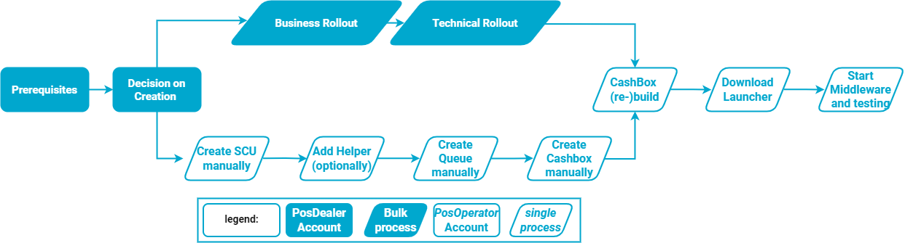

# My First Cashbox

:::info summary

After reading this, you can create a CashBox and have a functioning fiskaltrust.Middleware instance.

:::

## Introduction

Our fiskaltrust.Portal supports you as a PosDealer with two options to create your first CashBox.
We recommend [Rollout plans](#business-rollout) as our **deployment wizards** in the fiskaltrust.Portal. With Rollout Plans, you enjoy high security when creating, buying and setting up CashBoxes and related components for your PosOperators. Additionally, you save time by being able to select several PosOperators as well as several outlets at the same time.

If you want to create a configuration manually, first read the [Architecture](../business-basics/architecture.md) section to learn more about the components needed to create a CashBox then follow the guide for [Manual Configuration](../technical-operations/middleware/manual-configuration.md).

Both options require legally or commercially necessary preparations. These have been described and explained previously in this documentation. In the section [Prerequisites](#prerequisites), you will find them again summarized.

:::tip

Please make sure you use your [Sandbox](sandbox.md) account. So you avoid a bill on your account.

If you don't have one yet, please get in touch with your *PosCreator* for invitation details or [register](registration.md) a new PosDealer Sandbox account yourself.

:::

## Prerequisites

Before we roll out our Middleware instance, the following prerequisites must be in place:

* A working **Internet connection** (_please see [Network Requirements](../technical-operations/middleware/network-requirements.md)_)
* An active **PosDealer account** (*either by [registration](registration.md) or by invitation through your PosCreator*) at the fiskaltrust.Portal (Sandbox). Then, as a PosDealer, you can check `PosSystems` too to ensure that a `PosSystemId` is available. Note that this menu item is not available in the account of PosOperators.
* A checked set of Master Data and at least one outlet (_please see [Master Data](../getting-started/operator-onboarding/master-data.md)_)
* If you use a local middleware installation, a system meeting the hardware and software **[requirements](../technical-operations/middleware/supported-environments.md)**
* Any **SSCD components** (*hardware or SaaS credentials*) required for the setup, unless created during the setup itself

## Rollout Plans

### Business Rollout

A rollout plan typically follows these five steps:

1. Select the **product** you'd like to roll out.
2. Select one or more **PosOperators** for which you plan the rollout.
3. Select one or more **outlets** where you want to perform the rollout.
4. Create a **quote** and load the quote into your **shopping cart**
5. Perform the **checkout**

import Tabs from '@theme/Tabs';
import TabItem from '@theme/TabItem';

import BusinessRolloutAT from '../../_markets/at/getting-started/my-first-cashbox/_business.mdx';
import BusinessRolloutFR from '../../_markets/fr/getting-started/my-first-cashbox/_business.mdx';
import BusinessRolloutDE from '../_markets/de/getting-started/my-first-cashbox/_business.mdx';

<Tabs groupId="market">

  <TabItem value="AT" label="Austria">
    <BusinessRolloutAT />
  </TabItem>

  <TabItem value="FR" label="France">
    <BusinessRolloutFR />
  </TabItem>

  <TabItem value="DE" label="Germany">
    <BusinessRolloutDE />
  </TabItem>

</Tabs>

## Running a test request

Once the Middleware has been deployed and started, it is advisable to perform a quick check if the Middleware is generally available and responds to requests.

For that purpose, the Middleware features an echo/ping request type that responds with the received data. If you successfully get a response, the Middleware should also be ready to accept your signing requests.

:::tip postman collection

For Postman, you can download a request collection from the [Github repository](https://github.com/fiskaltrust/middleware-demo-postman).

:::

### Request details

import EchoAT from '../_markets/at/getting-started/my-first-cashbox/_echo.mdx';
import EchoFR from '../_markets/fr/getting-started/my-first-cashbox/_echo.mdx';
import EchoDE from '../_markets/de/getting-started/my-first-cashbox/_echo.mdx';

<Tabs groupId="market">

  <TabItem value="AT" label="Austria">
    <EchoAT />
  </TabItem>

  <TabItem value="FR" label="France">
    <EchoFR />
  </TabItem>

  <TabItem value="DE" label="Germany">
    <EchoDE />
  </TabItem>

</Tabs>
