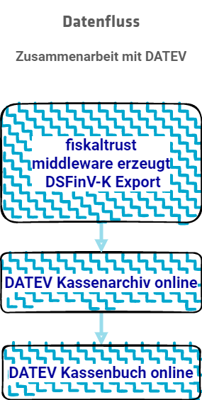

# DATEV MeinFiskal

KassenBetreiber, welche ein fiskaltrust.Sorglos-Paket nutzen, können über das fiskaltrust.Portal auf [DATEV MeinFiskal](https://www.datev.de/meinfiskal/) zugreifen. Mit Services wie DATEV Kassenarchiv online und Anbindung DATEV Kassenbuch online werden die Bestandteile des fiskaltrust.Sorglos-Pakets erweitert.

fiskaltrust übernimmt die Erzeugung und den Export der gesetzlich vorgeschriebenen Datenformate. Mit der Übermittlung dieser Daten (DSFinV-K, DFKA-Taxonomie) und, falls gewünscht weiterer Daten wie ~.tar-Files, Speisekarten, Verfahrensdokumentationen) an das DATEV Kassenarchiv online ist die Archiverung gesichert. Auf Wunsch kann dann auch die Anbindung DATEV Kassenbuch online genutzt und damit die Führung eines Kassenbuchs unterstützt werden.
Die je nach KassenHersteller spezifische Anbindung an DATEV MeinFiskal entfällt sowohl für KassenHändler als auch KassenBetreiber.

Diese Anleitung beschreibt Schritt für Schritt (Voraussetzungen, Rechtliche Hinweise, Grunddaten prüfen, Account bereitstellen, meinFiskal Konto aktivieren, Nutzung für KassenBetreiber oder Berater, Troubleshooting) die Vorgänge, wie ein KassenHändler im Account des KassenBetreibers die Verbindung zwischen dem fiskaltrust.Portal und dem DATEV MeinFiskal Benutzerkonto vorbereiten und anlegen kann.

Alternativ kann der KassenBetreiber diesen Vorgang selbst entsprechend der Anleitung durchführen. In der Regel wird er aber die Anbindung dem KassenHändler überlassen und auf die übermittelten Daten bei DATEV MeinFiskal zugreifen.

## Voraussetzungen:

* aktueller Browser in Nutzung
* Benutzerdaten für fiskaltrust.Portal vorhanden
* KassenHändler hat Berechtigung auf Vertragsabschluss
* Stammdaten beim KassenBetreiber komplett und korrekt eingetragen
* Entweder St.-ldNr. oder USt-ldNr. wurden mit der Gültigkeitsprüfung erfolgreich geprüft.
* fiskaltrust.Sorglos-Paket in Verwendung

## Rechtliche Hinweise:

* Bei der Nutzung der automatisierten Schnittstelle vom fiskaltrust.Portal zu DATEV MeinFiskal dürfen keine personenbezogenen Daten weitergegeben werden.
* Die KassenHersteller sind verpflichtet die Schnittstelle gemäß den DATEV Schnittstellenvorgaben zu konfigurieren. 
Diese stehen unter https://www.datev.de/web/de/media/datev_de/pdf/export-importschnittstelle_datev_factoring.pdf zum Download zur Verfügung.

## Grunddaten im fiskaltrust.Portal prüfen

- [ ] Melden Sie als Kassenhändler sich an im fiskaltrust.Portal.
- [ ] Wechseln Sie zu <kbd>[PosOperator](https://portal.fiskaltrust.de/PosOperator)</kbd>  &rarr; `Übersicht`.
- [ ] Geben Sie ggf. Filterkriterien ein, um die Suchergebnisse einzugrenzen und wählen Sie `Suchen`.
- [ ] Prüfen Sie mit dem Symbol bei `Berechtigungen`, ob der Eintrag `Vertragsabschluss` aktiv ist.  Falls nicht, setzen Sie sich mit dem KassenBetreiber in Verbindung und lassen diese aktivieren. Beachten Sie dazu den Hilfetext bei [Troubleshooting](#Troubleshooting)  
- [ ] Mit `OK` schließen Sie das Dialogfenster.
- [ ] Wählen Sie bei `Name*`  den Link und wechseln Sie den Account des Kassenbetreibers.
- [ ] Wählen Sie <kbd>[Firma](https://portal.fiskaltrust.de/AccountProfile/Edit)</kbd>  &rarr; Stammdaten.
- [ ] Kontrollieren Sie, ob jedes Pflichtfeld wie `Name*`, `Adresse*` ausgefüllt ist.
- [ ] Prüfen Sie auch, ob vor oder nach den Werten **keine Leerstellen** in den Feldern eingegeben wurden.
- [ ] Kontrollieren Sie, ob entweder mit `St.-ldNr.` oder mit `USt-ldNr.` eine **Gültigkeitsprüfung** erfolgreich durchgeführt werden kann.

- [ ] Sichern Sie Ihre Eingaben mit `Speichern`.

## Account bereitstellen

- [ ] Wechseln Sie im Account des Kassenbetreibers zu <kbd>[Firma](https://portal.fiskaltrust.de/AccountProfile)</kbd>  &rarr; Übersicht.

- [ ] Aktivieren Sie den Schieberegler bei `Hier können Sie Verbindungen zu Drittpartnern aktivieren:`
- [ ] Aktivieren Sie das Kästchen bei `Ich habe die AGB und die Datenschutzerklärung gelesen und akzeptiere diese.`
- [ ] Unterschreiben Sie den **Nutzungsvertrag** durch eine beliebige Eingabe.
- [ ] Der Durchführende (also im Fall dieser Anleitung der KassenHändler) erhält eine E-Mail mit der Kopie des gezeichneten Nutzungsvertrages als Anhang.  Weiter enthält diese E-Mail auch einen Link zum Download des Nutzungsvertrages.

## meinFiskal Konto aktivieren

- [ ] Im fiskaltrust.Portal wechselt bei `DATEV MeinFiskal` die Statusmeldung:

- [ ] Wählen Sie `Durchführen von MeinFiskal-Onboarding-Vorgängen`.
- [ ] Folgen Sie den Anweisungen. 
- [ ] Je nach Browsereinstellungen wird das <kbd>[Fenster zum Passwort setzen](https://meinfiskal.de/registrierung/passwort-setzen...)</kbd> **nicht im Vordergrund** angezeigt.  Wechseln Sie dann mit <kbd>Alt</kbd> & <kbd>Tab</kbd> zum gewünschten Fenster.

- [ ] Geben Sie ein Passwort ein und wiederholen Sie dieses im zweiten Feld.
- [ ] Damit Ihr Passwort sicher genug ist, muss es aus mindestens 8 Zeichen bestehen und Zeichen aus drei der nachfolgend genannten Zeichengruppen enthalten:
- [ ] Großbuchstaben, Kleinbuchstaben, Zahlen, Sonderzeichen
- [ ] Nach der Meldung namens `Vielen Dank, Passwort erfolgreich geändert!` wechseln Sie zum **Anmelden**.
- [ ] Bei der Einwilligung in elektronische Werbung (Kundenbefragungen) nach § 7 UWG können Sie `Zustimmen` oder `Überspringen` wählen.

- [ ] Im Portal von DATEV MeinFiskal werden Sie nach der Erstanmeldung um `Zustimmung zu Berechtigungen` gefragt.

- [ ] Aktivieren Sie `Zukünftig ohne Rückfrage automatisch zustimmen` und wählen Sie `Ich stimme zu`.
- [ ] Zurück im fiskaltrust.Portal wechselte bei DATEV MeinFiskal die Statusmeldung, und zeigt `Das MeinFiskal-Konto ist mit fiskaltrust verbunden.`

## Kassensystem aktivieren

- [ ] Der Durchführende, also in diesem Fall der KassenHändler erhält eine E-Mail an die im fiskaltrust.Portal hinterlegte E-Mailadresse. Diese E-Mail enthält einen Link auf den Passwort-Änderungsdialog und die Kundenstammdaten (Name, Adresse, E-Mail, Kundennummer).  **Der Link zum Passwort-Setzen ist 4 Tage gültig**. 
- [ ] Das Zurücksetzen des Passwortes kann später auch über die Portalseite (https://meinfiskal.de/registrierung/passwort-vergessen) erfolgen.

- [ ] Zur Aktivierung oder Nutzung von `DATEV MeinFiskal` melden Sie sich an unter https://meinfiskal.de/ 
- [ ] Im Portal von `DATEV MeinFiskal` zeigt die Übersicht die Option, eine Kasse mit dem Kassenarchiv zu verbinden.
- [ ] Für weitere Arbeitsschritte im DATEV MeinFiskal Benutzerkonto erkundigen Sie sich bei der DATEV.

## Nutzung für KassenBetreiber oder Berater

- [ ] KassenBetreiber erhalten nach der Aktivierung des DATEV MeinFiskal Benutzerkontos eine E-Mail an die im fiskaltrust.Portal hinterlegte E-Mailadresse.  Diese E-Mail enthält die Kundenstammdaten (Name, Adresse, E-Mail): 

- [ ] Darin ist ein Link zur Vergabe eines neuen Passwortes enthalten. Mit diesem Passwort können KassenBetreiber oder deren Berater auf das Portal von DATEV MeinFiskal zugreifen.  Die Datenübermittlung vom fiskaltrust.Portal zur KassenBuch-Schnittstelle wird damit nicht beeinflusst.
- [ ] Der Link zur Vergabe eines neuen Passwortes ist 4 Tage gültig. 

## Troubleshooting

 * Einem KassenHändler fehlt im fiskaltrust.Portal die Berechtigung zum `Vertragsabschluss`. 
 * Bei <kbd>[PosOperator](https://portal.fiskaltrust.de/PosOperator)</kbd>  &rarr; `Übersicht` ist das Recht auf Vertragsabschlusss bei `Berechtigungen` nicht aktiv.
 * Die Schaltfläche bei <kbd>[Firma](https://portal.fiskaltrust.de/AccountProfile)</kbd>  &rarr; `Übersicht` &rarr; `DATEV MeinFiskal` ist für den KassenHändler inaktiv.

  

 Die genannten Probleme liegen eventuell daran, dass der KassenBetreiber dem KassenHändler kein Recht auf `Vertragsabschluss` gewährt hat. 
    - [ ] Das Recht auf `Vertragsabschluss` kann der KassenBetreiber, nicht der KassenHändler unter <kbd>[PosOperator](https://portal.fiskaltrust.de/PosOperator)</kbd> &rarr; `Übersicht` aktivieren. 
    - [ ] Nach der Suche nach dem KassenHändler das Symbol bei `Berechtigungen` wählen und den ersten Eintrag `Vertragsabschluss` aktivieren.

* Bei <kbd>[Firma](https://portal.fiskaltrust.de/AccountProfile)</kbd>  &rarr; `Übersicht` &rarr; `DATEV MeinFiskal` beim KassenHändler konnte der Vertrag gezeichnet werden.   Aber beim Durchführen von MeinFiskal-Onboarding-Vorgängen erscheinen ständig Fehlermeldungen
    - [ ] Wechseln Sie zu Firma  &rarr; Stammdaten. 
    - [ ] Kontrollieren Sie, ob jedes Pflichtfeld ausgefüllt wurde. 
    - [ ] Kontrollieren Sie weiter, ob Leeerstellen vor oder nach den Werten eingesetzt wurden.
    - [ ] Lassen Sie die `St.-ldNr.` oder `USt-ldNr.` mit der **Gültigkeitsprüfung** prüfen
    - [ ] Wechseln Sie anschließend zu Firma  &rarr; Übersicht &rarr; DATEV MeinFiskal und testen den Verbindungsvorgang erneut.

* Das Fenster (https://meinfiskal.de/registrierung/passwort-setzen...) erscheint nicht und ist auch nicht mit <kbd>Alt</kbd> & <kbd>Tab</kbd> nicht zu finden.
 Im `fiskaltrust.Portal` erscheint ein Warnhinweis: Fehler: Looks like you have closed the password set dialog without setting a password. Please try again and make sure to set the password accordingly.
     - [ ] Aktualisieren Sie das Browserfenster vom fiskaltrust.Portal
     - [ ] Verwenden Sie dazu die Schaltfläche `Diese Seite neu laden` in der Adresszeile des Browsers oder die Funktionstaste <kbd>F5</kbd>.

* Das Mail an KassenBetreiber mit dem Link zum Passwort setzen wurde länger als vier Tage nicht beachtet. Der Link steht nicht mehr zur Verfügung.
    - [ ] Wählen Sie im Browser Ihrer Wahl https://meinfiskal.de/registrierung/passwort-vergessen.