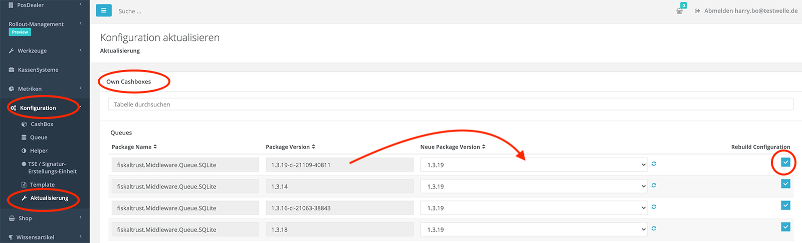
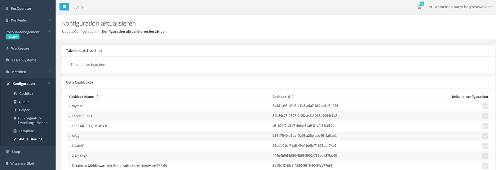

# How-To: Bulk Update von CashBoxen

Diese Anleitung beschreibt, wie Sie viele CashBoxen gleichzeitig mit Hilfe des fiskaltrust.Portals aktualisieren können. Dies ist zum Beispiel für den Fall nützlich, wenn fiskaltrust eine neuere Version eines Softwarepackage zur Verfügung stellt und Sie dieses für viele Ihrer laufenden fiskaltrust.Middleware Instanzen benötigen (z.B. die Packageversion der SQLite Queue muss für alle Kunden ausgetauscht werden). 

## Aktualisierung über das fiskaltrust.Portal

Im fiskaltrust.Portal gelangen Sie zur Ansicht für die Bulk-Aktualisierung der CashBoxen über den Menüpunkt `Konfiguration->Aktualisierung`.  Sie haben hierbei die Wahl die CashBoxen des aktuellen Account zu aktualisieren und/oder die CashBoxen aller Ihnen zugewiesenen KassenBetreiber zu aktualisieren, falls Sie in Ihrem Account als KassenHändler eingeloggt sind.

Jede CashBox kann die Module `Queue`, `Helper` und `SCU` beinhalten. Je nachdem für welches Modul Sie die Packageversion aktualisieren möchten (z.B.  für `fiskaltrust.Middleware.Queue.SQLite` von Version `1.3.8` auf `1.3.9`) können Sie hier Ihren Aktualisierungswunsch mittels den angezeigten Dropdowns angeben. Des Weiteren steht Ihnen zudem die Möglichkeit zur Verfügung die durch Ihre Angaben zu aktualisierenden CashBoxen gleich neu zu publizieren, indem sie das Kästchen "Rebuild Configuration" für jede Aktualisierungsangabe selektieren. 

Nach der Vornahme der Aktualisierungseinstellungen und optional der Selektion von "Rebuild Configuration", können Sie mit Hilfe des Buttons "Übermitteln" Ihre Auswahl zur Verarbeitung durch das fiskaltrust.Portal übermitteln. Das fiskaltrust.Portal überprüft dabei Ihre Angaben und stellt Ihnen eine Übersicht der zu ändernden CashBoxes zur Überprüfung bereit. 

Überprüfen Sie die Übersicht und wenn Sie mit den Angaben zufrieden sind, drücken Sie als nächstes den "Ausführen" Button um die Aktualisierung durchzuführen.

## CashBoxen neu publizieren

Sollten Sie in dem oben beschriebenen Schritt zur Aktualisierung der CashBoxen die Option "Rebuild Configuration" nicht gewählt haben, so müssen sie dies vor dem Ausrollen unter `Konfiguration -> CashBox` für jede betroffene CashBox manuell vornehmen. Erst dadurch steht die Konfigurationsänderung für die fiskaltrust.Middleware Instanzen zum Download bereit.

 

## fiskaltrust.Middleware neu starten

Nach dem Bereitstellen der neuen Konfigurationen (CashBoxen) stehen diese für die fiskaltrust.Middlware Instanzen zum Download bereit. Die fiskaltrust.Middleware Instanz wird jedoch die aktualisierte CashBox erst nach Neustart herunterladen und anwenden. Dies kann zum Beispiel im Rahmen eines nächtlichen Neustart des Rechners automatisch passieren oder manuell von Ihnen angetriggert werden, indem Sie die fiskaltrust.Middleware Instanz manuell stoppen und neu starten.
