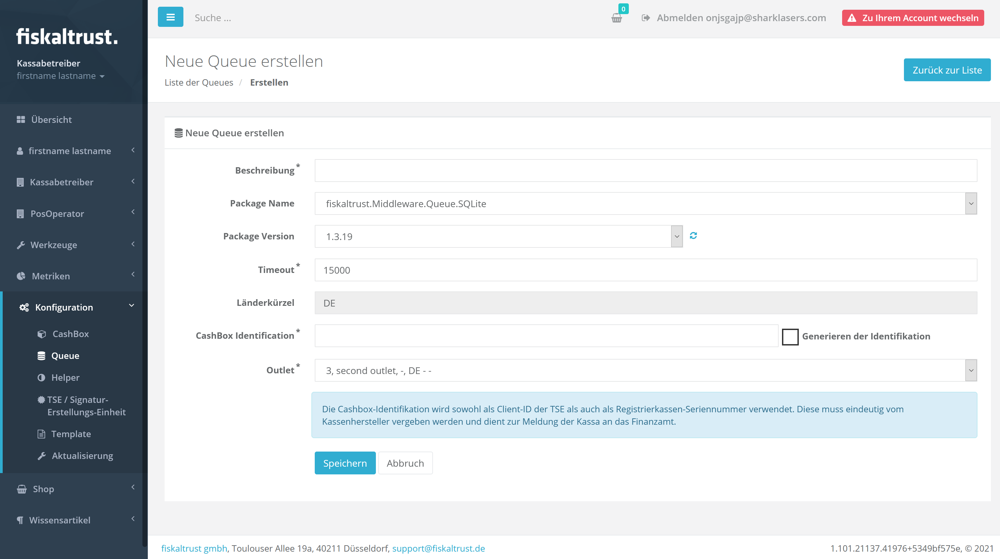
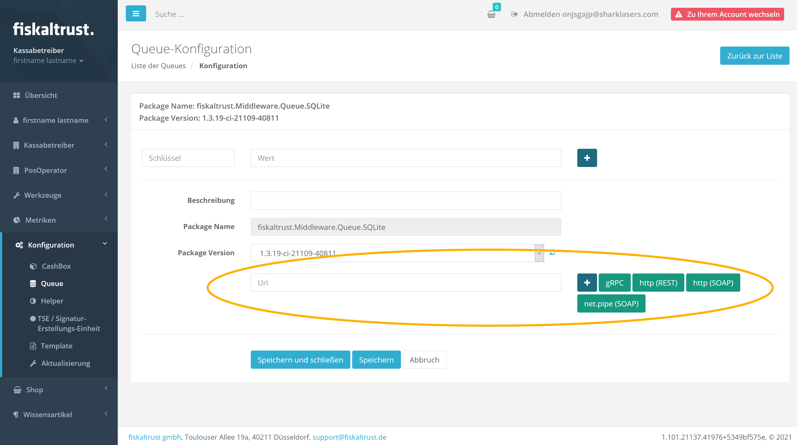

# Eine TSE pro Kassa

Dieser Leitfaden führt Sie durch eine Basisinstallation mit einer dedizierten Cashbox (eine *Queue* mit einer *SCU/TSE*) für jede Kassa.

## 0 - Voraussetzungen
Als Händler stellen Sie bitte sicher, dass Sie zuerst die **Surrogate Funktion** benutzt haben, um in das **Konto Ihres Kunden zu wechseln und Änderungen in diesem Kontext auszuführen**.

Dazu klicken Sie bitte linkerhand `PosOperator` - `Übersicht`, suchen das Konto Ihres Kunden und klicken auf den dazugehörigen Namen.

*Sollte es nicht möglich sein den Namen anzuklicken, überprüfen Sie bitte das Statusicon und stellen sicher, dass Ihr Kunde bereits aktiv geschalten ist (ansonsten hätte er möglicherweise sein Kontoerstellung noch nicht abgeschlossen).*

Sobald Sie in das Konto Ihres Kunden eingestiegen sind, erhalten Sie rechts oben einen roten Knopf mit der Aufschrift `Zu Ihrem Account wechseln`. Dies zeigt einerseits an, dass Sie erfolgreich in das Konto Ihres Kunden gewechselt haben, andererseits können Sie damit zu Ihrem eigenen Konto zurückwechseln.

## 1 - Erstellung der SCU
### Schritt 1 - Navigation im Menü
Wählen Sie linkerhand im Menü `Konfiguration` - `TSE / Signatur-Erstellungs-Einheit`.

### Schritt 2 - Hinzufügen

Klicken Sie den `Hinzufügen` Knopf.

### Schritt 3 - Eingabe der Details

Geben Sie einen aussagekräftigen Namen für Ihre neue SCU im Feld Beschreibung an, wählen Sie das korrekte Paket und die neueste Version für Ihre konkrete TSE und wählen Sie das Outlet, in welchem diese SCU aktiv sein soll. Nach Auswahl vom Paket wird das Portal automatisch die aktuellste Paketversion als Standard auswählen.

Klicken Sie `Speichern` sobald Sie alle Informationen eingegeben habe. Danach werden Sie zu einem Schirm umgeleitet, wo Sie zusätzliche technische Details konfigurieren können. Die Mehrheit dieser Einstellungen ist TSE-spezifisch (*im folgenden Beispiel haben wir eine Fiskaly Cloud TSE* ausgewählt) und erfordert die korrekten Werte für diese TSE (z.B. den richtigen Laufwerksbuchstaben oder den korrekten API Schlüssel).
*Eine vollständige Liste aller möglichen Optionen für jeden TSE Typ kann [hier](https://docs.fiskaltrust.cloud/de/docs/posdealers/rollout-doc/middleware#templating-zum-anlegen-von-cashboxen) im Abschnitt `SCU` gefunden werden.*

Ein weiterer wichtiger Punkt hier ist die URL, unter welcher die SCU für die Queue verfügbar sein soll. Diese besteht aus drei Elementen

1. dem **Kommunikationsprotokoll**. Sie können zwischen gRPC, REST, SOAP und net.pipe wählen
2. dem **Hostname** (für dieses Beispiel sollte er `localhost` sein)
3. dem für die SCU spezifischen **URL Pfad**

Klicken Sie auf einen der verfügbaren Protokolltypen um automatische eine passende URL dafür zu generieren. Sie können die Standardwerte beibelassen, ausser Sie benötigen hier spezifische Werte.

> **Es ist wichtig, dass Ihre SCU URL nicht den gleichen Netzwerk-Port verwendet wie die URL, welche Sie später für Ihre Queue verwenden möchten.**

Sobald Sie die Konfiguration abgeschlossen haben scrollen Sie zum Seitenende, klicken `Speichern und schliessen` und die neue SCU sollte auf dem folgenden Schirm unter den SCUs Ihres Kunden aufgeführt sein.

## 2 - Erstellung der Queue
### Schritt 1 - Navigation im Menü
Wählen Sie linkerhand im Menü `Konfiguration` - `Queue`.

### Schritt 2 - Hinzufügen
Klicken Sie den `Hinzufügen` Knopf.

### Schritt 3 - Eingabe der Details

Geben Sie einen aussagekräftigen Namen für Ihre neue Queue im Feld Beschreibung an, wählen Sie das korrekte Paket für den gewünschten Datenbanktyp, sowie die neueste Version (*wenn Sie SQLite wählen, wird die Middleware die Datenbank automatisch erstellen*), wählen Sie den gewünschten Timeout Wert aus (Standard sind 15.000 Millisekunden), geben Sie die Serien- oder Identifikationsnummer Ihrer Kassa an (*oder wählen Sie `Generieren der Identifikation` aus um das Portal eine eindeutige Nummer generieren zu lassen*) und wählen Sie das Outlet, in welchem diese Queue aktiv ist aus.

Sobald Sie alle Informationen eingetragen haben, scrollen Sie ans untere Ende der Seite und klicken `Speichern`, worauf Sie auf einen Schirm umgeleitet werden, wo Sie zusätzliche technische Details konfigurieren können. Der wichtigste Teil hier, ist die URL unter welcher die Queue IPOS Anfragen von Ihrer Kassa entgegennehmen soll. Diese URL besteht aus drei Elementen

1. dem **Kommunikationsprotokoll**. Sie können zwischen gRPC, REST, SOAP und net.pipe wählen
2. dem **Hostname** (wählen Sie `localhost` falls die Queue auf derselben Maschine läuft wie Ihr Kassasystem)
3. dem für die Queue spezifischen **URL Pfad**

Klicken Sie auf einen der verfügbaren Protokolltypen um automatische eine passende URL dafür zu generieren. Sie können die Standardwerte beibelassen, ausser Sie benötigen hier spezifische Werte.

> **Es ist wichtig, dass Ihre Queue URL nicht den gleichen Netzwerk-Port verwendet wie die URL welche Sie im vorigen Schritt für die SCU verwendet haben.**

Klicken Sie `Speichern und schliessen` sobald Sie die Konfiguration abgeschlossen haben. Die neue Queue sollte dann auf dem folgenden Schirm unter den Queues Ihres Kunden aufgeführt sein.

## 3 - Erstellung der Cashbox

Die Cashbox ist der zentrale Einstiegspunkt und beinhaltet die komplette Konfiguration Ihrer Middleware Instanz und vereint und verbindet die Queue mit der SCU.

### Schritt 1 - Navigation im Menü

Wählen Sie linkerhand im Menü `Konfiguration` - `CashBox`.

### Schritt 2 - Hinzufügen

Klicken Sie den `Hinzufügen` Knopf.

### Schritt 3 - Eingabe der Details

Geben Sie einen aussagekräftigen Namen für Ihre neue Cashbox im Feld Beschreibung an und wählen Sie das Outlet, in welchem diese Cashbox aktiv sein soll aus. Optional kann auch ein Hostname oder IP Adresse angegeben werden, welche dann als Standardwerte für etwaige externe SCUs verwendet wird.

Klicken Sie auf `Speichern` sobald Sie alle Informationen eingegeben haben und die neue Cashbox sollte auf dem folgenden Schirm unter den Cashboxen Ihres Kunden aufgeführt sein.

### Schritt 4 - Verbindung der Komponenten

* Zurück bei der Liste der Cashbox, klicken Sie den `Bearbeiten per Liste` Knopf.

* Auf dem folgenden Schirm müssen Sie die vorher erstellte Queue für diese Cashbox auswählen, indem Sie die richtige Zeile anwählen.

Zusätzlich müssen Sie die **Queue mit der SCU verbinden**, indem Sie das Pop-Out Icon auf der rechten Seite anklicken. Dies öffnet folgenden Schirm, wo Sie die vorher erstellte SCU auswählen und `Speichern und schliessen` anklicken.

* Wir haben jetzt die Queue für die Cashbox konfiguriert und sie mit der SCU verbunden, müssen jedoch noch die SCU selbst der Cashbox hinzufügen, indem wir die richtige Zeile anwählen.

## 4 - Cashbox Build

Dies ist ein **wichtiger Schritt**, welchen Sie immer durchführen müssen nachdem Sie eine Cashbox erstellt, **oder geändert**, haben.

Um ein Build, oder Rebuild, einer Cashbox durchzuführen, öffnen Sie die Liste aller Ihrer Cashboxen und klicken den `Rebuild configuration` Knopf bei der entsprechenden Cashbox, sofern dieser in Orange markiert ist.

Der Build Prozess ist relativ schnell und innerhalb weniger Sekunden fertig. Sobald der Rebuild Knopf grau ist haben Sie eine aktuelle Konfiguration.

## Zusammenfassung

An diesem Punkt sollten Sie folgende Komponenten haben

* eine **SCU**, verbunden mit Ihrer TSE
* eine **Queue** (mit einer integrierten Datenbank, falls Sie SQLite gewählt haben), verbunden mit der SCU
* und eine **Cashbox**, welche sowohl die SCU, als auch die Queue beinhaltet

Sie können nun den Launcher Ihrer Wahl herunterladen und mit seiner Cashbox Konfiguration auf Ihrem Kassasystem ausrollen.