# Rechenzentrum als Operational Environment

Dieser Leitfaden führt Sie durch ein Setup wo Ihre Outlets Kassenterminals verwenden und durch ein zentrales Kassensystem in Ihrem Rechenzentrum verrechnen. Weiters führt das Kassensystem für jedes Outlet eine eigene Cashbox (mit eigener Queue und SCU), welche jeweils abhängig davon von welchem Outlet die Anfrage gekommen ist, angesprochen wird.


Diese Konfiguration beinhaltet eine Anzahl von traditionellen Queue/SCU Setups, jedoch mit dem grössten Unterschied, dass diese *nicht die klassische integrierte SQLite Datenbank* verwenden, sondern **stattdessen eine externe MySQL Datenbank**.

In diesem Tutorial stellen wir zuerst sicher, dass die Datenbank funktionsfähig ist. Danach setzen wir folgende Komponenten auf

1. eine SCU
2. eine Queue
3. eine Cashbox, welche die SCU und die Cashbox beinhaltet


## 0 - Voraussetzungen
Als Händler stellen Sie bitte sicher, dass Sie zuerst die **Surrogate Funktion** benutzt haben, um in das **Konto Ihres Kunden zu wechseln und Änderungen in diesem Kontext auszuführen**.

Dazu klicken Sie bitte linkerhand `PosOperator` - `Übersicht`, suchen das Konto Ihres Kunden und klicken auf den dazugehörigen Namen.

*Sollte es nicht möglich sein den Namen anzuklicken, überprüfen Sie bitte das Statusicon und stellen sicher, dass Ihr Kunde bereits aktiv geschalten ist (ansonsten hätte er möglicherweise sein Kontoerstellung noch nicht abgeschlossen).*

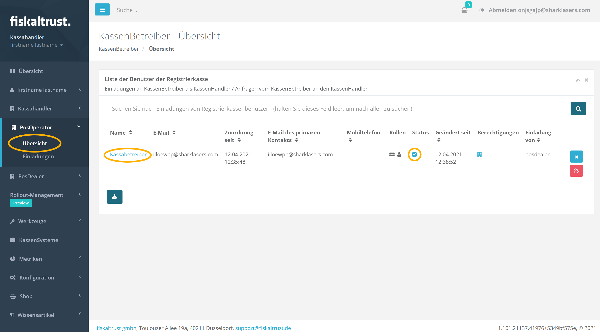


Sobald Sie in das Konto Ihres Kunden eingestiegen sind, erhalten Sie rechts oben einen roten Knopf mit der Aufschrift `Zu Ihrem Account wechseln`. Dies zeigt einerseits an, dass Sie erfolgreich in das Konto Ihres Kunden gewechselt haben, andererseits können Sie damit zu Ihrem eigenen Konto zurückwechseln.

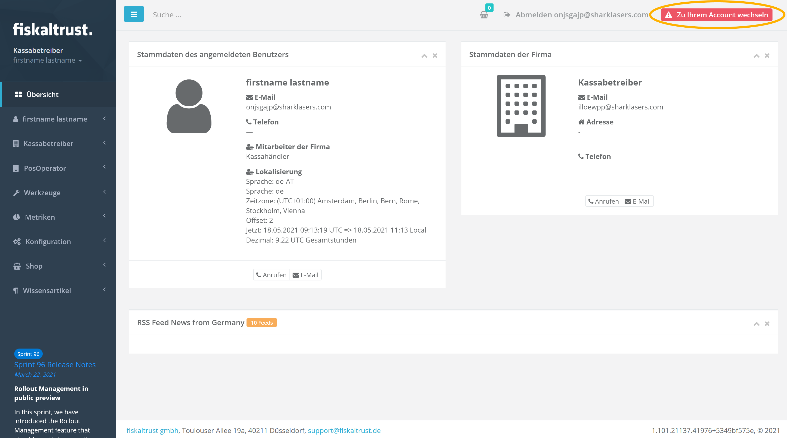


## 1 - Überprüfung der Datenbankverbindung

Da wir keine integrierte SQLite Datenbank in diesem Tutorial verwenden, vergewissern Sie sich bitte, dass Ihr MySQL Instanz aktiv und korrekt für die jeweiligen Queue Setups konfiguriert ist. https://dev.mysql.com/doc/refman/8.0/en/ hat weitere konkrete Details zum MySQL Setup.


## 2 - Erstellung der SCU
### Schritt 1 - Navigation im Menü
Wählen Sie linkerhand im Menü `Konfiguration` - `TSE / Signatur-Erstellungs-Einheit`.


### Schritt 2 - Hinzufügen

Klicken Sie den `Hinzufügen` Knopf.

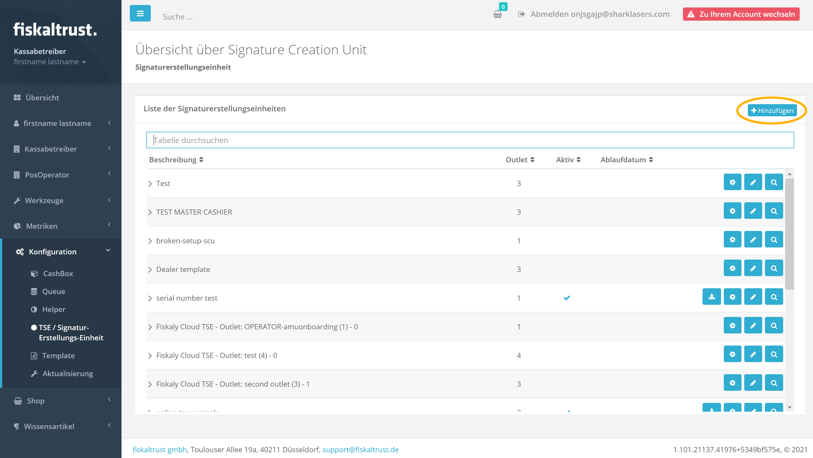

### Schritt 3 - Eingabe der Details
Geben Sie einen aussagekräftigen Namen für Ihre neue SCU im Feld Beschreibung an, wählen Sie das korrekte Paket und die neueste Version für Ihre konkrete TSE und wählen Sie das Outlet, in welchem diese SCU aktiv sein soll. Nach Auswahl vom Paket wird das Portal automatisch die aktuellste Paketversion als Standard auswählen.

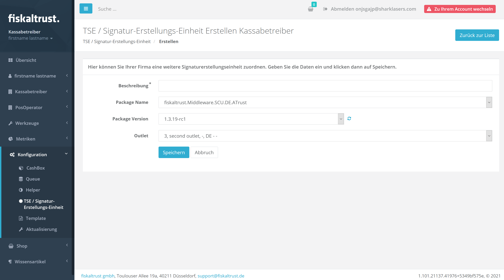


Klicken Sie `Speichern` sobald Sie alle Informationen eingegeben habe. Danach werden Sie zu einem Schirm umgeleitet, wo Sie zusätzliche technische Details konfigurieren können. Die Mehrheit dieser Einstellungen ist TSE-spezifisch (*im folgenden Beispiel haben wir eine Fiskaly Cloud TSE* ausgewählt) und erfordert die korrekten Werte für diese TSE (z.B. den richtigen Laufwerksbuchstaben oder den korrekten API Schlüssel).
*Eine vollständige Liste aller möglichen Optionen für jeden TSE Typ kann [hier](https://docs.fiskaltrust.cloud/de/docs/posdealers/rollout-doc/middleware#templating-zum-anlegen-von-cashboxen) im Abschnitt `SCU` gefunden werden.*

Ein weiterer wichtiger Punkt hier ist die URL, unter welcher die SCU für die Queue verfügbar sein soll. Diese besteht aus drei Elementen

1. dem **Kommunikationsprotokoll**. In einem Rechenzentrums Kontext ist es **wichtig hier `gRPC` auszuwählen**
2. dem **Hostname**. Vergewissern Sie sich, dass die hier ausgewählte Adresse von all Ihren Queues erreichbar ist
3. dem für die SCU spezifischen **URL Pfad**

Klicken Sie auf einen der verfügbaren Protokolltypen um automatische eine passende URL dafür zu generieren. Sie können die Standardwerte beibelassen, ausser Sie benötigen hier spezifische Werte.


> **Es ist wichtig, dass Ihre SCU URL nicht den gleichen Netzwerk-Port verwendet wie die URL, welche Sie später für Ihre Queue verwenden möchten.**


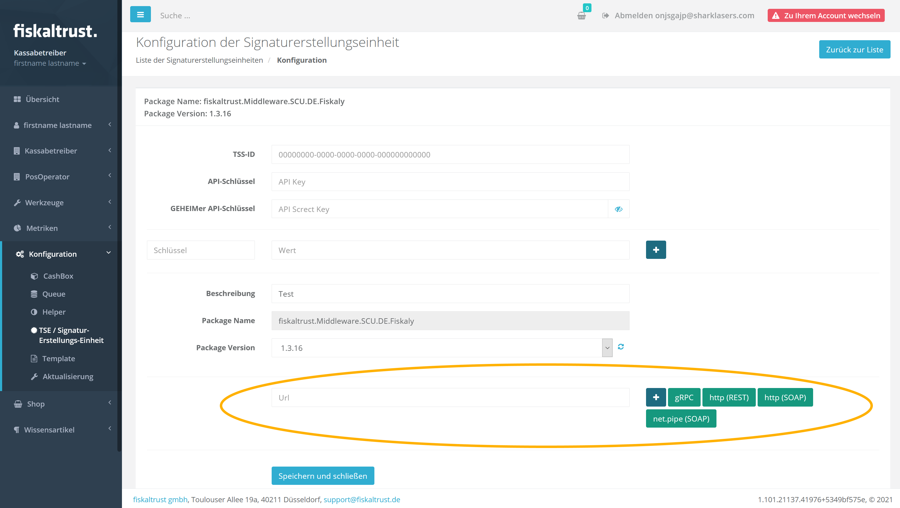

Sobald Sie die Konfiguration abgeschlossen haben scrollen Sie zum Seitenende, klicken `Speichern und schliessen` und die neue SCU sollte auf dem folgenden Schirm unter den SCUs Ihres Kunden aufgeführt sein.


## 3 - Erstellung der Queue

### Schritt 1 - Navigation im Menü

Wählen Sie linkerhand im Menü `Konfiguration` - `Queue`.

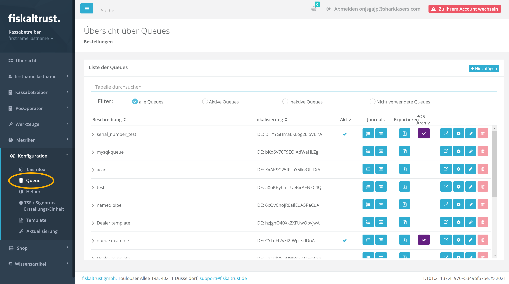

### Schritt 2 - Hinzufügen

Klicken Sie den `Hinzufügen` Knopf.

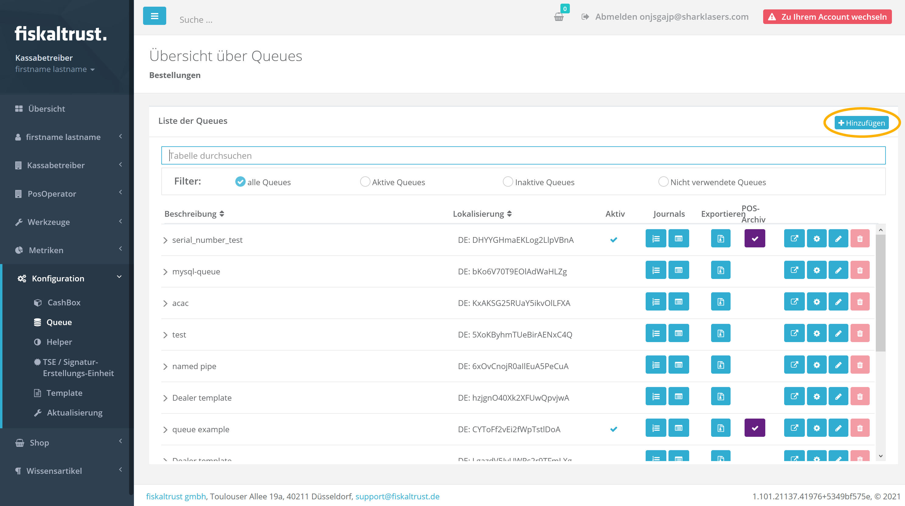

### Step 3 - Entering the details

Geben Sie einen aussagekräftigen Namen für Ihre neue Queue im Feld Beschreibung an, wählen Sie `fiskaltrust.Middleware.Queue.MySQL` als gewünschten Datenbanktyp, sowie die neueste Version, wählen Sie den gewünschten Timeout Wert aus (Standard sind 15.000 Millisekunden), geben Sie die Serien- oder Identifikationsnummer Ihrer Kassa an (*oder wählen Sie `Generieren der Identifikation` aus um das Portal eine eindeutige Nummer generieren zu lassen*) und wählen Sie das Outlet, in welchem diese Queue aktiv ist aus.

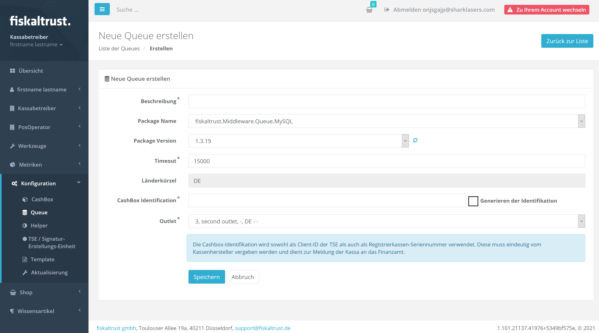

Sobald Sie alle Informationen eingetragen haben, scrollen Sie ans untere Ende der Seite und klicken `Speichern`, worauf Sie auf einen Schirm umgeleitet werden, wo Sie zusätzliche technische Details konfigurieren können.

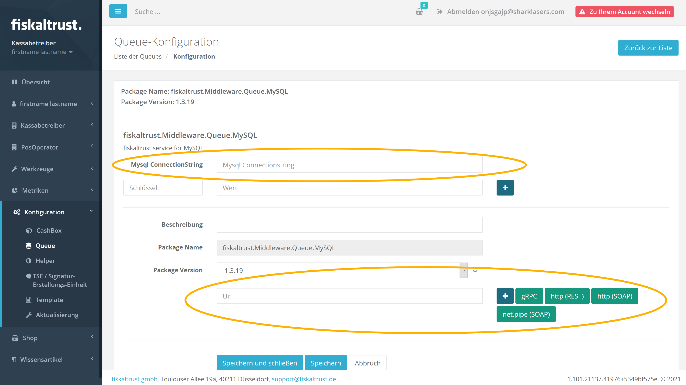

Der wichtigste Teil hier der MySQL Connection String und die URL unter welcher die Queue IPOS Requests von Ihrer Kassa entgegenehmen soll.

#### MySQL Connection String

Bitte geben Sie hier einen gültigen .NET Connection String an, welcher alles Details für den Zugriff auf Ihre Datenbank beinhalt (z.B. Hostname, Benutzername, Password). Ein typischer Connection String wäre wie folgt formatiert

```
Server=myServerAddress;Database=myDataBase;Uid=myUsername;Pwd=myPassword;
```

Weitere Beispiele und Details finden Sie unter https://dev.mysql.com/doc/connector-net/en/connector-net-connections-string.html.

> Bitte stellen Sie auch sicher, dass jede Queue ihre eigene Datenbank hat, welche nicht mit anderen Queues geteilt wird.

#### Queue URL

Diese URL besteht aus drei Elementen

1. dem **Kommunikationsprotokoll**. In einem Rechenzentrums-Kontext **wählen Sie bitte hier `REST`**
2. dem **Hostname** (bitte wählen Sie hier den richtigen Hostname, unter welchem die Queue für das Kassensystem erreichbar sein wird)
3. dem für die Queue spezifischen **URL Pfad**

Klicken Sie auf einen der verfügbaren Protokolltypen um automatische eine passende URL dafür zu generieren.

Klicken Sie `Speichern und schliessen` sobald Sie die Konfiguration abgeschlossen haben. Die neue Queue sollte dann auf dem folgenden Schirm unter den Queues Ihres Kunden aufgeführt sein.


> **Es ist wichtig, dass Ihre Queue URL nicht den gleichen Netzwerk-Port verwendet wie die URL welche Sie im vorigen Schritt für die SCU verwendet haben.**


## 4 - Erstellung der Cashbox

### Schritt 1 - Navigation im Menü

Wählen Sie linkerhand im Menü `Konfiguration` - `CashBox`.

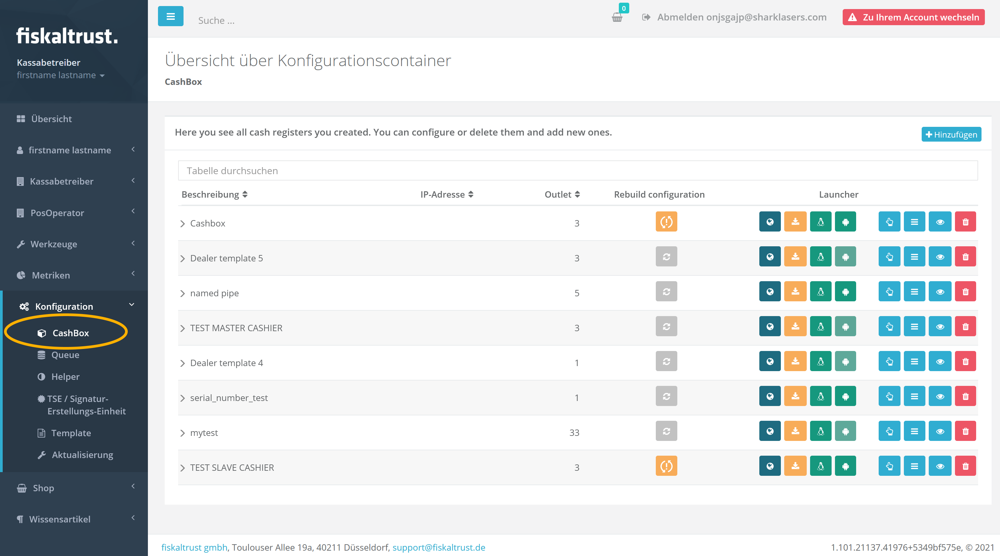


### Schritt 2 - Hinzufügen

Klicken Sie den `Hinzufügen` Knopf.

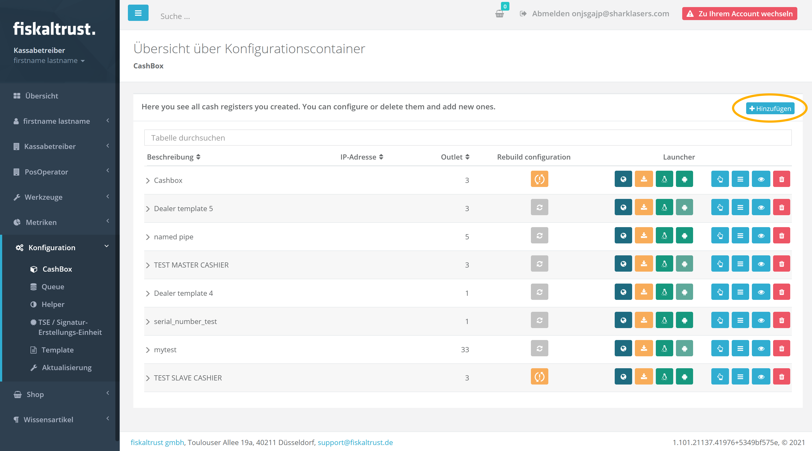


### Schritt 3 - Eingabe der Details

Geben Sie einen aussagekräftigen Namen für Ihre neue Cashbox im Feld Beschreibung an und wählen Sie das Outlet, in welchem diese Cashbox aktiv sein soll aus.

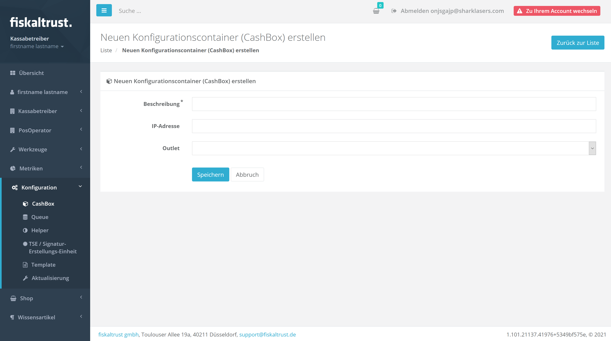

Klicken Sie auf `Speichern` sobald Sie alle Informationen eingegeben haben und die neue Cashbox sollte auf dem folgenden Schirm unter den Cashboxen Ihres Kunden aufgeführt sein.


### Schritt 4 - Verbindung der Komponenten

Zurück bei der Liste der Cashbox, klicken Sie den `Bearbeiten per Liste` Knopf.

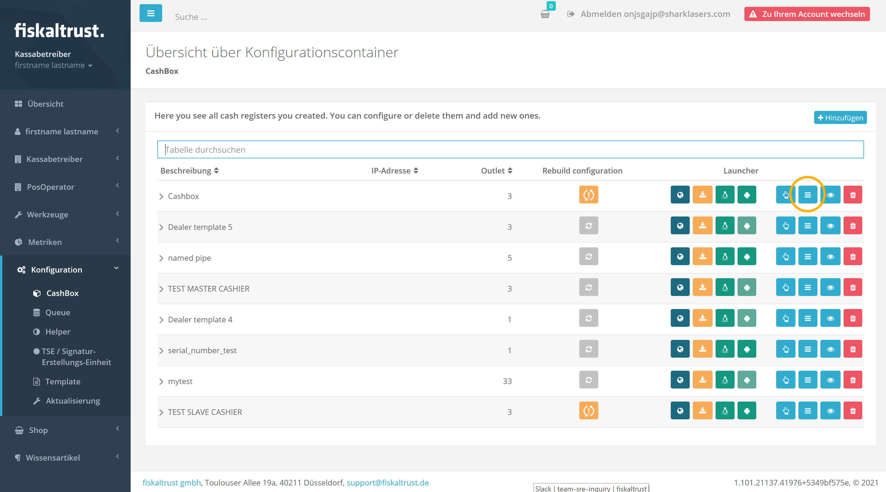


Auf dem folgenden Schirm müssen Sie die vorher erstellte Queue für diese Cashbox auswählen, indem Sie die richtige Zeile anwählen.

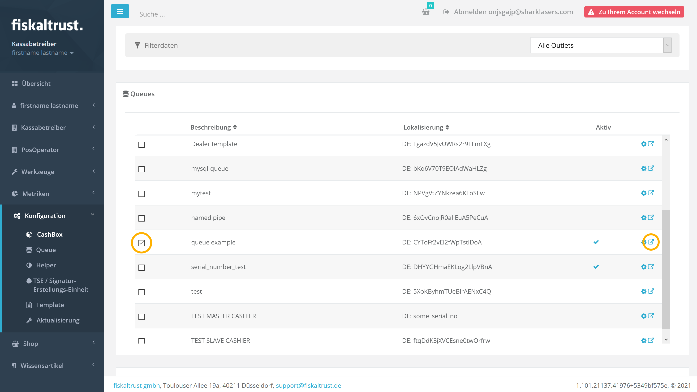

Zusätzlich müssen Sie die **Queue mit der SCU verbinden**, indem Sie das Pop-Out Icon auf der rechten Seite anklicken. Dies öffnet folgenden Schirm, wo Sie die vorher erstellte SCU auswählen und `Speichern und schliessen` anklicken.

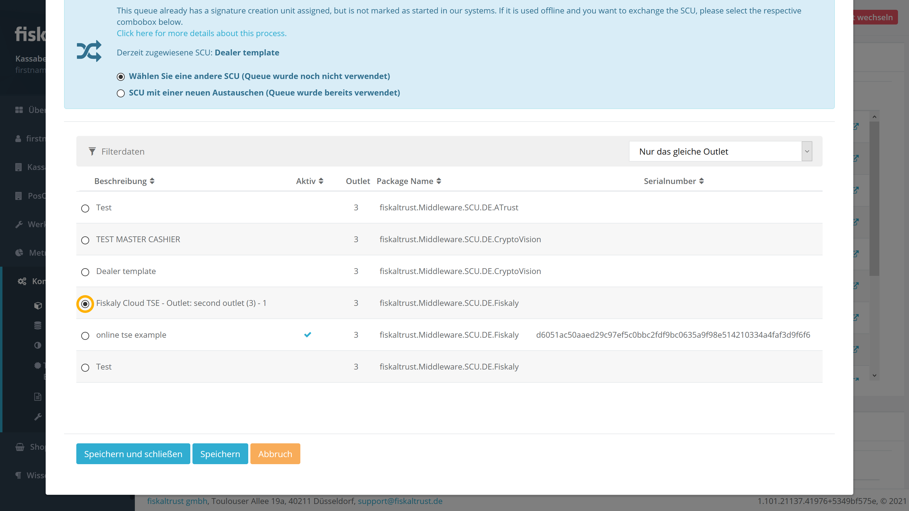


Wir haben jetzt die Queue für die Cashbox konfiguriert und sie mit der SCU verbunden, müssen jedoch noch die SCU selbst der Cashbox hinzufügen, indem wir die richtige Zeile anwählen.

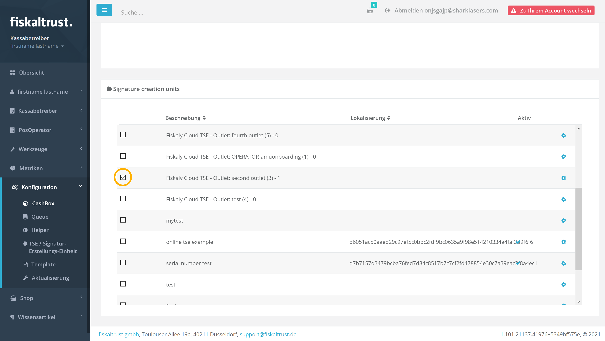


Scrollen Sie an das untere Ende der Seite und klicken `Speichern`.


## 5 - Weitere Outlets

Wiederholen Sie die Punkte 2 bis 4 für jedes weitere Outlet, welches Sie konfigurieren möchten und wo Sie Ihrem POS System eine Queue zur Verfügung stellen möchten.


## 6 - Cashbox Build

Dies ist ein **wichtiger Schritt**, welchen Sie immer durchführen müssen nachdem Sie eine Cashbox erstellt, **oder geändert**, haben.

Um ein Build, oder Rebuild, einer Cashbox durchzuführen, öffnen Sie die Liste aller Ihrer Cashboxen und klicken den `Rebuild configuration` Knopf bei der entsprechenden Cashbox, sofern dieser in Orange markiert ist.

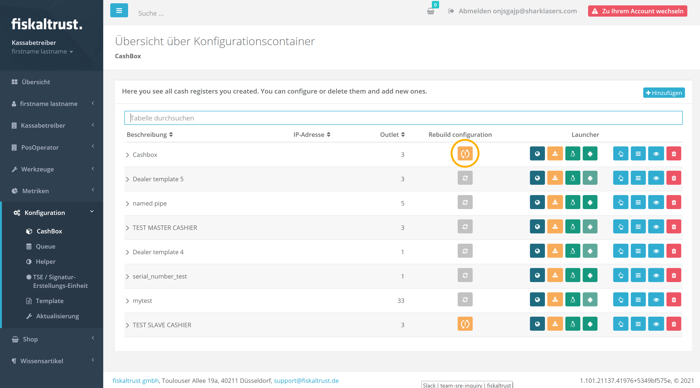

Der Build Prozess ist relativ schnell und innerhalb weniger Sekunden fertig. Sobald der Rebuild Knopf grau ist haben Sie eine aktuelle Konfiguration.


## Zusammenfassung

An diesem Punkt sollten Sie über eine Anzahl von Cashboxen für Ihr Setup verfügen (jede mit ihrer eigenen Queue, SCU und TSE), wo jede Queue ihre **eigene MySQL Datenbank verwendet**. Nun ist es wichtig, dass Ihr POS System so konfiguriert ist, dass es jeweils die richtige Queue anspricht, wenn es einen Request von seinen Kassenterminals erhält.
