# fiskaltrust-Produkte kaufen und weiter verkaufen (für DE)

## Einleitung

fiskaltrust bietet für KassenHersteller eine lizenzkostenfreie fiskaltrust.Middleware an und kostenpflichtige Add-On Produkte (die auf die fiskaltrust.Middleware aufbauen) sowie Einzelprodukte (unabhängig von der fiskaltrust.Middleware) für Kassenbetreiber an.
Diese fiskaltrust Produkte werden ausschließlich über unsere Kassenhändler-Partner als Bestandteil ihrer Produkt- bzw. Ihrer Service-Palette an Kassenbetreiber vertrieben. Hierbei handelt es sich um Archivierungsprodukte, automatisierte Meldungen an das Finanzamt, Technische Sicherheitseinrichtungen (TSE) diverser Hersteller und auch um Sorglospakete mit und ohne TSE-as-a-Service. Eine aktuelle Auflistung unserer Produkte finden Sie in unserer [Produkt-Dokumentation](https://docs.fiskaltrust.cloud/docs/posdealers/get-started/products).  

Im Rahmen des Rollouts führt der Kassenhändler folgende Schritte durch:
- Anzahl der Produkte kalkulieren
- Einkäufe im [fiskaltrust.Portal](https://portal.fiskaltrust.de/) vorbereiten
- Produkte erwerben
- Produkte als Ansprüche an Kassenbetreiber übertragen
- Ansprüche des Kassenbetreibers aktivieren  

In diesem Kapitel gehen wir auf diese Schritte ein und zeigen wie diese mit Hilfe des [fiskaltrust.Portals](https://portal.fiskaltrust.de/) von Kassenhändlern ausgeführt werden können. Zudem stellen wir Ihnen gerne auch ein [Video](https://www.youtube.com/watch?v=l6IcV7o_LFM&t=8s) mit einer Anleitung zur Verfügung.

### Anzahl der Produkte kalkulieren

Bevor Sie fiskaltrust kontaktieren, recherchieren Sie, wie viele Kunden und wie viele Kassensysteme diese wiederum haben. Schätzen Sie dann, welche Kunden eher ein fiskaltrust.Sorglos-Bundle erwerben oder eine günstigere Lösung bevorzugen werden. Zu guter Letzt sollten Sie abschätzen, wie viele Kunden eine TSE benötigen werden.     

Der Einkauf von fiskaltrust Produkten findet über den fiskaltrust.Shop statt. Dieser ist Bestandteil des fiskaltrust.Portals. Im Bereich "Produkte" werden je nach [Partnerrolle](../introduction.md#die-unterschiedlichen-rollen-der-fiskaltrust-partner) ausgewählte fiskaltrust Produkte zum Kauf angeboten. Für Kassenhändler sind das neben diversen TSE sogenannte "Händlereinkaufsprodukte", die sogenannte Entitlements, also Ansprüche darstellen:

Nach Ihrer Registrierung im [fiskaltrust.Portal](https://portal.fiskaltrust.de/) ist die Unterzeichnung der Nutzungsvereinbarung notwendig. Wir empfehlen, auch die hinterlegten Daten, wie Namen, Anschrift und Mailadressen zu prüfen. 
Kontaktieren Sie dann unser Sales Team unter sales@fiskaltrust.de. Vereinbaren Sie entsprechend Ihrer Kalkulation Mengenrabatt und Kreditrahmen. 
Im fiskaltrust.Portal finden Sie unter "Shop &rarr; Produkte" je nach [Partnerrolle](../introduction.md#die-unterschiedlichen-rollen-der-fiskaltrust-partner) passende fiskaltrust Produkte. Für Kassenhändler sind das neben diversen TSE sogenannte "Händlereinkaufsprodukte", die sogenannte Entitlements, also Ansprüche darstellen:

### Produkte erwerben

Kassenhändler kaufen im fiskaltrust.Portal sogenannte "Entitlements", also Ansprüche auf die fiskaltrust Produkte, nicht die Produkte selbst.
Diese Ansprüche werden auf die Kassenbetreiber übertragen und für die Kassenbetreiber pro Standort aktiviert. Mit der Aktivierung der Ansprüche wird das Produkt eindeutig dem Kassenbetreiber und seinem Kassensystem zugeordnet.

Kassenhändler kaufen im fiskaltrust.Portal nicht die fiskaltrust Produkte selbst, sondern sogenannte "Entitlements" also Ansprüche auf die Produkte, die sie dann an die Kassenbetreiber einzeln übertragen und für diese pro Standort aktivieren können. Die Entitlements werden im fiskaltrust.Shop auch unter dem Namen "Händlereinkaufsprodukte" geführt.

Im folgenden Beispiel zeigen wir Ihnen wie Sie als Kassenhändler **nach** der Unterzeichnung eines Rahmenvertrags mit entsprechenden Mengenrabatten und Kreditlimitfreigabe im fiskaltrust.Shop Entitlements erwerben können. 

Gehen Sie im fiskaltrust.Portal auf den Menüpunkt "Shop &rarr; Produkte" und legen Sie hier z.B. 15 Stück der Produkts "fiskaltrust.Sorglos mit TSE Händlereinkaufsprodukt" in den Warenkorb:

In der oberen Leiste wird ein Warenkorb-Symbol angezeigt. Mit Klick darauf erscheint ein Popup. Wählen Sie hier "Checkout":

Als Nächstes wird die Zusammenfassung Ihrer Bestellung angezeigt:

Überprüfen Sie die Daten wie Produktbeschreibung, deren Anzahl sowie die dargestellten Preise. Mit dem Button: "Verbindlich Bestellen" erhalten Sie eine Bestätigung zu Ihrer Bestellung:

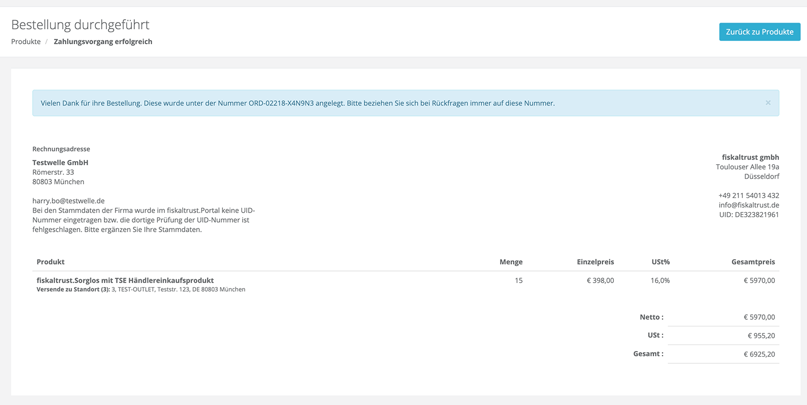

Diese Bestätigung Ihrer Bestellung wird auch per Email an die hinterlegte Mailadresse versandt. Sie können zudem Ihre Bestellungen in dem Bereich "Shop &rarr; Bestellungen" einsehen:

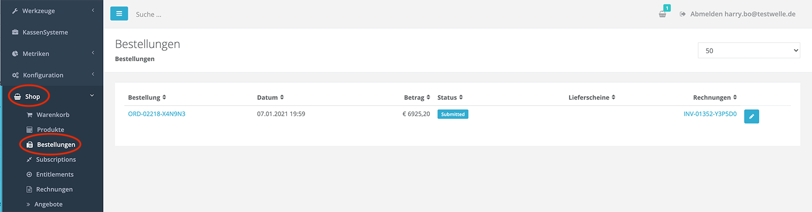

Die dazugehörige Rechnung finden Sie unter "Shop &rarr; Rechnungen".

Nach der Bearbeitung der Bestellung durch das fiskaltrust System, erscheinen im Bereich "Shop &rarr; Entitlements" die Ihnen gutgeschriebenen Ansprüche. In unserem Beispiel erhalten wir 15 Entitlements zur Einlösung des Sorglospakets und 15 Ansprüche auf Einlösung einer  TSE-as-a-Service:

### Produkte als Ansprüche an Kassenbetreiber übertragen

Drücken Sie nun auf den Namen des Kassenbetreibers, der in der Liste als Link dargestellt wird (sollte hier der Name des Kassenbetreibers nicht als Link erscheinen, dann hat dieser die Nutzungsvereinbarung noch nicht unterschrieben). Mit dem Link werden Sie zum Account des Kassenbetreibers weitergeleitet. Den Wechsel erkennen Sie am Button namens "Zu Ihrem Account wechseln" im oberen Bereich rechts.  Weiter zeigt die Menüleiste den Firmenname des Kassenbetreibers.

Die Übertragung der gekauften Ansprüche/Entitlements und die Aktivierung der dazugehörigen Produkte für den Kassenbetreiber wird bei fiskaltrust ebenfalls mit der Hilfe des Shops im fiskaltrust.Portal abgebildet.

Zur Übertragung der zuvor gekauften Entitlements an den Kassenbetreiber wechseln Sie mit Hilfe der surrogate-Funktion im fiskaltrust.Portal aus Ihrem Account als Kassenhändler heraus in den Account des Kassenbetreibers. Gehen Sie dazu in den Bereich "POSOperator->Übersicht" und suchen Sie hier den Kassenbetreiber dem Sie das oder die Entitlements übertragen möchten:

Drücken Sie nun auf den Namen des Kassenbetreibers, der in der Liste als Link dargestellt wird (sollte hier der Name des Kassenbetreibers nicht als Link erscheinen, dann hat er die Nutzungsvereinbarung noch nicht unterschrieben). Wenn Sie auf den Link drücken, werden Sie zu dem Account des Kassenbetreibers weitergeleitet. Das erkennen Sie daran, dass im oberen Bereich rechts ein Button namens "Zu Ihrem Account wechseln" erscheint und zudem daran, dass in der Menüleiste nun der Firmenname des Kassenbetreibers angezeigt wird.

Wechseln Sie im Menü zu "Shop &rarr; Produkte". 
Beachten Sie, zuerst im oberen Bereich den gewünschten Standort des Kassenbetreibers zu wählen.

>Hinweis: Die Auswahl eines falschen Standortes kann nachträglich nicht korrigiert werden.

Legen Sie die gewünschten "Übertragungsprodukte" in den Warenkorb. In unseren Beispiel:
- "TSE-as-a-Service - Anspruch übertragen"
- "fiskaltrust.Sorglos -Anspruch übertragen"

Legen Sie zur Aktivierung beim Kassenbetreiber als nächstes die entsprechenden "Erzeugungsprodukte" ebenfalls in den Warenkorb. Wir entscheiden uns in diesem Beispiel für eine Swissbit USB Hardware-TSE. In unserem Beispiel sind also die "Erzeugungsprodukte": "Swissbit USB Hardware TSE-as-a-Service - aus - Anspruch erzeugen" und "fiskaltrust.Sorglos Betreiber-Abo - aus Anspruch erzeugen" in den Warenkorb zu legen. 
> Hinweis: Achten Sie bitte darauf, dass im oberen Bereich der richtige Standort ausgewählt ist, bevor Produkte in den Warenkorb übernommen werden.

> Hinweis:
Beachten Sie bitte bei der Auswahl die Reihenfolge, um die korrekte Verarbeitung sicherzustellen. Wählen Sie stets zuerst die  "Übertragungsprodukte", danach die "Erzeugungsprodukte".
>Hinweis:
  Um den zusammengestellten Warenkorb auszuchecken, **müssen** Sie nach der Auswahl von Ansprüchen oder Produkten in Ihren Account als Kassenhändler zurück wechseln.

1. Schritt: Standort wählen - (im Dropdown oben)
2. Schritt: Ansprüche übertragen - (in Warenkorb legen)
3. Schritt: Produkt in dem oben gewählten Standort aktivieren/aus Anspruch erzeugen - (in Warenkorb legen)

> Hinweis: Der dritte Schritt (aktivieren/erzeugen) bezieht sich immer auf den zuvor von Ihnen oben gewählten Standort. Dieser kann nach dem auschecken nicht mehr geändert werden. Handelt es sich im dritten Schritt um die Aktivierung eine Hardware TSE, so wird diese in der Folge an den angegebenen Standort des Kassenbetreibers geliefert. 
Wenn Sie als Kassenhändler jedoch möchten, dass die Hardware TSE an ihren eigenen Standort gesendet wird, so folgen Sie bitte der Anleitung im Kapitel [Lieferoptionen für Hardware TSEs](#lieferoptionen-für-hardware-tses)..

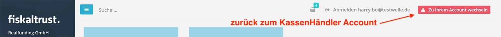

### Ansprüche des Kassenbetreibers aktivieren
In Ihrem Account finden sie unter Shop &rarr; Warenkorb in der Warenkorbübersicht die zuvor gewählten Ansprüche oder Produkte. In unserem Beispiel sind das je zwei "Übertragungsprodukte" und "Erzeugungsprodukte":

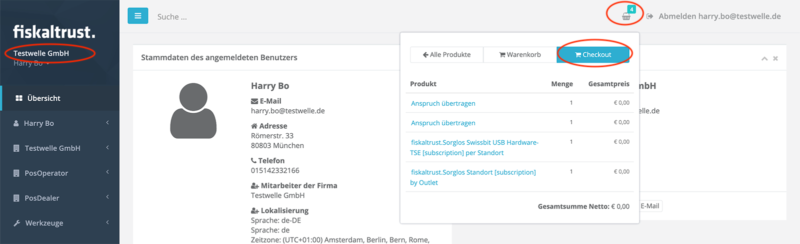

Nach der Prüfung von Auswahl, Anzahl und Empfänger wählen Sie "Checkout".  
Die Übertragungen und Aktivierungen von Produkten für den Kassenbetreiber sollten kostenlos sein. Nach der Kontrolle Ihrer Bestellung, vor allem den korrekten Standorten wählen Sie "Verbindlich bestellen".  

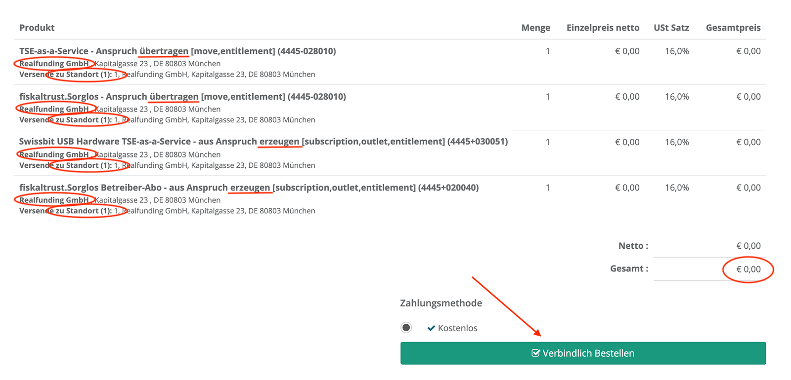

Als Nächstes wird Ihnen die erfolgreiche Bestellung angezeigt und eine Bestätigung per Email versandt. Ihre Bestellungen können Sie jederzeit im Bereich "Shop->Bestellungen" einsehen. Die dazugehörigen Rechnungen befinden sich im Bereich "Shop->Rechnungen".

Nach der Bearbeitung der Bestellung durch das fiskaltrust System (kann 2-3 Minuten dauern) werden Ihnen die verbrauchten Ansprüche abgezogen. In unserem Beispiel sind unter "Shop &rarr; Entitlements" noch 14 von zuvor 15 übrig.

Zudem können wir im Account des Kassenbetreibers unter "Firmenname &rarr; Standorte" sehen, dass für den zuvor bei der Aktivierung angegebenen Standort das Sorglospaket aktiviert wurde:

 
 [comment]: <> (added with the information for new rollout Management)
## Rollout Management
Mit dem Rollout Management können analog zum bisher beschriebenen Prozess auf von der fiskaltrust gmbH vorgefertigte Pläne zurück. Diese bereiten die Daten für die Produktion einer kompletten Konfiguration in einem oder mehreren Outlet auf. 

>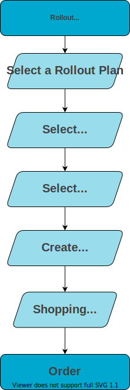

### Select a Rollout Plan

> 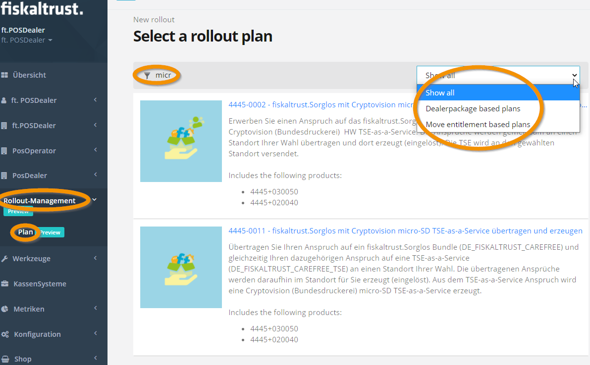

Wählen Sie im fiskaltrust.portal den Eintrag <kbd>Rollout-Management</kbd> und danach <kbd>Plan</kbd>.
Verringern Sie die Anzahl der Pläne durch die Eingabe von Filterkriterien oder mit der Auswahlleiste.
Markieren Sie einen der Pläne.
>Hinweis: 
Sollten Sie den gewählten Plan häufiger anwenden wollen, empfiehlt sich, ein Lesezeichen zu setzen (<kbd>Strg</kbd> & D)

### Select a PosOperator

> 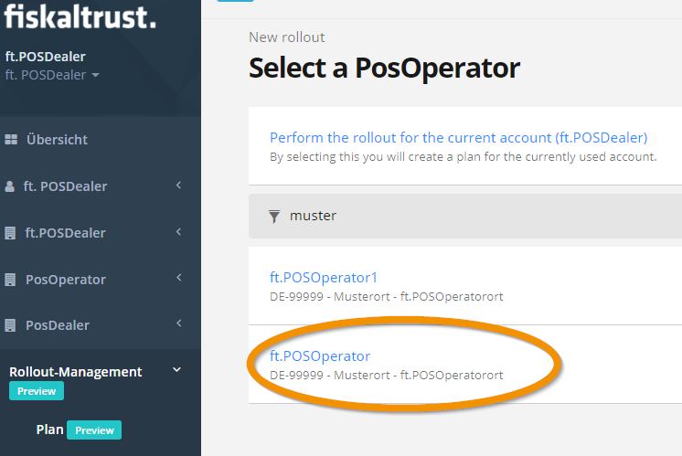

Verringern Sie die Anzahl der Kassenbetreiber durch die Eingabe von Filterkriterien, falls gewünscht.

Markieren Sie einen der Kassenbetreiber oder gehen Sie mit <kbd>Suche</kbd> zurück zur Auswahl eines Plans.
### Select Outlets

> 

Verringern Sie die Anzahl der Outlets durch die Eingabe von Filterkriterien.

Markieren Sie eines oder mehrere der Outlets.
Alternativ verwenden Sie die Auswahlleiste und <kbd>Select all</kbd>.
Wurde eines oder mehrere der Outlets markiert, wird aus <kbd>Nothing selected yet...</kbd> die Schaltfläche <kbd>Submit Selection</kbd>. Damit bestätigen Sie Ihre Auswahl. 

>Hinweis: 
Mit <kbd>Clear selection</kbd> wird ihre Auswahl von Outlets verworfen.
Mit der Zurück-Schaltfläche des Browsers können Sie einzelne Schritte zurück gehen und Ihre Auswahl wiederholen.

### Create Quote

> 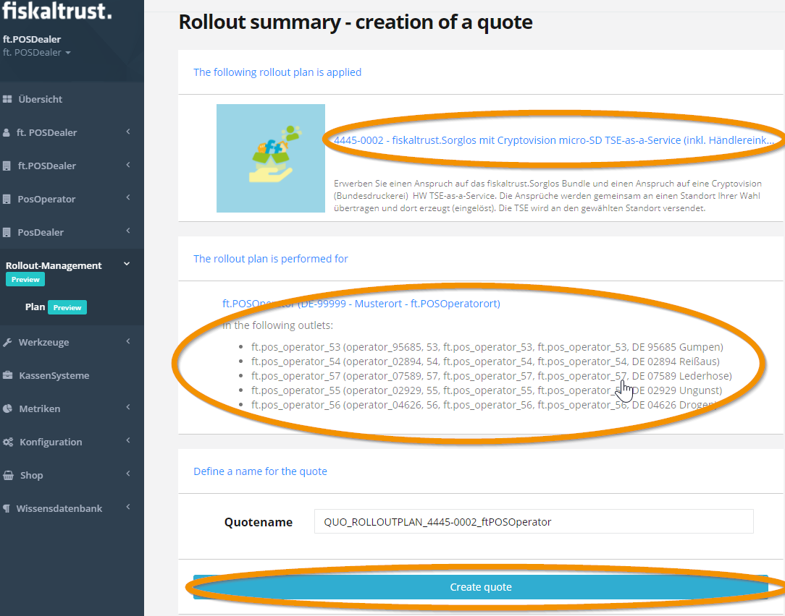

Kontrollieren Sie die gewählten Angaben wie Plan, Kassenbetreiber und Outlet(s).
Falls gewünscht, können Sie den namen des Angebotes an Ihre Wünsche anpassen.
Bestätigen Sie Ihre Auswahl mit <kbd>Create quote</kbd>.

>Hinweis: 
Sollten bei der folgenden Überprüfung von Kreditlimit, Anzahl der zur Verfügung stehenden Entitlements oder ähnlichem Probleme auftreten, werden Sie mit nachvollziehbaren Fehlermeldungen informiert.
Korrekturen nehmen Sie vor, indem Sie mit <kbd>Suche </kbd> zurück zum Anfang, zur Auswahl eines Plans gehen. 
Mit der Zurück-Schalfläche des Browsers können Sie einzelne Schritte zurück gehen und Ihre Auswahl wiederholen.

Übernehmen Sie die Zusammenstellung mit <kbd>Load quote into cart</kbd>.

### Shopping Cart

> 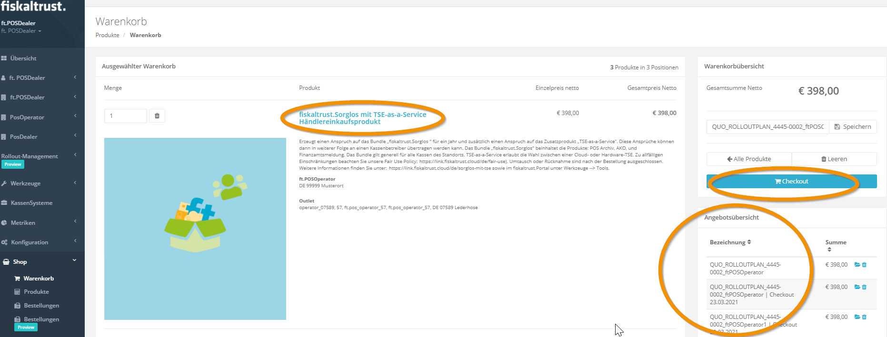

Sie können Ihre Auswahl im Warenkorb nochmals kontrollieren. 
Die Anzahl der Artikel, Detailbeschreibungen, Outlet(s) und die Kosten werden aufgelistet. 
Rechts zeigt die <kbd>Angebotsübersicht</kbd> zum Vergleich die zuletzt getätigten Einkäufe.  
Bestätigen Sie Ihre Auswahl mit der Schaltfläche <kbd>Checkout</kbd>.
### Order

Bei der Bestellung erhalten Sie eine zusammengefasste Übersicht.
Mit <kbd>Verbindlich bestellen</kbd> wird die Bestellung durchgeführt.
Im Account des Kassenbetreibers ist die gewählte Konfiguration innerhalb weniger Minuten zu finden.
#### Kontrolle 
Sie können den Vorgang Im Account des Kassenbetreibers kontrollieren. Dazu nutzen Sie die Surrogatefunktion, im den Account zu wechseln. Anschließend wechseln Sie wieder in den eigenen Account

> 

Wählen Sie <kbd>PosOperator</kbd>  &rarr; <kbd>Übersicht</kbd>. 
Dort suchen Sie den Datensatz des zuvor gewählten Kassenbetreibers. Wählen Sie den Link.
Im Account des Kassenbetreibers wählen Sie <kbd>PosOperator</kbd> &rarr; <kbd>Standorte</kbd>.
Filtern Sie die Tabelle der Standorte mit der Eingabe eines Suchbegriffes oder sortieren Sie die Standorte mit Klick auf eine der Tabellenüberschriften.
Rechts werden in den Spalten <kbd>Sorglos</kbd> und <kbd>AKO</kbd> die aktuellen Konfigurationen gezeigt.
Mit <kbd>Zu Ihrem Account wechseln</kbd> gelangen Sie wieder zurück in Ihren Account als Kassenhändler.

## Tipps & Tricks
### Bestellungen vereinfachen
Bei "PosOperator &rarr; Übersicht" finden Sie die Übersicht über Ihre Kassenbetreiber. Mit einem Klick auf "Suchen" zeigt das Portal alle Kassenbetreiber an.
Stellen Sie zuvor bei "[Firmenname] &rarr; Kontoeinstellungen" bei "Nummerierung" einen bestimmten Wert ein, wird beim Aufruf von der Übersicht über Ihre Kassenbetreiber sofort die angegebene Anzahl von Datensätzen gezeigt. 

### Konfiguration Cashbox vereinfachen 
Neben der Auswahl von "Übertragungsprodukten" und "Erzeugungsprodukten" für Kassenbetreiber können Sie den Bestellvorgang nutzen, um die Konfiguration der Kassensysteme zu vereinfachen. Dazu finden Sie Templates bei den Produkten, welche der automatischen Generierung der Cashboxen (Konfigurationscontainer) dienen. 
Wählen Sie dazu je Standort zusätzlich das passende Template in den Warenkorb. Dabei können Sie sowohl auf eigene Templates als auch auf die von fiskaltrust zur Verfügung gestellten Default-Templates zugreifen. 
Ein Beispiel wird im Kapitel [Swissbit Cloud TSE auschecken und einrichten](#swissbit-cloud-tse-auschecken-und-einrichten) erläutert.

### Bestellungen zusammenfassen
Die zuvor beschriebenen Schritte können Sie für andere Standorte und auch für andere Kassenbetreiber wiederholen und auch für diese Ansprüche und Aktivierungen zusammen in einer Bestellung abwickeln:

1. Schritt: "Shop &rarr; Produkte" und im Dropdown oben den ersten Standort wählen
2. Schritt: Übertragungsprodukte und Erzeugungsprodukte in Warenkorb legen
3. Schritt: im Dropdown oben weiteren Standort wählen
4. Schritt: Übertragungsprodukte und Erzeugungsprodukte in Warenkorb legen 
5. Schritt: wiederholen nach Belieben
6. Schritt Wechsel in den eigenen Account, dabei das versehentliche Abmelden vermeiden
7. Schritt: Unter "Shop &rarr; Warenkorb" die Übertragungsprodukte und Erzeugungsprodukte je nach  gewähltem Standort kontrollieren. 
8. Schritt: Bei Bedarf löschen und erneut zum Kassenbetreiber und dem gewünschten Standort wechseln, erneut bestellen und zurück zum eigenen Account bzw Bestellung für andere  Kassenbetreiber vornehmen
8 Schritt:  Mit "Verbindlich bestellen" den Vorgang für mehrere Standorte oder auch Kassenbetreiber abschließen.

>Hinweis: Der zweite Schritt bezieht sich immer auf den zuvor gewählten Standort und kann nach dem "Verbindlich bestellen" nicht mehr geändert werden. 
 
### Bestellung mit getrennten Rechnungen
Sollen einzelne Rechnungen mit Angaben zu den Kassenbetreibern erstellt werden, gehen Sie vor, wie zuvor in Schritt 1-5 beschrieben. 
Danach gehen Sie im Account des Kassenbetreibers auf  "Shop &rarr; Warenkorb". Kontrollieren Sie die Übertragungsprodukte und Erzeugungsprodukte je nach  gewähltem Standort. Schließen Sie die Bestellung mit der Schaltfläche "Verbindlich bestellen" ab.
 In diesem Fall müssen Sie keine "Übertragung" mehr vornehmen, erhalten aber dafür eine separate Rechnung. 
Ein Beispiel dazu finden sie weiter unten im Kapitel [Swissbit Cloud TSE auschecken und einrichten](#swissbit-cloud-tse-auschecken-und-einrichten).

Beide zuvor beschriebenen Tipps werden auch in unserem  [Video](https://www.youtube.com/watch?v=l6IcV7o_LFM&t=8s) detailliert dargestellt.

1. Neben den Produkten zur Übertragung und Aktivierung der Ansprüche pro Standort des Kassenbetreibers können Sie im gleichen Schritt auch Templates zur automatischen Generierung der benötigten Cashboxen (Konfigurationscontainer) in den Warenkorb des Kassenbetreibers legen. 
Mit Templates optimieren Sie den Rollout-Prozess. Dabei können Sie sowohl zuvor von Ihnen erstellte, angepasste Templates als auch die von fiskaltrust zur Verfügung gestellten Standard-Templates verwenden. Ein Beispiel dazu finden sie weiter unten im Kapitel [Swissbit Cloud TSE auschecken und einrichten](#swissbit-cloud-tse-auschecken-und-einrichten).

2. Sie können, falls gewünscht, die "Händlereinkaufsprodukte", also die Ansprüche, auch direkt im Account der Kassenbetreiber erwerben. D.h. in den gleichen Warenkorb wie (s.o.) deren Übertragung und Aktivierung legen. In diesem Fall müssen Sie keine "Übertragung" mehr vornehmen, erhalten aber dafür eine separate Rechnung. Ein Beispiel dazu finden sie weiter unten im Kapitel [Swissbit Cloud TSE auschecken und einrichten](#swissbit-cloud-tse-auschecken-und-einrichten)..

Diese beiden Tipps werden auch in unserem  [Video](https://www.youtube.com/watch?v=l6IcV7o_LFM&t=8s) detailliert dargestellt.

3. Sie können im Warenkorb Bestell-Vorlagen aus Bestellungen erstellen, um diese später wiederverwenden zu können.  

## Lieferoptionen für Hardware TSEs

Als Kassenhändler können Sie Hardware TSEs entweder an den Standort des Kassenbetreibers liefern lassen oder an Ihren eigenen Standort. Wenn Sie dem im oberen Beispiel dargestellten Vorgang folgen, dann wird die aktivierte Hardware TSE an den für die Aktivierung ausgewählten Standort des Kassenbetreiber gesendet. 

Möchten Sie jedoch, dass die Hardware TSE aus dem Sorglospaket nicht an den Standort des Kassenbetreiber, sondern an Ihren eigenen Standort gesendet wird, dann aktivieren (erzeugen) Sie bitte die Hardware TSE aus dem Anspruch in Ihrem eigenen Account und nicht im Account des Kassenbetreiber.

Bezogen auf das obere Beispiel würden dann die Schritte wie folgt aussehen:

1. Schritt: Im eigenen Account in den Shop gehen und im oberen Bereich Ihren eigenen Standort wählen.
2. Schritt: Im eigenen Account das Hardware TSE Aktivierungsprodukt, z.B. das Produkt "Swissbit USB Hardware TSE-as-a-Service - aus Anspruch erzeugen", in den Warenkorb legen - damit wird die Hardware TSE direkt an Sie versandt.
3. Schritt: In den Account des Kassenbetreiber mit Hilfe der surrogate-Funktion wechseln  (wie oben beschrieben).

4. Schritt: Im Account des Kassenbetreiber in den Shop gehen und im oberen Bereich den gewünschten Standort des Kassenbetreibers auswählen.
5. Schritt: Im Account des Kassenbetreiber im Shop die Übertragung des Anspruchs auf das Sorglospaket an den Kassenbetreiber vornehmen, also das Produkt "fiskaltrust.Sorglos -Anspruch übertragen" in den Warenkorb legen.
6. Schritt: Im Account des Kassenbetreiber im Shop die Aktivierung des Sorglospakets vornehmen, also das Produkt "fiskaltrust.Sorglos Betreiber-Abo - aus Anspruch erzeugen" in den Warenkorb legen.
7. Schritt: Zurück in Ihren eigenen Account wechseln und dort den Warenkorb auschecken und die Bestellung vornehmen.

Der Unterschied zu dem in dem oberen Kapitel beschriebenen Vorgang ist, dass der Anspruch auf die Hardware-TSE nicht mehr auf den Kassenbetreiber übertragen und unter seinem Account aktiviert wird, sondern direkt in Ihrem eigenen Account. Somit erfolgt die Lieferung der Hardware TSE aus dem Sorglospaket direkt an Sie als Kassenhändler. Wichtig hierbei ist jedoch, dass Sie den "fiskaltrust.Sorglos" Anspruch weiterhin an den Kassenbetreiber übertragen und im Account des KassenBertreiber für den richtigen Standort des Kassenbetreibers aktivieren.

## Swissbit Cloud TSE auschecken und einrichten

In diesem Kapitel möchten wir Ihnen anhand eines Beispiels das Auschecken und Einrichten einer Swissbit Cloud TSE als Bestandteil eines Sorglospakets mit TSE-as-a-Service vorführen. Dabei werden wir als Erweiterung zur oben beschriebenen Vorgehensweise den Erwerb des Anspruchs für das Sorglospaket ("fiskaltrust.Sorglos mit TSE Händlereinkaufsprodukt") direkt im Account des Kassenbetreibers vornehmen. Zudem werden wir für die Einrichtung, also für die Erstellung der Cashbox, das für die Swissbit Cloud TSE von fiskaltrust zur Verfügung gestellte Default-Template im selben Warenkorb auschecken. Diese beiden Erweiterungen/Optimierungen sind auch im Kapitel [Tipps & Tricks](#tipps--tricks) beschrieben.

Loggen Sie sich in Ihren Kassenhändler Account ein und wechseln Sie im ersten Schritt mit Hilfe der surrogate-Funktion in den Account des Kassenbetreiber. Suchen Sie dazu unter dem Menüpunkt "POSOperator->Übersicht" den Kassenbetreiber für den Sie die Swissbit Cloud TSE auschecken und einrichten möchten:

Drücken Sie nun auf den Namen des Kassenbetreibers, der in der Liste als Link dargestellt wird (sollte hier der Name des Kassenbetreibers nicht als Link erscheinen, dann hat er die Nutzungsvereinbarung noch nicht unterschrieben). Mit Klick auf den Link werden Sie zu dem Account des Kassenbetreibers weitergeleitet. Das erkennen Sie daran, dass im oberen Bereich rechts ein Button namens "Zu Ihrem Account wechseln" erscheint und daran, dass in der Menüleiste nun der Firmenname des Kassenbetreibers angezeigt wird.

Drücken Sie nun hier im Account des Kassenbetreiber auf den Menüpunkt: "Shop &rarr; Produkte". Wählen Sie zuerst im oberen Bereich den gewünschten Standort des Kassenbetreibers aus.

Legen Sie als Nächstes folgende Produkte in den Warenkorb:

- fiskaltrust.Sorglos mit TSE Händlereinkaufsprodukt
- Swissbit Cloud TSE-as-a-Service - aus - Anspruch erzeugen
- fiskaltrust.Sorglos Betreiber-Abo - aus Anspruch erzeugen
- fiskaltrust.Middleware mit Swissbit Cloud TSE (das ist das fiskaltrust Template zum Erstellen der Cashbox)

>Hinweis: Um den zusammengestellten Warenkorb auszuchecken, **müssen** Sie nun in Ihren Kassenhändler Account zurückkehren. Drücken Sie hierzu den "Zu Ihrem Account wechseln" Knopf im oberen Bereich rechts:

Zurück in Ihrem Account können sie nun sehen, dass die zuvor gewählten Produkte ebenfalls in Ihrem Warenkorb erscheinen:

Drücken Sie hier auf "Checkout" und überprüfen Sie dann den Warenkorb bevor Sie die Bestellung abschicken. Überprüfen Sie vor allem die Richtigkeit der Standortangaben.

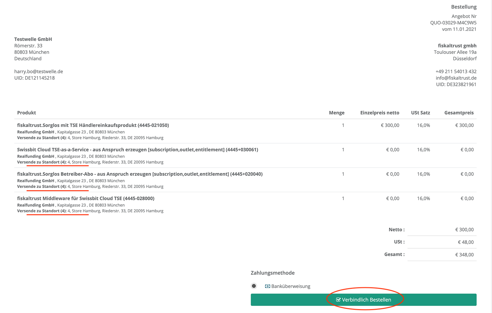

Als Nächstes wird Ihnen die erfolgreiche Bestellung angezeigt und eine Bestätigung per Email versandt. Ihre Bestellungen können Sie jederzeit im Bereich "Shop->Bestellungen" einsehen. Die dazugehörigen Rechnungen befinden sich im Bereich "Shop->Rechnungen"

Nach der Bearbeitung der Bestellung durch das fiskaltrust System (kann 2-3 Minuten dauern) können Sie im Account des Kassenbetreibers sehen, dass das zuvor bestellte Sorglospaket im Standort des Kassenbetreibers aktiviert wurde. Wechseln Sie dafür mit Hilfe der surrogation Funktion in den Account des Kassenbetreibers und gehen Sie im Menü auf "[Firmenname] &rarr; Standorte":

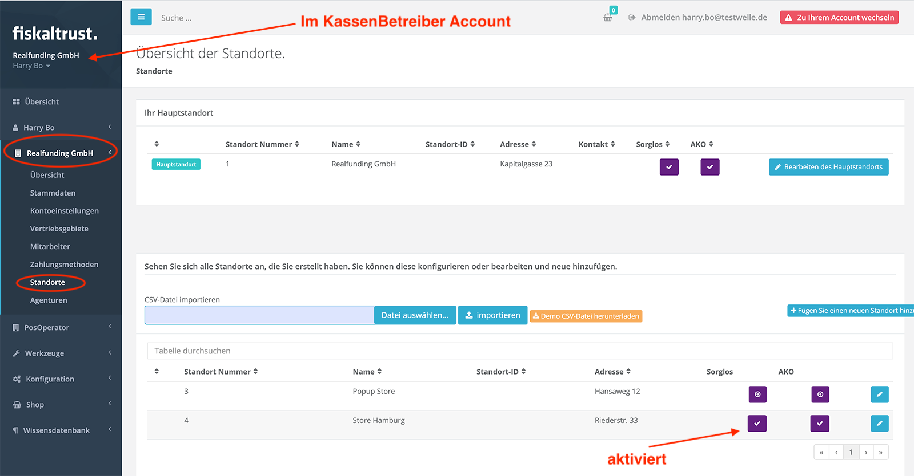

Zudem wurde die CashBox ebenfalls angelegt, weil wir davor das Template in den Warenkorb gelegt und ausgecheckt haben. Um dies zu überprüfen, gehen Sie im Menü auf "Konfiguration -> Cashbox":

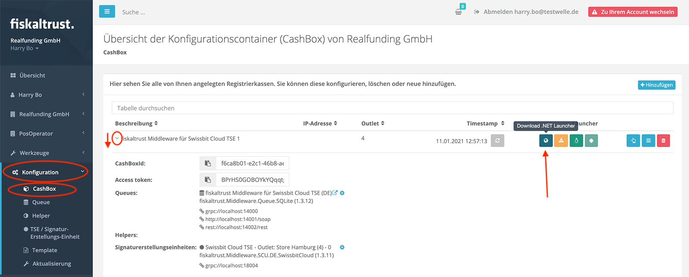

Damit ist die Cashbox für die Swissbit-Cloud TSE eingerichtet. Sie können nun den gewünschten Launcher downloaden und starten, er verwendet zur Konfiguration die zuvor angelegte Cashbox für die Swissbit Cloud TSE.

Bitte beachten sie auch das Dokument [Technische Besonderheiten der Swissbit Cloud](swissbit-cloud-special.md)

## Fiskaly Cloud TSE auschecken und einrichten

Der Vorgang zum Auschecken und Einrichten einer Fiskaly Cloud TSE ist analog zu dem oben im Kapitel [Swissbit Cloud TSE auschecken und einrichten](#swissbit-cloud-tse-auschecken-und-einrichten) beschrieben Vorgang. Der Unterschied ist nur, dass Sie hierbei die Fiskaly Cloud TSE statt der Swissbit Cloud TSE beziehen und einrichten. Legen Sie dazu statt dem Produkt "Swissbit Cloud TSE-as-a-Service - aus - Anspruch erzeugen" das Produkt "Fiskaly Cloud TSE-as-a-Service - aus - Anspruch erzeugen" in den Warenkorb. Legen Sie zudem statt dem Template-Produkt "fiskaltrust.Middleware mit Swissbit Cloud TSE" das Template-Produkt "fiskaltrust.Middleware mit Fiskaly Cloud TSE" in den Warenkorb. Ansonsten ist die Vorgehensweise identisch mit der oben beschriebenen für die Swissbit Cloud TSE.
