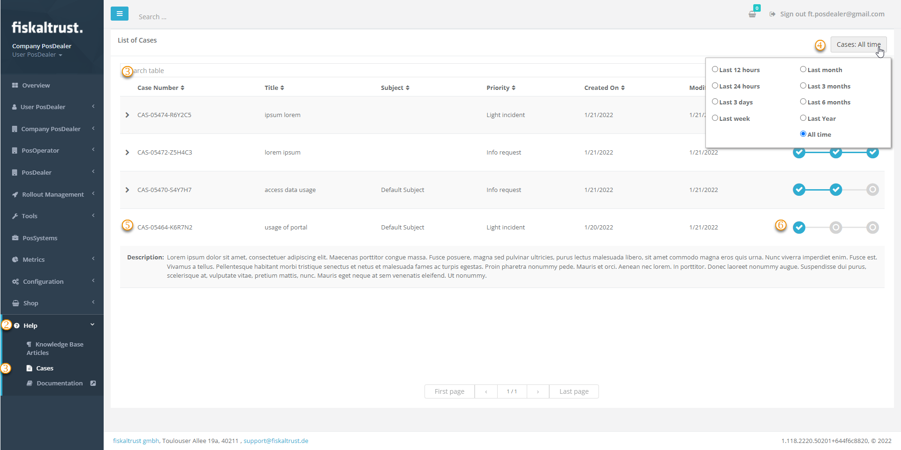

# Cases

:::info summary

After reading this, you can work with support cases in the Help-Section of the portal.

:::

## Explanation

As a PosDealer, you can contact fiskaltrust's Customer Success Team. Your call will be answered by a call service center. The agents will create a ticket, as will any e-mail you send to the country-specific address below. When your ticket is processed, a case is created, you will receive an confirmation via e-mail.
In the fiskaltrust.Portal you will find the option to check the cases that have been assigned to your company. So, even different users of your company can also see all the Cases.

You can see the progress of each case, distinguishing between `Identify`, `Research` and `Solved`. Further, you will also find descriptions of previous requests. This way you can avoid unnecessary time spent on overlapping requests from different users or repeated requests.
If you have any questions, please always use the reply e-mail. The case number can help you to search your inbox.

## Work steps

| options | description                                                                                                                |
|:----------------------:|-------------------------------------------------------------------------------------------------------------------------------------|
|| `Help:` Tick to open the Help-Area.  |
|| `Cases`: Tick to open the Cases.  |
|| `Search table`: Enter a search keyword.  |
|| Selection of the search period: reduce or select the period, when your case has been created.  |
|| `Case Number`: Tick here to open the description of the case.  |
|| `Progress`: the progress of a case changes from  `Identify`to `Research` and `Solved`.  |

## Country-specific information

import Tabs from '@theme/Tabs';
import TabItem from '@theme/TabItem';
import SalesAT from '../_markets/at/overview/business-model/_sales.mdx';
import SalesFR from '../_markets/fr/overview/business-model/_sales.mdx';
import SalesDE from '../_markets/de/overview/business-model/_sales.mdx';

<Tabs groupId="market">

  <TabItem value="AT" label="Austria">
    <SalesAT />
  </TabItem>

  <TabItem value="FR" label="France">
    <SalesFR />
  </TabItem>

  <TabItem value="DE" label="Germany">
    <SalesDE />
  </TabItem>

</Tabs>