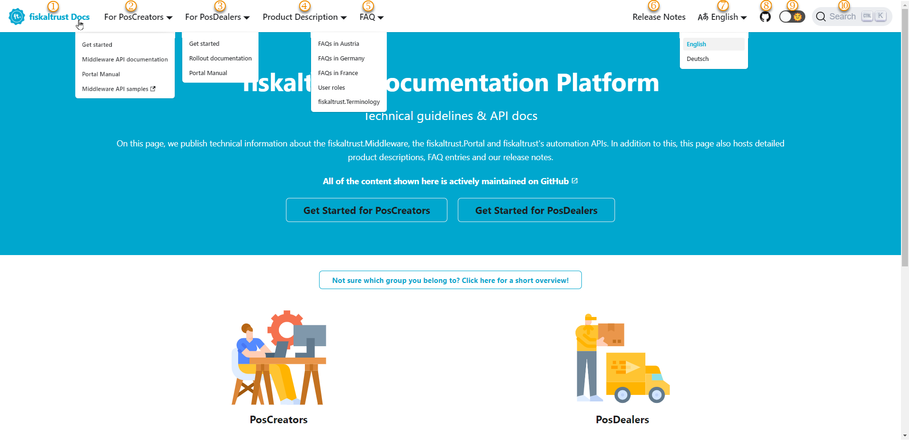

# About this Documentation

:::info summary

After reading this, you can use the documentation effectively in your specific function.

:::

## Usage of the documentation
| links | description                                                                                                                |
|:----------------------:|-------------------------------------------------------------------------------------------------------------------------------------|
| |Jump back to the [start](https://docs.fiskaltrust.cloud/)  |
| |PosCreators start reading [here](https://docs.fiskaltrust.cloud/de/docs/poscreators/get-started)  |
| |PosDealers start reading [here](https://docs.fiskaltrust.cloud/de/docs/posdealers/get-started)   |
| |Here you can find more detailed [product descriptions](https://docs.fiskaltrust.cloud/docs/product-description/germany)   |
| |Here you will find answers to frequently asked questions (FAQ), a description of [customer roles](https://docs.fiskaltrust.cloud/docs/faq/customer-roles) like PosCreator, PosDealer an our [Terminology](https://docs.fiskaltrust.cloud/docs/faq/terms)  |
| |Jump to our [Release Notes](https://docs.fiskaltrust.cloud/docs/release-notes) |
| |Change between languages, if translations are available  |
| |Switch between light mode and dark mode with this button  |
| |Jump to our [repositories](https://github.com/fiskaltrust) in GitHub  |
||Tick here or use `CTRL` & `K` to open the search window  |

## Searching in the documentation

import ReactPlayer from "react-player"

<ReactPlayer controls url={require("./images/search-options-22-01-31.mp4").default} /> 

| Steps | Description                                                                                                                |
|:----------------------:|-------------------------------------------------------------------------------------------------------------------------------------|
| |Use `CTRL` & `K` to open the search window or tick the symbol in the taskbar. Enter keywords for your search |
| |Keywords that you have used in the running session are listed here)  |
| |Keywords that are often in use, can be set as favorites here   |
||Scroll down to the lower end of the search results (not usable without keywords)  |
|  |Tick on `See all XYZ results` |
| |Find more details about the context of your keyword|
| |Get more overview by opening the found documents in several tabs |

## Copying expressions

:::tip Copying expressions made easy

Fiskaltrust`s documentation, in particular the technical chapters, contains code blocks. These you can execute on your system's command line. When hovering with the mouse over such a code block, a copy button will appear in the top right. This button allows you to copy the whole code with one click to your clipboard. You can save time and avoid typos or spelling issues. Please note the respective explanatory text for notes on where to use the code and whether adjustments are necessary.

:::

<ReactPlayer controls url={require("./images/using-code-comand-prompt.mp4").default} /> 

## Our software documentation:

* is based on fundamental knowledge of our customers' frameworks
* creates a basic understanding of our comprehensive approach
* helps you to understand our products
* gives you and your staff the ability to accomplish tasks at hand
* provides solutions when you encounter problems using our products
* allows you to search and quickly find a specific section
* uses master data, which is fictitious, as far as possible

These sources provided the basis for the main points of the description 

* fixing problems encountered during the development process
* helping the end-user understand the product 
* helping PosCreators and PosDealers and the CST find relevant information

## General offers

* Glossary: look for our [terminology here](https://docs.fiskaltrust.cloud/de/docs/faq/terms).
* Videos - Learn a concept by following a series of [videos](videos.md) 
* Scenarios - complete a task or achieve a given goal [here](../technical-operations/rollout-scenarios).

## Tools in use

We use [docusaurus](https://docusaurus.io/) for this documentation.  
We create and edit screenshots with [snagit](https://www.techsmith.com/screen-capture.html).  
We edit our videos with [camtasia](https://www.techsmith.com/video-editor.html)   