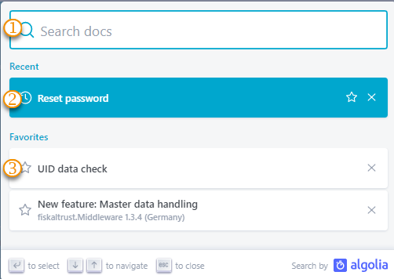
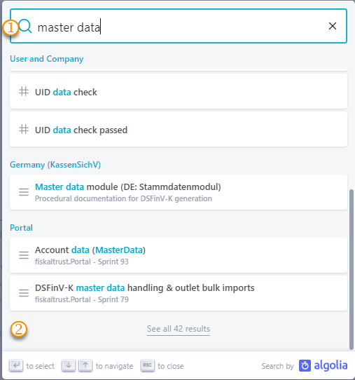
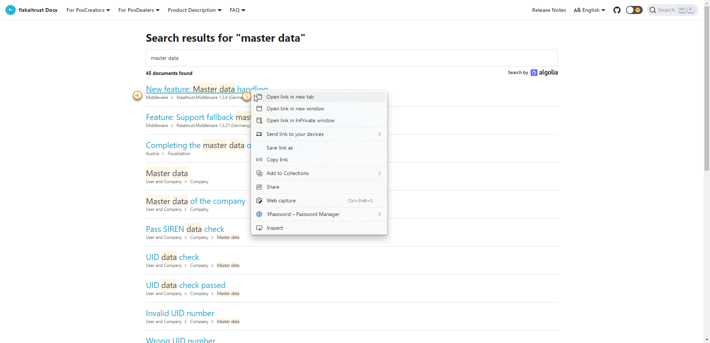

## Documentation

:::info summary

After reading this, you can use the documentation effectively in your specific function.

:::

## Our documentation

### Usage of our documentation
| links | description                                                                                                                |
|:----------------------:|-------------------------------------------------------------------------------------------------------------------------------------|
| |Jump back to the [start](https://docs.fiskaltrust.cloud/)  |
| |PosCreators start reading [here](https://docs.fiskaltrust.cloud/de/docs/poscreators/get-started)  |
| |PosDealers start reading [here](https://docs.fiskaltrust.cloud/de/docs/posdealers/get-started)   |
| |Here you can find more detailed [product descriptions](https://docs.fiskaltrust.cloud/docs/product-description/germany)   |
| |Here are listed answers to frequently asked questions (FAQ), a [description of customer roles](https://docs.fiskaltrust.cloud/docs/faq/customer-roles) like PosCraetor, PosDealer an our [Terminology](https://docs.fiskaltrust.cloud/docs/faq/terms)  |
| |Jump to our [Release Notes](https://docs.fiskaltrust.cloud/docs/release-notes) |
| |Change between languages, if translations are available  |
| |Switch between light mode and dark mode with this button  |
| |Jump to our [repositories](https://github.com/fiskaltrust) in GitHub  |
| |Tick here or use `CTRL` & `K` to open the search window  |

### Searching in our documentation

| steps | description                                                                                                                |
|:----------------------:|-------------------------------------------------------------------------------------------------------------------------------------|
| |Use `CTRL` & `K` to open the search window or tick the symbol in the task bar. Enter keywords for your search |
| |keywords, that you have used in the running session are listed here)  |
| |keywords, that will be used often, can be set as favourites here, different behavior is mostly due to the settings of your browser   |

#### Prepare advanced search

| steps | description                                                                                                                |
|:----------------------:|-------------------------------------------------------------------------------------------------------------------------------------|
|--- |Use `CTRL` & `K` to open the search window or tick the symbol in the task bar. Enter keywords for your search |
||Scroll down to the lower end of the search results(without keywords not usable)  |
|  |Tick on `See all XYZ results` |

#### Advanced search options

| steps | description                                                                                                                |
|:----------------------:|-------------------------------------------------------------------------------------------------------------------------------------|
| |Here you can find more details about the content, in which your keyword was found|
| |Get more overview with opening the found documents in several tabs |

## Our software documentation:

* The main points of the descriptions are based on the following sources
    * fixing problems encountered during the development process
    * Helping the end user understand the product 
    * Helping PosCreators and PosDealers and the CST find relevant information
* The used master data is fictitious as far as possible
* Is based on fundamental knowledge of our customers' frameworks
* creates a basic understanding of our comprehensive approach
* helps you to understand our products
* gives you and your staff the ability to accomplish tasks at hand
* provides solutions when you encounter problems using our products
* helps you to search and quickly find a specific section
* Guided tour through the user interface as a first introduction 

### General offers

* Glossar: look for our [terminology here](https://docs.fiskaltrust.cloud/de/docs/faq/terms).
* Videos - Learn a concept by following a series of [videos](videos.md) 
* Scenarios - complete a task or achieve a given goal [here](../../technical-operations/scenarios).

### Tools in use

We use [docusaurus](https://docusaurus.io/) for this documentation.
Screenshots are done with [snagit](https://www.techsmith.com/screen-capture.html)
Videos are edited with [camtasia](https://www.techsmith.com/video-editor.html) 