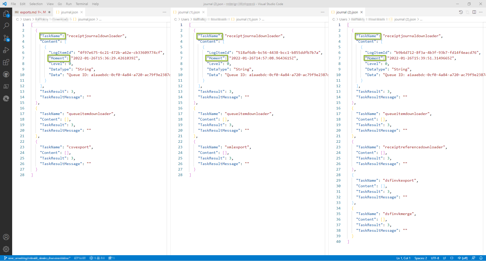

# Exports

:::info summary

After reading this, you can create exports and download them from the portal.

:::

## Explanation

Data from your POS systems can be exported via the fiskaltrust.portal for archiving or for processing with other systems such as your accounting. 
You can choose from various file types. Once the preparations have been fulfilled, exports are triggered manually with individual settings. You can select here file types like `~.csv`, `~.xml file`or country-specific exports. The latter, if a PosArchive is in use, also offer the option for automatic export. Because of different legal obligations this automated export can require some detail work in the preparation. On the other hand, the data will stand up to the respective fiscal audits.

The preparation of an export to the desired file format can also take some time, depending on the amount of data. The fiskaltrust.portal can be closed in the meantime or you as a PosDealer can surrogate to another account, but you cannot switch to another queue of the same account. If you are waiting for processing, you will be automatically redirected. If you interrupt your session in the fiskaltrust.portal, you can also find the desired export data later under `Tools` / `Downloads`.  

Regardless of the selected file type, after the export is done, two files are available. With the `export.zip` you get access to the previously selected data. You can download this compressed file, unpack it and use it with a suitable program of your choice. With the information about type (`Taskname`), date and time (`Moment`) the file `journal.json` gives you an overview about the creation of the report.

### Work steps

import ReactPlayer from "react-player"

<ReactPlayer controls url={require("./images/exporte-220126.mp4").default} /> 

| options | description                                                                                                                |
|:----------------------:|-------------------------------------------------------------------------------------------------------------------------------------|
|| You as PosDealer or KassenBetreiber log in to the desired account.  |
|| At `Configuration` / `Queue` select the queue from which data should be exported.  |
|| If necessary, reduce the number of queues displayed by `Filter Criteria like Active Queues` or by entering search terms.|
|| Check the documents by selecting `Receipt Journals`. There individual receipts can be checked in the preview.  |
|| With `Back to selection` you return to the `List of queues`.  |
|| With `Export` you switch to the creation of queue exports.  |
|| Define the export range by limiting it with document numbers or dates. Alternatively, use the slider to specify the export range. |
|| Then select one of the export types. |
|| Even if no target is selected, the export can be downloaded from fiskaltrust.Portal.. |
||With `Start Export` the data will be prepared. You will be redirected to or find the exports later with `Tools` / `Downloads`. |
||Open the reportdata with a tick at `Status`. `export.zip` gives you access to the previously selected data, `journal.json` gives you master data of the export. |
|| Tick `Switch to your account`or repeat these steps with another queue. |

import Tabs from '@theme/Tabs';
import TabItem from '@theme/TabItem';
import ExportsAT from '../_markets/at/sources/info/_exports.mdx';
import ExportsFR from '../_markets/fr/sources/info/_exports.mdx';
import ExportsDE from '../_markets/de/sources/info/_exports.mdx';

<Tabs groupId="market">

  <TabItem value="AT" label="Austria">
    <ExportsAT />
  </TabItem>

  <TabItem value="FR" label="France">
    <ExportsFR />
  </TabItem>

  <TabItem value="DE" label="Germany">
    <ExportsDE />
  </TabItem>

</Tabs>