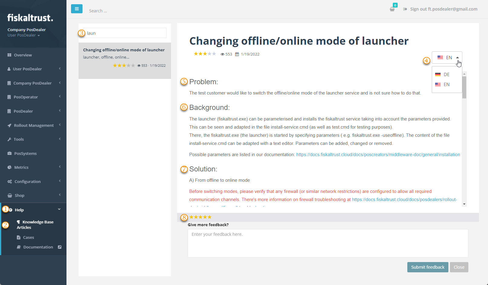

# Knowledge Base

:::info summary

After reading this, you can use knowledge base articles in the Help-section of the portal.

:::

## Explanation

A knowledge base is typically a collection of articles that contain images and text. Articles in a knowledge base may be targeted to internal or external audiences.   

PosDealers or PosOperators will find knowledge base articles in the help section of the fiskaltrust.Portal. The articles are based on the questions that our customer success team answers most frequently.

You, as a PosDealer, can browse these articles to learn more about fiskaltrusts products or services or how to solve related problems.  

So you can avoid possible waiting times with a support request if you **first visit the knowledge base** in the fiskaltrust.Portal when you have a problem and see if your problem has already been described and a solution explained.

At the end of each article you will find the option to leave feedback. In addition to your rating between one and five stars, leave comments and suggestions. These will help the fiskaltrust.Staff to see if the articles meet the needs of PosDealers and help to solve problems of PosOperators.

## Work steps

| options | description                                                                                                                |
|:----------------------:|-------------------------------------------------------------------------------------------------------------------------------------|
|| `Help:` Tick to open the Help-Area.  |
|| `Knowledge Base Articles`: Tick to open the collection of articles.  |
|| `Search for articles`: Enter a search keyword.  |
|| Choice of language: Select the language you prefer, if available.  |
|| Problem: Note the problem description.  |
|| Background: Get more overview with background information.  |
|| Solution: Note if prerequisites are described that must be met before you can go through the solution steps.  |
|| `Was this article helpful?`: Your rating and a comment will be transmitted with `Submit feedback`.  |
