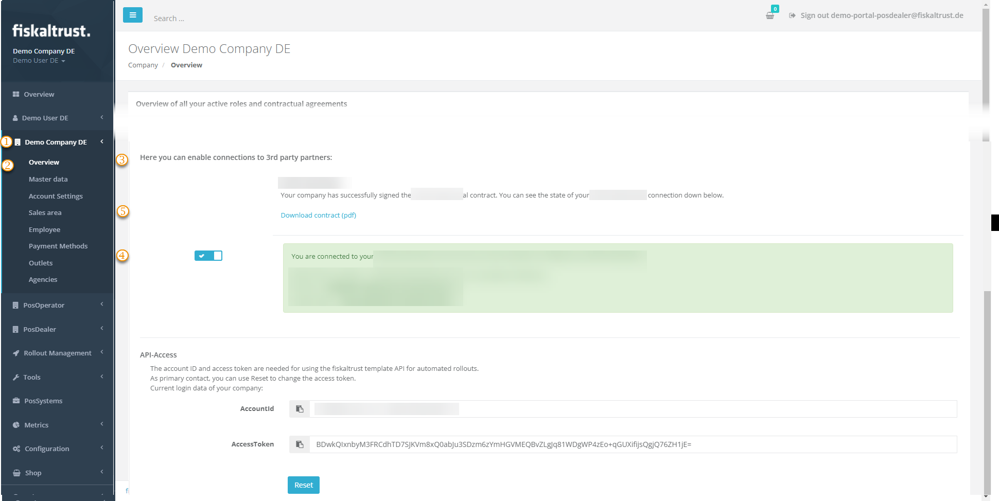

# Status of third-party partners

:::info summary

After reading this, you can explain where to find status information about third-party partners.

:::

## Introduction

External service providers can, for example, provide technological support for payment processes or prepare and forward data for accounting.  
You, as a PosDealer, can initialize the exchange with external service providers in the fiskaltrust.Portal and also manage them there.  

**No data exchange can take place without active setup by PosDealer or PosOperator.**  

For details, please refer to the respective instructions or product descriptions [Products](../buy-resell/products.md).  
For manual exchange, see the section on [Exports](../technical-operations/maintenance/exports.md).

## Work steps

| Steps | Description                                                                                                                |
|:----------------------:|-------------------------------------------------------------------------------------------------------------------------------------|
| |Tick `[COMPANY]`  |
| |Choose `Overview`  |
| |Scroll down until `Here you can enable connections to 3rd party partners`  |
| |Enable the connection by setting the slide to the right and signing the contract. |
| |Return to download the contract again, if needed. This contract was sent to your E-Mail address when the contact was signed or changed  |