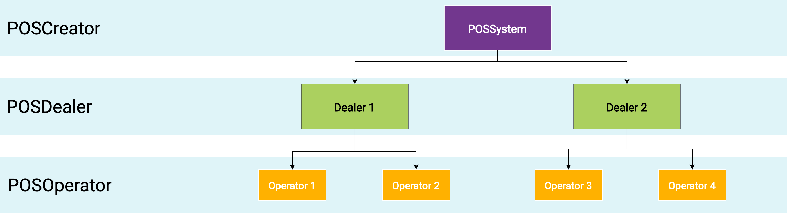

 
<strong>Compliance-as-a-Service for POSSystems</strong>
 
 
 

 

# fiskaltrust Rollout documentation

This documentation is meant to support POSDealers (cash register dealers), and to some extend also POSCreators (cash register manufacturers) in planning and executing the rollout process of the fiskaltrust.Middleware and other fiskaltrust products. 

## Getting started

fiskaltrust offers Compliance-As-A-Service for POSSystems in the fiscalization area. This is done by using the license-free fiskaltrust software product "fiskaltrust.Middleware", which is integrated by the POSCreator into his POSSystem. 

The fiskaltrust.Middleware takes care of the communication with the TSE and prepares the fiscalization data for the POSSystem, which must be printed on the receipt (e.g. receipt number, signatures, start times, QR code for the audit, etc.). Furthermore, an export of audit-relevant data can be performed via the fiskaltrust.Middleware, locally at the POSOperator. These exports are provided by the fiskaltrust.Middleware in the formats defined by the legislator (DSFinV-K, TSE-TAR files). 

The fiskaltrust.Middleware runs as an independent service on the cash register of the POSOperator and must therefore be rolled out there by the POSDealer.

Furthermore, fiskaltrust offers add-on products (based on the fiskaltrust.Middleware) as well as individual products (independent of the fiskaltrust.Middleware) for POSOperators. These products are sold to POSOPerators exclusively through our POSDealer partners. These products include archiving products, automated reports to the tax office, technical security equipment (TSE) from various manufacturers as well as carefree packages with and without a TSE-As-A-Service. As part of the rollout, the POSDealer must transfer the products previously acquired from fiskaltrust to its POSOperators and activate them. 

The rollout process therefore consists of the configuration and delivery of the fiskaltrust.Middleware to the cash register(s) of the POSOperator and the transfer and activation of the add-on and individual products for the POSOperators. In this document we will describe which preparatory measures have to be taken before the actual rollout and how, based on this, the rollout is carried out in detail. The fiskaltrust.Portal will play an important role as a rollout management tool.

### The different roles of the fiskaltrust partners

In the rollout process, fiskaltrust basically distinguishes between three partner roles: POSCreator, POSDealer and POSOperator. 

POSCreators implement POSSystems and sell them via their POSDealers. The POSDealers sell the POSSystem and the associated services to their POSOperators. The POSOperators operate the acquired POSSystem in one or more cash registers, at one or more locations. The rollout process of the fiskaltrust.Middleware and other fiskaltrust.Products is also structured according to this principle. The fiskaltrust.Portal plays an important role in this process, as it maps the three partner roles mentioned above to support the rollout process.

### Process overview

POSCreators who have opted for fiskaltrust, integrate the fiskaltrust.Middleware into their POSSystems, this means that they implement their POSSystem in such a way that it can communicate with the fiskaltrust.Middleware, which runs as an independent service. The prerequisite for this is the independent registration of the POSCreator in the fiskaltrust.Portal. In doing so, POSCreators digitally sign a cooperation agreement with fiskaltrust and can thus use the fiskaltrust.Middleware free of license costs. During the integration of the fiskaltrust.Middleware, POSCreators also deal with how the fiskaltrust.Middleware will later be rolled out to the cash registers of the POSOperators. They make preparations to be able to support their POSDealers in the rollout process of their POSSystem and the fiskaltrust.Middleware. Depending on the circumstances (number of cash registers to which the fiskaltrust.Middleware is to be delivered later), they also analyze automation options for a mass rollout. It is often the case that POSCreators prepare so-called configuration templates for their POSDealers.

POSCreators should invite their POSDealers to register on the fiskaltrust.Portal as early as possible so that they can prepare together for the rollout of the fiskaltrust.Middleware and so that the POSDealers in turn can invite their POSOperators to register on the fiskaltrust.Portal in good time, because they must digitally sign a user agreement there so that the fiskaltrust.Middleware can be installed and operated on their cash register. These invitations are made via the fiskaltrust.Portal. The invitation process with the associated details is described in the chapter [Invitation management](./invitation-management/README.md).

POSCreators then discuss with their POSDealers how to configure the fiskaltrust.Middleware instances to be delivered and carry out a joint pilot installation at a POSOperator. How to configure the fiskaltrust.Middleware, what exactly has to be configured and which automation options are available for mass rollouts can be read in the chapter [Rollout of the fiskaltrust.Middleware](./middleware/README.md). After successful pilot installation and preparation for the mass rollout, the POSDealers take over and perform the mass rollout independently.

In addition, POSDealers have the possibility to purchase add-on products and individual products from fiskaltrust in the fiskaltrust.Portal and to resell them to the POSDealers as part of their service. For the activation of volume discounts, POSDealers agree on the conditions with fiskaltrust with the help of framework agreements/contracts and can then purchase so-called Entitlements in the fiskaltrust.Shop (part of the fiskaltrust.Portal). As part of the rollout, they transfer these to their customers, the POSOPerators, and activate the associated products via the fiskaltrust.Portal. The exact procedure for this is described in the chapter [Buying and reselling fiskaltrust products](./shop/README.md).

### Structure of the rollout documentation

This documentation is divided into the following main elements based on the processes described above:

1. [Invitation management](./invitation-management/README.md) - important for POSCreators and for POSDealers
2. [Rollout of the fiskaltrust.Middleware](./middleware/README.md) - important for POSCreators and for POSDealers
3. [Buying and reselling fiskaltrust products](./shop/README.md) - important especially for POSDealers

### Further

Occasionally, fiskaltrust partners do not fit exactly into the partner roles described above, for example because they are a POSCreator and a POSDealer in one (e.g. a POSCreator that distributes to end customers) or because they are both a POSCreator and a POSOperator (e.g. a franchise company). If you are one of these partners and do not completely fit into the partner roles described here, we recommend that you still follow the described process by inviting yourself to the fiskaltrust.Portal to take over and compensate for the missing partner role(s). If you have any further questions about this, please do not hesitate to contact our support and sales team at info@fiskaltrust.de.

## Table of contents

<pre>
├── <a href="./invitation-management/README.md" title="Invitation management">Invitation management</a>
│   └── <a href="./invitation-managemen/README.md#poscreators-invite-posdealers" title="POSCreators invite POSDealers">POSCreators invite POSDealers</a>
│   └── <a href="./invitation-managemen/README.md#posdealers-invite-posoperators" title="POSDealers invite POSOperators">POSDealers invite POSOperators</a>
├── <a href="./middleware/README.md" title="Middleware">Rollout of the fiskaltrust.Middleware</a>
│   └── <a href="./middleware/README.md#configuration-of-the-fiskaltrustmiddleware" title="Configuration of the fiskaltrust.Middleware">Configuration of the fiskaltrust.Middleware</a>
│   └── <a href="./middleware/README.md#start-and-test-the-service" title="Start and test the service">Start and test the service</a>
│   └── <a href="./middleware/README.md#test-data-export" title="Test data export">Test data export</a>
│   └── <a href="./middleware/README.md#rollout-scenarios" title="Rollout scenarios">Rollout scenarios</a>
│   └── <a href="./middleware/README.md#rollout-automation" title="Rollout automationt">Rollout automation</a>
├── <a href="./shop/README.md" title="Buy and resell fiskaltrust products">Buy and resell fiskaltrust products</a>
│   └── <a href="./shop/README.md#fiskaltrustshop" title="fiskaltrust.Shop">fiskaltrust.Shop</a>
│   └── <a href="./shop/README.md#framework-agreements-for-volume-discount" title="Framework agreements for volume discount">Framework agreements for volume discount</a>
│   └── <a href="./shop/README.md#buy-products-via-entitlements" title="Buy products via Entitlements">Buy products via Entitlements</a>
│   └── <a href="./shop/README.md#transfer-of-purchased-entitlements-to-the-posoperator" title="Transfer of purchased entitlements to the POSOperators">Transfer of purchased entitlements to the POSOperators</a>
│   └── <a href="./shop/README.md#delivery-options-for-hardware-tses" title="Delivery options for hardware TSEs">Delivery options for hardware TSEs</a>
│   └── <a href="./shop/README.md#swissbit-cloud-tse-check-out-and-setup" title="Swissbit Cloud TSE check out and setup">Swissbit Cloud TSE check out and setup</a>
│   └── <a href="./shop/README.md#fiskaly-cloud-tse-check-out-and-setup" title="Fiskaly Cloud TSE  check out and setup">Fiskaly Cloud TSE  check out and setup</a>
</pre>

