# Rollout of the fiskaltrust.Middleware

<div className="hide-in-docs">

## Table of contents

<pre>
├── <a href="#introduction" title="Introduction">Introduction</a>
├── <a href="#configuration-of-the-fiskaltrustmiddleware" title="Configuration of the fiskaltrust.Middleware">Configuration of the fiskaltrust.Middleware</a>
│   └── <a href="#structure-of-the-fiskaltrustmiddleware" title="Structure of the fiskaltrust.Middleware">Structure of the fiskaltrust.Middleware</a>
│   └── <a href="##the-cashbox-as-a-configuration-container" title="The CashBox as a configuration container">The CashBox as a configuration container</a>
│       └── <a href="#configuration-of-the-queue" title="Configuration of the queue">Configuration of the Queue</a>
│       └── <a href="#configuration-of-the-scu" title="Configuration of the SCU">Configuration of the SCU</a>
│   └── <a href="#create-cashbox-manually-via-the-fiskaltrustportal" title="Create CashBox manually via the fiskaltrust.Portal">Create CashBox manually via the fiskaltrust.Portal</a>
├── <a href="#start-and-test-the-service" title="Start and test the service">Start and test the service</a>
│   └── <a href="#test-the-availability-of-the-queue" title="Test the availability of the Queue">Test the availability of the Queue</a>
│   └── <a href="#initialization-of-the-fiskaltrustmiddleware-instance-via-an-initial-operation-receipt" title="Initialization of the fiskaltrust.Middleware instance via an initial-operation receipt">Initialization of the fiskaltrust.Middleware instance via an initial-operation receipt</a>
│   └── <a href="#send-a-pos-receipt" title="Send a pos-receipt">Send a pos-receipt</a>
│   └── <a href="#check-connection-with-the-fiskaltrustcloud" title="Check connection with the fiskaltrust.Cloud">Check connection with the fiskaltrust.Cloud</a>
│   └── <a href="#firewall-troubleshooting" title="Firewall troubleshooting">Firewall troubleshooting</a>
│   └── <a href="#using-a-proxy" title="Using a proxy">Using a proxy</a>
│   └── <a href="#test-data-export" title="Test data export">Test data export</a>
│       └── <a href="#local-data-export" title="Local data export ">Local data export </a>
│       └── <a href="#notes-on-the-dsfinv-k-export" title="Notes on the DSFinV-K export">Notes on the DSFinV-K export</a>
│       └── <a href="#notes-on-the-tar-file-export" title="Notes on the TAR file export">Notes on the TAR file export</a>
│       └── <a href="#data-export-via-the-fiskaltrustportal" title="Data export via the fiskaltrust.Portal">Data export via the fiskaltrust.Portal</a>
├── <a href="#rollout-scenarios" title="Rollout scenarios">Rollout scenarios</a>
│   └── <a href="#introduction-1" title="Introduction">Introduction</a>
│   └── <a href="#a-tse-per-cash-register" title="A TSE per cash register">A TSE per cash register</a>
│   └── <a href="#hardware-tses-at-local-server-for-multiple-cash-registers" title="Hardware TSE(s) at local server for multiple cash registers">Hardware TSE(s) at local server for multiple cash registers</a>
│   └── <a href="#hardware-tse-at-the-main-cash-register-for-several-additional-cash-registers" title="Hardware TSE at the main cash register for several additional cash registers">Hardware TSE at the main cash register for several additional cash registers</a>
│   └── <a href="#a-cloud-tse-for-multiple-cash-registers" title="A cloud TSE for multiple cash registers">A cloud TSE for multiple cash registers</a>
│   └── <a href="#rollout-scenario-with-terminals" title="Rollout scenario with terminals">Rollout scenario with terminals</a>
│   └── <a href="#data-center-as-operational-environment" title="Data center as operational environment">Data center as operational environment</a>
│   └── <a href="#connection-variants-of-the-tse-to-the-scu" title="Connection variants of the TSE to the SCU">Connection variants of the TSE to the SCU</a>
│   └── <a href="#proposed-solutions-for-virtualization-within-an-outlet" title="Proposed solutions for virtualization within an outlet">Proposed solutions for virtualization within an outlet</a>
│   └── <a href="#performance-recommendations" title="Performanceempfehlungen">Performanceempfehlungen</a>
├── <a href="#rollout-automation" title="Rollout automation">Rollout automation</a>
│   └── <a href="#introduction-2" title="Introduction">Introduction</a>
│   └── <a href="#overview-manual-process" title="Overview manual process">Overview manual process</a>
│   └── <a href="#templating-to-create-cashboxes" title="Templating to create CashBoxes">Templating to create CashBoxes</a>
│   └── <a href="#automated-rollout-of-the-fiskaltrustmiddleware" title="Automated rollout of the fiskaltrust.Middleware">Automated rollout of the fiskaltrust.Middleware</a>
│   └── <a href="#high-degree-of-automation" title="High degree of automation">High degree of automation</a>

</pre>

</div>

## Introduction

The fiskaltrust.Middleware is the license-free base product of fiskaltrust, which is integrated by POSCreators into their POSSystems in order to implement conformity with the new fiscalization laws. The fiskaltrust.Middleware runs as an independent service on the cash register of the POSOperator and is addressed by the POSSystem via an interface. 

Since fiskaltrust.middleware runs as a standalone service, it must be rolled out to the cash register of the POSOperator. Depending on the circumstances, the respective fiskaltrust.Middleware instance must be configured accordingly before going live. For example, it must be specified where the POSSystem can reach the service, in which database the processed data is to be stored by the service, which TSE is to be used for the signatures, and how the TSE can be reached by the service. 

In the following chapters we will explain how to configure the fiskaltrust.Middleware for the rollout. In addition, we will show you how to install and test the service and we will discuss various rollout scenarios. Finally, we will describe which automation options fiskaltrust provides for a mass rollout.


## Configuration of the fiskaltrust.Middleware

The configuration of the fiskaltrust.Middleware can be done manually via the fiskaltrust.Portal or automated via an API. But before we look at how the configuration is created, we will first go into the structure of the fiskaltrust.Middleware.

### Structure of the fiskaltrust.Middleware

The fiskaltrust.Middleware is modular and consists of several components. The most important components are the **Queue** and the **SCU** (signature creation unit). Furthermore, so-called **Helpers** can also be used, such as the Helipad Helper, which is responsible for the regular upload of the processed data to the fiskaltrust.Cloud. The following illustration shows how the Queue and the SCU are used:


The Queue is the component of the fiskaltrust.Middleware with which the POSSystem communicates. For this purpose, the Queue provides an interface that is the same for all countries, the so-called IPOS Interface. The type of communication with the Queue is selected by the POSCreator when implementing the POSSystem. For example, grpc or WCF can be used. The IPOS Interface provides the POSSystem following three functions:

- `echo` - to check the availability of the Queue
- `sign` - for signing receipt data, as well as for executing functionality via special receipts (e.g. initial operation receipt, daily closing receipt or zero receipt)
- `journal` - to export the data in the formats required by law

The Queue receives requests from the POSSystem and processes them. It is responsible for the creation of the receipt number, for the chaining of the requests and for the persistence of the data.

The fiskaltrust.Middleware component SCU (signature creation unit) is responsible for signing the data. The data to be signed is sent from the Queue to the SCU, which in turn, in the German variant, communicates with a TSE. The TSE finally signs the data. The signed data and all associated information are then sent back to the Queue by the SCU. The Queue persists the data and builds the response that is returned to the POSSystem. This response contains important information that must be printed on the receipt by the POSSystem.

### The CashBox as a configuration container

The configuration of a fiskaltrust.Middleware instance is done via a so-called **CashBox**. The CashBox is a configuration container. It contains the configurations of the fiskaltrust.Middleware components used in the fiskaltrust.Middleware instance (e.g. Queue, SCU). The following example shows a CashBox that contains the configuration of a Queue and the configuration of an SCU:


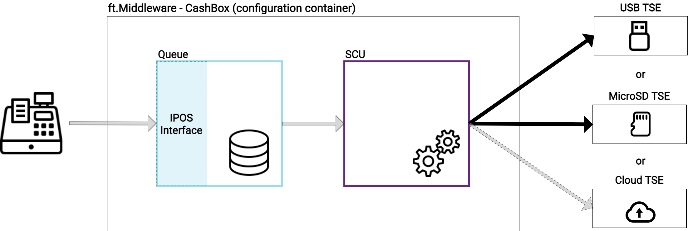


So for the example above we need to configure the Queue and the SCU and then put these two configurations into a configuration container (CashBox). But what exactly do we have to configure for the Queue and for the SCU?

#### Configuration of the Queue

As mentioned above, the Queue is the component of the fiskaltrust.Middleware that is available to the POSSystem for queries via the IPOS Interface. In addition, the Queue is responsible for the persistence of the processed data. And these are exactly the two points that we have to configure here:

1. how and where exactly should the Queue be accessible for the POSSystem? (e.g. via `grpc` on `localhost:1234`)
2. where exactly should the Queue store the data? (e.g. in a MySql database with the connectionstring: "xyz")

How the communication is to take place, e.g. via `grpc`, is decided by the POSCreator, who implements the POSSystem accordingly. Where the Queue and thus the service exactly will be attainable, thus e.g. `localhost:1234` decides usually the POSDealer, depending upon conditions with the POSOperator. 

#### Configuration of the SCU

The SCU is responsible for creating the signatures. It receives the data to be signed from the Queue and handles communication with a TSE to have the data signed. Two configuration entries must also be made for the SCU:

1. on the one hand the Queue must know how and where it can reach the SCU (i.e. via `grpc` on `localhost:5678`).

2. and on the other hand the SCU must know which TSE it should access and where it is located (e.g. Swissbit - USB - TSE in drive `E:`).

Now you will surely ask yourself why we have to configure here how the SCU should be reachable by the Queue, if the Queue and SCU are components of the fiskaltrust.Middleware after all. Isn't the Queue already aware of how to reach the SCU? Well, the answer lies in the flexibility of the fiskaltrust.Middleware, because an instance of the fiskaltrust.Middleware operates only exactly those components, which are specified in its CashBox. For example, three cash registers can share one SCU and thus one hardware TSE:


Each cash register runs an instance of the fiskaltrust.Middleware, which is configured by its own CashBox. The CashBoxes of the upper and lower cash registers contain only the configuration of a Queue. The CashBox of the middle cash register contains the configuration of a Queue and a SCU. To make the SCU from the middle cash register (e.g. main cash register) reachable for the other two cash registers or Queues, we have to specify in the Queue configuration how and where the SCU is reachable (and of course release the corresponding port). To ensure that a Queue connects to the correct SCU, we must specify this connection when creating the CashBox for the Queue. 

### Create CashBox manually via the fiskaltrust.Portal

Each instance of the fiskaltrust.Middleware must be configured using a CashBox. Such a CashBox can be created manually via the fiskaltrust.Portal or automated via an API. In this chapter we will show you an example of how to create a CashBox via the fiskaltrust.Portal. For this purpose, we assume the following scenario:


Our CashBox shall contain a Queue and a SCU. The SCU accesses a USB TSE. Specifically, we will configure a Queue that the POSSystem communicates with via `REST` and is accessible to the POSSystem at `localhost:1200/fiskaltrust`. The Queue stores the processed data in a `SQLite` database. Furthermore we configure in this example a SCU which is accessible for the Queue via `grpc` and under `localhost:1400` and which accesses a Cryptovision USB-TSE for signing the data. The TSE is plugged into the `E:` drive.

**Step 1: Create the SCU configuration**

In the fiskaltrust.Portal, go to "Configuration -> Signature creation unit". The list of SCUs already created appears. 

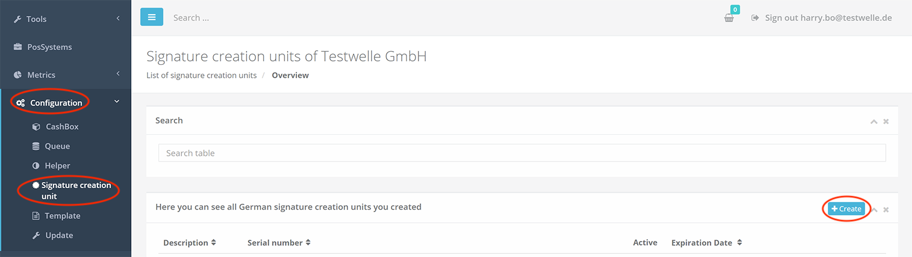

Now press the "+ Create" button. A form for entering the SCU data appears.


1. Enter the name of the SCU here (e.g. "TEST SCU").
2. Depending on the TSE, select the package (module) that the SCU should use (in our example we use a CryptoVision TSE).
3. For the package version, the latest one is automatically selected
4. Specify the outlet, the main outlet is automatically preselected by default
5. Press "Save"

The SCU has been created and we are now forwarded to the second configuration form. This form depends on the previously selected package. In our example, we must specify the device path for the Cryptovision TSE. For another package, something else may be required here (e.g. Com-Port for a Diebold TSE). 


1. Enter the device path (i.e. `E:` in our case).
2. Now specify how and where the SCU is to be accessible for a Queue. First press the corresponding button for the type of communication (e.g. `grpc`) and then enter the path (e.g. `localhost:1401`).
3. Press "Save and close" to save the data and to return to the list.

In the list we can now see that our SCU configuration has been successfully created:

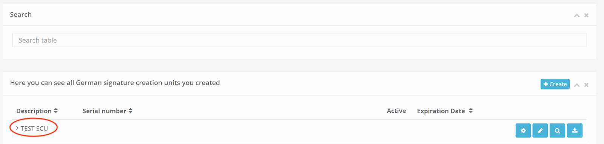


**Step 2: Create the Queue configuration**

Next, we create the Queue configuration. To do this, we go to "Configuration -> Queue". The list of already created Queues is displayed.

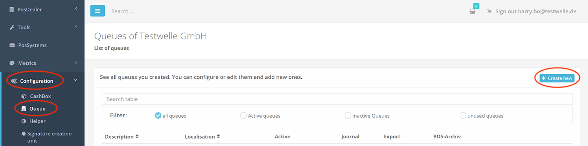

Now press the "+ Create new" button. A form for entering the Queue data appears.


1. Enter the name of the Queue here (e.g. "TEST QUEUE"). 2.
2. Select how the data should be persisted (e.g. SQLite database). 
3. The latest package version is automatically selected.

4. Enter the **cash register serial number** in the "CashBox Identification" field. Make sure that this is unique worldwide and that it is a [printable string](https://en.wikipedia.org/wiki/PrintableString) with a maximum length of 20 characters. The cash register serial number specified here will later also be registered as the ClientId in the TSE in order to uniquely assign the signatures to the cash register. Since the different TSE manufacturers have different specifications for the formatting and for the length of the ClientId, we have agreed on the lowest common denominator ([printable string](https://en.wikipedia.org/wiki/PrintableString), max. 20 characters).

5. Specify the outlet, the main outlet is automatically preselected by default

6. Press "Save"

The Queue has been created and we are now forwarded to the second configuration form. This form depends on the previously selected persistence package. In our example, we do not have to make any further entries for the SQLite database, because it is automatically created by the fiskaltrust.Middleware. However, if it was a different package, then appropriate connection specifications must be made here. For example, the specification of a connection string for a MySQL database. 


1. If necessary, enter the database connection details (not necessary in this example, the SQLite DB). 
2. Now specify how the Queue should be accessible from the POSSystem. First press the corresponding button for the type of communication (e.g. `http(REST)`) and then enter the path (e.g. `localhost:1200/fiskaltrust`).
3. Press "Save and close" to save the information and to return to the list.

In the list we can now see that our Queue configuration has been successfully created:


**Step 3: Create the CashBox**

After creating the SCU and the Queue, we next create the CashBox, meaning the configuration container for the fiskaltrust.Middleware instance. To do this, go to "Configuration->CashBox". The list of already created CashBoxes will be displayed.

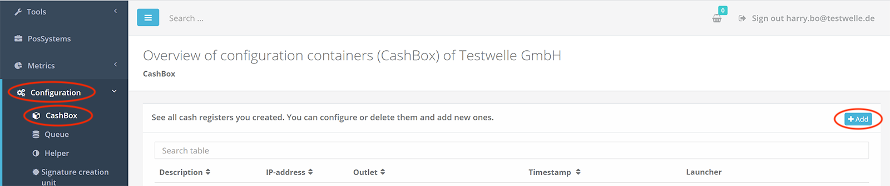

Now press the "+ Add" button. A form for entering the CashBox data will appear.


1. Enter the name of the CashBox here (e.g. "TEST CASHBOX")

2. Enter the outlet, by default the main outlet will be preselected automatically

3. Press "Save" to save the data and to return to the list.

In the list we can now see that our new CashBox has been successfully created:

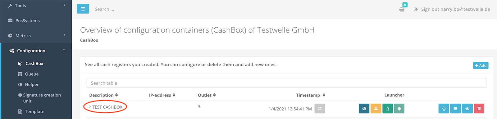

**Step 4: Fill the CashBox**

After creating the CashBox, it is to be filled next. In our example, we want to put the previously created Queue configuration and the SCU configuration into the CashBox. The list entry with our CashBox can be expanded. Here we can see that it is currently still empty.


To fill the newly created CashBox press the "Edit by list" button in the list entry of the CashBox.


The list of existing configurations is displayed.

We can choose here which configurations we want to add to our configuration container so into the CashBox. For our example we select the Queue and the SCU we created before and then press the "Save" button.


Back in the list, we can expand the list entry of our CashBox again and now see that it contains Queue and SCU.

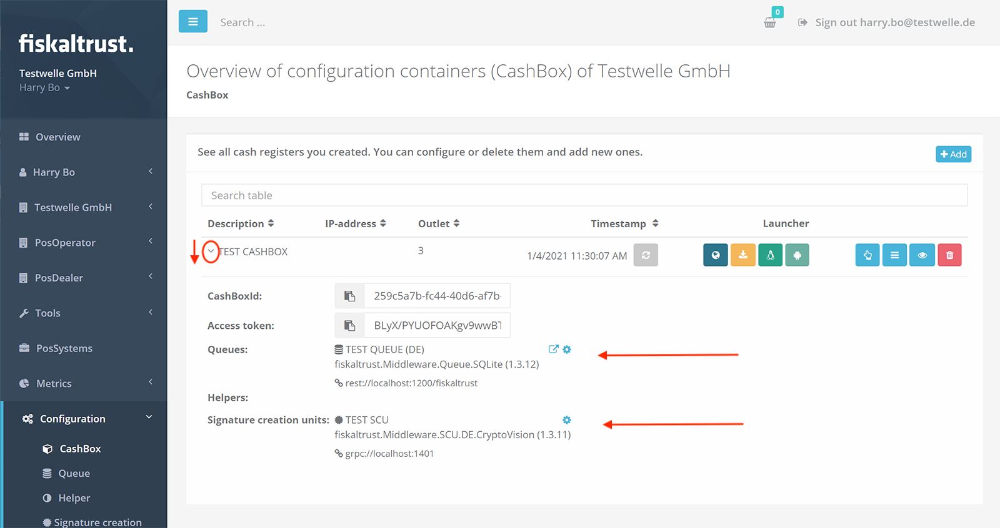

**Step 5: Connect the Queue with the SCU**

As described above, we need to tell the Queue which SCU to use to sign the data. So we have to "connect" the Queue with the SCU. In our case, the Queue and SCU are in the same CashBox. Nevertheless, we have to create the connection. To do this, we press the "Connect" button in the expanded list entry of the CashBox, which is displayed to the right of the Queue:

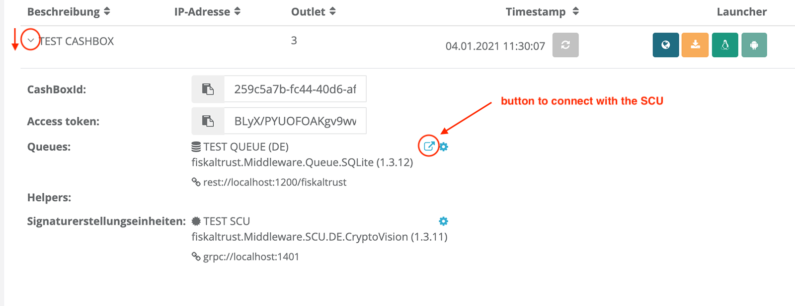

A popup appears with the available SCUs. From this list we can now select our previously created SCU, save and close the popup.


The queue now knows with which SCU it has to communicate and where the SCU can be reached.

**Step 5: Publish the CashBox (rebuild configuration)**

The last step is to publish the created CashBox. This is done with the "Rebuild configuration" button available in the list line of the CasBox.


This makes the CashBox available for download as a JSON file. This JSON configuration file can later be downloaded by a fiskaltrust.Middleware instance and used for initial initialization or for an update. In case of an update, for example update of the SCU package version due to a change in the law, the change is only made available in the CashBox after the "Rebuild configuration" button has been pressed. If the fiskaltrust.Middleware instance to which this CashBox is assigned is then restarted, it loads the new configuration and updates itself automatically, e.g. by downloading and using the new package. 

## Start and test the service

To test the service, meaning a fiskaltrust.Middleware instance, we download the so-called "Launcher". We can do this in the list entry of the previously created CashBox. To do this, press the "Download .NET Launcher" button. 


You will receive a zip compressed folder that you can unzip on the cash register. Unzip the zip file. 


The resulting folder can also be renamed if necessary. The folder contains the launcher `fiskaltrust.exe`, the service represented by the `.dll` files, a configuration file named `fiskaltrust.exe.config` and three command files:

- `install-service.cmd`
- `uninstall-service.cmd`
- `test.cmd`

The command files can be used for parameterized starting or stopping of the service. They execute the `fiskaltrust.exe` with specification of appropriate parameters. The content of the `install-service.cmd` file is for example as follows:

`cd /d "%~dp0%"`
`fiskaltrust -cashboxid=259c5a7b-fc44-40d6-af7b-73fde0943ec4 -accesstoken=BL...8D6o= -sandbox -i -servicename=fiskaltrust-259c5a7b-fc44-40d6-af7b-73fde0943ec4`
`timeout 15`

Thus `fiskaltrust.exe` is started with the `cashobxid` "259c..". Thus the started fiskaltrust.Middleware instance knows from which configuration container (CashBox) it should initialize itself. The `cashboxid` is the ID of the CashBox and can be seen in the fiskaltrust.Portal in the expanded list entry of the CashBox:


To be able to load the CashBox from the fiskaltrust.Portal the service needs an access authorization. This is specified via the `accesstoken` parameter. The value can also be found in the fiskaltrust.Portal in the expanded list entry of the CashBox (see above).

The `sandbox` parameter specifies that the sandbox portal is to be accessed. The parameter `i` specifies that the fiskaltrust.Middleware instance should be installed and started as a (Windows) service. The `servicename` parameter sets the name of the (Windows) service.

For the complete list of available parameters and further technical information about the installation of the service, please refer to our IPOS Interface documentation in chapter [Installation](https://docs.fiskaltrust.cloud/doc/interface-doc/doc/general/installation/installation.html).

To test the service we can use the command file `test.cmd`. The content looks like this:

`cd /d "%~dp0%"`
`fiskaltrust -cashboxid=259c5a7b-fc44-40d6-af7b-73fde0943ec4 -accesstoken=BL...8D6o= -sandbox -test`

So the fiskaltrust.Middleware instance is not installed and started as a (Windows) service, but instead started directly in test mode in the console (cmd) using the `test` parameter. The advantage here is that we can see the log messages directly in the console and react accordingly. To activate an extended log output we can edit the `test.cmd` file before running it and add the parameter `verbosity` with the value `Debug`:

`cd /d "%~dp0%"`
`fiskaltrust -cashboxid=259c5a7b-fc44-40d6-af7b-73fde0943ec4 -accesstoken=BL...8D6o= -sandbox -test -verbosity=Debug`

Save and run as administrator:


A console appears in which the fisklatrust.Middleware instance is started. We can see here what exactly happens at startup and make appropriate corrections (e.g. in the CashBox or in the connection of the TSE) in case of any errors.


Now you can try to send requests from the POSSystem to the started fiskaltrust.Middleware instance. As a POSDealer, corresponding buttons will be available to you in the POSSystem UI. 

In our example we simulate a POSSystem using [Postman](https://www.postman.com/). Postman can send requests to the Queue via `REST`. For this we use our collection from the fiskaltrust [middleware-demo-postman github repository](https://github.com/fiskaltrust/middleware-demo-postman). The repository also contains the instructions for configuring the Postman collection. Important here is the specification of the endpoint at which the Queue is accessible and the specification of the CashBoxId as values for the already created variables:


### Test the availability of the Queue

First we send a `echo` request to check the availability of the Queue. As a POSDealer, you will have a corresponding button available in the POSSystem. In our example we use the "Echo" request from the Postman collection described above:


The Queue responds and we now know that the fiskaltrust.Middleware instance is reachable and available for further requests. We can also see the request and its processing in the previously started console as a log message:


### Initialization of the fiskaltrust.Middleware instance via an initial-operation receipt

Next, we send an "initial-operation receipt". As a POSDealer, you will have a corresponding button available in the POSSystem. In our example we again use the Postman collection described above. The initial-operation receipt ensures that the fiskaltrust.Middleware is initialized, registers the Queue as a client in the TSE and if the TSE is not yet initialized, the TSE is also put into operation.


In the response and in the console we can now see that our Queue has been registered as a client in the TSE.

### Send a pos-receipt

Next, we can send a pos-receipt to settle a purchase. As a POSDealer, the corresponding functionality will be available to you in the POSSystem. In our example, we again use the Postman Collection described above. 


The fiskaltrust.Middleware processes the request and sends back a response containing important receipt data, including the required signatures. If successful, these signatures are printed on the receipt by the POSSystem.

### Check connection with the fiskaltrust.Cloud

In the fiskaltrust.Portal we can see the above submitted request and the resulting receipt, because they are uploaded via the Helipad Helper every 5 minutes. To do this, go to "Configuration->Queue" and press the "ReceiptJournal" button in the list entry of the Queue.


An overview of the processed receipt requests appears:


Notice: 

If the receipts do not appear here, it is possible that the communication of the fiskaltrust.Middleware with the server did not work. In this case, first check whether 5 minutes have already passed since the requests were sent. If this is the case, please check the log messages in the console. It may be that you have to release the corresponding firewall ports first.

Now press the button with the eye symbol in the line with the previously sent pos-receipt request (see above). You can now view an exemplary representation of the receipt. In addition, the concrete request and the answer to the POS system are displayed:


### Firewall troubleshooting

If errors occur when connecting fiskaltrust.Middleware to the outside world, it is possible that your firewall does not allow the connection. Check the following permissions depending on the TSE you are using:

#### No cloud TSE is used

In this case, only the permissions for the required fiskaltrust servers need to be checked:

- https://helipad.fiskaltrust.cloud/version (for downloading the cashbox and uploading the receipt data)
- https://packages.fiskaltrust.cloud/version (for downloading the required software packages)

must be reachable. To assist you in troubleshooting, we provide a [PowerShell Script](#script-to-check-the-firewall-permissions). The script must run without errors.

#### The fiskaly Cloud TSE is used

In this case, the permissions for the required fiskaltrust servers and the permissions for the fiskaly server must be checked:

- https://helipad.fiskaltrust.cloud/version (to download the cashbox and upload the receipt data).
- https://packages.fiskaltrust.cloud/version (to download the required software packages)
- https://kassensichv.io (to connect the SCU to the fiskaly Cloud TSE)

must be reachable. To assist with troubleshooting, we provide a [PowerShell Script](#script-to-check-the-firewall-permissions) for you. The script must run without errors.

#### The swissbit Cloud TSE is used

In this case, the permissions for the required fiskaltrust servers and the permissions for the swissbit server must be checked:

- https://helipad.fiskaltrust.cloud/version (for downloading the cashbox and uploading the receipt data).
- https://packages.fiskaltrust.cloud/version (to download the required software packages)
- https://link.fiskaltrust.cloud/release-notes (redirect for the ft.Middleware to the FCC download)
- https://downloads.fiskaltrust.cloud/downloads/info.html (to download the FCC needed to connect to the swissbit Cloud TSE)
- https://fiskal.cloud (for the FCC to connect to the swissbit Cloud TSE)

must be reachable. To assist you in troubleshooting, we provide a [PowerShell Script](#script-to-check-the-firewall-permissions). The script must run without errors.

#### Script to check the firewall permissions

You can download our PowerShell script to check the firewall permissions [here](images/fw-script.zip). Unzip the zip-file and navigate with a PowerShell window to the directory where you unzipped it. You need to run the PowerShell window as an administrator.

If not already done, please set the execution policy to RemoteSigned:

`Set-ExecutionPolicy RemoteSigned`

To run the PowerShell script with `.\CheckFirewall.ps1` specify on startup the associated csv file (includes the URLs described above) depending on the TSE you are using:

**No cloud TSE is used:**

`.\CheckFirewall.ps1 FirewallTests-ft.csv`

**The fiskaly Cloud TSE is used:**

`.\CheckFirewall.ps1 FirewallTests-FiskalyCloud.csv`

**The swissbit Cloud TSE is used:**

`.\CheckFirewall.ps1 FirewallTests-SwissbitCloud.csv`

The script must run without errors.

If you like to send the output of the script to a file you can do it like in the following example:

`.\CheckFirewall.ps1 .\FirewallTests-SwissbitCloud.csv | Out-File -FilePath C:\test\fw-script\output.txt -Width 1600`


### Using a Proxy

If errors occur when connecting fiskaltrust.Middleware to the outside world, it is possible that the network does not allow direct connections and requires the use of proxy. When using a proxy, the proxy settings must be provided via the [parameter](https://docs.fiskaltrust.cloud/docs/poscreators/middleware-doc/general/installation) `-proxy` to the launcher before installing the fiskaltrust service (edit files `install-service.cmd` and `test.cmd` within the launcher directory)

The value of the `-proxy` parameter can be used as follows:

 `-proxy=“address=xxx.xxx.xxx.xxx;user=test;password=pwd123`

When the launcher installs the service, it will add the provided proxy setting into the `fiskaltrust.exe.config` file as a key value pair to be used by the service for subsequent restarts. The value (proxy setting) provided will be stored encrypted in the `fiskaltrust.exe.config` file. It looks like this:

`<add key="proxy" value="encrypted string"/>`

Therefore it can not be changed manually in the config file. This means, that if required to be changed, one needs to change the value of the `-proxy` parameter for the launcher. The service must then be uninstalled and installed again. By doing so, the launcher will apply the change and will also update the config file.


#### Proxy and Swissbit Cloud TSE

When using the Swissbit Cloud TSE, the proxy settings must additionally be provided in the SCU configuration (portal or template). See: https://docs.fiskaltrust.cloud/docs/product-description/germany/products-and-services/caas/features/basics/tse/swissbit-cloud


### Test data export

A data export can be performed locally via the fiskaltrust.Middleware or via the fiskaltrust.Portal. The local export of data directly from the fiskaltrust.Middleware is free of license fees. The export via the fiskaltrust.Portal is subject to a fee and is activated via the fiskaltrust product POSArchiv per POSOperator and cash register. The product POSArchiv is also included in our carefree packages and refers to all cash registers of the outlet (but is limited to a maximum number of cash registers - see also the current product description).

#### Local data export 

The following data can be exported directly locally via the fiskaltrust.Middleware:

- Action journal in internal fiskaltrust format (JSON)
- Receipt journal in internal fiskaltrust format (JSON)
- QueueItemes journal in internal fiskaltrust format (JSON)
- DSFinV-K - a DSFinV-K (digital interface of the financial administration for POSSystems) compatible export of the data sent to the Queue. The data is aggregated in several CSV files, according to DSFinV-K 2.2
- TAR file export of the TSE data aggregated in a TAR file (an archive for packaging files) that can be opened with 7-zip, for example.

The export always refers to a Queue (with the exception of the TSE-TAR, see note below). The data export from the fiskaltrust.Middleware is provided by the POSCreator via the POSSystem. For this purpose, the POSSystem uses the 'journal' function of the IPOS interface, which is provided by the fiskaltrust.Middleware. As a POSDealer, the corresponding functionality is then available to you at the POSSystem. Please test the data export in this case directly with the POSSystem. Please also note the information on the DSFinV-K export and the TAR file export below.

#### Notes on the DSFinV-K export

The DSFinV-K export always refers to a closed day. It requires that each day is closed with a so-called daily closing receipt. The daily closing receipt must be sent to the fiskaltrust.Middleware via the POSSystem. As a POSDealer, the POSSystem provides you with a corresponding button.  

#### Notes on the TAR file export

The TAR file export refers to all data of the TSE, even if the TSE is used by several Queues. The TSE-TAR export therefore contains the data of all Queues that use the same TSE. 

The TAR export is automatically triggered by the fiskaltrust.Middleware with the daily closing receipt. The data is transferred to the database of the executing Queue and then deleted from the TSE. Furthermore, the data is uploaded to the fiskaltrust.Cloud where it is available in the fiskaltrust.Portal after activation of the POSArchive product.

Therefore, in case several Queues use the same TSE, we recommend to define a "leading Queue" which receives the TSE data at the daily-closing receipt. For the other Queues accessing the same TSE, POSCreators should ensure that the POSSystem uses the receipt case flag [0x0000000004000000](https://docs.fiskaltrust.cloud/doc/interface-doc/doc/appendix-de-kassensichv/reference-tables/type-of-receipt-ftreceiptcase.html#ftreceiptcaseflag) for the daily-closing receipt. This prevents the automatic TAR export by the fiskaltrust.Middleware and thus the data is not distributed to different Queues, but always ends up in the leading Queue. As a POSDealer, you should have two different functions available in the POSSystem for this case (e.g. daily closing with automatic TAR file export - for the leading Queue - and daily closing without automatic TAR file export for the other Queues that use the same TSE).

We are also currently working on a outlet-based export in the fiskaltrust.Portal, which will then lead to a handling simplification.

The direct export of the TSE-TAR data can be called from the POSSystem via the journal function of the IPOS Interface.

The ftJournalType can be used to distinguish between two variants:

[0x44450000000001](https://docs.fiskaltrust.cloud/doc/interface-doc/doc/appendix-de-kassensichv/reference-tables/type-of-journal-ftjournaltype.html) - exports the TAR-TSE data currently in the TSE (I.e. from the last daily-closing to the time of the call).
[0x44450000000003](https://docs.fiskaltrust.cloud/doc/interface-doc/doc/appendix-de-kassensichv/reference-tables/type-of-journal-ftjournaltype.html) - exports the TAR-TSE data that is in the Queue database.

As a POSDealer, you should also have corresponding buttons available in the POSSystem for this purpose.

#### Data export via the fiskaltrust.Portal

The following data can be exported per Queue:

- Full export (XML or CSV) - export of all data sent to the Queue. The data is aggregated in the form of an XML file or CSV file.
- Action journal in internal fiskaltrust format (JSON)
- Receipt journal in internal fiskaltrust format (JSON)
- DSFinV-K - a DSFinV-K (digital interface of the financial administration for cash register systems) compatible export of the data sent to the Queue. The data is aggregated in several CSV files, according to DSFinV-K 2.2
- TAR file export of the TSE data aggregated in a TAR file (an archive for packaging files) that can be opened with 7-zip, for example.


To test the data export via the fiskaltrust.Portal you can proceed as follows:

##### Export ReceiptJournal and ActionJournal

In the fiskaltrust.Portal, go to the menu item "Configuration -> Queue". You will find a list entry for each Queue. The list entry of the Queue contains the buttons for exporting the journals:

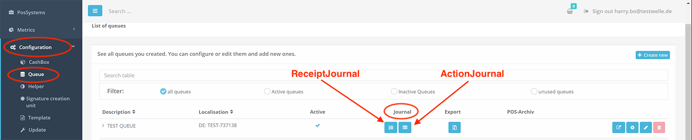


##### Full export (XML or CSV), DSFinV-K export or TAR file export

To do this, first go to the "Configuration -> Queue" menu item in the fiskaltrust.Portal. You will find a list entry for each Queue. In the list entry of the Queue there is an "Export" button:


The export view for the selected Queue appears. Here you can select the type of export and trigger the export:

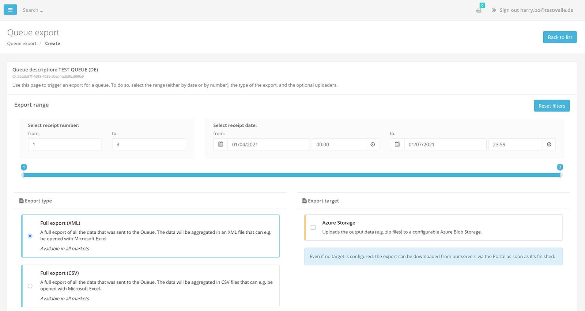

Set the desired filters in the upper filter area, then select e.g. "Full export (CSV)" and press the "Start export" button at the bottom. You will be redirected to the list of triggered exports, where you will see that the export is currently being processed. As soon as the desired export is available, you can expand the list entry and download the finished export.


The procedure described above can be performed analogously to all export formats offered in the export view. When testing the DSFinV-K and TAR file export, make sure that a corresponding dayly closing receipt has been sent to the fiskaltrust.Middelware from the POSSystem.


### Closing words

In the upper chapters we have described how the fiskaltrust.Middleware is structured, how the individual instances can be configured manually via the fiskaltrust.Portal and how the service can be started and tested. Next, we would like to present a few possible rollout scenarios as inspiration for the rollout. These show how flexibly the fiskaltrust.Middleware can be deployed at the operator's outlet. After presenting various rollout scenarios, we will then go into possible automation options for mass rollout. 

## Rollout scenarios

### Introduction
Instances of the fiskaltrust.Middleware can be configured and can work together in different ways depending on the situation or scenario. Each scenario presented in this chapter is related to one outlet. The following basic requirements must be fulfilled, regardless of the scenario:

- At least one SCU including TSE must be used per outlet. The TSE can either be an on-site hardware TSE or a certified cloud TSE.
- A TSE can only be used by one company and therefore by POSOperator (account) in the fiskaltrust.Portal. Even if two companies share an outlet, two TSEs must still be used.
- Each Queue must be reported to the tax office as an electronic cash or recording system (cash register).
- All Queues, SCUs and TSEs must be located in the POSOperator's operational environment. The cloud component of a certified cloud TSE is an exception. This is located in the data center of the cloud TSE provider.
- Only one SCU can be assigned to each Queue and each SCU can only be responsible for one TSE. I.e. each cash register can only use one TSE.
- Several terminals can be operated per cash register. (A terminal is a device without a cash register function).

  

*Cloud TSE Info*
In a cloud TSE, a component runs in the data center of the cloud TSE provider. If this TSE component is no longer accessible, the fiskaltrust.middleware switches to failure mode. When using cloud TSEs, we would like to additionally refer to our [Fair-Use-Policy](https://github.com/fiskaltrust/productdescription-de-doc/blob/master/product-service-description/market-de-fair-use-policy.md).

 *Hardware TSE Info*
 Basically, hardware TSE are connected directly to the cash register via micro SD card or USB port.


### A TSE per cash register
From a technical point of view, this is the simplest scenario, but it requires a higher number of TSEs, since a separate TSE is used for each cash register. One advantage of this solution is that if one TSE fails or is lost, other cash registers are not affected. Another advantage is that performance bottlenecks are avoided because each cash register uses its own TSE and thus only the requests of this one cash register have to be processed or signed by the TSE.

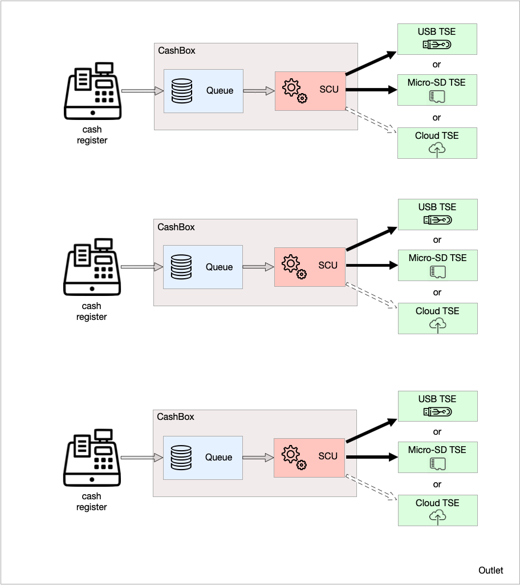

In the chapter [Template examples](#template-examples) you can find a template that represents this scenario.

### Hardware TSE(s) at local server for multiple cash registers

The fiskaltrust.Middleware runs on each cash register and on the local server. The hardware TSE is connected to the local server (e.g. via USB). The server's CashBox configures the fiskaltrust.Middleware instance with an SCU. The SCU configured for the server accesses a hardware TSE. The CashBoxes of the individual cash registers are configured in such a way that their fiskaltrust.Middleware instance is equipped with only one Queue. The Queues used here connect to the server's SCU. This scenario enables a saving of TSEs. However, since all requests have to pass through the server's SCU, the server becomes a bottleneck. The TSE also becomes a bottleneck. If the server or the TSE fails, all cash registers are affected. Furthermore, this scenario can lead to [performance bottlenecks](#performance recommendation) in the hardware TSE. 

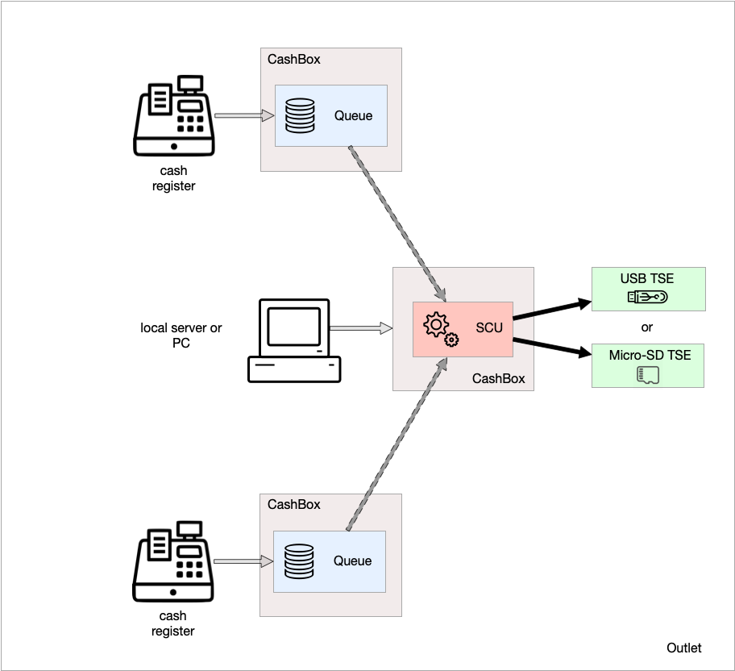

In the chapter [Template examples](#template-examples) you can find a template that represents this scenario.

If you decide to use this scenario, we recommend using one or more additional TSEs if you have a large number of requests. This is visualized in the image below as an example.


In the chapter [Template examples](#template-examples) you can find a template that represents this scenario.

### Hardware TSE at the main cash register for several additional cash registers
The fiskaltrust.Middleware runs on each cash register. The CashBox of the main cash register configures the fiskaltrust.Middleware instance with a Queue and an SCU. The SCU configured for the main cash register accesses a TSE. The CashBoxes of the other cash registers are configured so that their fiskaltrust.Middleware instances are only equipped with a Queue. The Queues used here connect to the SCU of the main cash register. This scenario enables a saving of TSEs. However, since all requests have to run via the SCU of the main checkout, the main checkout becomes a bottleneck. The hardware TSE also becomes a bottleneck. If the main cash register or the hardware TSE fails, all other cash registers are affected. Furthermore, in this scenario, [performance bottlenecks](#performancerecommendation) may occur in the TSE. If you decide to use this scenario, we recommend using one or more additional TSEs if you have a large number of requests.


In the chapter [Template examples](#template-examples) you can find a template that represents this scenario.

### A cloud TSE for multiple cash registers
The fiskaltrust.Middleware runs on each cash register. The CashBox of each cash register configures the fiskaltrust.Middleware instance with its own Queue and its own SCU. Each SCU accesses the same cloud TSE. This scenario enables cloud TSEs to be saved. One advantage here is that the SCU does not become a bottleneck, since each POS has its own SCU. However, since all requests are sent to the same cloud TSE, the TSE becomes a bottleneck. Furthermore, both possible [performance bottlenecks](#performance recommendation) in the cloud TSE and our [fair use policy](https://github.com/fiskaltrust/productdescription-de-doc/blob/master/product-service-description/market-de-fair-use-policy.md) must also be taken into account here.


In the chapter [Template examples](#template-examples) you can find a template that represents this scenario.

### Rollout scenario with terminals
Terminals are input devices such as tablets, handhelds or similar (without cash register function), where it is not possible to connect a hardware TSE or to install the fiskaltrust.Middleware on the device itself. In this case the fiskaltrust.Middleware is operated at a cash register or at a server and is always accessible for the terminals. The terminals only serve as input devices and connect to the server or to the cash register. If there are many simultaneous requests, [performance bottlenecks](#performancerecommendation) may occur in the TSE. If you decide to use this scenario, we recommend using multiple cash registers with additional TSEs (alternatively: multiple fiskaltrust.Middleware instances with their own SCU and TSE on a server) if you have a large number of requests.


Another possible variation of this scenario is to assign each terminal to its own Queue.

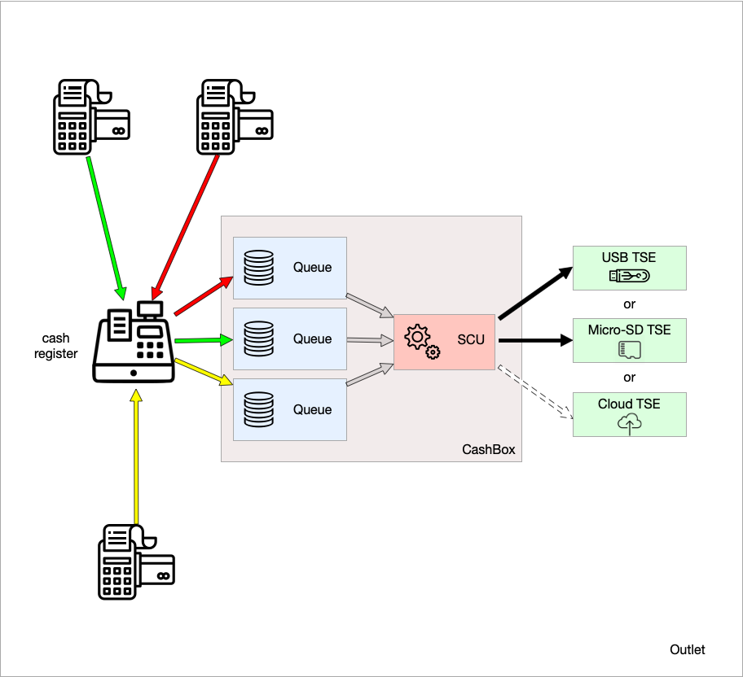

In the chapter [Template examples](#template-examples) you can find a template that represents this scenario.


### Data center as operational environment
If the cash register is operated in a data center and the terminals cannot function without an (Internet) connection to it, the data center can be assumed to be the "operational environment" under certain conditions. In this case, the fiskaltrust.Middleware should be operated entirely in the data center. In this scenario, the terminals connect to the fiskaltrust.Middleware in the data center via the online POSSystem.
However, in the event of a failure of the (Internet) connection, the fiskaltrust.Middleware can no longer be reached and therefore no signatures generated by the fiskaltrust.Middleware can be printed on the receipts. If you are interested in this solution (BYOD - Bring your own datacenter), where the fiskaltrust.middleware runs in the datacenter of the cash register operator, you can find more information in our [BYOD github repository](https://github.com/fiskaltrust/product-de-bring-your-own-datacenter). 


In the chapter [Template examples](#template-examples) you can find a template that represents this scenario.

### Connection variants of the TSE to the SCU

For the following connection variants we have prepared a legend showing the meaning of the individual arrows:


#### Cash register with hardware TSE
In the classic connection variant, the POSSystem is located in the local environment of the outlet and a hardware TSE is connected directly to the POSSystem, e.g. via USB or micro SD.


#### Network printer with hardware TSE
Another variant in the local environment is the use of a network printer with hardware TSE. The hardware TSE can be integrated directly in the printer or connected via USB. One or more cash registers use the printer.


#### Local TSE server with hardware TSEs
The third connection variant in the local environment is implemented via a TSE server in the local network. Several hardware TSEs can be connected to one TSE server. Several cash registers access the TSE server via their SCU.


#### Cash register with cloud TSE
A cloud TSE must be accessed over the Internet. In the following scenario, a POSSystem accesses a cloud TSE over the Internet using the SCU.

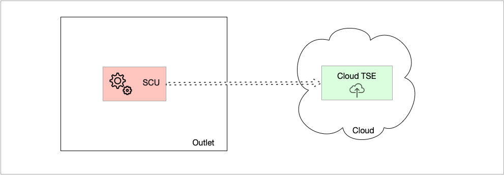

#### POSSystem in the operator's data center with cloud TSE

Here, too, the POSSystem accesses a cloud TSE via the Internet with the help of the fiskaltrust SCU. In the local environment, there are only terminals without a cash register function that access the electronic POSSystem in the POSOperator's data center via the Internet.

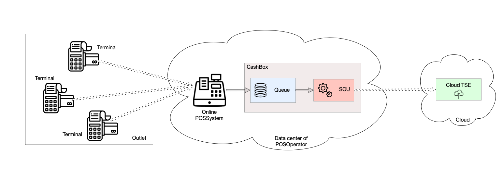

### Proposed solutions for virtualization within an outlet

When virtualizing the electronic cash register or recording system including fiskaltrust.Middleware, experience has shown that problems occur when accessing a hardware TSE directly connected to the local server via USB or as micro SD. An exception to this is the Diebold-Nixdorf TSE, since communication with it takes place via COM port. Due to the aforementioned access problems, we have presented proposed solutions for this scenario in the following sketches. Instead of connecting a hardware TSE directly to the local server, we recommend the following options:

#### SCU is within the virtual instance

- Connection to a local network printer with TSE
- Connection to a TSE server in the local network
- Connection of cloud TSEs
- Connection to a Diebold-Nixdorf hardware TSE, as communication takes place via COM port here


#### SCU is outside the virtual instance

A fiskaltrust.middleware runs on a second local server with this option. It is not operated in the virtualized environment. The CashBox used for this purpose merely configures an SCU that accesses the hardware TSE. The hardware TSE, in turn, is connected directly to this second server via USB or micro-SD. In the first server, in which the virtual instances run, the CashBoxes used configure the fiskaltrust.Middelware instances in such a way that they each operate only one Queue, which accesses the SCU in the second server.


A possible optimization of the option described above could be that the fiskaltrust.Middleware that runs the SCU runs on the same server as the virtual instances, but is not virtualized. This can then also access the hardware TSE.

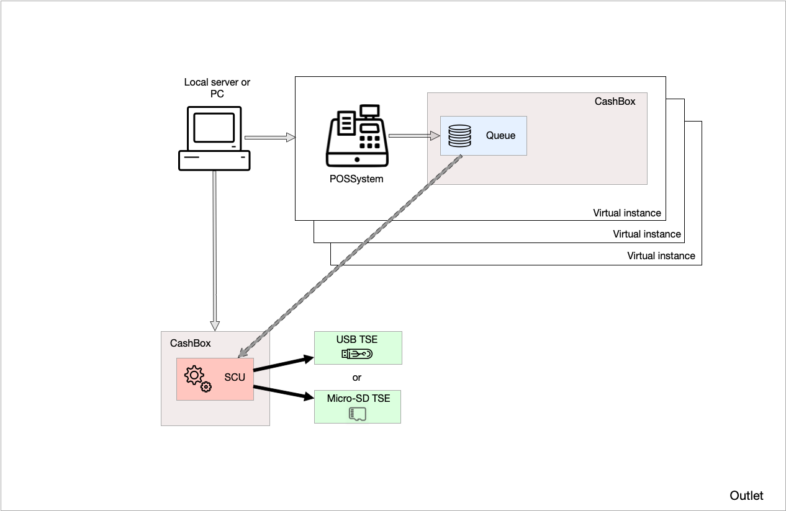

### Performance recommendations
In internal tests, we have found that 3 signatures per second can be processed well by each TSE. More than 3 signatures per second will cause delays. Please note that 2 signatures per request are sent in an implicit flow. We therefore recommend that if a higher number of signatures per second is expected, additional TSEs should be taken into account in the planning. 


## Rollout automation

This chapter is intended to support the rollout process by showing ways to simplify and optimize the rollout through automation. 

### Introduction

Each fiskaltrust.Middleware instance is configured with a so-called CashBox. This configuration container is rolled out together with the fiskaltrust.Middleware at the POSOperator. For doing so, the launcher can be downloaded from the portal and started in the cash register. The downloaded launcher contains the fiskaltrust.Middleware and its configuration in the form of a CashBox. The CashBox mainly contains the configurations of the Queue and the SCU but can also contain helper configurations. 


For example, communication endpoints, database access, TSE access, etc. are defined in the included configurations. Normally, one such CashBox is required per cash register. A rollout with many cash registers is therefore very time-consuming if done manually, since a separate CashBox must basically be created, compiled and published in the portal for each cash register. Furthermore, the launcher must be downloaded and executed in the cash register. 

In order to optimize this process, fiskaltrust provides various tools. A central role is played by the possibility of templating for the creation of CashBoxes and the possibility of automated execution of the templates with the help of the fiskaltrust.Portal API. 

In the following, we will discuss these and other optimization options and show how you, as a POSDealer, can make use of them as needed.


### Overview manual process

As already mentioned in the introduction, basically one CashBox is required per cash register. Normally, the configuration of a Queue and a SCU is made here and these are linked with each other. 

There are also other scenarios (see [Rollout scenarios](./README.md#rollout-scenarios ) which we will discuss later. The configuration of the CashBox is described in the chapter [Configuration of the fiskaltrust.Middleware](./README.md#configuration-of-the-fiskaltrustmiddleware).

As soon as the CashBox for the cash register has been created, configured and published in the portal, the Launcher can already be downloaded from the fiskaltrust.Portal and started on the cash register. As soon as the launcher is started for the first time, the included configuration is applied. Thereby the middleware is ready and will be started by the launcher in the next step. 

This means that in the manual process, at least the following initial steps must be taken for each cash register during the rollout:

1. Creation and configuration of the Queue
2. Creation and configuration of the SCU
3. Linking the Queue with the SCU
4. Create and configure the CashBox
5. Rebuild configuration for the CashBox (assembling/publishing the CashBox)
6. Download the Launcher
7. Start the Launcher

If you want to update the configuration later (e.g. use a new SCU package version), the following steps must be performed:

1. Update of the affected configuration in the portal (e.g. SCU configuration).
2. Rebuild configuration for the CashBox in the portal (assembling/publishing the CashBox)
3. Stop the middleware and restart the launcher at the cash register. 

The launcher then automatically loads the new version of CashBox, applies it and starts the fiskaltrust.Middleware with the new configuration.

With a large number of cash registers, the initial rollout is very time-consuming if it is performed using the manual processes described above. 


### Templating to create CashBoxes

When templating, it is possible to automatically create CashBoxes for the POSOperator with the help of a configuration template. A template is prepared for this and stored for the POSOperator in the fisklatrust.Portal. The template then appears in the fisklatrust.Shop within the POSOperator account as a free product. It can be checked out there in any quantity. The quantity represents the number of CashBoxes that are to be generated automatically. As soon as the checkout process is completed, the fiskaltrust.Portal automatically generates the corresponding number of CashBoxes by applying the template and stores them in the POSOPerators account. 

In the following, the individual steps of the process described above are presented in detail. In addition, we provide a [video](https://www.youtube.com/watch?v=l6IcV7o_LFM&t=8s) on the topic of tempalting.

#### Creation and contents of the configuration template

The template is a JSON string that represents a parameterizable variant of the CashBox (configuration container as JSON string) and can thus contain the configurations of Queues, SCUs and Helpers. It is parameterizable in that the structure for the CashBox to be generated can be defined here (e.g. five Queues, one SCU). In addition, variables can be used as placeholders for the values. As soon as the resulting CashBox is generated, the variables are filled with concrete, final values.

In the following snippet an example of such a template is visualized:

```json
{
    "ftCashBoxId": "|[cashbox_id]|",
    "ftSignaturCreationDevices": [
        {
            "Id": "|[scu0_id]|",
            "Package": "fiskaltrust.Middleware.SCU.DE.CryptoVision",
            "Url": [
                "grpc://localhost:10081"
            ],
            "Configuration": {
                "devicePath": "t:"
            }
        }
    ],
    "ftQueues": [
        {
            "Id": "|[queue0_id]|",
            "Package": "fiskaltrust.Middleware.Queue.SQLite",
            "Configuration": {
                "init_ftQueue": [
                    {
                        "ftQueueId": "|[queue0_id]|",
                        "ftCashBoxId": "|[cashbox_id]|",
                        "CountryCode": "DE",
                        "Timeout": 15000
                    }
                ],
                "init_ftQueueDE": [
                    {
                        "ftQueueDEId": "|[queue0_id]|",
                        "CashBoxIdentification": "|[my_shopcode]|-|[my_tillcode]|",
                        "ftSignaturCreationUnitDEId": "|[scu0_id]|"
                    }
                ],
                "init_ftSignaturCreationUnitDE": [
                    {
                        "ftSignaturCreationUnitDEId": "|[scu0_id]|",
                        "Url": "[\"grpc://localhost:10081\"]"
                    }
                ]
            },
            "Url": [
                "grpc://localhost:10082"
            ]
        }
    ]
}
```

Variables are marked by specifying them within ``|[``` and ```]|```. Possible is the specification of [system variables](#system-variables). Their values are generated by the fiskaltrust system during the generation. Also possible is the specification of own variables. Their values can be transferred later via an API call to generate the CashBox (see also [parameterization of the API call](#parameterization)). 

In line 1 of the above example, the system variable: ```|[cashbox_id]|`` is specified as the value for ``"ftCashBoxId"```. This is the CashBoxID, a value that is automatically generated by the system and used when generating the CashBox at this point.

Line 31, on the other hand, uses its own variables (```|[my_shopcode]|`` and ```|[my_tillcode]|`` ) whose concrete values can be passed later during the API call. 

As can also be seen in line 31, the JSON string values can consist of a combination of variables and static parts. However, they can also contain only static "text" or only one variable.

The following tables show the possible contents (data structure) of a template:

| **Fieldname**        | **Mandatory**              | **Content**          | **Description**          |
|----------------------|--------------------------|--------------------------|---------------------|
| `ftCashBoxId` |yes | ```GUID String``` | Identifies the CashBox in the fiskaltrust system and must therefore be unique. Will later be part of the authentication of the cash register with fiskaltrust. The system variable ```|[cashbox_id]|``` can be used here to automatically generate and use the value when generating the CashBox from fiskaltrust. |
| `ftSignaturCreationDevices` |no | `PackageConfiguration [ ]` | Array, contains the configurations of the SCUs to be used. |
| `ftQueues` |no | `PackageConfiguration [ ]` | Array, contains the configurations of the Queues to be used. |
| `helpers` |no | `PackageConfiguration [ ]` | Array, contains the configurations of the Helpers to be used. |
| `TimeStamp` |no | ```DateTime.UtcNow.Ticks``` | Time of creation of the template.|

A **`PackageConfiguration`** object is structured as follows:

| **Fieldname**        | **Mandatory**              | **Content**          | **Description**          |
|----------------------|--------------------------|--------------------------|---------------------|
| `Id` |yes |  ```GUID String```  | Identifies the instance of the element that is configured here (SCU, Queue or Helper). For the Queue, the system variable `queue{0-9}_id` can be used. For SCU the system variable `scu{0-9}_id` can be used here. For Helper `helper{0-9}_id`. |
| `Package` |yes | ```String``` | Name of the package that should be used to create the element. E.g. `fiskaltrust.Middleware.SCU.DE.CryptoVision` for a SCU that should communicate with a Cyptovision TSE. Currently supported packages can be found below. |
| `Description` |no |  ```String```| Name of the element. E.g. the Queue or SCU |
| `Version` |no |  ```String```| Version of the package to be used for creating the element. If no version is specified, the latest version is used.|
| `Configuration` |no | `<String, Object>`| Configuration parameters of the element. E.g. drive letter of the TSE for the Cryptovision SCU, so that the SCU knows how to access the TSE. To be filled depending on the element type. See below. |
| `URL` |yes | `String []` | Array, communication endpoints of the element. E.g. REST endpoint for communication with the Queue. |

**Queue**
The following packages are currently available for Queues:

| **Package Name**        | **Description**          |
|----------------------|----------------------|
| `fiskaltrust.Middleware.Queue.SQLite` |A SQLite database is used as a local persistence layer. |
| `fiskaltrust.Middleware.Queue.EF` |Entity Framework is used as a local persistence layer. |
| `fiskaltrust.Middleware.Queue.MySQL` | A MySQL database is used as a local persistence layer. |

The following key-value pairs are used in the **`Configuration`** object of a Queue:

| **Fieldname**        | **Mandatory**              | **Content**          | **Description**          |
|----------------------|--------------------------|--------------------------|---------------------|
| `init_ftQueue` |yes |  ```Configuration``` | Initialization parameters for the Queue (general part of the Queue configuration).|
| `init_ftQueueDE` |yes |  ```Configuration``` | Initialization parameters for the Queue (country-specific part of the Queue configuration).|
| `init_ftSignaturCreationUnitDE` |no |  ```Configuration``` | Initialization parameter for linking the Queue with an SCU. Connection values are stored here.|
| `connectionstring` |no |  ```String``` | Connection string to the persistence layer. Example see below. With SQLite this field can be omitted if no own database is available. In this case fiskaltrust automatically creates an SQLite database. |

Example of a `connectionstring` when using Entity Framework:

`Data Source=.\\!sql-instanz!;Initial Catalog=!fiskaltrust!;User ID=!user!;Password=!password!;MultipleActiveResultSets=True` 

Example of a `connectionstring` when using MySQL:

`Server=myServerAddress;Database=myDataBase;Uid=myUsername;Pwd=myPassword;` 

Example of a `connectionstring` when using SQLite:

`Data Source=c:\mydb.db;Version=3;Password=myPassword;` 

The following key-value pairs are used in the **`Configuration` **object of a Queue in the **`init_ftQueue`** field:

| **Fieldname**        | **Mandatory**              | **Content**          | **Description**          |
|----------------------|--------------------------|--------------------------|---------------------|
| `ftQueueId` |yes |  ```GUID String``` | Identification of the Queue. The system variable `queue{0-9}_id` can be used.|
| `ftCashBoxId` |yes |  ```GUID String``` | Identification of the CashBox. The system variable ``|[cashbox_id]|`` can be used here.|
| `CountryCode` |yes |  ```String``` | Country code. For Germany: "DE".|
| `Timeout` |no |  ```Int``` | Timeout in milliseconds. |

The following key-value pairs are used in the **`Configuration`** object of a Queue in the **`init_ftQueueDE`** field:

| **Fieldname**        | **Mandatory**              | **Content**          | **Description**          |
|----------------------|--------------------------|--------------------------|---------------------|
| `ftQueueDEId` |yes |  ```GUID String``` | Identification of the Queue. The system variable `queue{0-9}_id` can be used. (Here the same value must be used as for `ftQueueId`). |
| `CashBoxIdentification` |yes |  ```printable String (20)``` | Cash register serial number. Also used as client ID for the TSE. Printable string, max. 20 characters.|
| `ftSignaturCreationUnitDEId` |yes |  ```GUID String```  | The ID of the SCU this Queue should connect to.

The following key-value pairs are used in the **`Configuration`** object of a Queue in the **`init_ftSignatureCreationUnitDE`** field:

| **Fieldname**        | **Mandatory**              | **Content**          | **Description**          |
|----------------------|--------------------------|--------------------------|---------------------|
| `ftSignaturCreationUnitDEId` |yes |  ```GUID String``` | Identification of the SCU to which this Queue should connect. The system variable `scu{0-9}_id` can be used. |
| `Url` |yes |  ```String``` | Communication endpoints of the SCU. As an array in the string Ex: ```"[\"grpc://localhost:10081\", \"grpc://localhost:10082\"]" ```. Normally only one endpoint is needed. |

**SCU**

Folgende Packages stehen aktuell für SCUs zur Verfügung:

| **Package Name**        | **Description**          |
|----------------------|----------------------|
| `fiskaltrust.Middleware.SCU.DE.CryptoVision` | This package enables communication with a Cryptovision TSE.|
| `fiskaltrust.Middleware.SCU.DE.DieboldNixdorf` | This package enables communication with a Diebold Nixdorf TSE.|
| `fiskaltrust.Middleware.SCU.DE.Epson` | This package enables communication with an Epson TSE.|
| `fiskaltrust.Middleware.SCU.DE.Fiskaly` | This package enables communication with a Fiskaly TSE.|
| `fiskaltrust.Middleware.SCU.DE.Swissbit` | This package enables communication with a Swissbit TSE. |

The following key-value pairs are used in the **`Configuration`** object of a **SCU** depending on the manufacturer of the TSE:

**Swissbit TSE**

| **Fieldname**        | **Mandatory**              | **Content**          | **Description**          |
|----------------------|--------------------------|--------------------------|---------------------|
| `devicePath` |yes |  ```String``` | Drive letter followed by colon (e.g. `E:`). Represents the drive to which the Swissbit TSE is connected at the cash register. |
| `adminPin` |no |  ```String``` | Admin PIN. Only to be entered if the TSE has been initialized outside fiskaltrust. If the TSE is not yet initialized, this value is not required.|
| `timeAdminPin` |no |  ```String``` | Time Admin PIN. Only to be specified if the TSE has been initialized outside of fiskaltrust. If the TSE is not yet initialized, this value is not required.|

**Cryptovision TSE**

| **Fieldname**        | **Mandatory**              | **Content**          | **Description**          |
|----------------------|--------------------------|--------------------------|---------------------|
| `devicePath` |yes |  ```String``` | Drive letter followed by colon (e.g. `E:`). Represents the drive to which the Cryptovision TSE is connected at the cash register. |
| `adminPin` |no |  ```String``` | Admin PIN. Only to be entered if the TSE has been initialized outside fiskaltrust. If the TSE is not yet initialized, this value is not required.|
| `timeAdminPin` |no |  ```String``` | Time Admin PIN. Only to be specified if the TSE has been initialized outside of fiskaltrust. If the TSE is not yet initialized, this value is not required.|

**Diebold Nixdorf**

| **Fieldname**        | **Mandatory**              | **Content**          | **Description**          |
|----------------------|--------------------------|--------------------------|---------------------|
| `comPort` |yes (only USB) |  ```String``` | Defines the Com port to which the TSE is connected. For example `COM6`. Only to be used if it is a USB TSE without Connect Box. |
| `url` |yes (only Connect Box) |  ```String``` | Connection url if it is a Diebold Nixdorf Connect Box. |
| `adminUser` |no |  ```String``` | Admin Username. Only to be specified if the TSE has been initialized outside fiskaltrust. If the TSE is not yet initialized, this value is not required.|
| `adminPin` |no |  ```String``` | Admin PIN. Only to be entered if the TSE has been initialized outside fiskaltrust. If the TSE is not yet initialized, this value is not required.|
| `timeAdminUser` |no |  ```String``` | Time Admin Username. Only to be specified if the TSE has been initialized outside fiskaltrust. If the TSE is not yet initialized, this value is not required.|
| `timeAdminPin` |no |  ```String``` | Time Admin PIN. Only to be specified if the TSE has been initialized outside of fiskaltrust. If the TSE is not yet initialized, this value is not required.|
| `slotNumber` |yes (nur Connect Box) |  ```Int``` | Slot number of the TSE if a Diebold Nixdorf Connect Box is used. |

**Epson** 

| **Fieldname**        | **Mandatory**              | **Content**          | **Description**          |
|----------------------|--------------------------|--------------------------|---------------------|
| `host` |yes |  ```String``` | Url to connect to the TSE. Here the TSE will be reachable. |
| `port` |no |  ```String``` | Port to connect to the TSE. Here the TSE will be reachable.|
| `deviceId` |no |  ```String``` | Device Id if Epson Server.|
| `timeout` |no | Int | Timeout in milliseconds |

**Fiskaly**

| **Fieldname**        | **Mandatory**              | **Content**          | **Description**          |
|----------------------|--------------------------|--------------------------|---------------------|
| `ApiKey` |yes |  ```String``` | Fiskaly API Key |
| `ApiSecret` |yes |  ```String``` | Fiskaly API Secret |
| `TssId` |yes |  ```GUID String``` | ID of the TSE from Fiskaly |

The following key-value pairs can be used in the **`Configuration`** object of a **SCU** independent of the manufacturer of the TSE:

| **Fieldname**        | **Mandatory**              | **Content**          | **Description**          |
|----------------------|--------------------------|--------------------------|---------------------|
| `Counter` |no |  ```Integer``` | If the counter is set for an SCU in it's configuration, than the counter can later be used in a template to create a cashbox that doese not include, but needs to reference this SCU. See also chapter [Referencing an existing SCU in a template](#referencing-an-existing-scu-in-a-template).|

#### System variables

The following system variables are available for use in the template:

| Variable                                  | Wert                                                         |
| ----------------------------------------- | ------------------------------------------------------------ |
| `cashbox_id`                              | Random GUID                                                  |
| `scu{0-9}_id`                             | Random GUID                                                  |
| `helper{0-9}_id`                          | Random GUID                                                  |
| `queue{0-9}_id`                           | Random GUID                                                  |
| `queue{0-9}_id_base64withoutspecialchars` | `{queue_id}`, converted to Base64 without special characters |
| `reference_scu_fiskaly_counter_{0-n}_id` | used to reference an existing fiscaly cloud scu (e.g. that was automatically created by checkout)|
| `reference_scu_swissbitcloud_counter_{0-n}_id` | used to reference an existing swissbit cloud scu (e.g. that was automatically created by checkout)|
| `reference_scu_swissbit_counter_{0-n}_id` | used to reference an existing swissbit usb scu that has a counter set in it's configuration|
| `reference_scu_cryptovision_counter_{0-n}_id` | used to reference an existing cryptovision scu that has a counter set in it's configuration|
| `reference_scu_dieboldnixdorf_counter_{0-n}_id` | used to reference an existing diebold scu that has a counter set in it's configuration|
| `reference_scu_epson_counter_{0-n}_id` | used to reference an existing epson scu that has a counter set in it's configuration|
| `reference_scu_atrust_counter_{0-n}_id` | used to reference an existing atrust scu that has a counter set in it's configuration|
| `reference_scu_fiskaly_counter_{0-n}_url` | used to obtain the url of an existing fiscaly cloud scu that has a counter set in it's configuration|
| `reference_scu_swissbitcloud_counter_{0-n}_url` | used to obtain the url of an existing swissbit cloud scu that has a counter set in it's configuration|
| `reference_scu_swissbit_counter_{0-n}_url` | used to obtain the url of an existing swissbit usb scu that has a counter set in it's configuration|
| `reference_scu_cryptovision_counter_{0-n}_url` | used to obtain the url of an existing cryptovision scu that has a counter set in it's configuration|
| `reference_scu_dieboldnixdorf_counter_{0-n}_url` | used to obtain the url of an existing diebold scu that has a counter set in it's configuration|
| `reference_scu_epson_counter_{0-n}_url` | used to obtain the url of an existing epson scu that has a counter set in it's configuration|
| `reference_scu_atrust_counter_{0-n}_url` | used to obtain the url of an existing atrust scu that has a counter set in it's configuration|

_Dynamic values are highlighted by {} in this table._

#### Referencing an existing SCU in a template

A previously created SCU can be referenced in a template. This is important, for example, in the case that a queue of the new cashbox to be created has to access an already existing SCU that is located outside the new cashbox.

The SCU to be referenced is identified by the combination of its type (e.g. swissbit) and its `Counter` in the template. The prerequisite is that the SCU to be referenced has a so-called `Counter` as a key-value pair in its configuration. SCUs created automatically by fiskaltrust (e.g. fiskaly or swissbit cloud at checkout) already have the `Counter` set. For SCUs created manually or by a template, the `Counter` is set via the portal in the configuration area. To do this, create the key-value pair `Counter` in the configuration of the SCU as follows:

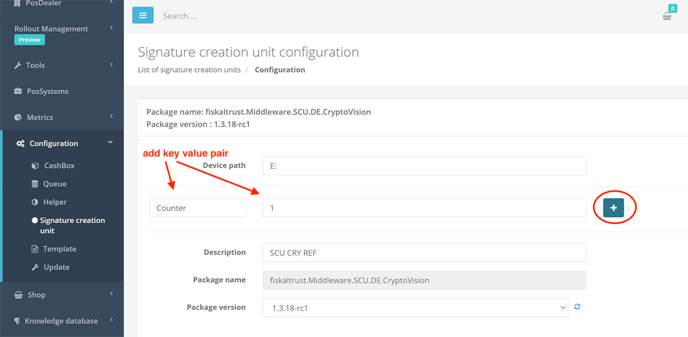

When initially creating a new SCU via a template, the `Counter` can be set in the **`Configuration`** area. Example:

```json
"Configuration": {
    "devicePath": "E:",
    "Counter": 1
}
```
In the template that is to reference the SCU, the following specifications can now be made:

1.  In the **`ftSignatureCreationDevices`** section, specify the SCU to reference as follows:

```json
"ftSignaturCreationDevices":[
  {
     "Id":"|[reference_scu_swissbit_counter_1_id]|",
     "Package":"fiskaltrust.Middleware.SCU.DE.Swissbit"
  }
]
```
Depending on the type, **`Id`** uses the corresponding [system variable](#system-variables). In the above example it is the variable `reference_scu_swissbit_counter_{0-n}_id`. The value `{0-n}` specifies which SCU should be referenced. In our example it is 1, i.e.: reference_scu_swissbit_counter_**1**_id.

Furthermore, the package of the SCU to be referenced must be specified for **`Package`**. In our example it is for the swissbit usb the package `fiskaltrust.Middleware.SCU.DE.Swissbit`.

2. The connection of a Queue with the SCU is specified in the template at the following two places:

**`init_ftQueueDE`** :
```json
"init_ftQueueDE":[
  {
     "ftQueueDEId":"|[queue0_id]|",
     "ftSignaturCreationUnitDEId":"|[reference_scu_swissbit_counter_1_id]|",
     "CashBoxIdentification":"|[queue0_id_base64withoutspecialchars]|"
  }
]
```
and

**`init_ftSignaturCreationUnitDE`** :

```json
"init_ftSignaturCreationUnitDE":[
   {
      "ftSignaturCreationUnitDEId":"|[reference_scu_swissbit_counter_1_id]|",
      "Url":"[\"|[reference_scu_swissbit_counter_1_url]|\"]"
   }
]
```

Here you can find such a template as an example for download: [`ref-template-example`](images/ref-template-example.zip) 

#### Template examples

You can download our template examples bundled as a [zip file](images/template-examples.zip). The individual examples and their associated files are described below. Also in the folder is a postmancollection that can be used to test execution via the [API](#api) described below.

| **Name**        | **Files**              | **Description**          |
|----------------------|--------------------------|--------------------------|
| A TSE per cash register| `a-tse-per-cashregister.json` | Refers to the rollout scenario [A TSE per cash register](#a-tse-per-cash-register) described above. The template creates a cashbox with a Queue and a SCU that accesses a hardware TSE located in the E: drive. The Queue is accessible via a REST endpoint. |
| A hardware TSE(s) at a local server for multiple cash registers| `tse-at-local-server-for-multiple-cashregisters-1-1.json` and `tse-at-local-server-for-multiple-cashregisters-1-2.json`  | Refers to the first part of the above described rollout scenario [Hardware TSE(s) at local server for multiple cash registers](#hardware-tses-at-local-server-for-multiple-cash-registers). The template in the file `tse-at-local-server-for-multiple-cashregisters-1-1.json` is executed first. It creates the cashbox for the server with a SCU that accesses a hardware TSE. The SCU is given a Counter so that it can later be referenced from the cashboxes of the cash registers. For each cash register, the template from the file `tse-at-local-server-for-multiple-cashregisters-1-2.json` is then executed. It creates a cashbox that references the SCU from the server and creates a Queue that accesses the server's SCU. |
| Multiple hardware TSE(s) at a local server for multiple cash registers| `tse-at-local-server-for-multiple-cashregisters-2-1.json` ,  `tse-at-local-server-for-multiple-cashregisters-2-2.json` and  `tse-at-local-server-for-multiple-cashregisters-2-3.json`  | Refers to the second part of the above described rollout scenario [Hardware TSE(s) at local server for multiple cash registers](#hardware-tses-at-local-server-for-multiple-cash-registers). The template in the file `tse-at-local-server-for-multiple-cashregisters-2-1.json` is executed first. It creates the cashbox for the server with two SCUs each accessing a hardware TSE. The SCUs are given a Counter so that they can be referenced later from the cashboxes of the cash registers. For each cash register that is to use the first SCU, the template from the file `tse-at-local-server-for-multiple-cashregisters-2-2.json` is then executed. It creates a cashbox that references the first SCU from the server and creates a Queue that accesses the first SCU of the server. |
| A hardware TSE at the main cash register for several additional cash registers| `hw-tse-at-main-cashregister-1.json` and `hw-tse-at-main-cashregister-2.json`  | Refers to the rollout scenario [Hardware TSE at the main cash register for several additional cash registers](#hardware-tse-at-the-main-cash-register-for-several-additional-cash-registers) described above. The template in the file `hw-tse-at-main-cashregister-1.json` is executed first. It creates the cashbox for the main cash register with its own Queue and a SCU that accesses a hardware TSE. The SCU gets a Counter so that it can be referenced later from the cashboxes of the other cash registers. For each other cash register, the template from the file `hw-tse-at-main-cashregister-2.json` is then executed. It creates a cashbox that references the SCU from the main cash register and creates a Queue that accesses the SCU of the main cash register. |
| A cloud TSE for multiple cash registers| `a-cloud-tse-for-multiple-cashregisters-1.json` or `a-cloud-tse-for-multiple-cashregisters-2.json`  | Refers to the rollout scenario described above: [A cloud TSE for multiple cash registers](#a-cloud-tse-for-multiple-cash-registers). The template in the file `a-cloud-tse-for-multiple-cashregisters-1.json` is executed per cash register. The prerequisite here is that a SCU already exists, because it is not created when the cashbox is generated, but only referenced. The SCU is usually created automatically by fiskaltrust when checking out a cloud TSE in the shop, but it can also be created manually. The second template `a-cloud-tse-for-multiple-cashregisters-2.json` shows an example where the SCU is also created in the cashbox. Individual variables are used to place the connection values. Their concrete values can be passed as query parameters when executing the template via the API. The exact procedure for passing the values for the individual variables can be found in the chapter [API](#api). This second example also creates a Queue that in contrast stores its data in a MySQL database. It can be especially useful in a [BYODC environment](https://github.com/fiskaltrust/product-de-bring-your-own-datacenter). |
| A cashbox with multiple Queues| `multiple-queues-same-scu.json` | This template is used to create a cashbox that contains multiple Queues that in turn access the same SCU. It is pictured in the [Rollout scenario with terminals](#rollout-scenario-with-terminals) above, but can also be used in the case where only one fiskaltrust.Middleware instance is to be used for several cash registers. Each Queue has a different endpoint (port is different) and can be addressed individually. |
| Data center as operational environment (BYODC)| `byodc-1.json` oder  `byodc-2.json`| Refers to the rollout scenario [Data center as operational environment](#data-center-as-operational-environment) described above. Using the template from the `byodc-1.json` file, a cashbox is created that references an existing SCU. The SCU is usually created automatically by fiskaltrust when checking out a cloud TSE in the store, but it can also be created manually. The second template `byodc-2.json` shows an example where the SCU is also created in the cashbox. Individual variables are used to place the connection values. Their concrete values can be passed as query parameters when executing the template via the API. The exact procedure for passing the values for the individual variables can be found in the chapter [API](#api). The Queue created by the template stores its data in a MySQL database. This is specific for a [BYODC environment](https://github.com/fiskaltrust/product-de-bring-your-own-datacenter). |


**Notes about the postmancollection**

The collection is located in the file `fiskaltrust_templates.postman_collection.json` . The file must be imported with Postman. The collection contains two request entries. One for the sandbox and one for production. The difference between the two is only the Endpoint URL of the API which is addressed via POST. Please read more about the API in the chapter [API](#api). Before executing the template it is important to set the correct values in the request. In the Header, the AccountId and the AccessToken of the account for which the template is to be executed must be specified. In the Body the content of the template (json) must be placed between the quotation marks - Important: the content must be "escaped" (search for "online json escape" on the Internet for quick conversion). In the request URL, the outlet number must be passed as a parameter in the query string (e.g. outlet_number=1). Depending on ones requirements, additional parameters can optionally be passed via the query string (e.g. concrete values for individual variables in the template).


#### Making the configuration template available via the portal

POSCreators, POSDealers and POSOPerators can store and release configuration templates in the fiskaltrust.Portal. They can do this under the menu item `Configuration->Templates`. 

The template itself (JSON string) is stored in the form field `Content`.

When creating the template, one can select the target group for which the template is to be released. 

Options for **POSCreator**:

| **Option**        | **Description**          |
|----------------------|----------------------|
| `Deaktiviert` | No release, template is still in preparation or has been paused. |
| `Privat (nur Besitzer)` | Release only for the POSCreator itself (e.g. for testing) |
| `Geteilt mit Händler` | Release for the POSCreator itself and for all POSDealers associated with him. |
| `Getielt mit Betreiber` | Release for the POSCreator itself and for all POSOperators associated with his POSDealers.|

Options for **POSDealer**:

| **Option**        | **Description**          |
|----------------------|----------------------|
| `Deaktiviert` | No release, template is still in preparation or has been paused. |
| `Privat (nur Besitzer)` | Release only for the POSDealer himself (e.g. for testing). |
| `Getielt mit Betreiber` | Release for the POSDealer itself and for all POSOperators associated with him.|

Options for **POSOperator**:

| **Option**        | **Description**          |
|----------------------|----------------------|
| `Deaktiviert` | No release, template is still in preparation or has been paused. |
| `Privat (nur Besitzer)` | Release only for the POSOperator itself. |

Furthermore, the template can be personalized with an image and link. Since the template will later appear in the fiskaltrust.Shop for approved accounts, this branding will enable better recognition.

If the POSCreator provides a template for his POSDealers, they can clone the template, possibly adapt it and make it available to their POSOperators as a new template.


#### Manual execution of the configuration template

As soon as a template has been released for an account, it appears as a free product in the fiskaltrust.Shop within the released account. The account owner can now check out the template in any quantity. The quantity represents the number of CashBoxes that should be generated automatically. As soon as the checkout process is completed, the portal automatically generates the corresponding number of CashBoxes by applying the template. They can be found here:  `Configuration->CashBox`. 

If this is the account of a POSOperator, it is possible to check out different templates depending on the outlet. Therefore, before transferring the template to the shopping cart, you should pay attention to the outlet selection (selection: outlet dropdown in the upper left corner of the shop page).

Under certain circumstances, the POSDealer can check out the template for the POSOperator himself. This is a time-saving optimization that allows POSDealers to operate during the rollout without the intervention of the POSOperator. To do this, however, the POSDealer needs general permission from the POSOperator for the so-called "surrogation" function. With this function, the POSDealer can switch to the account of the POSOperator. See also [invitation management](../invitation-management/README.md).

#### FAQ: Template for one customer only

A frequently asked question in this context is whether a template can also be made available only to a specific end customer (POSOperator). To achieve this, the POSDealer can use the "surrogation" function to switch to the account of the POSOperator and create the template there and then release it with the release level `Privat (nur Besitzer)`. Thus, this template is visible via the fiskaltrust.Shop only in the account of this POSOperator.


#### Use of API and PowerShell for automated execution of the templates


fiskaltrust provides an HTTP API that allows you to automate CashBox generation using configuration templates. This chapter describes the API and demonstrates a call using PowerShell as an example.

#### API
The execution of templates can be easily automated via our HTTP API. You need the template as JSON string, the AccountId and the AccessToken of the account (e.g. of the POSOperator) for which the template should be executed. AccountId and AccessToken can be found in the fiskaltrust.Portal within the corresponding account (menu item: [`Company name -> Overview`](https://portal.fiskaltrust.de/AccountProfile) in the lower area there is the section `API Access`).


Your request should look like this:

- _Method_: **POST**
- _Headers_: 
  - `accountid`: `<your-account-id>`
  - `accesstoken`: `<your-access-token>`
- _Body_: JSON template
- _URLs_: 
  - Sandbox: `https://helipad-sandbox.fiskaltrust.cloud/api/configuration`
  - Production: `https://helipad.fiskaltrust.cloud/api/configuration`

#### Parameterization

In addition, variables can be added to the query string of the URL, which will then be automatically replaced in the template.  For example, change the above URL to the value:

`https://helipad.fiskaltrust.cloud/api/configuration?my_variable=123` 

by doing so, the occurrences `|[my_variable]|` are replaced with the string `123` before the template is executed.

If not overwritten via the query string, [system variables](#system-variables) in the template are automatically replaced by the system as described above.

Furthermore, it is possible to pass the following additional (optional) parameters via the query string of the URL:

| Variable                 | Description                                                 | Default value if not passed                       |
| ------------------------ | ------------------------------------------------------------ | --------------------------------------------------------- |
| `outlet_number`          | Outlet number                                         | `{max(outlets used in account's existing cashboxes) + 1}` |
| `description`            | General name. Used for the CashBox, contained Queues and SCUs, if not individually overwritten with its own parameter. | `ft{yyyyMMddHHmmss}`                                      |
| `cashbox_description`    | Name for the cashBox. Overwrites `description `           | `ft{yyyyMMddHHmmss}`                                      |
| `cashbox_id`             | ID of the CashBox. Can be used for new creation and for modification. In case of new creation we recommend not to specify this parameter and to leave its automatic generation to the fiskaltrust system. Attention: will be overwritten by the template field `ftCashBoxId`. | Random GUID                                               |
| `cashbox_ipaddress`      | IP address of the CashBox.                                      | Empty string                                              |
| `cashbox_producttype`    | CashBox Product Type                                         | Empty string                                              |
| `queue{0-9}_id`          | ID of the Queue. This parameter can be used for new Queues and for changes. In case of new creation we recommend not to specify this parameter and to leave its automatic generation to the fiskaltrust system. Attention: will be overwritten by the template field `PackageConfiguration.Id`. | Random GUID                                               |
| `queue{0-9}_description` | Name for the Queue. Overwrites `description`. Warning: will be overwritten by `PackageConfiguration.Description`. | `{description}` |
|`queue{0-9}_package` |  Name of the package to create the Queue. Attention: will be overwritten by `PackageConfiguration.Package`. | Empty String |
|`queue{0-9}_version` |  Version of the package to create the Queue. Attention: will be overwritten by `PackageConfiguration.Version`. | Empty String |
| `queue{0-9}_url` | JSON array with URLs (strings) for the Queue. Attention: will be overwritten by `PackageConfiguration.Url`.  | `http://localhost:1200/fiskaltrust` for the first Queue, `http://localhost:1200/fiskaltrust{1-9}` for others |
| `queue{0-9}_configuration` | JSON element to configure the Queue. Like `PackageConfiguration.Configuration` from the template. Attention: will be overwritten by `PackageConfiguration.Configuration`. | Empty |
| `queue{0-9}_countrycode` | Country code for the Queue. Like `PackageConfiguration.Configuration.CountryCode` from the template. Attention: will be overwritten by `PackageConfiguration.Configuration.CountryCode`.  | Empty |
| `queue{0-9}_timeout` | Timeout for the Queue. Like `PackageConfiguration.Configuration.Timeout` from the template. Attention: will be overwritten by `PackageConfiguration.Configuration.Timeout`.  | 15000 |
| `scu{0-9}_id`                            | ID of the SCU. Can be used for new creation and for changes. In case of new creation we recommend not to specify this parameter and to leave its automatic generation to the fiskaltrust system. Attention: will be overwritten by the template field 'PackageConfiguration.Id'. | Random GUID                                                  |
| `scu{0-9}_description`                   | Name for the SCU. Overwrites `description` . Attention: will be overwritten by `PackageConfiguration.Description`. | `{description}`                                              |
|`scu{0-9}_package` |  Name of the package to create the SCU. Attention: will be overwritten by `PackageConfiguration.Package`. | Empty String |
|`scu{0-9}_version` |  Version of the package to create the SCU. Attention: will be overwritten by `PackageConfiguration.Version`. | Empty String |
| `scu{0-9}_url` | JSON array with URLs (strings) for the SCU. Attention: will be overwritten by `PackageConfiguration.Url`.  | `net.pipe://localhost/{scu_id}` |
| `scu{0-9}_configuration` | JSON element to configure the SCU. Like `PackageConfiguration.Configuration` from the template. Attention: will be overwritten by `PackageConfiguration.Configuration`. | Empty |
| `helper{0-9}_id`                         | ID of the helper. Can be used for new creation and for changes. In case of new creation we recommend not to specify this parameter and to leave its automatic generation to the fiskaltrust system. Attention: will be overwritten by the template field `PackageConfiguration.Id`. | Random GUID                                                  |
| `helper{0-9}_description`                | Name for the helper. Overwrites `description` . Warning: will be overwritten by `PackageConfiguration.Description`.  | `{description}`                                              |
| `helper{0-9}_url`                        | JSON array with URLs (strings) for the helper. Attention: will be overwritten by `PackageConfiguration.Url`.  | `net.pipe://localhost/{helper_id}`                           |
|`helper{0-9}_package` |  Name of the package to create the helper. Attention: will be overwritten by `PackageConfiguration.Package`. | Empty String |
|`helper{0-9}_version` |  Version of the package to create the helper. Attention: will be overwritten by `PackageConfiguration.Version`. | Empty String |
| `helper{0-9}_configuration` | JSON element to configure the helper. Like `PackageConfiguration.Configuration` from the template. Attention: will be overwritten by `PackageConfiguration.Configuration`.  | Empty |


Example:

`https://helipad-sandbox.fiskaltrust.cloud/api/configuration?outlet_number=55&description=Mdedarh999&queue0_description=Mdedarh999_Q1&queue1_description=Mdedarh999_Q2&queue2_description=Mdedarh999_Q3`

#### Response

In response, the API returns a JSON string containing the `cashboxid` of the created CashBox, the `accesstoken` and the template. The received `cashboxid` is important for the overall automation of the rollout. See also [Rollout automation](#rollout-automation).

#### PowerShell

The following example shows how to send the request to our API using PowerShell:

```powershell
$headers = @{ accountid = "your-account-id" ; accesstoken = "your-access-token" }
$uri = "https://helipad-sandbox.fiskaltrust.cloud/api/Configuration"
# Read from template.json and escape JSON string
$template = (Get-Content .\template.json -Raw).Replace('\', '\\').Replace('"', '\"')

Invoke-WebRequest -uri  $uri -Headers $headers -Method POST -ContentType "application/json" -Body "`"$template`""
```

#### Handling of outlets

As mentioned above, the checkout of templates can be linked to the outlet of the POSOperator. This chapter shows how this function can be automated via the API.

##### Creating or importing the outlets in the portal

Outlets can be created manually via the portal in the POSOperator's account. See menu item `Outlets`. Furthermore, as an optimization variant under the same menu item, an entire list of locations can be imported with the help of a csv. File a whole list of locations can be imported. The structure of such a list is described in the portal.

Creating the locations is only possible via the portal and cannot be done via the API.

##### Specification of the outlet in the API call

The `outlet_number` parameter can be used in the query string to specify the outlet number for which the template is to be executed:

`https://helipad-sandbox.fiskaltrust.cloud/api/configuration?outlet_number=12`

##### Example automated execution of different templates considering the outlets

Powershell:

```powershell
$headers = @{ accountid = "your-account-id" ; accesstoken = "your-access-token"  }

$outlets = Import-Csv -Path .\fiskaltrustOutletsWithTemplateFile.csv -Delimiter ';'

foreach ($outlet in $outlets)
{
    $template = (Get-Content .\$($outlet.Template) -Raw).Replace('\', '\\').Replace('"', '\"')

    $uri = "https://helipad-sandbox.fiskaltrust.cloud/api/configuration?description=$([uri]::EscapeDataString($outlet.Name))&outlet_number=$([uri]::EscapeDataString($outlet.OutletNumber))&my_shopcode=$($outlet.OutletNumber)&my_tillcode=$($outlet.TillCode)"

    Write-Output $uri
    Invoke-WebRequest -uri  $uri -Headers $headers -Method POST -ContentType "application/json" -Body "`"$template`""
}
```
Step 1: Define header (set accountId and accesstoken)

Step 2: Import outlets from the [`fiskaltrustOutletsWithTemplateFile.csv`](images/fiskaltrustOutletsWithTemplateFile.csv) file. This file is used both for creating the outlets (import in the portal) and for running the templates. After import in the portal, it is read here. Sample content:
`
LocationId;OutletNumber;Name;Address;ContactName;Telephone;Fax;PostalCode;City;County;StateOrProvince;Country;Template;TillCode
;15;Outlet 5;street address5;;;;80803;München;;;DE;template1.json;till1
;16;Outlet 6;street address6;;;;80803;München;;;DE;template2.json;till2
;17;Outlet 7;street address7;;;;80803;München;;;DE;template1.json;till3
`

Step 3: Iterate over the lines read from the outlet file.

Step 4: for each line read in, the corresponding template is read in and prepared. E.g. for line 1 the content of the file [`template1.json`](images/templates.zip) is read in. In line 2 another template [`template2.json`](pathname://images/template2.json) is needed for another outlet.

Step 5: for each row read in, the Uri for the API call is built. Here the outlet number is passed as a parameter in the query string.

Step 6: for each line read, a call to the HTTP API is made with the previously prepared header, Uri and template.

Summary: In the above example, using the [`fiskaltrustOutletsWithTemplateFile.csv`](images/fiskaltrustOutletsWithTemplateFile.csv) file, both the outlets were created in the portal (bulk import) and the associated template was executed for each outlet (once - as an example).

### Automated rollout of the fiskaltrust.Middleware

Via the fiskaltrust.Portal you have the possibility to download the launcher. To do so, press the "Download .NET Launcher" button of any CahsBox in the portal. You can now automatically deploy and start the downloaded launcher to all POSOperator cash registers as part of your rollout. 

It is important to make sure that the fiskaltrust.Middleware is initialized correctly, i.e. with the corresponding CashBox. For this purpose, the Launcher provides a configuration file (fiskaltrust.exe.config). You can adjust this accordingly before rolling out the launcher to the operator's cash register. 

To do this, please specify the values for `cashboxid` and `accesstoken` in the `appSetting` section. You will get these values as return values of the [API call](#response) for executing the configuration template.

```xml
<configuration>
<appSettings>
  <add key="cashboxid" value="your-cashbox-id" />
  <add key="accesstoken" value="your-access-token" />
```
Now you can deliver the launcher with the customized configuration file to the POSOperator's cash register and start it with `fiskaltrust.exe`. The launcher will automatically download the CashBox (configuration container) identified by the `cashboxid` specified in `fiskaltrust.exe.config` from the fiskaltrust server, then configure and launch the fiskaltrust.Middleware accordingly.

Alternatively to adjusting the configuration in the `fiskaltrust.exe.config` file, you can pass the `cashboxid` and the `accesstoken` as parameters when starting the launcher (`fiskaltrust.exe` ). This specification overwrites the existing configuration in `fiskaltrust.exe.config`. The description of the possible start parameters can be found [here](https://github.com/fiskaltrust/interface-doc/blob/master/doc/general/installation/installation.md).

### High degree of automation

The procedures described above for executing the configuration templates via the API and for the automated rollout of the fiskaltrust.Middleware allow a high degree of rollout automation to be achieved. Only the outlets have to be created manually using the bulk import in the portal.

## Closing words

We hope that the procedures described above for the rollout of fiskaltrust.Middleware have been helpful to you. If you have any further questions, please visit our [FAQ list](https://docs.fiskaltrust.cloud/doc/faq/qna/market-de.html). If you do not find what you are looking for there, please feel free to contact us at info@fiskaltrust.de.

Go to the section: [buy and resell fiskaltrust products](../shop/README.md)
